<p align="center">
    <strong>Universidad Peruana de Ciencias Aplicadas</strong><br>
    <br></img><br>
    <br>
    <strong>Ingeniería de Software - 2025-01</strong><br>
    <br>
    <strong>1ASI0732 - Diseño de Experimentos de Ingeniería de Software - 4453</strong><br>  
    <br>
    <strong>Profesor: Julio Manuel Noriega Melendez</strong><br>
    <br> <strong>INFORME DE TF1</strong> 
</p>
<p align="center">
    <strong>Startup: AlquilaEZ</strong><br>
    <strong>Producto:  AlquilaFacil</strong>
</p>

<h3 align="center" >Team Members:</h3>
<div>
    <table align="center">
        <tr>
            <th style="text-align:center;">Miembro</th>
            <th style="text-align:center;">Código</th>
        </tr>
        <tr>
            <td>Ames Oviedo, Mariano Jose</td>
            <td>U202211371</td>
        </tr>
        <tr>
            <td>Criollo de la Cruz, Diego Anderson </td>
            <td>U202219639</td>
        </tr>
        <tr>
            <td>Lecca Choccare, Christopher Bryan</td>
            <td>U202211399</td>
        </tr>
        <tr>
            <td>Sosa Colca, Angello Rodolfo</td>
            <td>U202212077</td>
        </tr>
        <tr>
            <td>Valle Zuta, Abel Andrés</td>
            <td>U202210297</td>
        </tr>
    </table>
</div>
<br>
<p align="center">
    <strong>JUNIO 2025 </strong>
</p>

## Registro de Versiones 

<div align="center">

| Versión |   Fecha    | Autor | Descripción de modificación | 
|:-------:|:----------:|:-----:|:----------------------------| 
|TB1| 13/04/2025 |Ames Oviedo, Mariano Jose| Capítulo I, II, III, IV y V |
|TB1| 13/04/2025 |Criollo de la Cruz, Diego Anderson| Capítulo I, II, III, IV y V |
|TB1| 13/04/2025 |Lecca Choccare, Christopher Bryan| Capítulo I, II, III, IV y V |
|TB1| 13/04/2025 |Sosa Colca, Angello Rodolfo| Capítulo I, II, III, IV y V |
|TB1| 13/04/2025 |Valle Zuta, Abel Andrés| Capítulo I, II, III, IV y V |
|TP1| 13/04/2025 |Ames Oviedo, Mariano Jose| Capítulo V, VI y VII |
|TP1| 13/04/2025 |Criollo de la Cruz, Diego Anderson| Capítulo V, VI y VII |
|TP1| 13/04/2025 |Lecca Choccare, Christopher Bryan| Capítulo V, VI y VII |
|TP1| 13/04/2025 |Sosa Colca, Angello Rodolfo| Capítulo V, VI y VII |
|TP1| 13/04/2025 |Valle Zuta, Abel Andrés| Capítulo V, VI y VII |
|TB2| 13/04/2025 |Ames Oviedo, Mariano Jose| Capítulo VI, VII y VIII |
|TB2| 13/04/2025 |Criollo de la Cruz, Diego Anderson| Capítulo VI, VII y VIII |
|TB2| 13/04/2025 |Lecca Choccare, Christopher Bryan| Capítulo VI, VII y VIII |
|TB2| 13/04/2025 |Sosa Colca, Angello Rodolfo| Capítulo VI, VII y VIII |
|TB2| 13/04/2025 |Valle Zuta, Abel Andrés| Capítulo VI, VII y VIII |
|TF1| 13/04/2025 |Ames Oviedo, Mariano Jose| Capítulo VIII |
|TF1| 13/04/2025 |Criollo de la Cruz, Diego Anderson| Capítulo VIII |
|TF1| 13/04/2025 |Lecca Choccare, Christopher Bryan| Capítulo VIII |
|TF1| 13/04/2025 |Sosa Colca, Angello Rodolfo| Capítulo VIII |
|TF1| 13/04/2025 |Valle Zuta, Abel Andrés| Capítulo VIII |

</div>

## Contenido

**Tabla de contenidos**

| Tabla de contenidos                                                                                                 |
| ------------------------------------------------------------------------------------------------------------------- |
| [Capítulo I: Introducción](#capítulo-i-introducción)                                                                |
| [1.1. Startup Profile](#11-startup-profile)                                                                         |
| [1.1.1. Descripción de la Startup](#111-descripción-de-la-startup)                                                  |
| [1.1.2. Perfiles de integrantes del equipo](#112-perfiles-de-integrantes-del-equipo)                                |
| [1.2. Solution Profile](#12-solution-profile)                                                                       |
| [1.2.1 Antecedentes y problemática](#121-antecedentes-y-problemática)                                               |
| [1.2.2. Lean UX Process](#122-lean-ux-process)                                                                      |
| [1.2.2.1. Lean UX Problem Statements](#1221-lean-ux-problem-statements)                                             |
| [1.2.2.2. Lean UX Assumptions](#1222-lean-ux-assumptions)                                                           |
| [1.2.2.3. Lean UX Hypothesis Statements](#1223-lean-ux-hypothesis-statements)                                       |
| [1.2.2.4. Lean UX Canvas](#1224-lean-ux-canvas)                                                                     |
| [1.3. Segmentos objetivo](#13-segmentos-objetivo)                                                                   |
| [Capítulo II: Requirements Elicitation & Analysis](#capítulo-ii-requirements-elicitation--analysis)                 |
| [2.1. Competidores](#21-competidores)                                                                               |
| [2.1.1. Análisis competitivo](#211-análisis-competitivo)                                                            |
| [2.1.2. Estrategias y tácticas frente a competidores](#212-estrategias-y-tácticas-frente-a-competidores)            |
| [2.2. Entrevistas](#22-entrevistas)                                                                                 |
| [2.2.1. Diseño de entrevistas](#221-diseño-de-entrevistas)                                                          |
| [2.2.2. Registro de entrevistas](#222-registro-de-entrevistas)                                                      |
| [2.2.3. Análisis de entrevistas](#223-análisis-de-entrevistas)          |
| [2.3. Needfinding](#23-needfinding)         |
| [2.3.1. User Personas](#231-user-personas)                                                                          |
| [2.3.2. User Task Matrix](#232-user-task-matrix)                                                                    |
| [2.3.3. User Journey Mapping](#233-user-journey-mapping)                                                            |
| [2.3.4. Empathy Mapping](#234-empathy-mapping)                                                                      |
| [2.3.5. As-is Scenario Mapping](#235-as-is-scenario-mapping)                                                        |
| [2.4. Ubiquitous Language](#24-ubiquitous-language) | 
| [Capítulo III: Requirements Specification](#capítulo-iii-requirements-specification) |
| [3.1. To-Be Scenario Mapping](#31-to-be-scenario-mapping)                                                           |
| [3.2. User Stories](#32-user-stories)                               |
| [3.3. Product Backlog](#33-product-backlog)                                                  |
| [3.4. Impact Mapping](#34-impact-mapping) | 
| [Capítulo IV: Product Design](#capítulo-iv-product-design)                          |
| [4.1. Style Guidelines](#41-style-guidelines) |
| [4.1.1. General Style Guidelines](#411-general-style-guidelines) |
| [4.1.2. Web Style Guidelines](#412-web-style-guidelines) |
| [4.1.3. Mobile Style Guidelines](#413-mobile-style-guidelines) |
| [4.1.3.1. iOS Mobile Style Guidelines](#4131-ios-mobile-style-guidelines) |
| [4.1.3.2. Android Mobile Style Guidelines](#4132-android-mobile-style-guidelines) |
| [4.2. Information Architecture](#42-information-architecture) |
| [4.2.1. Organization Systems](#421-organization-systems) |
| [4.2.2. Labeling Systems](#422-labeling-systems) |
| [4.2.3. SEO Tags and Meta Tags](#423-seo-tags-and-meta-tags) |
| [4.2.4. Searching Systems](#424-searching-systems) |
| [4.2.5. Navigation Systems](#425-navigation-systems) |
| [4.3. Landing Page UI Design](#43-landing-page-ui-design) |
| [4.3.1. Landing Page Wireframe](#431-landing-page-wireframe) |
| [4.3.2. Landing Page Mock-up](#432-landing-page-mock-up) |
| [4.4. Mobile Applications UX/UI Design](#44-mobile-applications-uxui-design) |
| [4.4.1. Mobile Applications Wireframes](#441-mobile-applications-wireframes) |
| [4.4.2. Mobile Applications Wireflow Diagrams](#442-mobile-applications-wireflow-diagrams) |
| [4.4.3. Mobile Applications Mock-ups](#443-mobile-applications-mock-ups) |
| [4.4.4. Mobile Applications User Flow Diagrams](#444-mobile-applications-user-flow-diagrams) |
| [4.5. Mobile Applications Prototyping](#45-mobile-applications-prototyping) |
| [4.5.1. Android Mobile Applications Prototyping](#451-android-mobile-applications-prototyping) |
| [4.5.2. iOS Mobile Applications Prototyping](#452-ios-mobile-applications-prototyping) |
| [4.6. Web Applications UX/UI Design](#46-web-applications-uxui-design) |
| [4.6.1. Web Applications Wireframes](#461-web-applications-wireframes) |
| [4.6.2. Web Applications Wireflow Diagrams](#462-web-applications-wireflow-diagrams) |
| [4.6.3. Web Applications Mock-ups](#463-web-applications-mock-ups) |
| [4.6.4. Web Applications User Flow Diagrams](#464-web-applications-user-flow-diagrams) |
| [4.7. Web Applications Prototyping](#47-web-applications-prototyping) |
| [4.8. Domain-Driven Software Architecture](#48-domain-driven-software-architecture) |
| [4.8.1. Software Architecture Context Diagram](#481-software-architecture-context-diagram) |
| [4.8.2. Software Architecture Container Diagrams](#482-software-architecture-container-diagrams) |
| [4.8.3. Software Architecture Components Diagrams](#483-software-architecture-components-diagrams) |
| [4.9. Software Object-Oriented Design](#49-software-object-oriented-design) |
| [4.9.1. Class Diagrams](#491-class-diagrams) |
| [4.9.2. Class Dictionary](#492-class-dictionary) |
| [4.10. Database Design](#410-database-design) |
| [4.10.1. Relational/Non-Relational Database Diagram](#4101-relationalnon-relational-database-diagram) |
| [Capítulo V: Product Implementation](#capítulo-iv-product-implementation) |    
| [5.1. Software Configuration Management](#51-software-configuration-management) |
| [5.1.1. Software Development Environment Configuration](#511-software-development-environment-configuration) |
| [5.1.2. Source Code Management](#512-source-code-management) |
| [5.1.3. Source Code Style Guide & Conventions](#513-source-code-style-guide--conventions) |
| [5.1.4. Software Deployment Configuration](#514-software-deployment-configuration) |
| [5.2. Product Implementation & Deployment](#52-product-implementation--deployment) |
| [5.2.1. Sprint Backlogs](#521-sprint-backlogs) |
| [5.2.2. Implemented Landing Page Evidence](#522-implemented-landing-page-evidence) |
| [5.2.3. Implemented Frontend-Web Application Evidence](#523-implemented-frontend-web-application-evidence) |
| [5.2.4. Acuerdo de Servicio Saas](#524-acuerdo-de-servicio-saas) |
| [5.2.5. Implemented Native-Mobile Application Evidence](#525-implemented-native-mobile-application-evidence) |
| [5.2.6. Implemented RESTful API and/or Serverless Backend Evidence](#526-implemented-restful-api-andor-serverless-backend-evidence) |
| [5.2.7. RESTful API documentation](#527-restful-api-documentation) |
| [5.2.8. Team Collaboration Insights](#528-team-collaboration-insights) |
| [5.3. Video About-the-Product](#53-video-about-the-product) |
| [Capítulo VI: Product Verification & Validation](#capítulo-vi-product-verification-&-validation) |    
| [6.1. Testing Suites & Validation](#61-testing-suites-&-validation) |
| [6.1.1. Core Entities Unit Tests](#611-core-entities-unit-tests) |
| [6.1.2. Core Integration Tests](#612-core-integration-tests) |
| [6.1.3. Core Behavior Driven Development](#613-core-behavior-driven-development) |
| [6.1.4. Core System Tests](#614-core-system-tests) |
| [6.2. Static Testing & Verification](#62-static-testing--verification) |
| [6.2.1. Static Code Analysis](#621-static-code-analysis) |
| [6.2.1.1. Coding Standard & Code Conventions](#6211-coding-standard--code-conventions) |
| [6.2.1.2. Code Quality & Code Security](#6212-code-quality--code-security) |
| [6.2.2. Reviews](#622-reviews) |
| [6.3. Validation Interviews](#63-validation-interviews) |
| [6.3.1. Diseño de Entrevistas](#631-diseño-de-entrevistas) |
| [6.3.2. Registro de Entrevistas](#632-registro-de-entrevistas) |
| [6.3.3. Evaluaciones según heurísticas](#633-evaluaciones-según-heurísticas) |
| [6.4. Auditoría de Experiencias de Usuario](#64-auditoría-de-experiencias-de-usuario) |
| [6.4.1. Auditoría realizada](#641-auditoría-realizada) |
| [6.4.1.1. Información del grupo auditado](#6411-información-del-grupo-auditado) |
| [6.4.1.2. Cronograma de auditoría realizada](#6412-cronograma-de-auditoría-realizada) |
| [6.4.1.3. Contenido de auditoría realizada](#6413-contenido-de-auditoría-realizada) |
| [6.4.2. Auditoría recibida](#642-auditoría-recibida) |
| [6.4.2.1. Información del grupo auditor](#6421-información-del-grupo-auditor) |
| [6.4.2.2. Cronograma de auditoría recibida](#6422-cronograma-de-auditoría-recibida) |
| [6.4.2.3. Contenido de auditoría recibida](#6423-contenido-de-auditoría-recibida) |
| [6.4.2.4. Resumen de modificaciones para subsanar os](#6424-resumen-de-modificaciones-para-subsanar-os) |
| [Capítulo VII: DevOps Practices](#capítulo-vii-devops-practices) |    
| [7.1. Continuous Integration](#71-continuous-integration) |
| [7.1.1. Tools and Practices](#711-tools-and-practices) |
| [7.1.2. Build & Test Suite Pipeline Components](#712-build-&-test-suite-pipeline-components) |
| [7.2. Continuous Delivery](#71-continuous-delivery) |
| [7.2.1. Tools and Practices](#721-tools-and-practices) |
| [7.2.2. Stages Deployment Pipeline Components](#722-stages-deployment-pipeline-components) |
| [7.3. Continuous Deployment](#73-continuous-deployment) |
| [7.3.1. Tools and Practices](#731-tools-and-practices) |
| [7.3.2. Production Deployment Pipeline Components](#732-production-deployment-pipeline-components) |
| [7.4. Continuous Monitoring](#74-continuous-monitoring) |
| [7.4.1. Tools and Practices](#741-tools-and-practices) |
| [7.4.2. Monitoring Pipeline Components](#742-monitoring-pipeline-components) |
| [7.4.3. Alerting Pipeline Components](#743-alerting-pipeline-components) |
| [7.4.4. Notification Pipeline Components](#744-notification-pipeline-components) |
| [Capítulo VIII: Experiment-Driven Development](#capítulo-viii-experiment-driven-development) |
| [8.1. Experiment Planning](#81-experiment-planning) |
| [8.1.1. As-Is Summary](#811-as-is-summary) |
| [8.1.2. Raw Material: Assumptions, Knowledge Gaps, Ideas, Claims](#812-raw-material-assumptions-knowledge-gaps-ideas-claims) |
| [8.1.3. Experiment-Ready Questions](#813-experiment-ready-questions) |
| [8.1.4. Question Backlog](#814-question-backlog) |
| [8.1.5. Experiment Cards](#815-experiment-cards) |
| [8.2. Experiment Design](#82-experiment-design) |
| [8.2.1. Hypotheses](#821-hypotheses) |
| [8.2.2. Measures](#822-measures) |
| [8.2.3. Conditions](#823-conditions) |
| [8.2.4. Scale Calculations and Decisions](#824-cálculos-de-escala-y-decisiones) |
| [8.2.5. Methods Selection](#825-selección-de-métodos) |
| [8.2.6. Data Analytics: Goals, KPIs and Metrics Selection](#826-analítica-de-datos-objetivos-kpis-y-métricas) |
| [8.2.7. Web and Mobile Tracking Plan](#827-web-and-mobile-tracking-plan) |
| [8.3. Experimentation](#83-experimentation) |
| [8.3.1. To-be user stories](#831-to-be-user-stories) |
| [8.3.2. To-be product backlog](#832-to-be-product-backlog) |
| [8.3.3. Pipeline-supported, Experiment-Driven To-Be Software Platform Lifecycle](#833-pipeline-supported-experiment-driven-to-be-software-platform-lifecycle) |
| [8.3.3.1. To-Be Sprint Backlogs](#8331-to-be-sprint-backlogs) |
| [8.3.3.2. Implemented To-Be Landing Page Evidence](#8332-implemented-to-be-landing-page-evidence) |
| [8.3.3.3. Implemented To-Be Frontend-Web Application Evidence](#8333-implemented-to-be-frontend-web-application-evidence) |
| [8.3.3.4. Implemented To-Be Native-Mobile Application Evidence](#8334-implemented-to-be-native-mobile-application-evidence) |
| [8.3.3.5. Implemented To-Be RESTful API and/or Serverless Backend Evidence](#8335-implemented-to-be-restful-api-andor-serverless-backend-evidence) |
| [8.3.3.6. Team Collaboration Insights](#8336-team-collaboration-insights) |
| [8.3.4. To-Be Validation Interviews](#834-to-be-validation-interviews) |
| [8.3.4.1. Diseño de Entrevistas](#8341-diseño-de-entrevistas) |
| [8.3.4.2. Registro de Entrevistas](#8342-registro-de-entrevistas) |
| [8.4. Experiment Aftermath & Analysis](#84-experiment-aftermath--analysis) |
| [8.4.1. Analysis and Interpretation of Results](#841-analysis-and-interpretation-of-results) |
| [8.4.2. Re-scored and Re-prioritized Question Backlog](#842-re-scored-and-re-prioritized-question-backlog) |
| [8.5. Continuous Learning](#85-continuous-learning) |
| [8.5.1. Shareback Session Artifacts: Learning Workflow](#851-shareback-session-artifacts-learning-workflow) |
| [8.6. To-Be Software Platform Pre-launch](#86-to-be-software-platform-pre-launch) |
| [8.6.1. About-the-Product Intro Video](#861-about-the-product-intro-video) |
| [Conclusiones](#conclusiones) |
| [Video About-The-Team](#video-about-the-team) |
| [Bibliografia](#bibliografia) |
| [Anexos](#anexos) |

# Student Outcome

**ABET – EAC – Student Outcome 4**

<div align="justify">
    Criterio: La capacidad de reconocer responsabilidades éticas y
profesionales en situaciones de ingeniería y hacer juicios informados, que deben
considerar el impacto de las soluciones de ingeniería en contextos globales, económicos,
ambientales y sociales

En el siguiente cuadro se describe las acciones realizadas y enunciados de
conclusiones por parte del grupo, que permiten sustentar el haber alcanzado el logro
del ABET – EAC - Student Outcome 4.
</div>    

<div align="justify">
</div>    

<div align="justify">
<table>
  <tr>
    <th>Criterio Específico</th>
    <th>Acciones Realizadas</th>
    <th>Conclusiones</th>
  </tr>
  <tr>
    <td>4.c.1 Reconoce responsabilidad
ética y profesional en
situaciones de ingeniería de
software</td>
    <td>
      <strong>TB1:</strong><br><br>
      Ames Oviedo, Mariano Jose<br>
      Durante la implementación del proyecto, asumí la responsabilidad ética de coordinar las sesiones de trabajo, asegurando una distribución justa de tareas y promoviendo la participación equitativa. Mi actuar se basó en principios de justicia, respeto y profesionalismo, fundamentales en el ejercicio responsable de la ingeniería de software.
      <br><br>
      Criollo de la Cruz, Diego Anderson<br>
      En el desarrollo del TB1, me encargué de la elaboración y revisión de documentación técnica, actuando con integridad para garantizar la veracidad y claridad de la información. Este compromiso refleja mi reconocimiento de la responsabilidad profesional que implica generar productos de calidad y mantener la trazabilidad del proceso de desarrollo.
      <br><br>
      Lecca Choccare, Christopher Bryan<br>
      En el desarrollo de esta primera entrega, fomenté un entorno de trabajo respetuoso y colaborativo, donde se valoraron todas las ideas sin prejuicios. Guié al equipo hacia decisiones técnicas consensuadas, demostrando compromiso con la ética profesional al priorizar el bienestar del grupo y la calidad del software sobre intereses individuales.
      <br><br>
      Sosa Colca, Angello Rodolfo<br>
      Durante este TB1, en el cumplimiento de mis funciones, gestioné el tiempo del equipo con responsabilidad, asegurando el cumplimiento de los plazos sin comprometer la calidad ni la salud del grupo. Esta actitud refleja mi comprensión del deber profesional que implica equilibrar la eficiencia con el respeto por las capacidades humanas del equipo.
      <br><br>
      Valle Zuta, Abel Andrés<br>
      En la primera entrega del presente proyecto, ejercí un liderazgo basado en la responsabilidad compartida, promoviendo decisiones transparentes y rendición de cuentas dentro del equipo. Esta práctica reafirma mi compromiso ético con la profesión, entendiendo que en ingeniería de software, el trabajo colectivo debe regirse por principios de honestidad, respeto y responsabilidad mutua.
 <br><br><strong>TP1:</strong><br><br>
      Ames Oviedo, Mariano Jose<br>
      En esta nueva fase, asumí la responsabilidad ética de coordinar la integración de los distintos componentes del sistema, garantizando la coherencia en la arquitectura y el cumplimiento de los estándares definidos. Mi rol implicó actuar con profesionalismo al resolver conflictos técnicos de manera colaborativa, priorizando tanto los requerimientos del cliente como la calidad del producto final. Esta experiencia reafirmó mi compromiso con prácticas responsables en el desarrollo de software.
      <br><br>
      Criollo de la Cruz, Diego Anderson<br>
	Durante esta iteración, me encargué de mantener actualizada la documentación técnica, actuando con rigurosidad y responsabilidad profesional. Aseguré la claridad de los cambios realizados en el diseño del sistema, entendiendo que una documentación precisa es clave para la trazabilidad, el trabajo en equipo y la toma de decisiones informadas. Esta tarea reflejó mi compromiso ético con la transparencia y la comunicación efectiva entre los equipos.
      <br><br>
      Lecca Choccare, Christopher Bryan<br>
      En esta nueva iteración, me centré en implementar nuevas funcionalidades conforme a los requerimientos del cliente, trabajando de manera colaborativa con el equipo backend. Mantuve una actitud profesional al asegurar la calidad del código y al validar su correcto funcionamiento mediante pruebas unitarias. Esta labor representa un ejercicio ético de mi rol como desarrollador, al priorizar la confiabilidad del sistema y asumir con responsabilidad el impacto que el software puede tener en su contexto de uso.
      <br><br>
      Sosa Colca, Angello Rodolfo<br>
      En esta fase del proyecto, lideré la mejora de la usabilidad de la interfaz de usuario, promoviendo una experiencia más inclusiva y accesible. En este proceso, me aseguré de que las decisiones técnicas consideraran no solo aspectos funcionales, sino también la ética en el diseño centrado en el usuario. La presentación clara de resultados ante stakeholders demuestra mi compromiso con una comunicación profesional, transparente y orientada a la mejora continua del producto.
      <br><br>
      Valle Zuta, Abel Andrés<br>
      Durante esta fase, fortalecí los procesos de control de calidad mediante pruebas de integración automatizadas. Fomenté la responsabilidad compartida en el aseguramiento de la calidad, coordinando al equipo de testing con un enfoque profesional y ético. A través de esta labor, contribuí a garantizar que el sistema cumpliera con los estándares técnicos y funcionales, reflejando una actuación responsable frente a los riesgos y consecuencias del software en producción.
      <br><br>
 <br><br><strong>TB2:</strong><br><br>
Ames Oviedo, Mariano José<br>
Durante esta iteración, asumí con responsabilidad ética la coordinación de la integración funcional entre los módulos desarrollados por cada área. Lideré reuniones técnicas donde prioricé la comprensión compartida de las decisiones arquitectónicas, asegurando que el equipo trabajara de forma alineada. Mi actuación se basó en principios profesionales de transparencia, colaboración y compromiso con la calidad del sistema, reflejando una conducta ética en la toma de decisiones técnicas.
<br><br>

Criollo de la Cruz, Diego Anderson<br>
En esta fase, contribuí activamente al mantenimiento de una documentación técnica precisa y actualizada, entendiendo que esta tarea representa un compromiso ético con la trazabilidad y la claridad del desarrollo. Coordiné con mis compañeros para garantizar la coherencia entre los cambios implementados y los documentos compartidos, facilitando así una comunicación profesional entre áreas y promoviendo prácticas responsables en el seguimiento del proyecto.
<br><br>

Lecca Choccare, Christopher Bryan<br>
En esta entrega, me centré en el desarrollo de funcionalidades críticas, asumiendo con responsabilidad el impacto que estas tendrían en la estabilidad del sistema. Participé en sesiones de revisión de código y pruebas conjuntas, donde actué con profesionalismo al proponer mejoras y resolver incidencias de forma colectiva. Este enfoque demuestra mi reconocimiento del deber ético que implica construir software confiable, eficiente y mantenible.
<br><br>

Sosa Colca, Angello Rodolfo<br>
Ejercí un liderazgo participativo en el diseño centrado en el usuario, promoviendo decisiones técnicas que respetaran criterios de accesibilidad y usabilidad. Validé propuestas de UI/UX con el equipo y con usuarios, priorizando siempre una experiencia ética y responsable para quienes interactúan con el sistema. Esta labor refleja un compromiso profesional orientado a crear soluciones inclusivas y comprensibles para todos los perfiles de usuario.
<br><br>

Valle Zuta, Abel Andrés<br>
Asumí con compromiso ético la mejora del control de calidad del sistema, promoviendo prácticas automatizadas que aseguran la confiabilidad del software. Coordiné la ejecución de pruebas y la definición de criterios de aceptación en colaboración con el equipo, demostrando responsabilidad profesional en la validación de funcionalidades. Esta experiencia consolidó mi actuar ético al priorizar estándares de calidad y el cumplimiento de los objetivos técnicos del proyecto.
          <br><br>
<br><br>
<strong>TF1:</strong><br><br>

Ames Oviedo, Mariano José<br>
Durante la fase final, asumí con responsabilidad ética la coordinación de pruebas integradas entre los distintos módulos del sistema. Guié la identificación de errores críticos y el seguimiento de soluciones, actuando con profesionalismo y promoviendo un entorno colaborativo basado en el respeto por los criterios técnicos y el impacto que las decisiones tendrían en el producto final.
<br><br>

Criollo de la Cruz, Diego Anderson<br>
En el TF1, lideré el control cruzado de funcionalidades entre plataformas con un enfoque ético y profesional, asegurando que cada prueba estuviera documentada de manera precisa y accesible para todo el equipo. Mi compromiso se reflejó en la validación exhaustiva de los flujos del sistema, priorizando la integridad del producto y la responsabilidad compartida en la verificación de su correcto funcionamiento.
<br><br>

Lecca Choccare, Christopher Bryan<br>
Participé activamente en las pruebas funcionales y de estrés, asumiendo la responsabilidad técnica de proponer soluciones inmediatas y éticas ante los errores detectados. Mi enfoque se centró en contribuir al desarrollo de un sistema robusto y alineado con los requerimientos, reconociendo la importancia del trabajo profesional y la colaboración informada durante el proceso de validación.
<br><br>

Sosa Colca, Angello Rodolfo<br>
En el TF1, lideré de manera colaborativa las pruebas centradas en la experiencia de usuario, comprometiéndome con la creación de interfaces accesibles y funcionales. Mi participación se basó en principios éticos de diseño inclusivo y en una comunicación transparente con los equipos técnicos, demostrando un actuar profesional guiado por la responsabilidad hacia el usuario final.
<br><br>

Valle Zuta, Abel Andrés<br>
Asumí un rol activo en la promoción de la calidad del sistema, coordinando pruebas automatizadas y validaciones manuales con criterios de responsabilidad técnica. Mi liderazgo se fundamentó en la ética profesional, asegurando que cada componente fuera evaluado rigurosamente y que el equipo avanzara hacia una entrega estable y confiable, en línea con los estándares de ingeniería de software.
    </td>
    <td>
      <strong>TB1:</strong><br><br>
      Durante el desarrollo del TB1, se asumieron roles diversos con responsabilidad ética y profesional, priorizando siempre el cumplimiento de los compromisos asumidos. A través de la coordinación de tareas, la documentación técnica precisa y la organización del tiempo, cada integrante evidenció conciencia sobre el impacto de sus acciones en el equipo y en el producto final. Este enfoque permitió no solo cumplir los objetivos en los plazos establecidos, sino también fortalecer una cultura de trabajo basada en la honestidad, el respeto mutuo y la toma de decisiones técnicas responsables.
      <br><br><strong>TP1:</strong><br><br>
	    En la segunda iteración, se reforzó el reconocimiento de la responsabilidad profesional al abordar tareas especializadas con compromiso y ética. La mejora en la usabilidad, la calidad del código y la documentación se realizó considerando tanto los estándares técnicos como el deber de entregar un producto útil y confiable. Las decisiones se tomaron de forma colaborativa, reflejando una actitud profesional frente a los desafíos técnicos y un respeto constante por el trabajo de los demás, lo que fortaleció el sentido de corresponsabilidad en cada entrega.
  <br><br><strong>TB2:</strong><br><br>
	    Durante el TB2, la evolución en la distribución de roles y el enfoque colaborativo reflejaron un mayor grado de madurez profesional. La participación activa en sesiones de seguimiento y la apertura a la retroalimentación evidenciaron un compromiso ético con la mejora continua y la calidad del trabajo. Cada tarea fue asumida con conciencia de su relevancia dentro del proceso de desarrollo, promoviendo prácticas responsables, comunicación transparente y respeto por los acuerdos técnicos del equipo.
     <br><br><strong>TF1:</strong><br><br>
En la fase final del proyecto, se demostró una actitud ética y profesional al asumir responsabilidades críticas en las pruebas integradas del sistema. La coordinación entre las distintas áreas y la resolución conjunta de incidencias se llevaron a cabo con un claro sentido de responsabilidad, priorizando la confiabilidad del producto final. Cada decisión fue evaluada en función de su impacto técnico y humano, reafirmando el compromiso del equipo con una práctica de la ingeniería basada en principios éticos, colaboración responsable y calidad sostenible.
    </td>
  </tr>
  <tr>
    <td>4.c.2 Emite juicios informados
considerando el impacto de las
soluciones de ingeniería de
software en contextos globales,
económicos, ambientales y
sociales.</td>
    <td>
      <strong>TB1:</strong><br><br>
      Ames Oviedo, Mariano Jose<br>
      Durante este primer avance, elaboré un informe técnico con un enfoque en la claridad y la accesibilidad para distintos públicos. Al estructurar el documento, consideré el impacto que nuestras decisiones técnicas podrían tener en la organización, especialmente en términos de escalabilidad y sostenibilidad económica. A través de gráficos y análisis comprensibles, busqué facilitar la toma de decisiones informadas sobre la viabilidad y el alcance de la solución propuesta, considerando los distintos niveles de responsabilidad dentro del proyecto.
      <br><br>
      Criollo de la Cruz, Diego Anderson<br>
      Me encargué de redactar la documentación del proyecto con el objetivo de comunicar no solo los aspectos técnicos, sino también las implicancias sociales y organizacionales de nuestras decisiones. Adapté el contenido para que fuera entendible por personas sin formación técnica, permitiendo una reflexión crítica sobre el valor de la solución en contextos reales. Esta labor me permitió emitir juicios informados que tomaron en cuenta cómo nuestras elecciones de diseño afectarían la operatividad, la inclusión digital y la eficiencia de recursos en su implementación.
      <br><br>
      Lecca Choccare, Christopher Bryan<br>
      En esta entrega, preparé una presentación para los stakeholders donde no solo describí los resultados técnicos, sino que también reflexioné sobre el impacto que tendría nuestra solución en la dinámica operativa de la empresa y en sus usuarios. Al adaptar el contenido para públicos diversos, abordé aspectos como la viabilidad económica, la sostenibilidad del sistema y su posible adopción a mayor escala, emitiendo juicios que integraran tanto la perspectiva técnica como las implicancias sociales de nuestras decisiones.
      <br><br>
      Sosa Colca, Angello Rodolfo<br>
      En el desarrollo de la documentación del sistema, estructuré contenidos pensando en su aplicabilidad por parte de usuarios con distintos niveles de experiencia tecnológica. Esta tarea me llevó a reflexionar sobre la accesibilidad y la inclusión social, considerando cómo nuestras decisiones de diseño podían facilitar o limitar el acceso al sistema. Emití juicios informados al proponer soluciones comprensibles, adaptables y alineadas con las necesidades de diferentes perfiles de usuarios, contribuyendo así a una solución más equitativa.
      <br><br>
      Valle Zuta, Abel Andrés<br>
      Lideré la elaboración del reporte técnico, integrando no solo elementos de arquitectura y planificación, sino también una visión sobre el impacto que tendría nuestra solución en el entorno organizacional y económico del cliente. Utilicé diagramas para explicar cómo las decisiones técnicas se relacionaban con los recursos disponibles, la escalabilidad del software y su sostenibilidad a largo plazo. Esta perspectiva me permitió emitir juicios informados considerando múltiples dimensiones del contexto en el que se aplicaría la solución.
      <br><br><strong>TP1</strong><br><br>
      Ames Oviedo, Mariano Jose<br>
      En esta fase, redacté informes sobre verificación, validación y auditoría de experiencia de usuario, considerando el impacto de la calidad del sistema en la satisfacción y eficiencia del usuario final. Al adaptar el lenguaje técnico a distintos públicos, procuré que tanto desarrolladores como stakeholders comprendieran cómo los resultados de las pruebas influían en la confiabilidad y sostenibilidad del producto. Emití juicios informados que vincularon directamente las decisiones técnicas con la mejora de la experiencia de uso y la efectividad operativa del sistema.
      <br><br>
      Criollo de la Cruz, Diego Anderson<br>
      Fui responsable de documentar el proceso de validación y las entrevistas de usuario, reconociendo la importancia de incorporar la perspectiva de quienes interactúan directamente con el sistema. Al aplicar principios heurísticos y registrar los resultados de manera clara, contribuí a emitir juicios informados sobre la adecuación del producto a distintos contextos sociales y organizacionales. Esta tarea me permitió evaluar cómo el software podía adaptarse a las necesidades reales de los usuarios, promoviendo una solución más inclusiva y efectiva.
      <br><br>
      Lecca Choccare, Christopher Bryan<br>
      Documenté las prácticas de integración y entrega continua, emitiendo juicios informados sobre cómo estas estrategias impactaban en la eficiencia del desarrollo y en la estabilidad del sistema en entornos de producción. Al detallar los procesos y herramientas utilizadas, tomé en cuenta su aplicabilidad en distintos escenarios técnicos y económicos, asegurando que el enfoque adoptado fuera viable para equipos con distintos niveles de recursos, fomentando así una solución adaptable y escalable.
      <br><br>
      Sosa Colca, Angello Rodolfo<br>
      Colaboré en la elaboración de la documentación sobre auditorías de experiencia de usuario y monitoreo continuo, analizando cómo estas prácticas contribuían a la sostenibilidad del sistema y a la prevención de errores críticos. Al describir los mecanismos de alerta y los ajustes derivados de las auditorías, emití juicios informados sobre su impacto en la mejora continua, especialmente en contextos donde el tiempo de respuesta y la estabilidad operativa son esenciales para usuarios con diferentes niveles de acceso tecnológico.
      <br><br>
      Valle Zuta, Abel Andrés<br>
      Me encargué de la documentación sobre análisis estático y calidad del código, evaluando cómo el cumplimiento de estándares técnicos y de seguridad influía en la mantenibilidad y confiabilidad del sistema a largo plazo. Además, detallé el funcionamiento de la pipeline de notificaciones, reflexionando sobre su importancia para mantener informados a los equipos de desarrollo en escenarios organizacionales dinámicos. Estas tareas me permitieron emitir juicios informados que consideraron tanto el impacto técnico como la viabilidad operativa del sistema en diversos contextos.
   <br><br> <strong>TB2:</strong><br><br>


Ames Oviedo, Mariano José<br>
Durante esta fase, elaboré reportes sobre la integración del sistema considerando no solo la compatibilidad técnica, sino también el impacto organizacional de las decisiones de diseño. Al explicar cómo interactúan los módulos y qué criterios se aplicaron, procuré que tanto el equipo técnico como el área de gestión comprendieran cómo estas elecciones influirían en la escalabilidad, mantenimiento y costos a futuro. Emití juicios informados orientados a facilitar decisiones estratégicas que equilibraran eficiencia técnica y sostenibilidad operativa.
<br><br>

Criollo de la Cruz, Diego Anderson<br>
Actualicé la documentación funcional del sistema incorporando una visión crítica del impacto que los cambios introducidos tendrían en el flujo operativo general. Adapté el contenido para diferentes públicos, permitiendo que tanto personal técnico como no técnico comprendieran cómo las modificaciones influían en la experiencia de uso y en la eficiencia de procesos. Esta labor me permitió emitir juicios informados que conectaran el aspecto técnico con su repercusión en contextos sociales y organizacionales concretos.
<br><br>

Lecca Choccare, Christopher Bryan<br>
Redacté informes de validación enfocados en funcionalidades clave, reflexionando sobre su impacto en la calidad general del sistema y en la confianza de los usuarios finales. Al presentar los resultados de manera estructurada y comprensible para diversos actores, contribuí a una toma de decisiones basada en datos verificables. Este trabajo me permitió emitir juicios informados sobre la estabilidad del sistema y su posible adopción en contextos reales donde la fiabilidad tecnológica es crítica.
<br><br>

Sosa Colca, Angello Rodolfo<br>
Preparé documentación sobre los cambios en la interfaz de usuario con el objetivo de mejorar la accesibilidad y usabilidad para distintos perfiles de usuario. Al estructurar el contenido para públicos técnicos y no técnicos, consideré cómo nuestras decisiones de diseño impactarían la inclusión digital y la comprensión del sistema en contextos diversos. Esta tarea me permitió emitir juicios informados orientados a desarrollar una solución socialmente más accesible y centrada en el usuario.
<br><br>

Valle Zuta, Abel Andrés<br>
Redacté un informe sobre aseguramiento de calidad y pruebas automatizadas, incorporando métricas que permitieran analizar la eficiencia y confiabilidad del sistema desde una perspectiva técnica y de gestión. Al comunicar estos resultados de forma clara para distintos niveles jerárquicos, reflexioné sobre cómo estas prácticas contribuían a la sostenibilidad técnica y económica del proyecto. Emití juicios informados que destacaron la importancia de mantener altos estándares de calidad para asegurar un impacto positivo y duradero del software en su entorno de aplicación.
<br><br>
<strong>TF1:</strong><br><br>

Ames Oviedo, Mariano José<br>
Durante el TF1, elaboré reportes técnicos y documentación de resultados de pruebas orientados a públicos técnicos y no técnicos, considerando que una comunicación efectiva es clave para decisiones estratégicas responsables. Al redactar informes accesibles, emití juicios informados sobre cómo la integración de módulos impactaría no solo en el rendimiento técnico, sino también en la eficiencia operativa y en la capacidad del sistema para adaptarse a diferentes contextos organizacionales.
<br><br>

Criollo de la Cruz, Diego Anderson<br>
En esta etapa, trabajé en la elaboración de documentos que explicaban el funcionamiento del sistema de forma clara y estructurada, facilitando su entendimiento por diversos perfiles profesionales. Al usar esquemas visuales y lenguaje accesible, me aseguré de que los resultados fueran útiles para la toma de decisiones informadas. Esta experiencia me permitió reflexionar sobre cómo una comunicación clara permite evaluar el impacto del software en procesos sociales y económicos concretos.
<br><br>

Lecca Choccare, Christopher Bryan<br>
Durante el TF1, documenté los resultados de pruebas técnicas considerando su implicancia en el funcionamiento global del sistema. Al comunicar errores y propuestas de mejora de forma comprensible, contribuí a que las decisiones sobre el producto consideraran tanto la calidad técnica como su impacto en la experiencia del usuario y en la sostenibilidad del sistema en el tiempo. Emití juicios informados que vincularon el análisis técnico con el valor real que la solución puede aportar en contextos diversos.

<br><br>

Sosa Colca, Angello Rodolfo<br>
En esta fase, redacté descripciones funcionales y reportes de pruebas de experiencia de usuario, adaptando la información para distintos perfiles del equipo. Esta tarea me llevó a reflexionar sobre cómo los cambios propuestos influían directamente en la accesibilidad y satisfacción de los usuarios. Emití juicios informados centrados en mejorar la interacción del sistema, promoviendo decisiones técnicas con impacto positivo en lo social y lo organizacional.

<br><br>

Valle Zuta, Abel Andrés<br>
Durante esta etapa, presenté resultados de pruebas automatizadas y criterios de calidad en informes comprensibles para distintos niveles jerárquicos, lo que facilitó una evaluación crítica de la estabilidad del sistema. Al comunicar hallazgos y recomendaciones de forma objetiva, emití juicios informados sobre el equilibrio entre la eficiencia técnica, la reducción de riesgos y la escalabilidad de la solución en entornos reales con recursos limitados o variables.
    </td>
    <td>
      <strong>TB1:</strong><br><br>
      Durante el desarrollo del TB1, se priorizó una comunicación técnica clara y adaptada, permitiendo que nuestras decisiones de ingeniería fueran comprendidas por todos los involucrados. Al estructurar la documentación con gráficos, tablas y explicaciones accesibles, emitimos juicios informados que tomaban en cuenta el impacto organizacional, económico y social del sistema propuesto. Esta fase marcó el inicio de una reflexión consciente sobre cómo nuestras soluciones podrían integrarse de forma efectiva en contextos reales.
      <br><br><strong>TP1:</strong><br><br>
      En la segunda iteración, TP1, se profundizó en la evaluación del sistema a través de procesos de validación, auditoría y prácticas DevOps. Cada documento elaborado no solo reflejaba el estado técnico del proyecto, sino también una evaluación crítica de su aplicabilidad en entornos diversos. Al considerar los efectos de nuestras decisiones sobre la experiencia del usuario y la eficiencia operativa, emitimos juicios informados que fortalecieron la calidad del producto y su alineación con los requerimientos del entorno.
      <br><br><strong>TB2:</strong><br><br>
	   Durante TB2, se afianzó la capacidad del equipo para comunicar con claridad el impacto de las decisiones técnicas mediante informes más complejos y específicos. Los cambios documentados fueron evaluados no solo por su valor funcional, sino también por su repercusión en la usabilidad, el mantenimiento y la escalabilidad del sistema. Esta fase permitió emitir juicios informados que consideraron la sostenibilidad de la solución en distintos contextos económicos y sociales, destacando la importancia de una documentación técnica estratégica y adaptada.
    <br><br><strong>TF1:</strong><br><br>
En la fase final (TF1), la comunicación escrita se convirtió en una herramienta esencial para consolidar los aprendizajes del proyecto. A través de reportes claros, visuales y accesibles, se documentaron hallazgos, validaciones y recomendaciones con una visión crítica sobre el estado final del sistema. Las decisiones técnicas fueron evaluadas desde su impacto en la experiencia del usuario y su viabilidad de implementación en entornos reales, permitiendo emitir juicios informados que integraran las dimensiones técnica, organizacional y social del proyecto.
    </td>
  </tr>
</table>


</div>

<div style="page-break-after: always;"></div>

# Capítulo I: Introducción

## 1.1. Startup Profile

### 1.1.1 Descripción de la Startup

<div align="justify">
    AlquilaFacil es un startup fundado en el 2025, por un grupo de estudiantes de la carrera de Ingeniería de Software de la Universidad Peruana de Ciencias Aplicadas (UPC). Nuestra empresa emergente se enfoca en la simplificación del proceso de búsqueda de alquiler de espacios para eventos, así como la administración de los mismos.

**Misión:** Revolucionar el alquiler de espacios para eventos con una plataforma intuitiva que une a arrendadores y arrendatarios de manera rápida y sencilla. 

**Visión:** Consolidarnos como la referencia global en alquiler de espacios para eventos, redefiniendo el sector con soluciones inteligentes y una experiencia excepcional.
</div>    


### 1.1.2 Perfiles de integrantes del equipo

<div align="justify">

| Integrante                | Perfil                                                                                                                                                                                                                                                                                                                                                                                                                                                                                                                                                                                                                                                                                                                                                                                              | Foto                                                |
|---------------------------|-----------------------------------------------------------------------------------------------------------------------------------------------------------------------------------------------------------------------------------------------------------------------------------------------------------------------------------------------------------------------------------------------------------------------------------------------------------------------------------------------------------------------------------------------------------------------------------------------------------------------------------------------------------------------------------------------------------------------------------------------------------------------------------------------------|-------------------------------------|
| Ames Oviedo, Mariano José (U202211371) | Soy Mariano, tengo 19 años actualmente curso mi 7mo ciclo de la carrera de Ingeniería de Software. Me considero una persona responsable y dispuesta a afrontar desafíos. Considero que estas cualidades beneficiaran a mi equipo para poder completar un trabajo de calidad. |              |
|  Criollo De La Cruz, Diego Anderson (U202219639) | Mi nombre es Diego Anderson Criollo de La Cruz, soy estudiante de 7mo ciclo de la carrera de Ingeniería de Software. Me gusta mucho emplear soluciones creativas y que busquen eficiencia para poder abordar de esta forma cualquier desafío de la mejor manera. Como miembro del grupo, pretendo aportar con todos mis conocimientos en el desarrollo web tanto como en el front-end y back-end, además de siempre colaborar con mis ideas y soluciones ante cualquier dificultad que se presente en el desarrollo. Espero poder aprender mucho de mis compañeros y que todos juntos podamos emplear de manera adecuada las tecnologías que iremos aprendiendo a lo largo del desarrollo del proyecto.   |    |
| Lecca Choccare, Christopher Bryan (U202211399)  | Mi nombre es Christopher, tengo 20 años y actualmente me encuentro cursando el 7mo ciclo de la carrera de Ingeniería de Software en la Universidad Peruana de Ciencias Aplicadas (UPC). Considero que mi compromiso con el equipo de trabajo designado y mi capacidad de aprendizaje rápida aportarán de buena manera al desarrollo del producto final.    |                |
| Sosa Colca, Angello Rodolfo (U202212077)  | Tengo 19 años y curso el 7mo ciclo de la carrera de Ingeniería de Software en la Universidad Peruana de Ciencias Aplicadas. Soy una persona enfocada, perseverante y colaborativo. Estas cualidades me permiten ser una persona que ayudará de manera óptima el requisito que se me imponga. Además, soy una persona que apoya cuando los demás se encuentran en problemas.  |              |
| Valle Zuta, Abel Andrés (U202210297) | Soy Abel Andrés Valle Zuta, estudiante de la carrera de Ingeniería de Software en la Universidad Peruana de Ciencias Aplicadas (UPC), tengo 20 años y actualmente estoy cursando el 7mo ciclo en la sede de Monterrico. Sé programar y editar videos. Además, sé resolver problemas, trabajar en equipo y lograr unir más al grupo. Mis hobbies son jugar básquet, fútbol, tenis, videojuegos, escuchar música, salir a pasear con mis amigos, ver películas, nadar, hacer ejercicio, pasear a mis mascotas y pasar tiempo con mi familia. Finalmente, siempre estoy dispuesto a trabajar y terminar a tiempo los deberes, esforzándome para aprender y comprender lo máximo posible y finalizar con éxito todos mis objetivos.                                                                     |                |

</div>

<div style="page-break-after: always;"></div>

## 1.2. Solution Profile


<div align="justify">
    En esta sección se detallan los aspectos claves de nuestra solución de software, incluyendo sus características distintivas y propuestas de valor. 

**Product Name:** AlquilaFacil

**Producto Descriptivo:** AlquilaFacil es una plataforma diseñada para simplificar el proceso de búsqueda y reserva de espacios para eventos, conectando de manera eficiente a arrendadores y arrendatarios. Ofrece una experiencia fluida, permitiendo a los usuarios buscar, reservar y gestionar espacios para una amplia variedad de eventos. Además, la plataforma incluye herramientas de gestión y seguimiento en tiempo real, asegurando una experiencia optimizada tanto para arrendadores como para arrendatarios. 

**Monetización:** AlquilaFacil generará ingresos a través de un modelo de suscripción para arrendadores que deseen destacar sus propiedades y acceder a herramientas avanzadas de gestión de reservas. Estos planes premium ofrecerán beneficios adicionales, como una mayor visibilidad en los resultados de búsqueda y acceso prioritario a herramientas analíticas avanzadas. Además, monetizaremos la plataforma mediante la implementación de sensores en los locales, permitiendo a los propietarios recibir reportes detallados sobre la actividad en sus espacios. En contraste, el acceso a la plataforma será completamente gratuito para los arrendatarios, incentivando su participación y aumentando la oferta de espacios disponibles.

### 1.2.1. Antecedentes y Problematicas

Actualmente, las personas tienen fácil acceso a herramientas tecnológicas para reservar y alquilar locales de eventos, en páginas web o mediante un aplicativo móvil. Esto genera una mayor demanda en nuestro país sobre el creciente mercado de las reservas online. Además, con el incremento de usuarios que tienen acceso a internet, uso de dispositivos para facilitar el proceso de reserva espacios para eventos. Según el INEI, en los primeros tres meses del año 2022, 73 de cada 100 personas de 6 y más años accedieron a Internet en el país, cifra que muestra un crecimiento de 5,1 y 17,7 puntos porcentuales comparado con igual trimestre de 2021 (67,4%) y 2019 (54,8%), respectivamente (Jasin, 2023). 

También es importante mencionar la creciente demanda por la elaboración de eventos por parte de las marcas. Según Mañas (2024), las marcas apuestan cada vez más por los eventos para darse a conocer e interactuar directamente con su audiencia, pues muchas consideran que estas experiencias ayudan a mostrar sus valores y a construir relaciones sólidas con sus clientes. 

Ante ello, podemos demostrar que en el Perú el número de personas con acceso a internet a incrementado considerablemente en los últimos dos años, por otro lado, también justificamos la necesidad de una plataforma para facilitar la búsqueda en alquiler de espacios ante la creciente demanda de estas por parte de las empresas.

</div>    


**Problemáticas - Técnica de las 5 'W's y 2 'H's**

**What?**

**¿Cuál es el problema?**

El problema es la falta de una plataforma centralizada y enfocada en el alquiler de espacios para eventos. Actualmente, arrendadores y arrendatarios enfrentan dificultades al buscar y reservar espacios adecuados para sus necesidades. 

**¿Cuál es la relación con la persona en cuestión?**

La persona en cuestión es que, si es arrendador de un espacio para eventos, puede enfrentar dificultades al encontrar y atraer a potenciales clientes para alquilar su espacio, asi como el poder monitorear del mismo. Del mismo modo, si es arrendatario, puede enfrentar desafíos al buscar y reservar un espacio adecuado para sus eventos.	 

**When?**

**¿Cuánto sucede el problema?** 

El problema ocurre cada vez que arrendadores desean alquilar y/o gestionar sus instalaciones para eventos o arrendatarios buscan espacios para celebrar sus actividades. Esta necesidad surge de manera recurrente y en diferentes momentos, ya sea para eventos planificados con anticipación o para aquellos que requieran una búsqueda rápida de un espacio disponible. 

**¿Cuándo utiliza el cliente el producto?** 

Cuando organizaciones o personas necesitan encontrar y reservar un espacio para un evento, ya sea con anticipación o de manera urgente. También, para aquellas personas que poseen instalaciones para realizar eventos y deseen promocionar su espacio, conectándose así con clientes potenciales. 

**Where?** 
**¿Dónde está el cliente cuando usa el producto?**

El cliente utiliza AlquilaFacil a través de su aplicación móvil. 

 
**¿A dónde se dirige?** 

Se dirige a una plataforma en línea o a una aplicación móvil, donde puede buscar, comparar y reservar espacios para eventos de manera conveniente y eficiente. 

**¿Dónde surge el problema?** 

El problema surge en la dificultad para encontrar y reservar espacios adecuados para eventos, ya sea durante la planificación anticipada de un evento o en situaciones donde se requiere una búsqueda rápida. 

**Why?**

**¿Cuál es la causa del problema?**

La falta de una plataforma centralizada y eficiente que conecte a arrendadores con personas que buscan alquilar un espacio para eventos. La ausencia de un sistema unificado dificulta la búsqueda y reserva de espacios adecuados, lo que puede generar frustración y pérdida de oportunidades tanto para arrendadores como para arrendatarios. 

**How?** 

**¿En qué condiciones los clientes usan nuestro producto?** 

Los clientes utilizan AlquilaFacil para buscar y reservar espacios para una variedad de eventos, ya sea para eventos sociales o corporativos. 

**¿Cómo prefieren los clientes acceder a nuestro producto?**

Los clientes prefieren acceder a nuestro producto, a través de una plataforma web o móvil. 

**¿Que llevó al cliente a llegar a esta situación?**

La falta de una plataforma para el alquiler y gestión de espacios para eventos llevó tanto a los clientes que buscan espacios como a los arrendadores a esta situación. 

 
**How much?** 

Los costos de AlquilaFacil varían según el plan de suscripción seleccionada. Ofrecemos opciones gratuitas para los usuarios básicos, así como planes de suscripción mensual o anual con tarifas moderadas para aquellos que deseen optar por un plan premium y beneficios adicionales, tanto para arrendadores y arrendatarios. 

### 1.2.2. Lean UX Process

En esta parte, llevaremos a cabo el proceso de Lean UX, que abarca la visión del modelo de negocio que respaldará nuestro producto de software. Este enfoque metodológico nos permite concentrarnos en el diseño de nuestra solución y en la resolución de los problemas identificados a través del pensamiento de diseño. 

#### 1.2.2.1. Lean UX Problem Statement

Nuestro contexto se enmarca en el mercado de alquiler de espacios para eventos en Perú, un sector que ha experimentado un crecimiento sostenido en los últimos años. Con el aumento de la demanda por espacios flexibles y adaptables para diferentes tipos de eventos, también surgen desafíos en la manera en que los usuarios, tanto arrendadores como arrendatarios, interactúan dentro de este ecosistema. 

Hemos identificado que, en el mercado de alquiler de espacios, los usuarios enfrentan dificultades por la falta de integración en el proceso. La fragmentación en la búsqueda, gestión de reservas y organización genera ineficiencias y una experiencia insatisfactoria. 

¿Cómo podemos mejorar la conexión entre arrendadores y arrendatarios, optimizando el proceso de alquiler de espacios para eventos y ofreciendo una experiencia más fluida y eficiente?

#### 1.2.2.2. Lean UX Assumptions

<div align="justify">
    **Business Outcomes:** 

- Asegurar que la plataforma procese al menos 1,000 reservas de eventos en el primer año, optimizando la gestión y la comunicación entre arrendadores y arrendatarios. 

- Lograr una tasa de satisfacción del usuario del 90% o más mediante la implementación de herramientas que permitan verificar clasificaciones e historial de espacios, ayudando a los arrendatarios a tomar decisiones informadas.  

- Renovación de suscripciones del 80% al final del primer año, indicando la satisfacción y la retención de clientes. 

 

**User Assumptions:**

- ¿Quién es el usuario?

  - Arrendatarios 

  - Arrendadores 

- ¿Dónde entra nuestro producto en su trabajo o su vida? 

  - **Arrendatarios:** AlquilaFacil simplifica la búsqueda y reserva de espacios, optimizando la planificación de eventos y ahorrando tiempo y esfuerzo. 

  - **Arrendadores:** AlquilaFacil facilita la promoción y gestión eficiente de sus espacios, aumentando su visibilidad y el número de reservas. 

<br>

- ¿Cuál es el problema que nuestro producto soluciona? 

  - Comunicación ineficiente entre arrendatarios y arrendadores. 

  - Dificultad para encontrar y reservar espacios adecuados. 

  - Falta de transparencia y confianza en la calidad y disponibilidad de los espacios. 

  - Necesidad de una herramienta centralizada para gestionar reservas, promover y monitorear espacios. 

<br>

- ¿Cómo y cuándo nuestro producto es usado? 

  - **Arrendatarios:** Usan la plataforma para buscar, filtrar y reservar espacios para sus eventos, tanto durante la planificación como en la fase de ejecución. 

  - **Arrendadores:** Usan la plataforma para promocionar sus espacios, gestionar reservas y recibir reportes de sus locales. 

 <br>

- ¿Qué características son importantes? 

  - Interfaz intuitiva y fácil de usar para búsqueda y reserva de espacios. 

  - Sistema de promoción y visibilidad para los espacios. 

  - Herramientas para gestionar reservas y comunicarse eficientemente. 

  - Acceso a clasificaciones y reseñas para tomar decisiones informadas.

  - Sección de reportes intuitiva y sencilla para los arrendadores


 <br>

- **User Outcomes:** 

  - Los arrendatarios de eventos lograrán una reducción del 20% en el tiempo promedio dedicado a la búsqueda y reserva de espacios para eventos dentro de los primeros seis meses de uso de la plataforma. 

 

  - Los arrendadores de espacios aumentarán en un 25% el número de reservas y consultas recibidas en sus espacios durante el primer año de implementación de la plataforma. 

 

  - Los arrendatarios de eventos experimentarán una mejora del 30% en la satisfacción con la calidad y adecuación de los espacios reservados, medida a través de reseñas y calificaciones en la plataforma durante el primer año. 
</div>  


#### 1.2.2.3. Lean UX Hypothesis Statements
  
<div align="justify">
    Para la elaboración de los Hypothesis Statements se utilizó el formato Lean UX: [We believe that], [This will achieve] y [We will have demostrated this when] 

**Hipótesis 1**

Creemos que, al simplificar el proceso de búsqueda y comparación de espacios para eventos en nuestra plataforma, aumentaremos la cantidad de clientes recurrentes. 

Sabremos que estamos en lo correcto cuando observemos un incremento en la cantidad de reservas realizadas por clientes recurrentes, proyectando un aumento del 25% dentro de los primeros seis meses de la implementación de esta mejora. 

<br>
 
**Hipótesis 2** 

Creemos que, al mejorar la función de búsqueda avanzada en nuestra plataforma, permitiendo a los usuarios filtrar por características específicas de los espacios (como capacidad, ubicación y servicios incluidos), aumentaremos la satisfacción del usuario y mejoraremos la precisión en la selección de espacios. 

Sabremos que estamos en lo correcto cuando observemos una disminución del 25% en las consultas de soporte relacionadas con la búsqueda de espacios y un aumento en el tiempo promedio que los usuarios pasan en la plataforma explorando opciones. 

<br>

**Hipótesis 3**

Creemos que, al ofrecer descuentos exclusivos en tarifas de alquiler de espacios seleccionados para los usuarios con suscripción premium, lograremos aumentar la conversión de usuarios de planes básicos a planes premium. 

Sabremos que estamos en lo correcto cuando observemos un aumento del 30% en la cantidad de usuarios que actualizan su suscripción a premium y un incremento en el volumen de reservas realizadas por estos usuarios, dentro de los primeros seis meses de la implementación de esta estrategia. 

<br>

**Hipótesis 4**

Creemos que, al implementar un sistema de calificación y comentarios para los espacios disponibles en nuestra plataforma, aumentaremos la confianza de los usuarios y mejoraremos la percepción de calidad de los espacios, lo que impulsará un mayor número de reservas. 

Sabremos que estamos en lo correcto cuando observemos un aumento del 20% en la cantidad de reservas completadas, junto con una mejora en las calificaciones y comentarios proporcionados por los usuarios, dentro de los primeros tres meses de la implementación.

<br>

**Hipótesis 5**

Creemos que, al implementar un programa de referidos que recompense a los usuarios por traer nuevos arrendadores o arrendatarios a nuestra plataforma, aumentaremos la adquisición de usuarios y fomentaremos el crecimiento orgánico de nuestra base de clientes. 

Sabremos que estamos en lo correcto cuando observemos un aumento del 35% en la cantidad de nuevos registros y un incremento en el número de referidos realizados por los usuarios existentes, dentro de los primeros tres meses de implementación del programa.
</div>    


#### 1.2.2.4. Lean UX Canvas


## 1.3. Segmentos objetivo


<div align="justify">
    En esta sección, identificamos los segmentos de clientes específicos a los que se dirige AlquilaFacil, basándonos en características demográficas, comportamientos y necesidades compartidas. 

**Arrendatarios:** 

- Descripción: Individuos que planifican eventos sociales como bodas, fiestas de cumpleaños, reuniones familiares, entre otros, y aquellos que organizan eventos regularmente, ya sea social o corporativo. 

- Características: Buscan espacios que se adapten a sus necesidades específicas, como capacidad, ubicación y servicios disponibles. Realizan múltiples reservas de espacios a lo largo del año. 

- Necesidades: Facilidad de búsqueda y reserva de espacios, acceso a información detallada sobre las instalaciones y servicios ofrecidos, programas de fidelización y alertas de acontecimientos que puedan afectar el desarrollo de su evento. 

**Arrendadores:**

- Descripción: Individuos o empresas que poseen espacios aptos para eventos, como salones de banquetes, jardines, locales comerciales, etc. 

- Características: Ofrecen una variedad de espacios con diferentes capacidades y servicios. 

- Necesidades: Promoción efectiva de sus espacios, gestión eficiente de reservas, acceso a herramientas para administrar sus listados, capacidad de poder gestionar y recibir reportes de sus inmuebles y proyectos de eventos. 

</div>    

# Capítulo II: Requirements Elicitation & Analysis

## 2.1. Competidores

<div align="justify">

Después de realizar una investigación de mercado, hemos identificado tres plataformas que ofrecen características similares a las de nuestra aplicación para conectar arrendadores con arrendatarios de eventos. Estas son: 
</div>

**Competidores:**

<div align="justify">

* ***Airbnb:***
  Es una plataforma en línea fundada en 2008 que revolucionó la industria hotelera al ofrecer una alternativa a los hoteles tradicionales. Permite a los usuarios alquilar alojamientos a corto plazo, desde habitaciones individuales hasta casas completas, en más de 191 países. Facilita la conexión entre anfitriones que desean alquilar sus propiedades y huéspedes en busca de alojamiento temporal.  

</div>

  )](Resources/Competitors/Airbnb.png)

<br>
<div align="justify">

* ***Vrbo:***
   Es una plataforma en línea fundada en 1995 que facilita el alquiler de alojamientos vacacionales directamente a través de los propietarios. El nombre significa "Vacation Rentals by Owner" (Alquileres Vacacionales por Propietario). Es uno de los principales sitios web para alquileres vacacionales en todo el mundo, donde los usuarios pueden buscar y reservar casas, apartamentos, cabañas y villas en una variedad de destinos. Esto les permite encontrar opciones que se adapten a sus necesidades y preferencias. 

</div>

  )](Resources/Competitors/Vrbo.png)
<br><br>
<div align="justify">

* ***Booking:***
 Es una plataforma que permite a los usuarios reservar alojamiento en hoteles, hostales, apartamentos y otros tipos de alojamiento en todo el mundo. También ofrece la posibilidad de reservar vuelos, alquilar coches y reservar actividades turísticas. Booking.com es una de las mayores plataformas de reserva de alojamiento en línea y ofrece una amplia variedad de opciones para viajeros de todo tipo. Los usuarios pueden buscar alojamientos según sus preferencias y presupuesto, y realizar reservas de manera rápida y conveniente a través de la plataforma. 

</div>

  )](Resources/Competitors/Booking.png)

<br>

### 2.1.1. Análisis competitivo
<br>
<table>
    <thead>
        <tr>
            <th colspan="6">Competitive Analysis Landscape</th>
        </tr>
        <tr>
            <th colspan="6">Este análisis se realizó con la finalidad de poder identificar a nuestros potenciales competidores e idear estrategias y tácticas para diferenciarnos de estos.</th>
        </tr>
        <tr>
            <th colspan="2">Nombre</th>
            <th>AlquilaFacil</th>
            <th>Airbnb</th>
            <th>Vrbo</th>
            <th>Booking.com</th>
        </tr>
        <tr>
            <th colspan="2">Logo</th>
            <th></th>
            <th></th>
            <th></th>
            <th></th>
        </tr>
    </thead>
    <tbody>
        <tr>
            <td rowspan="2" align="justify">Perfil</td>
            <td align="justify">Overview</td>
            <td align="justify">Es una plataforma en línea que facilita el alquiler de una amplia gama de espacios para eventos, desde salones de eventos hasta casas y alojamientos temporales. Con una interfaz fácil de usar, conecta a arrendadores con arrendatarios, ofreciendo una solución conveniente y eficiente para satisfacer las necesidades de ambos.</td>
            <td align="justify">Plataforma en línea que revoluciona el alquiler de alojamientos a corto plazo, conectando anfitriones y huéspedes en todo el mundo. Ofrece una amplia variedad de opciones de alojamiento, desde habitaciones individuales hasta casas completas.</td>
            <td align="justify">Plataforma en línea que permite a los usuarios buscar y reservar alojamientos vacacionales directamente a través de arrendadores. Ofrece una variedad de opciones de alojamiento, como casas, apartamentos, cabañas y villas, en diferentes destinos, adaptándose a las necesidades y preferencias de los viajeros.</td>
            <td align="justify">Booking.com es una plataforma líder para reservar alojamiento y actividades turísticas en todo el mundo. Ofrece una amplia variedad de opciones, desde hoteles hasta apartamentos, y facilita la búsqueda y reserva según las preferencias y presupuesto de los usuarios.</td>
        </tr>
        <tr>
            <td align="justify">Ventaja competitiva ¿Qué valor ofrece a los clientes?</td>
            <td align="justify">Proporciona una solución completa para la planificación de eventos, ofreciendo una amplia gama de espacios para eventos y una plataforma intuitiva para gestionar reservas y espacios. Con características como registro gratuito de espacios, búsqueda avanzada y servicio al cliente dedicado, ArrendaFácil simplifica el proceso de planificación de eventos para arrendatarios y arrendadores.</td>
            <td align="justify">Ofrece una amplia variedad de alojamientos en todo el mundo, desde habitaciones individuales hasta casas completas, junto con experiencias locales únicas organizadas por anfitriones. Esto permite a los viajeros personalizar su experiencia y sumergirse en la cultura local.	</td>
            <td align="justify">Se especializa en alquileres vacacionales directamente a través de arrendadores, brindando a los viajeros la oportunidad de disfrutar de una experiencia más auténtica y personalizada. Con una amplia selección de alojamientos vacacionales, Vrbo ofrece opciones para todos los gustos y presupuestos.</td>
            <td align="justify">Destaca por su amplia oferta de alojamiento y servicios, que incluyen hoteles, vuelos, alquiler de coches y actividades turísticas. La plataforma fácil de usar permite a los usuarios encontrar y reservar alojamiento de manera rápida y sencilla, ofreciendo una solución integral para los viajeros.</td>
        </tr>
        <tr>
            <td rowspan="5" align="justify">Perfil de Marketing</td>
            <td align="justify">Mercado Objetivo</td>
            <td align="justify">Dirigido a arrendatarios adultos de 18 años en adelante que buscan espacios para eventos sociales, corporativos o especiales, como bodas, conferencias, fiestas de empresa, entre otros. Además, atrae a empresas y organizaciones que buscan espacios para eventos corporativos y reuniones profesionales dirigidas a un público adulto.</td>
            <td align="justify">Se centra en viajeros adultos de 18 años en adelante, ofreciendo una amplia variedad de alojamientos en todo el mundo, desde habitaciones individuales hasta casas completas, para adaptarse a diferentes necesidades y preferencias de viaje. Además, apunta a grupos de amigos, parejas y familias adultas que buscan opciones de alojamiento que se ajusten a sus requerimientos y presupuestos durante sus vacaciones o escapadas.</td>
            <td align="justify">Está dirigido a familias y grupos de amigos adultos de 18 años en adelante que buscan alquilar casas, villas o cabañas para vacaciones o escapadas grupales. Además, atrae a parejas y grupos de amigos adultos que buscan alquilar alojamientos vacacionales para eventos especiales, como bodas, reuniones familiares o celebraciones de cumpleaños.</td>
            <td align="justify">Orientado a viajeros adultos de 18 años en adelante, busca ofrecer una amplia gama de opciones de alojamiento para adaptarse a diversas necesidades y preferencias durante sus viajes. También se dirige a personas que viajan por negocios, parejas en escapadas románticas, grupos de amigos en vacaciones y familias en busca de opciones de alojamiento cómodas y convenientes.</td>
        </tr>
        <tr>
            <td align="justify">Estrategias de Marketing</td>
            <td align="justify">ArrendaFácil destaca con marketing de contenidos, participación en eventos de la industria y alianzas con proveedores de servicios de eventos para ofrecer soluciones completas a arrendatarios.</td>
            <td align="justify">Airbnb emplea campañas publicitarias en redes sociales y colaboraciones con influencers para promocionar destinos y experiencias únicas. También utiliza programas de referidos para aumentar su base de usuarios.</td>
            <td align="justify">Vrbo se centra en contenido educativo en su sitio web, colaboraciones con agencias de viajes y ofertas exclusivas para atraer a familias y grupos de amigos a reservar a través de su plataforma.</td>
            <td align="justify">Booking.com utiliza estrategias de SEO y SEM, junto con programas de fidelización, para atraer tráfico y fomentar la lealtad del cliente a través de una experiencia personalizada.</td>
        </tr>
        <tr>
            <td align="justify">Productos & servicios</td>
            <td align="justify">Aplicación web que conecta a arrendadores de diversos espacios, como salones de eventos, jardines y locales comerciales, con arrendatarios que buscan alquilar estos espacios para celebrar eventos sociales, corporativos o especiales. Proporciona una variedad de herramientas y servicios para facilitar la búsqueda, reserva y gestión de espacios para eventos.</td>
            <td align="justify">Plataforma en línea donde los usuarios pueden alquilar una variedad de alojamientos a corto plazo, desde habitaciones individuales hasta casas completas, en todo el mundo. Además de alojamiento, Airbnb también proporciona experiencias locales únicas organizadas por anfitriones, como recorridos gastronómicos, clases de cocina y excursiones.	</td>
            <td align="justify">Plataforma para alquilar alojamientos vacacionales directamente a través de los arrendadores. Los usuarios pueden encontrar y reservar una amplia gama de propiedades, que van desde casas y apartamentos hasta cabañas y villas, para sus vacaciones o escapadas en todo el mundo.</td>
            <td align="justify">Plataforma en línea que permite a los usuarios reservar una variedad de alojamientos, incluyendo hoteles, hostales, apartamentos y otros tipos de hospedaje en todo el mundo. Además de alojamiento, Booking.com ofrece la posibilidad de reservar vuelos, alquilar coches y reservar actividades turísticas para completar la experiencia de viaje del usuario.</td>
        </tr>
        <tr>
            <td align="justify">Precios & Costos</td>
            <td align="justify">Los precios de ArrendaFácil varían dependiendo del lugar, el tamaño de la propiedad, servicios, y el tiempo de uso.</td>
            <td align="justify">El costo promedio puede variar significativamente dependiendo de varios factores, como la ubicación, el tipo de alojamiento, la época del año y la demanda local.</td>
            <td align="justify">Los precios en VRBO pueden variar significativamente dependiendo de la ubicación, el tamaño de la propiedad, las comodidades ofrecidas y la temporada del año.</td>
            <td align="justify">Los precios pueden variar significativamente según la ubicación, la temporada, la demanda y el tipo de alojamiento.</td>
        </tr>
        <tr>
            <td align="justify">Canales de distribución (Web y/o móvil)</td>
            <td align="justify">Redes sociales y aplicación web donde los usuarios pueden poner en renta su espacio o alquilar un espacio para eventos.</td>
            <td align="justify">Sitio web de Airbnb, aplicación móvil de Airbnb, socios afiliados y asociaciones, redes sociales y marketing digital.</td>
            <td align="justify">Principalmente su sitio web y su aplicación móvil, así como acuerdos de distribución con otros sitios web de viajes o agencias de viajes en línea.</td>
            <td align="justify">Sitio web de Booking.com, aplicación móvil de Booking, agencias de viajes en línea, alianzas con compañías de viajes, afiliados y asociados.</td>
        </tr>
        <tr>
            <td rowspan="4" align="justify">Análisis SWOT</td>
            <td align="justify">Fortalezas</td>
            <td align="justify">Solución completa para la planificación de eventos.</td>
            <td align="justify">Gran comunidad de anfitriones y usuarios.</td>
            <td align="justify">Variedad de alojamientos en todo el mundo.</td>
            <td align="justify">Interfaz fácil de usar y experiencia intuitiva del usuario.</td>
        </tr>
        <tr>
            <td align="justify">Debilidades</td>
            <td align="justify">Dependencia de la disponibilidad de espacios para eventos.</td>
            <td align="justify">Dependencia de la reputación y opiniones de los usuarios.</td>
            <td align="justify">Posible saturación del mercado de alquiler vacacional.</td>
            <td align="justify">Competencia intensa con otras plataformas de alquiler de alojamiento.</td>
        </tr>
        <tr>
            <td align="justify">Oportunidades</td>
            <td align="justify">Expansión mediante aplicaciones integradas para mejorar la comunicación entre sus usuarios.</td>
            <td align="justify">Desarrollo de nuevas características y servicios para mejorar la experiencia del usuario.</td>
            <td align="justify">Alianzas estratégicas con proveedores de servicios de eventos.</td>
            <td align="justify">Aprovechamiento de la tendencia creciente del turismo y los viajes.</td>
        </tr>
        <tr>
            <td align="justify">Amenazas</td>
            <td align="justify">Cambios en la regulación de alquileres vacacionales y eventos.</td>
            <td align="justify">Posible disminución de la demanda de viajes debido a crisis económicas o sanitarias.</td>
            <td align="justify">Innovaciones tecnológicas que podrían ser adoptadas por competidores.</td>
            <td align="justify">Posible pérdida de confianza del usuario debido a problemas de seguridad o calidad del servicio.</td>
        </tr>
    </tbody>
</table>

### 2.1.2. Estrategias y tácticas frente a competidores

<div align="justify">

En esta sección se analizarán las estrategias y tácticas que se implementarán para aprovechar las debilidades de la competencia y enfrentar sus fortalezas, así como para abordar las amenazas y oportunidades del mercado. Para ello, hemos empleado un análisis FODA que nos ha permitido identificar nuestras fortalezas y debilidades internas, así como las oportunidades y amenazas externas, todo en función de nuestros dos segmentos objetivos: arrendadores y arrendatarios.

**Estrategia de Diferenciación:**

**Para los arrendadores:** A diferencia de otras plataformas de alquiler de espacios para eventos, AlquilaFácil ofrecerá herramientas innovadoras para la gestión de reservas y un sistema de promoción destacada para que sus espacios tengan mayor visibilidad. Además, contarán con opciones para integrar servicios adicionales como catering o entretenimiento, facilitando así una oferta más completa para los clientes.

**Para los arrendatarios:** Nuestra interfaz será fácil de usar y estará diseñada para simplificar todo el proceso de búsqueda, comparación y reserva de espacios. AlquilaFácil también permitirá la personalización de eventos y la contratación de servicios complementarios desde la misma plataforma, brindando una experiencia integral y diferenciada.

**Estrategia de Liderazgo en Costos:**

AlquilaFácil buscará ofrecer un modelo flexible y competitivo en costos. Si bien se mantendrán tarifas estándar por el uso de la plataforma, se explorarán modelos de monetización creativa que permitan diversificar los ingresos sin afectar la accesibilidad. Se ofrecerán servicios premium opcionales para arrendadores que deseen destacar sus listados o acceder a herramientas avanzadas de gestión. También se considerará la inclusión de servicios adicionales bajo demanda, así como publicidad no intrusiva y patrocinios de eventos como fuentes complementarias de ingreso.

**Estrategia de Marketing:**

El marketing de AlquilaFácil estará enfocado en construir una comunidad activa y comprometida de arrendadores y arrendatarios. Se buscará destacar los beneficios de la plataforma no solo desde el punto de vista funcional, sino también como un espacio para compartir experiencias, generar confianza y fidelizar usuarios.

**Tácticas:**

- **Campañas segmentadas:** Se lanzarán campañas digitales específicas para arrendadores y otras para arrendatarios, empleando publicidad en redes sociales, colaboraciones con influencers del sector de eventos y alianzas con proveedores de servicios relacionados.
- **Fomento de comunidad:** Se habilitarán espacios dentro de la plataforma para que los usuarios compartan sus experiencias, recomienden espacios o servicios, e interactúen entre sí, fortaleciendo así el sentido de comunidad.
- **Eventos y participación activa:** AlquilaFácil participará en ferias comerciales, eventos del sector y actividades colaborativas que aumenten la visibilidad de la marca y fomenten la interacción directa con los usuarios.
- **Modelos de referidos:** Se incentivará a los usuarios actuales a invitar a nuevos miembros mediante recompensas como descuentos, servicios premium o visibilidad destacada.

</div>

## 2.2. Entrevistas

### 2.2.1. Diseño de entrevistas

<div align="justify">

Se ha definido una cierta cantidad de preguntas para cada uno de nuestros segmentos objetivo, con la finalidad de obtener información cualitativa como opiniones o descripciones. Esta información nos será de gran ayuda en el desarrollo de nuestra solución.

**Preguntas generales:**

1. ¿Cuál es tu nombre?  
2. ¿Qué edad tienes?  
3. ¿Dónde vives actualmente?  
4. ¿A qué te dedicas?  

**Preguntas segmento de arrendadores de espacios para eventos:**

1. ¿Qué desafíos enfrenta actualmente al promocionar y gestionar reservas para su espacio?  
2. ¿Qué tipo de propiedades suele alquilar o publicitar? (apartamentos, casas, locales comerciales, terrenos, etc.)  
3. De tener experiencia en alquilar su propiedad, ¿cómo ha realizado los pagos de los centros en alquiler?  
4. ¿Cómo promociona su espacio para atraer a potenciales clientes? ¿Qué estrategias de marketing ha encontrado más efectivas?  
5. ¿Qué te parece más importante al alquilar una propiedad: la facilidad de uso de la plataforma, la seguridad de las transacciones, la diversidad de opciones disponibles u otros aspectos?  
6. ¿Cuáles son las principales características que busca en una plataforma de alquiler de espacios para eventos?  
7. ¿Qué incentivos o beneficios podrían motivar a utilizar una plataforma de alquiler de espacios de manera más frecuente?  
8. ¿Ha tenido alguna experiencia previa con plataformas similares de alquiler de espacios para eventos? ¿Qué aspectos le gustaron?  
9. ¿Estarías dispuesto(a) a pagar una tarifa por utilizar una aplicación que te ayude a publicitar o alquilar tu propiedad de manera más eficiente?  
10. ¿Qué sugerencias o mejoras tendrías para una aplicación de este tipo que aún no estén disponibles en otras plataformas similares?  

**Preguntas segmento de arrendatarios sociales / usuarios frecuentes de espacios para eventos:**

1. ¿Qué tipo de propiedades alquila regularmente para sus reuniones?  
2. ¿Alguna vez has necesitado un lugar de encuentro o festivo de emergencia?  
3. ¿Qué tipo de información te gustaría que viniera en las características del local/propiedad? (ej. licencias de eventos, capacidad máxima de gente, etc.)  
4. Organizando eventos, ¿alguna vez tuvo un problema grave con las políticas de cancelación?  
5. ¿Eres promotor de algún tipo de evento recurrente?  
6. ¿Cada cuánto recurres a alquilar lugares o a usarlos?  
7. ¿Ves necesario una plataforma como AlquilaFácil?  
8. ¿De qué maneras ves útil AlquilaFácil y cada cuánto lo utilizarías?  
9. ¿Hay alguna otra consideración o solicitud especial que crea que deba adicionarse para hacer un mejor servicio?  
10. ¿Qué tan importante es para ti la flexibilidad de horarios al momento de reservar un espacio para tu evento?

</div>

### 2.2.2. Registro de entrevistas

<div align="justify">

Para el registro de entrevistas se realizará 3 entrevista por segmento, dando un total de 6 entrevistas. Además, el formato de las entrevistas es mp4, cada entrevista es independiente debido a las diferentes preguntas y respuestas dadas por los entrevistados de cada segmento.

**Segmento 1: Arrendadores de espacios para eventos**
<br>
<table>
<colgroup>
</colgroup>
<thead>
  <tr>
    <th colspan="2"> <div align="center">Entrevista #1<br></div></th>
  </tr>
</thead>
<tbody>
  <tr>
    <td>Nombre</td>
    <td>Mauricio</td>
  </tr>
  <tr>
    <td>Apellidos</td>
    <td>Rojas Ugarte</td>
  </tr>
  <tr>
    <td>Edad</td>
    <td>25</td>
  </tr>
  <tr>
    <td>Distrito</td>
    <td>Pueblo Libre</td>
  </tr>
  <tr>
    <td>Aplicaciones Usadas</td>
    <td>Excel</td>
  </tr>
  <tr>
    <td>Motivación</td>
    <td>Es un arrendador de espacios para eventos, el cual afronta diversos desafíos con serenidad y piensa en como superarlos.</td>
  </tr>
  <tr>
    <td>Frustración</td>
    <td>Las herramientas que posee no resultan ser del todo prácticas a la hora de gestionar sus espacios</td>
  </tr>
  <tr>
    <td>Tecnologías</td>
    <td>	iOS, Android y Windows</td>
  </tr>
	<tr>
    <td>Browsers</td>
    <td>Google Chrome</td>
  </tr>
  <tr>
    <td>Entrevistador</td>
    <td>Angello Sosa </td>
  </tr>
  <tr>
    <td>Evidencia</td>
    <td><div align="center"></div></td>
  </tr>
  <tr>
    <td>Link</td>
    <td><p><a target="_blank"  href="https://upcedupe-my.sharepoint.com/:v:/g/personal/u202212077_upc_edu_pe/Eb8yf3KhYDhEnQRAr3IiJkMB3QJIzxpIo97ILmSzEit0QA?e=UvTJfz&nav=eyJyZWZlcnJhbEluZm8iOnsicmVmZXJyYWxBcHAiOiJTdHJlYW1XZWJBcHAiLCJyZWZlcnJhbFZpZXciOiJTaGFyZURpYWxvZy1MaW5rIiwicmVmZXJyYWxBcHBQbGF0Zm9ybSI6IldlYiIsInJlZmVycmFsTW9kZSI6InZpZXcifX0%3D" title="Title">Microsoft Stream</a></p></td>
  </tr>
  <tr>
    <td>Duración<br></td>
    <td>00:05 min - 05:20 min </td>
  </tr>
  <tr>
    <td>Resumen</td>
    <td style="text-align: justify;">
    El entrevistado Mauricio Ugarte tiene 25 años y reside en Pueblo Libre, él es un arrendador con 3 años en el negocio. Durante la entrevisto nos revelo diversos datos sobre cómo lleva a cabo el proceso de gestionar sus locales, dentro de esta información se encuentra que maneja el sistema de disponibilidad de sus locales de forma manual, mediante el uso de aplicativos como Excel.
    Asimismo, indicó que la comunicación hacia sus clientes se realiza mediante aplicaciones de mensajería instantánea no formales como WhatsApp para los clientes y contacta con nuevos clientes mediante redes sociales como Facebook.
    También indicó que desearía que todos estos servicios se encuentran unificados en una aplicación, ya que esto haría que ahorre mucho tiempo y así mismo para tener un mejor orden ya que no desea estar colocando todos los datos de manera real.
</td>
  </tr>
</tbody>
</table>

<br>

<table>
<colgroup>
</colgroup>
<thead>
  <tr>
    <th colspan="2"> <div align="center">Entrevista #2<br></div></th>
  </tr>
</thead>
<tbody>
  <tr>
    <td>Nombre</td>
    <td>Omar Andrew</td>
  </tr>
  <tr>
    <td>Apellidos</td>
    <td>Morales Montalvo</td>
  </tr>
  <tr>
    <td>Edad</td>
    <td>29 años</td>
  </tr>
  <tr>
    <td>Distrito</td>
    <td>San Juan del Lurigancho</td>
  </tr>
  <tr>
    <td>Aplicaciones Usadas</td>
    <td>Facebook Marketplace</td>
  </tr>
  <tr>
    <td>Motivación</td>
    <td>Explorar nuevas oportunidades de negocio y expandir su presencia en el mercado de eventos sociales</td>
  </tr>
  <tr>
    <td>Frustración</td>
    <td>Dificultad para promocionar eficazmente su local y atraer clientes nuevos y recurrentes</td>
  </tr>
  <tr>
    <td>Tecnologías</td>
    <td>iOS, Android y Windows</td>
  </tr>
	<tr>
    <td>Browsers</td>
    <td>Brave</td>
  </tr>
  <tr>
    <td>Entrevistador</td>
    <td>Christopher Lecca</td>
  </tr>
  <tr>
    <td>Evidencia</td>
    <td><div align="center"></div></td>
  </tr>
  <tr>
    <td>Link</td>
    <td><p><a target="_blank"  href="https://upcedupe-my.sharepoint.com/:v:/g/personal/u202212077_upc_edu_pe/Eb8yf3KhYDhEnQRAr3IiJkMB3QJIzxpIo97ILmSzEit0QA?e=UvTJfz&nav=eyJyZWZlcnJhbEluZm8iOnsicmVmZXJyYWxBcHAiOiJTdHJlYW1XZWJBcHAiLCJyZWZlcnJhbFZpZXciOiJTaGFyZURpYWxvZy1MaW5rIiwicmVmZXJyYWxBcHBQbGF0Zm9ybSI6IldlYiIsInJlZmVycmFsTW9kZSI6InZpZXcifX0%3D" title="Title">Microsoft Stream</a></p></td>
  </tr>
  <tr>
    <td>Duración<br></td>
    <td>05:21 min - 10:15 min </td>
  </tr>
  <tr>
    <td>Resumen</td>
    <td style="text-align: justify;">
	 El entrevistado se menciona como Omar Morales, que recientemente se ha adentrado en el mercado de alquileres de espacios. Explica que uno de los principales desafíos que enfrenta al promocionar su espacio es alcanzar a las personas adecuadas para alquilarlo, y que ha tenido dificultades para llegar a más personas. Ha utilizado canales como el Marketplace de Facebook para promocionar su local, así como contactos propios para llegar a más de su segmento objetivo.
Considera útil la aplicación AlquilaFácil debido a su presentación y características, y está dispuesto a invertir dinero en una plataforma que brinde una buena experiencia de usuario, así como seguridad en los contratos de alquiler.
En cuanto a las características que le gustaría ver en la plataforma, menciona la importancia de una agenda que permita el control de las reservas de un espacios, agregando que esto facilitaría la llegada de más público. Además, sugiere la implementación de un sistema de reseñas para los espacios, lo que proporcionaría una mayor transparencia y confianza en el proceso de alquiler.
    </td>
  </tr>
</tbody>
</table>

<br>


<table>
<colgroup>
</colgroup>
<thead>
  <tr>
    <th colspan="2"> <div align="center">Entrevista #3<br></div></th>
  </tr>
</thead>
<tbody>
  <tr>
    <td>Nombre</td>
    <td>Walter Sebastian</td>
  </tr>
  <tr>
    <td>Apellidos</td>
    <td>Vallejos Almanza</td>
  </tr>
  <tr>
    <td>Edad</td>
    <td>26 años</td>
  </tr>
  <tr>
    <td>Distrito</td>
    <td>La Molina</td>
  </tr>
  <tr>
    <td>Aplicaciones Usadas</td>
    <td>Facebook e Instagram</td>
  </tr>
  <tr>
    <td>Motivación</td>
    <td>Atraer más clientes, gestionar reservas eficientemente y contar con pagos seguros y herramientas avanzadas para promoción.</td>
  </tr>
  <tr>
    <td>Frustración</td>
    <td>Dependencia de redes sociales y falta de plataformas adaptadas a las necesidades específicas del alquiler de espacios para eventos.</td>
  </tr>
  <tr>
    <td>Tecnologías</td>
    <td>Windows</td>
  </tr>
	<tr>
    <td>Browsers</td>
    <td>Google Chrome</td>
  </tr>
  <tr>
    <td>Entrevistador</td>
    <td>Abel Valle</td>
  </tr>
  <tr>
    <td>Evidencia</td>
    <td><div align="center"></div></td>
  </tr>
  <tr>
    <td>Link</td>
    <td><p><a target="_blank"  href="https://upcedupe-my.sharepoint.com/:v:/g/personal/u202212077_upc_edu_pe/Eb8yf3KhYDhEnQRAr3IiJkMB3QJIzxpIo97ILmSzEit0QA?e=UvTJfz&nav=eyJyZWZlcnJhbEluZm8iOnsicmVmZXJyYWxBcHAiOiJTdHJlYW1XZWJBcHAiLCJyZWZlcnJhbFZpZXciOiJTaGFyZURpYWxvZy1MaW5rIiwicmVmZXJyYWxBcHBQbGF0Zm9ybSI6IldlYiIsInJlZmVycmFsTW9kZSI6InZpZXcifX0%3D" title="Title">Microsoft Stream</a></p></td>
  </tr>
  <tr>
    <td>Duración<br></td>
    <td>10:16 min - 13:54 min </td>
  </tr>
  <tr>
    <td>Resumen</td>
    <td style="text-align: justify;">
    Sebastián Vallejos, arrendador de espacios para eventos, destaca que enfrenta desafíos para promocionar sus propiedades, como salones, terrazas y jardines, y gestionar reservas sin errores. Actualmente, realiza pagos mediante transferencias bancarias y efectivo, aunque busca opciones más seguras y rápidas. Promociona sus espacios principalmente en redes sociales como Facebook e Instagram, pero reconoce una fuerte dependencia de estas plataformas. Considera que una plataforma ideal debe ser fácil de usar, segura en las transacciones y eficiente en la gestión de reservas, además de incluir herramientas de promoción y sincronización con calendarios. Está dispuesto a pagar una tarifa razonable si el servicio incrementa sus clientes y facilita la operación. Con experiencia previa en plataformas como Airbnb, señala que estas no están diseñadas para espacios de eventos y sugiere añadir funciones como chat directo con clientes, análisis de promociones y sincronización de calendarios para cubrir necesidades específicas.
    </td>
  </tr>
</tbody>
</table>
<br>

**Segmento 2: Arrendatarios sociales frecuentes de espacios para eventos**

<br>
<table>
<colgroup>
</colgroup>
<thead>
  <tr>
    <th colspan="2"> <div align="center">Entrevista #1<br></div></th>
  </tr>
</thead>
<tbody>
  <tr>
    <td>Nombre</td>
    <td>Manuel Jesús</td>
  </tr>
  <tr>
    <td>Apellidos</td>
    <td>Chávez Cuba</td>
  </tr>
  <tr>
    <td>Edad</td>
    <td>21 años</td>
  </tr>
  <tr>
    <td>Distrito</td>
    <td>San Martín de Porres</td>
  </tr>
  <tr>
    <td>Aplicaciones Usadas</td>
    <td>Facebook, Instagram</td>
  </tr>
  <tr>
    <td>Motivación</td>
    <td>Ofrecer experiencias únicas y memorables para sus clientes</td>
  </tr>
  <tr>
    <td>Frustración</td>
    <td>Dificultades para encontrar espacios que cuenten con características específicas</td>
  </tr>
  <tr>
    <td>Tecnologías</td>
    <td>iOS, Android, Windows</td>
  </tr>
	<tr>
    <td>Browsers</td>
    <td>Google Chrome, Opera GX</td>
  </tr>
  <tr>
    <td>Entrevistador</td>
    <td>Christopher Lecca</td>
  </tr>
  <tr>
    <td>Evidencia</td>
    <td><div align="center"></div></td>
  </tr>
  <tr>
    <td>Link</td>
    <td><p><a target="_blank"  href="https://upcedupe-my.sharepoint.com/:v:/g/personal/u202212077_upc_edu_pe/Eb8yf3KhYDhEnQRAr3IiJkMB3QJIzxpIo97ILmSzEit0QA?e=UvTJfz&nav=eyJyZWZlcnJhbEluZm8iOnsicmVmZXJyYWxBcHAiOiJTdHJlYW1XZWJBcHAiLCJyZWZlcnJhbFZpZXciOiJTaGFyZURpYWxvZy1MaW5rIiwicmVmZXJyYWxBcHBQbGF0Zm9ybSI6IldlYiIsInJlZmVycmFsTW9kZSI6InZpZXcifX0%3D" title="Title">Microsoft Stream</a></p></td>
  </tr>
  <tr>
    <td>Duración<br></td>
    <td>13:56 min - 18:30 min </td>
  </tr>
  <tr>
    <td>Resumen</td>
    <td style="text-align: justify;">
	El entrevistado se presenta como Manuel Chavez, un estudiante de Ingeniería de 21 años. Manuel nos comentó que se encuentra viendo la manera de generar ingresos, por lo que se lo ocurrió adentrarse al mercado de alquiler de espacios para organizar eventos.
Durante la entrevista, resaltó la necesidad de una aplicación que facilite la experiencia del usuario, es decir, la facilidad de uso para poder alquilar de manera rápida un espacio.
Para finalizar, nos comentó su experiencia previa con otras herramientas similares y cómo es que estas fallaban al momento de brindarle seguridad al momento de alquilar un local, por lo que manifestó que sería de gran utilidad que incluyera herramientas de valoración, denuncias y una agenda para no olvidarse de sus reservas pendientes.
    </td>
  </tr>
</tbody>
</table>

<br>


<table>
<colgroup>
</colgroup>
<thead>
  <tr>
    <th colspan="2"> <div align="center">Entrevista #2<br></div></th>
  </tr>
</thead>
<tbody>
  <tr>
    <td>Nombre</td>
    <td>Hernan</td>
  </tr>
  <tr>
    <td>Apellidos</td>
    <td>Morales Calderón</td>
  </tr>
  <tr>
    <td>Edad</td>
    <td>25</td>
  </tr>
  <tr>
    <td>Distrito</td>
    <td>Santiago de Surco</td>
  </tr>
  <tr>
    <td>Aplicaciones Usadas</td>
    <td>Zoom, Chrome</td>
  </tr>
  <tr>
    <td>Motivación</td>
    <td>Hernán busca alquilar espacios de forma rápida y segura para sus eventos frecuentes, valorando la transparencia, disponibilidad inmediata y flexibilidad horaria.
</td>
  </tr>
  <tr>
    <td>Frustración</td>
    <td>Se frustra con la falta de información clara, políticas de cancelación injustas y la poca flexibilidad de horarios en los locales. También le incomoda no tener herramientas que generen confianza al alquilar.
</td>
  </tr>
  <tr>
    <td>Tecnologías</td>
    <td>Laptop, Windows</td>
  </tr>
	<tr>
    <td>Browsers</td>
    <td>Chrome</td>
  </tr>
  <tr>
    <td>Entrevistador</td>
    <td>Diego Criollo</td>
  </tr>
  <tr>
    <td>Evidencia</td>
    <td><div align="center">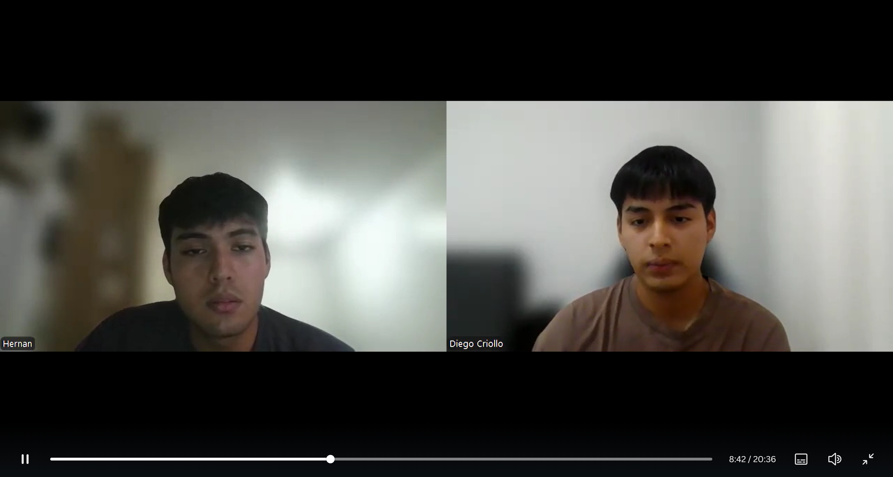</div></td>
  </tr>
  <tr>
    <td>Link</td>
    <td><p><a target="_blank"  href="https://upcedupe-my.sharepoint.com/:v:/g/personal/u202212077_upc_edu_pe/Eb8yf3KhYDhEnQRAr3IiJkMB3QJIzxpIo97ILmSzEit0QA?e=UvTJfz&nav=eyJyZWZlcnJhbEluZm8iOnsicmVmZXJyYWxBcHAiOiJTdHJlYW1XZWJBcHAiLCJyZWZlcnJhbFZpZXciOiJTaGFyZURpYWxvZy1MaW5rIiwicmVmZXJyYWxBcHBQbGF0Zm9ybSI6IldlYiIsInJlZmVycmFsTW9kZSI6InZpZXcifX0%3D" title="Title">Microsoft Stream</a></p></td>
  </tr>
  <tr>
    <td>Duración<br></td>
    <td>18:31 min - 24:14 min </td>
  </tr>
  <tr>
    <td>Resumen</td>
    <td style="text-align: justify;">
	    El entrevistado se presenta como Hernán, un joven de 25 años que frecuentemente organiza reuniones y eventos sociales. Nos comentó que, por su estilo de vida y círculos sociales, suele alquilar locales entre una y dos veces al mes, especialmente azoteas, salones de eventos o casas con jardín, dependiendo del tipo de actividad. Durante la entrevista, Hernán resaltó la importancia de contar con una plataforma que le permita alquilar espacios de manera rápida, segura y con toda la información clara desde el inicio. Mencionó que ha tenido experiencias en las que necesitó un lugar de emergencia, por lo que considera esencial poder ver disponibilidad en tiempo real y reservar sin complicaciones. También compartió su experiencia con cancelaciones imprevistas, en las que no recibió reembolso ni solución, por lo que cree que una aplicación como AlquilaFácil debería ofrecer políticas claras y flexibles, así como herramientas que refuercen la confianza, como valoraciones, filtros detallados (capacidad, licencias, horarios, servicios adicionales) y comunicación directa con el arrendador. Finalmente, hizo hincapié en la necesidad de flexibilidad horaria, ya que muchas veces sus eventos se extienden, y valoraría mucho la posibilidad de pagar por horas extra desde la misma plataforma.
    </td>
  </tr>
</tbody>
</table>

<br>


<table>
<colgroup>
</colgroup>
<thead>
  <tr>
    <th colspan="2"> <div align="center">Entrevista #3<br></div></th>
  </tr>
</thead>
<tbody>
  <tr>
    <td>Nombre</td>
    <td>Ariana</td>
  </tr>
  <tr>
    <td>Apellidos</td>
    <td>Torpoco Baltazar</td>
  </tr>
  <tr>
    <td>Edad</td>
    <td>25 años</td>
  </tr>
  <tr>
    <td>Distrito</td>
    <td>Santiago de Surco</td>
  </tr>
  <tr>
    <td>Aplicaciones Usadas</td>
    <td>Airbnb</td>
  </tr>
  <tr>
    <td>Motivación</td>
    <td>Encontrar una aplicación que le permita encontrar la mejor opción para alquilar lugares para eventos.</td>
  </tr>
  <tr>
    <td>Frustración</td>
    <td>No encuentra una aplicación que muestre de forma amigable todas las mejores opciones para reservar de acuerdo al evento planificado.</td>
  </tr>
  <tr>
    <td>Tecnologías</td>
    <td>Mac, Windows</td>
  </tr>
	<tr>
    <td>Browsers</td>
    <td>Google Chrome</td>
  </tr>
  <tr>
    <td>Entrevistador</td>
    <td>Abel Valle</td>
  </tr>
  <tr>
    <td>Evidencia</td>
    <td><div align="center"></div></td>
  </tr>
  <tr>
    <td>Link</td>
    <td><p><a target="_blank"  href="https://upcedupe-my.sharepoint.com/:v:/g/personal/u202212077_upc_edu_pe/Eb8yf3KhYDhEnQRAr3IiJkMB3QJIzxpIo97ILmSzEit0QA?e=UvTJfz&nav=eyJyZWZlcnJhbEluZm8iOnsicmVmZXJyYWxBcHAiOiJTdHJlYW1XZWJBcHAiLCJyZWZlcnJhbFZpZXciOiJTaGFyZURpYWxvZy1MaW5rIiwicmVmZXJyYWxBcHBQbGF0Zm9ybSI6IldlYiIsInJlZmVycmFsTW9kZSI6InZpZXcifX0%3D" title="Title">Microsoft Stream</a></p></td>
  </tr>
  <tr>
    <td>Duración<br></td>
    <td>24:15 min - 29:54 min </td>
  </tr>
  <tr>
    <td>Resumen</td>
    <td style="text-align: justify;">
    Ariana Torpoco, administrativa de 25 años en Centrum PUCP, organiza reuniones corporativas y eventos académicos al menos una vez al mes, por lo que necesita una plataforma que le permita alquilar espacios de forma rápida, segura y con información detallada sobre servicios como capacidad, equipamiento audiovisual y catering. Ha tenido experiencias negativas con plataformas que no ofrecen opciones claras de modificación o cancelación, lo que complica su planificación. Para Ariana, es fundamental contar con filtros avanzados, comunicación directa con arrendadores, gestión de reservas recurrentes y recordatorios automáticos. Además, considera clave la inclusión de políticas claras de cancelación y opciones de pago flexibles para generar confianza.
    </td>
  </tr>
</tbody>
</table>
</div>

### 2.2.3. Análisis de entrevistas

<div align="justify">

Las entrevistas realizadas proporcionan una visión detallada y matizada sobre las expectativas y requisitos de los distintos actores involucrados en el ámbito de las plataformas de alquiler de espacios para eventos. En general, tanto los arrendadores como los arrendatarios y los usuarios finales destacan la necesidad imperiosa de contar con sistemas que aseguren la integridad de las transacciones financieras, la claridad en los acuerdos contractuales y una comunicación fluida y eficaz. 

**Arrendadores de espacios para eventos**

Para los arrendadores, la seguridad en las transacciones financieras y la integridad de los contratos son aspectos fundamentales. También valoran una promoción efectiva de sus propiedades, buscando una plataforma que les permita llegar a un público amplio y relevante. Además, aprecian una comunicación clara y eficiente con los arrendatarios para evitar malentendidos y conflictos. Algunos arrendadores están dispuestos a invertir en servicios premium que les brinden ventajas adicionales, como una mayor visibilidad de sus espacios en la plataforma. En resumen, los arrendadores buscan una plataforma que les ofrezca seguridad, visibilidad, comunicación eficiente y opciones para maximizar el rendimiento de sus espacios. 


| **Característica objetiva**    | **Frecuencia** | **Porcentaje** | **Sustento desde entrevistas** |
|--------------------------------|----------------|----------------|--------------------------------|
| **Utiliza redes sociales para captar clientes** | 3 de 3. | 100% | Menciona Instagram y Facebook como fuentes principales de clientes |
| **Gestiona reservas manualmente** | 3 de 3. | 100% | Gestiona la disponibilidad con agenda física y Excel |
| **Recibe consultas por WhatsApp**  | 3 de 3. | 100% | Coordina todo el proceso por WhatsApp |
| **Necesita un sistema de agenda para evitar dobles reservas** | 3 de 3. | 100% | Tuvo una doble reserva por falta de sistema automatizado |


**Arrendatarios para eventos**

Por otro lado, los arrendatarios tienen necesidades específicas al utilizar plataformas de alquiler de locales. Para ellos, la facilidad de encontrar y reservar espacios adecuados es crucial, especialmente en situaciones de emergencia o cambios de último momento. Valoran la transparencia en los contratos y una comunicación eficiente con los arrendadores para evitar malentendidos y asegurar una experiencia sin contratiempos. Además, buscan plataformas que ofrezcan una amplia variedad de opciones de espacios que se ajusten a sus necesidades específicas y horarios. La posibilidad de utilizar herramientas de búsqueda avanzada y filtrado también es importante para encontrar el lugar perfecto. En resumen, los arrendatarios de eventos buscan plataformas que les brinden facilidad de uso, transparencia en los procesos, comunicación eficiente y una amplia gama de opciones de espacios para eventos. 


| **Característica objetiva**    | **Frecuencia** | **Porcentaje** | **Sustento desde entrevistas** |
|--------------------------------|----------------|----------------|--------------------------------|
| **Uso de redes sociales o sitios web para buscar espacios** | 3 de 3. | 100% | Todos los entrevistados mencionan usar redes o sitios web |
| **Realiza reservas con regularidad** | 3 de 3. | 100% | Todos mencionan alquilar espacios de forma habitual |
| **Busca espacios para eventos familiares o recreativos**  | 3 de 3. | 100% | Todos organizan o buscan espacios para actividades recreativas o familiares |
| **Valora herramientas que faciliten la organización del tiempo (agenda)** | 3 de 3. | 100% | Mencionan la utilidad de una agenda o calendario para organizarse mejor |


**Determinación de Personas**

Basado en el análisis de las entrevistas, se ha determinado lo siguiente:

**Persona Principal: Arrendatarios**  
**Razón:** Los arrendatarios son los usuarios finales que interactúan directamente con la plataforma para encontrar y reservar espacios. Sus necesidades de facilidad de uso, transparencia, comunicación eficiente y una amplia gama de opciones son cruciales para el éxito del producto. Además, la facilidad de encontrar y reservar espacios adecuados es fundamental para ellos, lo que hace que sus requerimientos sean el enfoque principal del desarrollo.  

**Persona Secundaria: Arrendadores**  
**Razón:** Aunque los arrendadores también son esenciales para el funcionamiento de la plataforma, su papel es secundario en comparación con los arrendatarios. Los arrendadores buscan seguridad, visibilidad y herramientas para la promoción y gestión de sus espacios. Estos aspectos son importantes, pero el enfoque primario debe estar en las necesidades y experiencias de los arrendatarios, que son quienes utilizan la plataforma de manera más activa y recurrente.

</div>


## 2.3. Needfinding

### 2.3.1. User Personas

<p align="justify">
Presentaremos los User Persona por cada segmento objetivo, en los cuales nos basamos en los usuarios ideales de cada segmento: Sergio Aguirre (Arrendatario), Claudia Camareño (Arrendador).
</p>

**Segmento 1: Arrendatario**

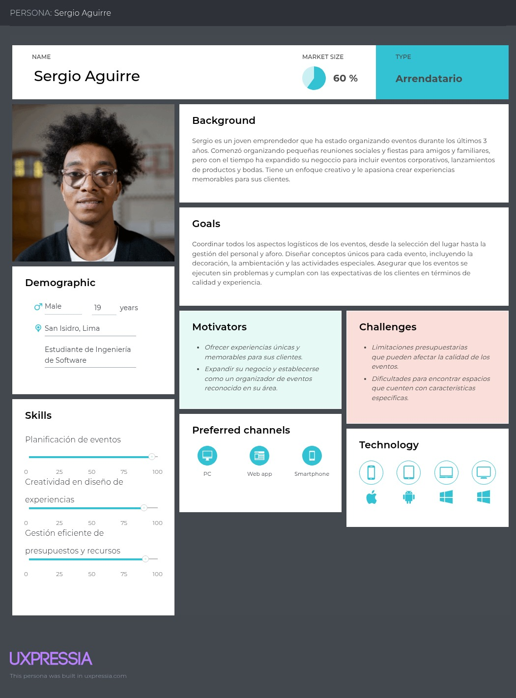

<br>

**Segmento 2: Arrendador**


### 2.3.2. User Task Matrix

<br>

**User Persona Principal**

**Nombre:** Sergio Aguirre  
**Rol:** Arrendatario

<table align="center">
  <thead>
    <tr>
      <th>Task</th>
      <th>Frequency</th>
      <th>Importance</th>
    </tr>
  </thead>
  <tbody>
    <tr>
      <td>Buscar y reservar espacios para eventos</td>
      <td>High</td>
      <td>High</td>
    </tr>
    <tr>
      <td>Comunicarse con los arrendadores de los espacios</td>
      <td>High</td>
      <td>High</td>
    </tr>
    <tr>
      <td>Buscar variedad en los tipos de espacios disponibles</td>
      <td>High</td>
      <td>High</td>
    </tr>
    <tr>
      <td>Reservar espacios para diferentes tipos de eventos</td>
      <td>High</td>
      <td>High</td>
    </tr>
    <tr>
      <td>Estar dispuesto a pagar por una mejor experiencia</td>
      <td>Medium</td>
      <td>Medium</td>
    </tr>
    <tr>
      <td>Utilizar una plataforma fácil de usar e intuitiva</td>
      <td>High</td>
      <td>High</td>
    </tr>
  </tbody>
</table>

<br>

**User Persona Secundaria**

**Nombre:** Claudia Cañamero  
**Rol:** Arrendadora

<table align="center">
  <thead>
    <tr>
      <th>Task</th>
      <th>Frequency</th>
      <th>Importance</th>
    </tr>
  </thead>
  <tbody>
    <tr>
      <td>Gestionar reservas y coordinar eventos</td>
      <td>High</td>
      <td>High</td>
    </tr>
    <tr>
      <td>Promocionar el local en redes sociales y otros canales de marketing</td>
      <td>High</td>
      <td>High</td>
    </tr>
    <tr>
      <td>Mantener el local en óptimas condiciones de limpieza y mantenimiento</td>
      <td>High</td>
      <td>High</td>
    </tr>
    <tr>
      <td>Establecer comunicación efectiva con clientes y proveedores</td>
      <td>High</td>
      <td>High</td>
    </tr>
    <tr>
      <td>Explorar nuevas oportunidades de negocio y crecimiento</td>
      <td>Medium</td>
      <td>Medium</td>
    </tr>
  </tbody>
</table> 
<br>

### 2.3.3. User Journey Mapping

**Persona Principal: Arrendatarios de eventos sociales / Usuarios frecuentes de espacios para eventos**

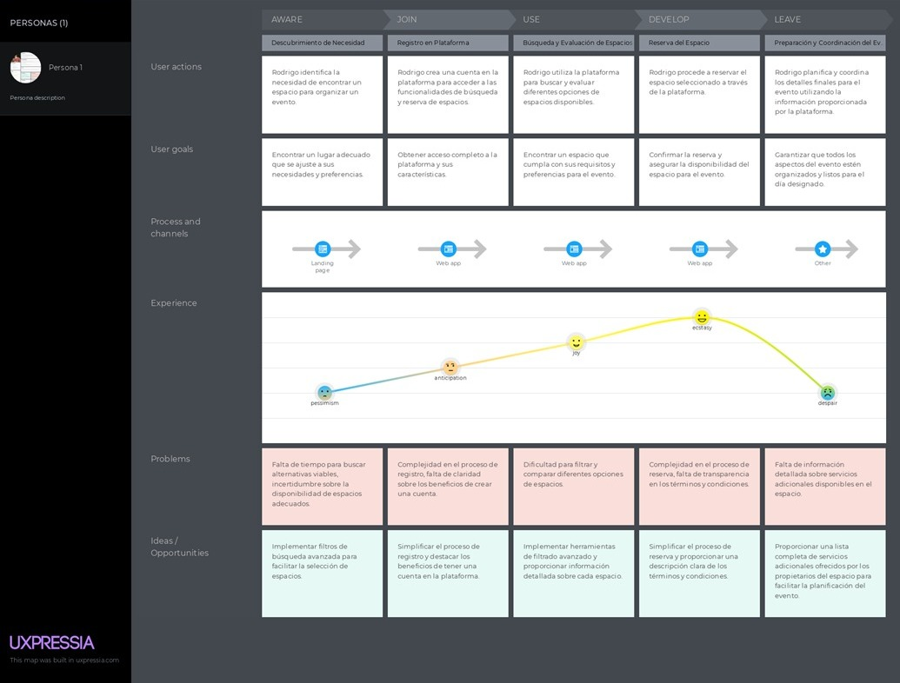

**Persona Secundaria: Arrendadores de espacios para eventos**

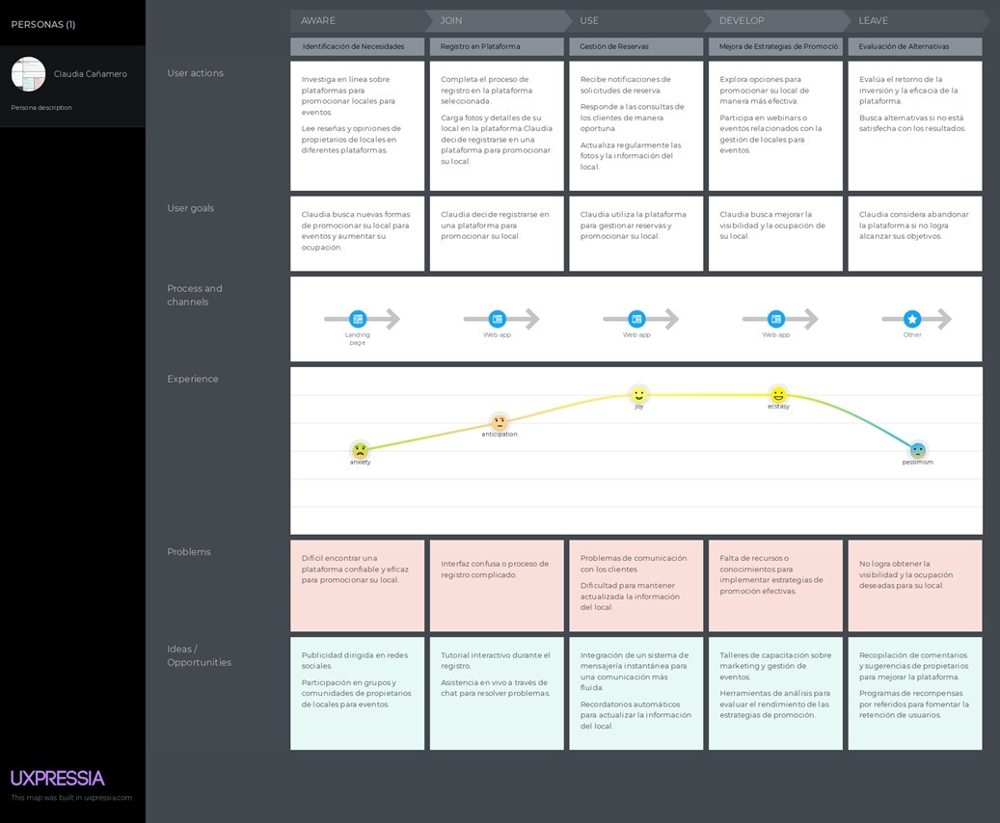

### 2.3.4. Empathy Mapping

**Persona Principal: Arrendatarios de eventos sociales / Usuarios frecuentes de espacios para eventos**


**Persona Secundaria: Arrendadores de espacios para eventos**

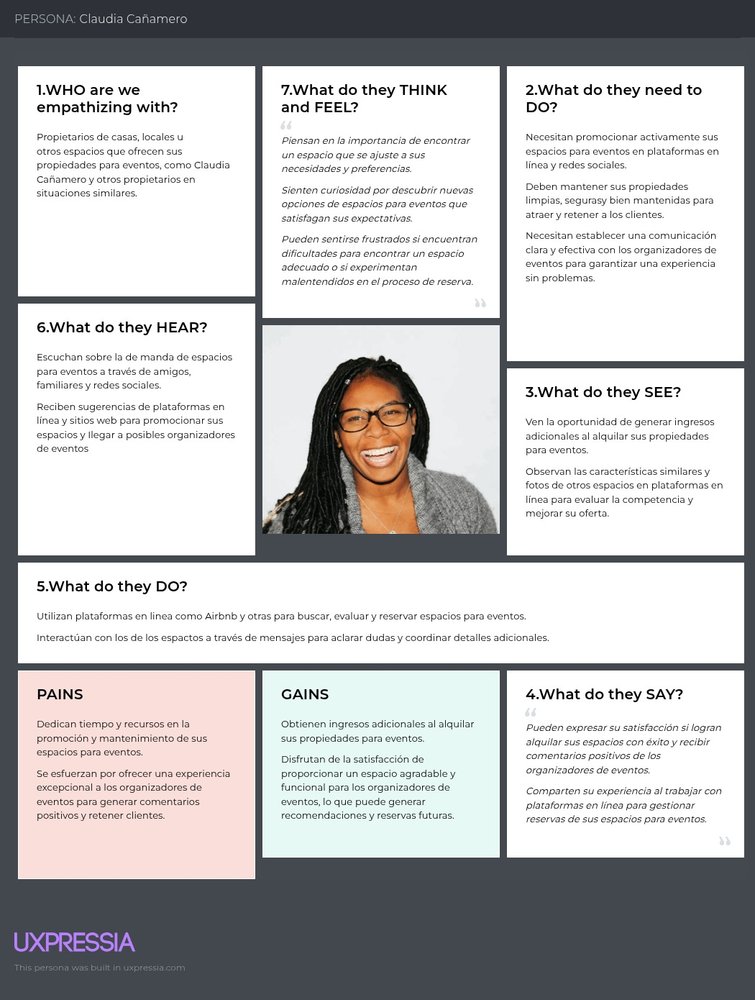


### 2.3.5. As-is Scenario Mapping

**Persona Principal: Arrendatarios**

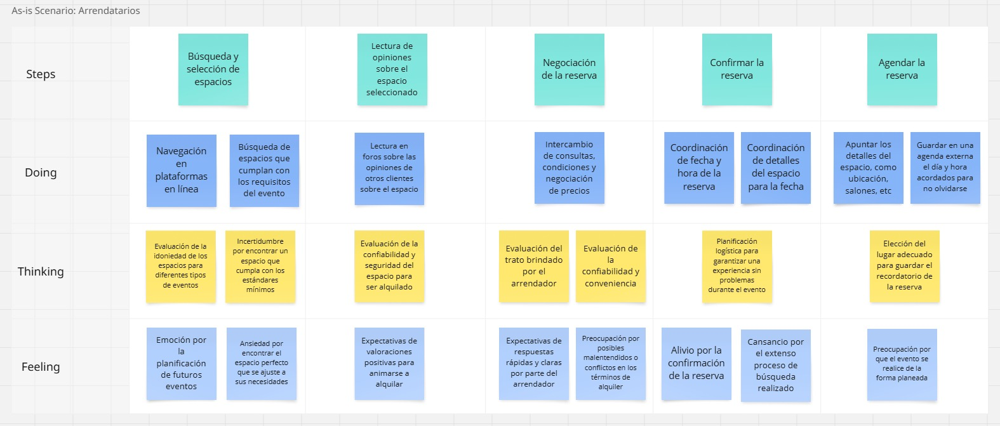

**Persona Secundaria: Arrendadores**

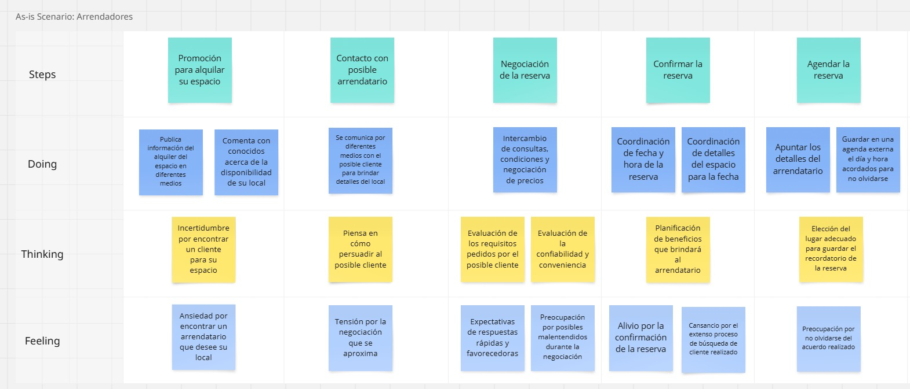

## 2.4. Ubiquitous Language

<table align="center">
  <thead>
    <tr>
      <th><strong>Término</strong></th>
      <th><strong>Definición</strong></th>
    </tr>
  </thead>
  <tbody>
    <tr>
      <td>Tenant</td>
      <td>Arrendatario, quien realiza la reserva de un espacio.</td>
    </tr>
    <tr>
      <td>Landlord</td>
      <td>Arrendador, quien publica sus espacios para ser reservados.</td>
    </tr>
    <tr>
      <td>Local</td>
      <td>Espacio para eventos que contiene diferentes características de acuerdo con el arrendador.</td>
    </tr>
    <tr>
      <td>Booking</td>
      <td>Reserva de un espacio, con identificación de arrendatario, fecha y hora de inicio y fin.</td>
    </tr>
    <tr>
      <td>Comment</td>
      <td>Comentario acerca de un local anexado a su reseña con calificación.</td>
    </tr>
    <tr>
      <td>Calendar</td>
      <td>Agenda de reservas presentadas tanto para arrendador como arrendatario.</td>
    </tr>
    <tr>
      <td>Report</td>
      <td>Denuncia hacia algún espacio publicada por un arrendatario de este mismo.</td>
    </tr>
    <tr>
      <td>District</td>
      <td>Distrito de locación del espacio publicado.</td>
    </tr>
    <tr>
      <td>Features</td>
      <td>Características adicionales del espacio publicado.</td>
    </tr>
  </tbody>
</table>


# Capítulo III: Requirements Specification

## 3.1. To-Be Scenario Mapping

**Persona Principal: Arrendatarios**


**Persona Secundaria: Arrendadores**


## 3.2. User Stories

**Epics:**


| **Epic / Story ID** | **Título**                             | **Descripción**                                                                                                                                                                    | **Historias de usuario relacionadas**     |
|---------------------|----------------------------------------|-------------------------------------------------------------------------------------------------------------------------------------------------------------------------------------|-------------------------------------------|
| **EP01**            | Gestión de usuarios y autenticación    | <div align="justify">Como usuario de AlquilaFácil, quiero poder registrarme fácilmente en la aplicación y acceder a mi cuenta, para poder utilizar las funcionalidades principales de la aplicación, sin complicaciones.</div> | <div align="justify">US01, US02, US13</div> |
| **EP02**            | Registro y gestión de espacios         | <div align="justify">Como arrendador de AlquilaFácil, quiero poder registrar en la plataforma para asegurarme de que los arrendatarios puedan ver y reservar mis propiedades de manera fácil y rápida.</div> | <div align="justify">US03, US11, US12</div> |
| **EP03**            | Búsqueda y reserva de espacios         | <div align="justify">Como arrendatario de AlquilaFácil, quiero poder buscar y reservar espacios de acuerdo con mis necesidades (por capacidad, categoría, y ubicación), para encontrar el lugar perfecto para mi evento y asegurar su disponibilidad.</div> | <div align="justify">US04, US05, US06, US07, US15, US16</div> |
| **EP04**            | Gestión de agenda de usuario           | <div align="justify">Como usuario de AlquilaFácil, quiero poder gestionar mis reservas y recibir notificaciones sobre cambios y actividades relacionadas con mis espacios, para mantenerme organizado y al tanto de todo en tiempo real.</div> | <div align="justify">US08, US09, US10</div> |
| **EP05**            | Funcionalidades de soporte y membresías| <div align="justify">Como usuario de AlquilaFácil, quiero poder acceder fácilmente a la sección de ayuda y adquirir una membresía premium, para recibir soporte cuando lo necesite y disfrutar de beneficios exclusivos que mejoren mi experiencia en la plataforma.</div> | <div align="justify">US14, US17</div> |


<br>


**User Stories:**


| **Epic / Story ID** | **Título**                      | **Descripción**                                                                                                                                                                                                                                                                       | **Criterios de aceptación**                                                                                                                                                                                                                                                                                                                                                                                                                          | **Relacionado con (Epic ID)** |
|---------------------|----------------------------------|----------------------------------------------------------------------------------------------------------------------------------------------------------------------------------------------------------------------------------------------------------------------------------------|--------------------------------------------------------------------------------------------------------------------------------------------------------------------------------------------------------------------------------------------------------------------------------------------------------------------------------------------------------------------------------------------------------------------------------------------------------|-------------------------------|
| US01 | Registrar usuario | <div align="justify">Como usuario de la aplicación de AlquilaFácil, quiero poder registrarme fácilmente en AlquilaFácil para ofrecer mi espacio en alquiler y llegar a más clientes potenciales.</div> | <div align="justify">**Escenario 01: Validación de datos**  <br> Dado que un usuario completa el formulario de registro en AlquilaFácil. Cuando el usuario envía el formulario. Entonces los datos proporcionados se validan para garantizar la precisión y la autenticidad. <br><br> **Escenario 02: Validación de CAPTCHA** <br> Dado que un usuario ha completado el formulario de registro. Cuando el usuario intenta enviarlo. Entonces el sistema solicita completar un CAPTCHA para verificar que no se trata de un bot. <br><br> **Escenario 03: Registro exitoso**  <br> Dado que un usuario ha completado correctamente el formulario y superado la validación de CAPTCHA. Cuando el usuario envía el formulario con toda la información válida. Entonces el usuario recibe una confirmación de registro y puede acceder a su cuenta.</div> | EP01            |
| US02 | Iniciar sesión | <div align="justify">Como usuario registrado de la aplicación de AlquilaFácil, quiero poder iniciar sesión fácilmente en mi cuenta, para gestionar mi espacio en alquiler y acceder a mis reservas.</div> | <div align="justify">**Escenario 01: Inicio de sesión exitoso**  <br> Dado que un usuario registrado desea acceder a su cuenta en AlquilaFácil. Cuando el usuario ingresa su correo electrónico y contraseña correctos en el formulario de inicio de sesión. Entonces el usuario es autenticado exitosamente y se le otorga acceso a su cuenta. <br><br> **Escenario 02: Error en el inicio de sesión por credenciales incorrectas**  <br> Dado que un usuario registrado intenta acceder a su cuenta. Cuando el usuario ingresa una combinación incorrecta. Entonces se muestra un mensaje de error indicando que las credenciales son incorrectas.</div> | EP01 |
| US03 | Registrar espacios | <div align="justify">Como arrendador de un espacio para eventos en AlquilaFácil, quiero poder registrar mi espacio para comenzar a recibir solicitudes de reserva lo antes posible.</div> | <div align="justify">**Escenario 01: Registro paso a paso del espacio**  <br> Dado que un arrendador desea registrar su espacio en AlquilaFácil. Cuando navega por las diferentes secciones del formulario e ingresa la información solicitada en cada paso, incluyendo detalles del espacio, ubicación, capacidad y servicios ofrecidos. Entonces puede avanzar progresivamente hasta llegar al resumen final del registro. <br><br> **Escenario 02: Validación final de los datos requeridos**  <br> Dado que un arrendador ha completado todos los pasos del registro. Cuando intenta enviar la solicitud de publicación del espacio. Entonces el sistema valida que toda la información requerida esté completa; si hay campos faltantes o incorrectos, se muestra un mensaje de error indicando qué se debe corregir antes de poder continuar.</div> | EP02 |
| US04 | Buscar espacios disponibles | <div align="justify">Como arrendatario, quiero poder buscar fácilmente espacios disponibles en AlquilaFácil para encontrar el lugar perfecto para mi evento.</div> | <div align="justify">**Escenario 01: Búsqueda general desde la página principal**  <br> Dado que un arrendatario desea explorar todas las opciones disponibles. Cuando accede a la página principal sin ingresar filtros o criterios específicos. Entonces se muestran todos los espacios disponibles en la plataforma. <br><br> **Escenario 02: Búsqueda por distrito desde la barra de navegación**  <br> Dado que un arrendatario desea buscar espacios en un distrito específico. Cuando selecciona un distrito desde la barra de navegación. Entonces se muestran únicamente los espacios disponibles dentro de ese distrito.</div> | EP03 |
| US05 | Filtrar espacios disponibles | <div align="justify">Como arrendatario, quiero poder filtrar los espacios disponibles por capacidad y categoría, para encontrar uno que cumpla con mis criterios específicos.</div> | <div align="justify">**Escenario 01: Filtrado por capacidad**  <br> Dado que un arrendatario desea un espacio con capacidad para un número específico de personas. Cuando el arrendatario aplica un filtro de capacidad en la búsqueda. Entonces se muestran solo los espacios que cumplen con ese criterio. <br><br> **Escenario 02: Filtrado por categoría**  <br> Dado que un arrendatario desea un espacio de una categoría en específico. Cuando aplica un filtro de categoría. Entonces se muestran solo los espacios que cumplen con ese criterio.</div> | EP03 |
| US06 | Visualizar información del espacio | <div align="justify">Como arrendatario, quiero poder visualizar información detallada del espacio, para evaluar si cumple con los requisitos de mi evento antes de hacer una reserva.</div> | <div align="justify">**Escenario 01: Visualización de información**  <br> Dado que el arrendatario selecciona un espacio en AlquilaFácil. Cuando accede a la página de detalles del espacio. Entonces puede visualizar información detallada como el aforo máximo, descripción del espacio y servicios disponibles. <br><br> **Escenario 02: Visualización de reseñas del espacio**  <br> Dado que el arrendatario está revisando un espacio. Cuando accede a la página de comentarios. Entonces puede visualizar las reseñas y calificaciones dejadas por otros usuarios.</div> | EP03 |
| US07 | Reservar espacios | <div align="justify">Como arrendatario, quiero poder reservar un espacio para mi evento en AlquilaFácil para garantizar su disponibilidad en la fecha deseada.</div> | <div align="justify">**Escenario 01: Selección de espacio y fecha**  <br> Dado que un arrendatario desea reservar un espacio. Cuando selecciona el espacio deseado y la fecha del evento. Entonces se muestra el precio total a pagar junto con los datos de la cuenta bancaria e interbancaria del arrendador. <br><br> **Escenario 02: Envío del comprobante de pago**  <br> Dado que el arrendatario ha realizado el pago externo mediante transferencia. Cuando carga una foto del voucher de pago y completa los datos solicitados. Entonces el sistema registra la reserva como pendiente de validación. <br><br> **Escenario 03: Validación del pago por parte del arrendador**  <br> Dado que se ha creado una nueva reserva con comprobante adjunto. Cuando el arrendador revisa el voucher y verifica que el monto es correcto. Entonces puede aceptar la reserva, o en caso contrario, rechazarla.</div> | EP03 |
| US08 | Gestionar calendario de reservas | <div align="justify">Como usuario de AlquilaFácil, quiero poder controlar una agenda de reservas para tener un horario organizado y evitar conflictos futuros.</div> | <div align="justify">**Escenario 01: Reserva de usuario normal**  <br> Dado que un arrendatario ha reservado un espacio. Cuando el arrendador accede al calendario. Entonces ve el día resaltado en azul. <br><br> **Escenario 02: Reserva de usuario premium**  <br> Dado que un usuario premium ha reservado un espacio. Cuando el propietario accede al calendario. Entonces ve el día resaltado en amarillo. <br><br> **Escenario 03: Reserva de espacio ajeno**  <br> Dado que un arrendatario ha reservado un espacio. Cuando accede al calendario. Entonces ve el día resaltado en rojo.</div> | EP03 |
| US09 | Calificar y comentar sobre espacios | <div align="justify">Como arrendatario, quiero poder publicar mi reseña sobre un espacio que he reservado para que otros usuarios puedan conocer mi experiencia antes de reservar.</div> | <div align="justify">**Escenario 01: Disponibilidad para calificar**  <br> Dado que un arrendatario ha realizado una reserva en AlquilaFácil. Cuando accede a los detalles de la reserva desde su calendario. Entonces solo podrá publicar una reseña si la fecha del evento ya ha finalizado; de lo contrario, la opción estará deshabilitada. <br><br> **Escenario 02: Publicación de reseña**  <br> Dado que el arrendatario tiene una reserva finalizada y desea compartir su experiencia. Cuando completa los campos de calificación y comentario, y presiona el botón de publicar reseña. Entonces la reseña se guarda correctamente y se muestra públicamente en el perfil del local.</div> | EP04 |
| US10 | Notificar sobre actividades | <div align="justify">Como arrendador, quiero recibir notificaciones cuando un arrendatario reserve mi espacio, para estar informado sobre la fecha y hora del evento.</div> | <div align="justify">**Escenario 01: Notificación automática de nueva reserva**  <br> Dado que un arrendatario ha realizado una reserva para un espacio. Cuando se completa el envío del comprobante de pago. Entonces el arrendador recibe una notificación que incluye la fecha, hora y nombre del espacio reservado. <br><br> **Escenario 02: Visualización en la sección de notificaciones**  <br> Dado que el arrendador desea revisar sus notificaciones. Cuando accede a la sección de notificaciones en la aplicación. Entonces puede ver un listado con los detalles de cada reserva reciente, incluyendo fecha y hora.</div> | EP04 |
| US11 | Controlar espacios favoritos | <div align="justify">Como arrendatario, quiero poder agregar un espacio a mis favoritos para acceder rápidamente a lugares de interés para futuras reservas.</div> |<div align="justify">**Escenario 01: Agregar a favoritos**  <br> Dado que el arrendatario está visualizando la página de detalles de un espacio. Cuando selecciona la opción "Agregar a favoritos". Entonces el espacio se guarda temporalmente para permitir su consulta rápida más adelante. <br><br> **Escenario 02: Eliminar de favoritos**  <br> Dado que un espacio ha sido marcado como favorito. Cuando el arrendatario selecciona la opción "Eliminar de favoritos". Entonces dicho espacio se retira de la lista personal de favoritos y deja de mostrarse como tal.</div>| EP03 |
| US12 | Visualizar espacios propios publicados | <div align="justify">Como arrendador, quiero poder visualizar todos los espacios que he publicado en la plataforma, para gestionar fácilmente la información de mis propiedades.</div> |<div align="justify">**Escenario 01: Listado de espacios publicados**  <br> Dado que el arrendador ha iniciado sesión. Cuando accede a la sección "Mis espacios". Entonces puede ver una lista de todos los espacios publicados con nombre y ubicación. <br><br> **Escenario 02: Acceso a detalles**  <br> Dado que visualiza la lista de espacios. Cuando selecciona un espacio. Entonces puede acceder a los detalles de este mismo.</div>| EP02 |
| US13 | Actualizar perfil y sesión de usuario | <div align="justify">Como usuario de AlquilaFácil, quiero poder modificar mi perfil, incluyendo la opción de cambiar mi nombre de usuario y cerrar sesión, para mantener actualizada mi información personal y gestionar mi acceso a la aplicación de manera conveniente.</div> | <div align="justify">**Escenario 01: Modificación del nombre de usuario**  <br> Dado que el usuario ha iniciado sesión en su cuenta de AlquilaFácil. Cuando accede a la sección de configuración de perfil y edita el campo "Nombre de usuario". Entonces puede guardar los cambios, y el nuevo nombre de usuario se refleja en su perfil y en todas las interacciones futuras en la plataforma. <br><br> **Escenario 02: Cierre de sesión**  <br> Dado que el usuario desea salir de su cuenta en AlquilaFácil. Cuando selecciona la opción "Cerrar sesión" en la configuración de perfil. Entonces es desconectado de su cuenta y redirigido a la pantalla de inicio de sesión, asegurando que su sesión se haya cerrado de manera segura.</div> | EP01 |
| US14 | Adquirir membresía premium | <div align="justify">Como usuario de AlquilaFácil, quiero poder adquirir una membresía mensual premium para acceder a beneficios exclusivos y maximizar mis oportunidades dentro del aplicativo.</div> | <div align="justify">**Escenario 01: Selección de la membresía premium**  <br> Dado que el usuario ha iniciado sesión en su cuenta de AlquilaFácil. Cuando accede a la sección de "Membresías" y selecciona la opción de "Membresía Premium". Entonces se le muestra una descripción detallada de los beneficios y el costo de la membresía, junto con la información bancaria necesaria para realizar el depósito. <br><br> **Escenario 02: Envío de comprobante de pago**  <br> Dado que el usuario desea adquirir la membresía mensual premium. Cuando realiza el depósito y carga la imagen del comprobante de pago. Entonces se registra su solicitud de membresía en espera de verificación. <br><br> **Escenario 03: Validación del comprobante**  <br> Dado que el usuario ha enviado el comprobante de pago. Cuando el administrador revisa que el depósito coincide con el monto correspondiente. Entonces aprueba la solicitud, y el usuario recibe acceso a los beneficios premium; de lo contrario, la solicitud es rechazada y el usuario es notificado.</div> | EP05 |
| US15 | Reportar espacios inseguros | <div align="justify">Como usuario de AlquilaFácil, quiero poder reportar espacios inseguros, para contribuir a la seguridad de la comunidad y alertar sobre situaciones que puedan poner en riesgo a otros usuarios.</div> | <div align="justify">**Escenario 01: Selección del espacio inseguro**  <br> Dado que el usuario ha iniciado sesión en su cuenta de AlquilaFácil. Cuando accede a la sección de "Reportar espacio" y selecciona el espacio desde la lista de reservas activas o buscando un espacio específico. Entonces puede ingresar un asunto y descripción del problema. <br><br> **Escenario 02: Confirmación del reporte**  <br> Dado que el usuario ha completado el formulario de reporte con todos los detalles requeridos. Cuando envía el reporte mediante el botón "Enviar". Entonces el reporte será registrado y revisado por el equipo de soporte de AlquilaFácil.</div> | EP03 |
| US16 | Visualizar espacios reportados por el usuario | <div align="justify">Como usuario de AlquilaFácil, quiero poder visualizar los espacios que he reportado, para realizar un seguimiento de mis reportes y gestionarlos.</div> | <div align="justify">**Escenario 01: Navegar a la sección de "Ver Espacios Reportados"**  <br> Dado que el usuario ha iniciado sesión en su cuenta de AlquilaFácil. Cuando accede a la sección de "Ver Espacios Reportados" desde el panel de control. Entonces puede ver una lista de los espacios que ha reportado, incluyendo información como el nombre del espacio, la fecha del reporte, y el motivo del reporte. <br><br> **Escenario 02: Eliminar un reporte deslizando hacia la izquierda**  <br> Dado que el usuario se encuentra en la lista de espacios reportados. Cuando desliza uno de los reportes hacia la izquierda. Entonces aparece una opción para confirmar la eliminación del reporte. Y si confirma, el reporte se elimina de la lista.</div> | EP03 |
| US17 | Acceder a información de ayuda | <div align="justify">Como usuario de AlquilaFácil, quiero poder acceder fácilmente a una sección de preguntas frecuentes e información de contacto para resolver mis dudas o comunicarme con el soporte cuando lo necesite.</div> | <div align="justify">**Escenario 01: Consultar preguntas frecuentes**  <br> Dado que un usuario tiene una duda común sobre el funcionamiento de la plataforma. Cuando selecciona la opción de "Preguntas frecuentes" en el menú de ayuda. Entonces se muestra una lista de preguntas con sus respuestas para ayudar al usuario. <br><br> **Escenario 02: Acceder a información de contacto**  <br> Dado que un usuario necesita comunicarse con el soporte. Cuando selecciona la opción de "Información de contacto" en el menú de ayuda. Entonces se muestra la información de contacto, incluyendo el correo electrónico y número de teléfono del soporte.</div> | EP05 |


## 3.3. Product Backlog

**Sprints:**

Link trello: https://trello.com/invite/b/680019837959f6609959ce6e/ATTI946724210c7338f82a2e8bd7f289e223CC65121F/product-backlog-diseno-de-experimentos-de-ingenieria-de-software

| Sprint # | Título                                                      | Descripción                                                                                                                             |
|----------|-------------------------------------------------------------|-----------------------------------------------------------------------------------------------------------------------------------------|
| 1        | Desarrollo de funcionalidades Core                                          | <div align="justify">En este sprint, nos centramos en desarrollar nuestras funcionalidades mas importantes para el aplicativo, con esto facilitamos el vance para siguientes sprints</div> |
| 2        | Desarrollo de segunda versión | <div align="justify">En este segundo sprint, nos enfocamos en implementar nuevas funcionalidades a nuestra aplicación, con el fin de tener una buena segunda versión que nos permita avanzar correctamente en los siguientes sprints.</div> |
| 3        |          | <div align="justify"> </div> |
| 4        |  | <div align="justify"> </div> |

<br>

**Product Backlog:**

<div align="center">
    <table>
        <thead>
            <tr>
                <th>User Stories ID</th>
                <th>Título</th>
                <th>Descripción</th>
                <th>Story Points (1/2/3/5/8)</th>
            </tr>
        </thead>
        <tbody>
            <tr>
                <td>US03</td>
                <td>Registrar espacios</td>
                <td>Como arrendador de un espacio para eventos en AlquilaFácil, quiero poder registrar mi espacio para comenzar a recibir solicitudes de reserva lo antes posible.</td>
                <td>8</td>
            </tr>
            <tr>
                <td>US04</td>
                <td>Buscar espacios disponibles</td>
                <td>Como arrendatario, quiero poder buscar fácilmente espacios disponibles en AlquilaFácil para encontrar el lugar perfecto para mi evento.</td>
                <td>5</td>
            </tr>
            <tr>
                <td>US05</td>
                <td>Filtrar espacios disponibles</td>
                <td>Como arrendatario, quiero poder filtrar los espacios disponibles por capacidad y categoría, para encontrar uno que cumpla con mis criterios específicos.</td>
                <td>5</td>
            </tr>
            <tr>
                <td>US06</td>
                <td>Visualizar información del espacio</td>
                <td>Como arrendatario, quiero poder visualizar información detallada del espacio, para evaluar si cumple con los requisitos de mi evento antes de hacer una reserva.</td>
                <td>5</td>
            </tr>
            <tr>
                <td>US07</td>
                <td>Reservar espacios</td>
                <td>Como arrendatario, quiero poder reservar un espacio para mi evento en AlquilaFácil para garantizar su disponibilidad en la fecha deseada.</td>
                <td>8</td>
            </tr>
            <tr>
                <td>US12</td>
                <td>Visualizar espacios propios publicados</td>
                <td>Como arrendador en AlquilaFácil, quiero poder visualizar todos los espacios que he publicado en la plataforma, para gestionar fácilmente la información de mis propiedades.</td>
                <td>3</td>
            </tr>
            <tr>
                <td>US08</td>
                <td>Gestionar calendario de reservas</td>
                <td>Como usuario de AlquilaFácil, quiero poder controlar una agenda de reservas para tener un horario organizado y evitar conflictos futuros.</td>
                <td>5</td>
            </tr>
            <tr>
                <td>US09</td>
                <td>Calificar y comentar sobre espacios</td>
                <td>Como arrendatario, quiero poder publicar mi reseña sobre un espacio que he reservado para que otros usuarios puedan conocer mi experiencia sobre este.</td>
                <td>3</td>
            </tr>
            <tr>
                <td>US11</td>
                <td>Controlar espacios favoritos</td>
                <td>Como arrendatario en AlquilaFácil, quiero poder agregar un espacio a mis favoritos para guardar y acceder rápidamente a los lugares de interés para futuras reservas.</td>
                <td>3</td>
            </tr>
            <tr>
                <td>US15</td>
                <td>Reportar espacios inseguros</td>
                <td>Como usuario de AlquilaFácil, quiero poder reportar espacios inseguros, para contribuir a la seguridad de la comunidad y alertar sobre situaciones que puedan poner en riesgo a otros usuarios.</td>
                <td>3</td>
            </tr>
            <tr>
                <td>US16</td>
                <td>Visualizar espacios reportados</td>
                <td>Como usuario de AlquilaFácil, quiero poder visualizar los espacios que he reportado, para realizar un seguimiento de mis reportes y gestionarlos.</td>
                <td>3</td>
            </tr>
            <tr>
                <td>US01</td>
                <td>Registrar usuario</td>
                <td>Como usuario de la aplicación móvil de AlquilaFácil de un espacio para eventos, quiero poder registrarme fácilmente en AlquilaFácil para ofrecer mi espacio en alquiler y llegar a más clientes potenciales.</td>
                <td>3</td>
            </tr>
            <tr>
                <td>US02</td>
                <td>Iniciar sesión</td>
                <td>Como usuario registrado de la aplicación móvil de AlquilaFácil, quiero poder iniciar sesión fácilmente en mi cuenta, para gestionar mi espacio en alquiler y acceder a mis mensajes y notificaciones.</td>
                <td>3</td>
            </tr>
            <tr>
                <td>US14</td>
                <td>Adquirir membresía premium</td>
                <td>Como usuario de AlquilaFácil, quiero poder adquirir una membresía mensual premium para acceder a beneficios exclusivos, para maximizar mis oportunidades dentro del aplicativo.</td>
                <td>5</td>
            </tr>
            <tr>
                <td>US10</td>
                <td>Notificar sobre actividades de arrendatarios</td>
                <td>Como arrendador de un espacio para eventos en AlquilaFácil, quiero recibir notificaciones Cuando un arrendatario ha realizado cierta acción sobre mi espacio para estar al tanto de su estado y tomar las acciones pertinentes.</td>
                <td>3</td>
            </tr>
            <tr>
                <td>US13</td>
                <td>Actualizar perfil y sesión de usuario</td>
                <td>Como usuario de AlquilaFácil, quiero poder modificar mi perfil, incluyendo la opción de cambiar mi nombre de usuario y cerrar sesión, para mantener actualizada mi información personal y gestionar mi acceso a la aplicación de manera conveniente.</td>
                <td>2</td>
            </tr>
            <tr>
                <td>US17</td>
                <td>Acceder a información de ayuda</td>
                <td>Como usuario de AlquilaFácil, quiero poder acceder fácilmente a una sección de preguntas frecuentes e información de contacto para resolver mis dudas o comunicarme con el soporte Cuando lo necesite.</td>
                <td>5</td>
            </tr>
        </tbody>
    </table>
</div>

## 3.4. Impact Mapping

**Persona Principal: Arrendatarios**


**Persona Secundaria: Arrendadores**


# Capítulo IV: Product Design

## 4.1. Style Guidelines

<div align="justify">
    Un Style Guideline es un conjunto de reglas y normas que definen cómo se debe redactar, diseñar o presentar documentos, contenido web, software u otros trabajos creativos. A continuación, se detallan las especificaciones de los parámetros implementados en la estructura del proyecto.
</div>


### 4.1.1. General Style Guidelines

**Overview:**
<div align="justify">
    Deseamos capturar la atención del usuario desde el inicio mediante la creación y el diseño de una perspectiva del producto que establezca una conexión inmediata y reconocible.
</div>
<br>

**Brand Overview:**
<div align="justify">
     AlquilaFácil es un startup tecnológico fundada en el 2024 por un grupo de estudiantes compuesta por un grupo de estudiantes de la carrera de Ingeniería de Software. Nuestro startup está dedicada a simplificar el proceso de alquiler de espacios para eventos, brindando una plataforma innovadora y accesible para propietarios y organizadores por igual.
</div>
<br>

**Brand Name:**
<div align="justify">
     Como el startup se trata de alquilar centros para eventos y también para publicitar centros que podrían ser alquilados, se vio conveniente llamarlo “AlquilaFácil”.
</div>
<br>

 

**Typography:**
<div align="justify">
     El tamaño elegido para la tipografía por el equipo fue: 
</div>
<br>

 

<br>

**Colors:**
<div align="justify">
     La gama de colores elegidos son:
</div>

<br>

 


### 4.1.2. Web Style Guidelines

<div align="justify">
    Teniendo en cuenta que tanto para la Web App se han utilizado los mismo estilos base ya predeterminados, como lo son: La tipografía, los colores y el brand del producto AlquilaFacil, hay ciertos aspectos que se diferencian dentro de la versión Mobile y Web. Por ejemplo:
</div>

<br>

**Toolbar:**
<div align="justify">
     Una de las principales notoriedades es la Toolbar, al tratarse de una plataforma Web a diferencia de la contraparte Mobile, se tiene la posibilidad de ser mucho más amplia y tener el contenido más disperso.
</div>
<br>

 

**Inputs/Buttons:**
<div align="justify">
     Al tener mucho más espacio en la pantalla, los inputs y botones de la Web App son mucho más grandes y con mayor espaciado.
</div>
<br>

 

**Espaciado**
<div align="justify">
     Siguiendo lo mencionado antes, teniendo en cuenta que el tamaño de la pantalla de una Web App es mucho más amplio, se puede tener un espacio mejor entre los componentes y elementos para una visibilidad más intuitiva.
</div>
<br>

 


### 4.1.3. Mobile Style Guidelines

<div align="justify">
Entre las plataformas de AlquilaFacil Mobile, existe una característica que comparten ambas plataformas del App Moblile, el cuál es la NavBar del aplicativo.
</div>

<br>

**Navbar:**
<div align="justify">
    En comparación con la versión de escritorio, la barra de nevagación es mucho más reducida y sintetizada a íconos alusivos a las funcionalidades principales de AlquilaFacil
</div>
<br>

 

#### 4.1.3.1. iOS Mobile Style Guidelines

**Buttons:**
<div align="justify">
    Ambas versiones tanto como para Android e iOS comparten similitudes en todos los aspectos, sin embargo hay ciertos botonos por ejemplo que en la versión de iOS son enfocados más en colores Blancos o Negros, como por ejemplo:
</div>
<br>

 

<br>

**Espaciado:**
<div align="justify">
    La versión de AlquilaFacil de iOS cuenta con un mayor espaciado en los lados, en comparación con su versión de Android.
</div>
<br>

 


#### 4.1.3.2. Android Mobile Style Guidelines

**Buttons:**
<div align="justify">
    Ambas versiones tanto como para Android e iOS comparten similitudes en todos los aspectos, sin embargo en la versión para Android, los botones cuentan con un estilo mucho más colorido.
</div>
<br>

 

<br>

**Espaciado:**
<div align="justify">
    La versión de AlquilaFacil de Android cuenta con un espacio mucho más reducido en los lados, abarcando un contenido más grande dentro de los contenedores principales del App Mobile.
</div>
<br>

 

## 4.2. Information Architecture

<div align="justify">
    En esta sección, se va a presentar la estructura del software según cada segmento objetivo. Además, los elementos que emplearan para la navegación de esta. 
</div>

### 4.2.1. Organization Systems

<div align="justify">
    El sistema de organización de AlquilaFácil ha sido diseñado con el objetivo de optimizar la experiencia del usuario, permitiendo una gestión eficiente de la búsqueda y selección de espacios en alquiler. Este sistema se basa en los siguientes componentes clave: 
</div>

<br>

<div align="justify">

* ***Búsqueda y filtros personalizados:***
La aplicación incorpora un motor de búsqueda avanzado acompañado de filtros que permiten a los usuarios refinar los resultados según criterios como ubicación, precio y características específicas del espacio.  
Esto asegura que el usuario solo vea opciones relevantes, facilitando la toma de decisiones.


* ***Tarjetas de visualización de espacios:***
Los espacios disponibles se muestran en formato de tarjetas visuales, donde se presenta la información más importante de manera clara y concisa.  
Cada tarjeta incluye:

    - Imagen del espacio  
    - Ubicación  
    - Precio  
    - Opción de añadir a favoritos


* ***Barra de navegación inferio:***
En la parte inferior de la pantalla se encuentra una barra de navegación que agrupa las principales funciones de la aplicación, como:

    - Búsqueda  
    - Notificaciones  
    - Acceso al calendario o eventos  
    - Gestión de reservas


* ***Jerarquización de la información:***
La información en la interfaz está organizada de manera que los elementos más relevantes, como el precio y la ubicación del espacio, sean inmediatamente visibles. Esto facilita al usuario la evaluación de cada opción sin necesidad de ingresar a detalles adicionales de cada anuncio. 
</div>

<br>

### 4.2.2. Labeling Systems

<div align="justify">
    El sistema de etiquetado o Labelling System de AlquilaFácil está diseñado para proporcionar claridad y coherencia en la presentación de información, facilitando la comprensión rápida y eficiente de los contenidos por parte del usuario. Este sistema emplea etiquetas visuales y textuales en diferentes áreas clave de la aplicación: 
</div>

<br>

<div align="justify">

* ***Etiquetas de búsqueda y filtro:***
En la parte superior de la interfaz, los campos de búsqueda y filtro están claramente etiquetados con íconos universales, como una lupa para la búsqueda y un embudo para los filtros. Estos íconos, junto con textos descriptivos, permiten que los usuarios identifiquen rápidamente las funciones y realicen acciones sin confusión. 

* ***Etiquetas en tarjetas de espacios:***
Cada tarjeta de espacio cuenta con etiquetas descriptivas que destacan la ubicación y el precio, las cuales están claramente diferenciadas en la interfaz. Estas etiquetas ayudan a los usuarios a identificar los detalles más relevantes de un espacio sin necesidad de interactuar más allá del listado inicial. 


* ***Iconos como Etiquetas Visuales:***
La aplicación utiliza iconos ampliamente reconocidos, como la estrella para "puntuaciones" y el botón de "más" para añadir nuevos espacios, que actúan como etiquetas visuales. Estos iconos, en combinación con sus posiciones estratégicas, ofrecen una experiencia intuitiva, reduciendo la necesidad de explicaciones textuales adicionales. 

* ***Categorías de espacios:***
Los espacios se pueden clasificar por diferentes tipos o características, lo que permite el uso de etiquetas de categoría. Estas etiquetas aparecen en los resultados de búsqueda para que los usuarios identifiquen rápidamente el tipo de espacio que están viendo (por ejemplo, oficinas, espacios de coworking, etc.). 
</div>

<br>

### 4.2.3. SEO Tags and Meta Tags

<div align="justify">
        Las meta-etiquetas nos permiten codificar y especificar metadatos en una página web. Aunque no son visibles para los usuarios, los navegadores y rastreadores web las leen. Estas etiquetas facilitan el análisis de archivos HTML y ayudan en el mantenimiento del contenido. Además, influyen en el posicionamiento de nuestra página en los motores de búsqueda. 
</div>

<br>

<div align="justify">
    
* ***Título:***
Las meta etiquetas nos permiten codificar y especificar metadatos en una página web. Aunque no son visibles para los usuarios, los navegadores y rastreadores web las leen. Estas etiquetas facilitan el análisis de archivos HTML y ayudan en el mantenimiento del contenido. Además, influyen en el posicionamiento de nuestra página en los motores de búsqueda.

:::
```
<title>Register your processes with AlquilaFacil</title>
```
:::


* ***Codificación de caracteres:***
Se decidió usar el utf-8 por la eficiencia de memoria. Es más eficiente en términos de memoria para caracteres del BMP (Plano Multilingüe Básico, que incluye la mayoría de los caracteres comunes).

:::
```
<meta charset="utf-8">
```
:::

* ***Descripción:***
Esta etiqueta meta nos permite ofrecer un resumen del contenido de la página web. En ella, proporcionamos una breve descripción de lo que los usuarios pueden esperar visualizar en la página.

:::
```
<meta name="description" content="AlquilaFacil is a web application focused on plublish and rent centers for events"/>
```
:::

* ***Palabras clave:***
En esta etiqueta se pone las palabras claves relacionadas con el tema o contenido de la página web.
:::
```
<meta name="keywords" content="publish, rent, management, application, announcements, centers"/> 
```
:::

* ***Autor y derechos de autor:***
Se utiliza para registrar la información del autor de la página web y la propiedad y derechos de autor.
:::
```
<meta name="author" content="AlquilaFacil"/> 

<meta name="copyright" content="Copyright AlquilaFacil team" />
```
:::

</div>

<br>

### 4.2.4. Searching Systems

<div align="justify">
    El motor de búsqueda es fundamental para que los usuarios encuentren rápidamente detalles específicos 
</div>

<br>

<div align="justify">
Características claves: 

* ***Búsqueda por ubicación:***
Los usuarios podrán buscar centros para eventos cercanos a su ubicación actual o especificar una ubicación deseada.

* ***Búsqueda por características:***
Los usuarios podrán buscar características específicas, como piscina, parrilla, pet friendly, vigilancia.

* ***Filtros avanzados:***
Se proporcionarán filtros para refinar la búsqueda, como calificaciones, precios y disponibilidad.

* ***Resultados relevantes:***
 El sistema de búsqueda mostrará resultados relevantes y ordenados de acuerdo con la ubicación y otros criterios.

</div>

<br>


### 4.2.5. Navigation Systems

<div align="justify">
El Navigation System de AlquilaFácil está diseñado para proporcionar una experiencia de usuario fluida, intuitiva y eficiente, permitiendo a los usuarios moverse por la aplicación de manera rápida y sin complicaciones. Este sistema incluye varios elementos clave que optimizan el acceso a las distintas funciones y secciones de la aplicación: 
</div>

<br>

<div align="justify">
    
* ***Barra de Navegación Inferior:***
La aplicación cuenta con una barra de navegación fija en la parte inferior de la pantalla que agrupa las principales funcionalidades. Los iconos incluidos, como la lupa (búsqueda), la campana (notificaciones), el botón de "+" (añadir nuevo espacio), el calendario (gestión de eventos o reservas) y el perfil (opciones del usuario), permiten un acceso directo a cada sección, facilitando la navegación entre las funciones esenciales sin necesidad de menús desplegables o múltiples clics. 

* ***Navegación Jerárquica:***
AlquilaFácil implementa un sistema de navegación jerárquica en el que los usuarios pueden profundizar en los detalles de un espacio o acción, pero siempre tienen la opción de volver a la pantalla anterior de manera sencilla. Este enfoque evita que los usuarios se pierdan en la aplicación, manteniendo siempre claro en qué nivel de la jerarquía se encuentran. 
    
</div>

<br>

## 4.3. Landing Page UI Design

### 4.3.1. Landing Page Wireframe

 

 

 

**Enlace:** https://www.figma.com/design/iVWEVfK7bp5Ski017EYYZI/AlquilaFacil?node-id=0-1&p=f&t=KCXgjx4xgr76zKvo-0

### 4.3.2. Landing Page Mock-up

 

 

<p align="center">
  
  
</p>

**Enlace:** https://www.figma.com/design/iVWEVfK7bp5Ski017EYYZI/AlquilaFacil?node-id=2-259&p=f&t=KCXgjx4xgr76zKvo-0

## 4.4. Mobile Applications UX/UI Design

### 4.4.1. Mobile Applications Wireframes

 

 

 

**Enlace:** https://www.figma.com/design/iVWEVfK7bp5Ski017EYYZI/AlquilaFacil?node-id=76-3768&p=f&t=KCXgjx4xgr76zKvo-0

<br>

### 4.4.2. Mobile Applications Wireflow Diagrams


### 4.4.3. Mobile Applications Mock-ups

 

 

 

**Enlace:** https://www.figma.com/design/iVWEVfK7bp5Ski017EYYZI/AlquilaFacil?node-id=76-517&p=f&t=KCXgjx4xgr76zKvo-0


<br>

### 4.4.4. Mobile Applications User Flow Diagrams


## 4.5. Mobile Applications Prototyping

### 4.5.1. Android Mobile Applications Prototyping

 

**Enlace:** https://www.figma.com/proto/ZgcH4GPA3oBLZf4SvVs52Z/Mobile-App?node-id=323-5448&p=f&t=m5g3QGHQaj8HwQ0a-1&scaling=scale-down&content-scaling=fixed&page-id=1%3A206&starting-point-node-id=323%3A5448

<br>

### 4.5.2. iOS Mobile Applications Prototyping

 

**Enlace:** https://www.figma.com/proto/iVWEVfK7bp5Ski017EYYZI/AlquilaFacil?node-id=102-2434&p=f&t=HmZsIwx9zf9fgjNw-1&scaling=scale-down&content-scaling=fixed&page-id=72%3A5&starting-point-node-id=102%3A2434

<br>

## 4.6. Web Applications UX/UI Design

### 4.6.1. Web Applications Wireframes

 

 

 

 

**Enlace:** https://www.figma.com/design/iVWEVfK7bp5Ski017EYYZI/AlquilaFacil?node-id=76-3769&p=f&t=KCXgjx4xgr76zKvo-0

### 4.6.2. Web Applications Wireflow Diagrams


### 4.6.3. Web Applications Mock-ups

 

 

 

**Enlace:** https://www.figma.com/design/iVWEVfK7bp5Ski017EYYZI/AlquilaFacil?node-id=76-3767&p=f&t=KCXgjx4xgr76zKvo-0

### 4.6.4. Web Applications User Flow Diagrams


## 4.7. Web Applications Prototyping

## 4.8. Domain-Driven Software Architecture

<div align="justify">
A continuación, se visualizarán los diagramas C4. 
</div>

### 4.8.1. Software Architecture Context Diagram

</div>

 

<div align="justify">

### 4.8.2. Software Architecture Container Diagrams

</div>

 

<div align="justify">


### 4.8.3. Software Architecture Components Diagrams

</div>

 

<div align="justify">

## 4.9. Software Object-Oriented Design

### 4.9.1. Class Diagrams

<div align="justify">

**Profile Context:**

</div>

 

<div align="justify">

**Contact Context:**

</div>

 

<div align="justify">

**Spaces Context:**

</div>

 

**Subscription Context:**

</div>

 

<br>

### 4.9.2. Class Dictionary


<table align="center">
  <thead>
    <tr>
      <th>Clase</th>
      <th>Descripción</th>
    </tr>
  </thead>
  <tbody>
    <tr><td>Profile</td><td>Raíz del agregado que representa un perfil de usuario con varios atributos.</td></tr>
    <tr><td>PersonName</td><td>Objeto de valor para almacenar el nombre, nombre del padre y madre.</td></tr>
    <tr><td>DocumentNumber</td><td>Objeto de valor para representar el número de documento.</td></tr>
    <tr><td>Phone</td><td>Objeto de valor para almacenar el número de teléfono.</td></tr>
    <tr><td>DateOfBirth</td><td>Objeto de valor para almacenar la fecha de nacimiento.</td></tr>
    <tr><td>Contact</td><td>Raíz del agregado que representa la información de contacto.</td></tr>
    <tr><td>NameUsername</td><td>Objeto de valor para almacenar el nombre y apellido.</td></tr>
    <tr><td>Message</td><td>Objeto de valor para almacenar un mensaje de contacto.</td></tr>
    <tr><td>Email</td><td>Objeto de valor para almacenar la dirección de correo electrónico.</td></tr>
    <tr><td>ContactAudit</td><td>Entidad que representa la información de auditoría de los contactos.</td></tr>
    <tr><td>Plan</td><td>Raíz del agregado que representa un plan de servicio.</td></tr>
    <tr><td>Invoice</td><td>Raíz del agregado que representa una factura.</td></tr>
    <tr><td>Subscription</td><td>Raíz del agregado que representa una suscripción.</td></tr>
    <tr><td>SubscriptionAudit</td><td>Entidad que representa la información de auditoría de las suscripciones.</td></tr>
    <tr><td>SubscriptionStatus</td><td>Entidad que representa el estado de una suscripción.</td></tr>
    <tr><td>Local</td><td>Raíz del agregado que representa un local.</td></tr>
    <tr><td>CityPlace</td><td>Objeto de valor para ciudad y país.</td></tr>
    <tr><td>LocalType</td><td>Objeto de valor para el tipo de local.</td></tr>
    <tr><td>NightPrice</td><td>Objeto de valor para el precio por noche.</td></tr>
    <tr><td>PhotoUrl</td><td>Objeto de valor para la URL de una foto.</td></tr>
    <tr><td>StreetAddress</td><td>Objeto de valor para la dirección de una calle.</td></tr>
    <tr><td>LocalCategory</td><td>Entidad que representa la categoría de un local.</td></tr>
  </tbody>
</table>

<br>

## 4.10. Database Design

<div align="justify">

Para AlquilaFácil, se ha decidido utilizar una base de datos relacional, ya que proporciona una estructura clara y organizada que facilita la gestión de datos interrelacionados. Esto permite asegurar la integridad y consistencia de la información, aprovechando las capacidades de SQL para realizar consultas complejas y optimizar el rendimiento. Además, la naturaleza relacional de la base de datos permite manejar mejor los requerimientos de la aplicación, asegurando que las relaciones entre los datos estén bien definidas y fácilmente accesibles. 
</div>

### 4.10.1. Relational/Non-Relational Database Diagram

 

# Capítulo V: Product Implementation

## 5.1. Software Configuration Management

<div align="justify">
En la siguiente sección, detallaremos las herramientas, convenciones, referencias y configuraciones empleadas a lo largo del desarrollo del proyecto, que contribuyeron a mantener la consistencia en el trabajo realizado. 
</div>

### 5.1.1. Software Development Environment Configuration

<div align="justify">
En este apartado, se mencionarán los distintos productos de software empleados por el equipo de desarrollo.
<br><br>

**Project Management**

* **Microsoft 365:** [https://www.office.com/](https://www.office.com/)  
Microsoft 365 es una plataforma web que facilita la creación de documentos para compartir y editar de forma conjunta. Se utilizó para designar, organizar y hacer un seguimiento de las actividades de trabajo, así como para establecer plazos de entrega.

* **Google Meet:** [https://meet.google.com/](https://meet.google.com/)  
Google Meet es una plataforma de videoconferencias que permite realizar videollamadas con múltiples participantes y programar sesiones de trabajo. Se usó como herramienta para llevar a cabo las reuniones del equipo.

**Requirements Management**

* **Trello:** [https://trello.com/](https://trello.com/)  
Es un software de gestión de proyectos, que facilita la asignación y organización de las tareas a realizar. Fue utilizado para el Product Backlog.

**Product UX/UI Design**

* **UXPressia:** [https://uxpressia.com/](https://uxpressia.com/)  
Es una herramienta en línea que permite a los equipos de trabajo identificar y comprender los problemas, necesidades y comportamiento del usuario en relación con la solución de software que se está desarrollando mediante el uso de plantillas. Se usó para la elaboración de los User Personas, Empathy Maps, Journey Maps e Impact Maps.

* **Figma:** [https://www.figma.com/](https://www.figma.com/)  
Figma es una herramienta de edición gráfica, en donde se puede diseñar y prototipar páginas web y aplicaciones de manera colaborativa. Se utilizó para crear los wireframes, mock-ups y los desktop and mobile application prototype del proyecto.

**Software Development**

* **Web Services**  
Para los servicios web, se empleó .NET junto al framework ASP.NET Core. La arquitectura implementada fue basada en RESTful API, permitiendo una comunicación eficiente y segura entre la aplicación móvil y el backend.

**Software Documentation**

* **Vertabelo:** [https://vertabelo.com/](https://vertabelo.com/)  
Es una herramienta online que facilita el diseño, creación y gestión de bases de datos de manera colaborativa. Se usó para diseñar la base de datos del proyecto.

* **LucidChart:** [https://lucid.app/](https://lucid.app/)  
LucidChart es una plataforma que cuenta con opciones para la creación de diagramas, mapas mentales, flujos, con el uso de plantillas y tableros con edición en tiempo real. Fue utilizado en el desarrollo del diagrama de clases UML, así como los Wireflows y User Flows.

* **Structurizr:** [https://www.structurizr.com/](https://www.structurizr.com/)  
Es una plataforma que permite modelado de diagramas de arquitectura de software por medio de código. Structurizr fue utilizado para crear el modelo C4 del proyecto.
</div>


### 5.1.2. Source Code Management

<div align="justify">

Para el desarrollo y gestión del proyecto, fue creada una organización mediante GitHub, donde se registró todas las modificaciones realizadas a lo largo de su ciclo de vida. Fue estructurado de la siguiente manera:

* **Organization:** [Ver Organización](https://github.com/AlquiladorEZ)  
* **Backend Repository:** [Ver Backend Repository](https://github.com/AlquiladorEZ/AlquilaFacil-BackEnd)
* **Report Repository:** [Ver Report Repository](https://github.com/AlquiladorEZ/AlquilaFacil-Report)
* **Frontend Repository:** [Ver Frontend Repository](https://github.com/AlquiladorEZ/AlquilaFacil-FrontEnd)
* **LandingPage Repository:** [Ver LandingPage Repository](https://github.com/AlquiladorEZ/AlquilaFacil-LandingPage)
* **MobileApp Repository:** [Ver MobileApp Repository](https://github.com/AlquiladorEZ/AlquilaFacil-MobileApp)

Por otra parte, para controlar de manera efectiva los cambios en el código de la aplicación y gestionar las ramas por cada repositorio, se ha implementado **GitFlow** para definir y estructurar nuestro flujo de trabajo. Esto involucra la creación de dos ramas principales:

- **main:** También denominada "master", es la rama donde se encuentra la versión más estable del proyecto que va a pasar a producción.
- **develop:** Es la rama donde se integra el contenido de las features. Va paralela al main.

**Ramas auxiliares:**

- **feature:** Son las ramas donde se desarrollan las funcionalidades del proyecto. Luego de completarlas, se fusionan con la rama develop.  
  El formato de nomenclatura usado para las ramas ha sido el siguiente: `feature/feature-name`. Aquí, "feature" indica la rama y "feature-name" el nombre de la funcionalidad que se está desarrollando.

- **release:** Son las ramas donde se prepara la próxima versión del programa. En esta, se realizan las pruebas finales y se corrigen pequeños errores antes del lanzamiento definitivo. Finalizado este proceso, los cambios se fusionan con la rama develop, y luego a la rama main.

</div>

### 5.1.3. Source Code Style Guide & Conventions

1. **General Naming & Language Convention**
- **Language**: English
- **Case Styles**:
  - `camelCase`: for variables, functions, methods (JavaScript, Dart).
  - `PascalCase`: for classes, interfaces, components (C#, Vue, Dart).
  - `kebab-case`: for file names, HTML/CSS class names.
  - `UPPER_SNAKE_CASE`: for constants.
- **Avoid**: abbreviations, underscores in identifiers, non-descriptive names.


2. **Landing Page (HTML, CSS, JavaScript)**

**HTML:**
- **Guide**: [Google HTML/CSS Style Guide](https://google.github.io/styleguide/htmlcssguide.html)
- Use semantic HTML5 tags (`<header>`, `<section>`, `<article>`, `<footer>`, `<body>`).
- Use `alt`, `title`, `aria-*` attributes for accessibility.
- Use double quotes (`"`) for attribute values.
- Indent using 1 tab.

**CSS:**
- **Guide**: [Google HTML/CSS Style Guide](https://google.github.io/styleguide/htmlcssguide.html)
- Use BEM methodology for class naming: `block__element--modifier`.
- Avoid `!important`.
- Use CSS variables and consistent units (`rem`, `em`, `%`).
- Separate layout (`grid`, `flex`) and theme-related styles.

**JavaScript:**
- **Guides**: 
  - [Google JavaScript Style Guide](https://google.github.io/styleguide/jsguide.html)
  - [MDN JavaScript Guidelines](https://developer.mozilla.org/en-US/docs/MDN/Guidelines)
- Use `const` and `let`.
- Prefer arrow functions.
- Functions/methods should be `camelCase`.
- One statement per line.
- Always use `===` and avoid implicit coercion.


3. **Backend (C# with ASP.NET Core)**

**C#:**
- **Guide**: [Microsoft C# Coding Conventions](https://learn.microsoft.com/en-us/dotnet/csharp/fundamentals/coding-style/coding-conventions)
- Classes, methods, and properties in `PascalCase`.
- Local variables and parameters in `camelCase`.
- Use dependency injection, no magic strings.
- Organize using Clean Architecture or Layered Architecture.
- Group using statements and avoid unnecessary namespaces.

**ASP.NET Core:**
- **Guide**: [ASP.NET Core Best Practices](https://learn.microsoft.com/en-us/aspnet/core/fundamentals/best-practices?view=aspnetcore-9.0)
- Use `I` prefix for interfaces (`IUserService`).
- Use `async`/`await` for all asynchronous operations.
- Controllers: `PascalCase`, suffix with `Controller`.
- Endpoints: RESTful naming (`GET /api/users/{id}`).
- DTOs in `PascalCase`.


4. **Mobile App (Flutter with Dart)**

**Dart & Flutter:**
- **Guide**: [Effective Dart](https://dart.dev/guides/language/effective-dart/style)
- Class names: `PascalCase`.
- Variables, functions: `camelCase`.
- Use `const` where possible.
- Widget tree must be readable and split into components.
- File names: `snake_case.dart`.


5. **Web App (Vue.js)**

**Vue.js:**
- **Guide**: [Vue 3 Style Guide](https://vuejs.org/style-guide/)
- Components in `PascalCase`.
- Props and events: `camelCase` in script, `kebab-case` in templates.
- Files in `kebab-case.vue`.
- Use `<script setup>` if working with Composition API.
- Store logic in `services/` or `composables/`.
- Use Vue Router with modular structure.


6. **Gherkin (.feature files)**

**Feature Files:**
- **Guide**: [Gherkin Conventions](https://cucumber.io/docs/gherkin/reference/)
- File names in `snake_case.feature`.
- Use keywords: `Feature`, `Scenario`, `Given`, `When`, `Then`, `And`, `But`.
- Avoid implementation details; focus on behavior.
- Use meaningful names for scenarios.


### 5.1.4. Software Deployment Configuration

<div align="justify">

**Despliegue de la Landing Page**
- **Plataforma**: GitHub Pages
- **Propósito**: Hospedar la Landing Page (HTML, CSS, JavaScript).
- **Acceso**: [Ver GitHub Pages](https://pages.github.com/)
- **Proceso de Despliegue**:
  1. Subir los archivos de la landing page (`index.html`, `style.css`, `script.js`) a un repositorio de GitHub.
  2. Ir a la sección de "Settings" del repositorio.
  3. Desplazarse a la sección "Pages".
  4. En "Branch", seleccionar `main` y la carpeta `/root`.
  5. GitHub desplegará automáticamente la página y generará una URL pública.

**Despliegue de la App Web**
- **Plataforma**: Netlify
- **Propósito**: Hospedar y desplegar automáticamente la aplicación web desarrollada en Vue.js.
- **Acceso**: [Ver Netlify](https://netlify.com/)
- **Proceso de Despliegue**:
  1. Subir el proyecto de Vue.js a un repositorio en GitHub.
  2. Crear una cuenta en Netlify y vincularla a GitHub.
  3. Crear un nuevo sitio en Netlify desde Git seleccionando el repositorio.
  4. Configurar el comando de construcción (`npm run build`) y definir la carpeta de publicación (`dist/`).
  5. Netlify construirá y desplegará automáticamente la aplicación.
  6. Cada vez que se haga push a `main`, Netlify redeplegará el sitio automáticamente.

**Despliegue del Backend**
- **Plataforma**: Microsoft Azure App Service
- **Propósito**: Hospedar y gestionar la API del backend desarrollada con ASP.NET Core.
- **Acceso**: [Ver Microsoft Azure](https://portal.azure.com/)
- **Proceso de Despliegue**:
  1. Publicar el proyecto ASP.NET Core desde Visual Studio o mediante Azure CLI.
  2. En el portal de Azure, crear un nuevo App Service.
  3. Conectar el App Service al repositorio de GitHub o cargar manualmente el build.
  4. Configurar los App Settings como cadenas de conexión o variables de entorno en Azure.
  5. Luego del despliegue, Azure proporcionará una URL pública para acceder a la API backend.


## 5.2. Product Implementation & Deployment

### 5.2.1. Sprint Backlogs

<div align="justify">
En esta sección se muestran los tasks que se realizaron en cada sprint respectivo y se adjunta una captura en Trello del avance hasta dicho sprint y el link del tablero.
</div>

<br>

**Enlace del Trello:** https://trello.com/b/MGs17EpK/product-backlog-dise%C3%B1o-de-experimentos-de-ingenier%C3%ADa-de-software

<br>

<div align="justify">
  
***Sprint 01:***

**Evidencia en Trello:**


**Sprint Backlog 01:**

<table align="center">
  <thead>
    <tr>
       <td colspan="2" align="center"><strong>Sprint #</strong></td>
       <td colspan="5" align="center"><strong>User Story</strong></td>
    </tr>
    <tr>
       <td colspan="2" align="center"><strong>Sprint 1</strong></td>
       <td colspan="5" align="center"><strong>Work-Item Task</strong></td>
    </tr>
    <tr>
      <th><center>Id</center></th>
      <th><center>Title</center></th>
      <th><center>Id</center></th>
      <th><center>Title</center></th>
      <th><center>Estimation (In hours)</center></th>
      <th><center>Assigned To</center></th>
      <th><center>Status</center></th>
    </tr>
  </thead>
  <tbody>
    <tr>
      <td><center>US01</center></td>
      <td><center>Registrar usuario</center></td>
      <td><center>W01</center></td>
      <td><center>Registro de Usuario - App Web</center></td>
      <td><center>3</center></td>
      <td><center>XXXX</center></td>
      <td><center>Done</center></td>
    </tr>
    <tr>
      <td><center>US01</center></td>
      <td><center>Registrar usuario</center></td>
      <td><center>W02</center></td>
      <td><center>Registro de Usuario - App Mobile</center></td>
      <td><center>3</center></td>
      <td><center>XXXX</center></td>
      <td><center>Done</center></td>
    </tr>
    <tr>
      <td><center>US01</center></td>
      <td><center>Registrar usuario</center></td>
      <td><center>W03</center></td>
      <td><center>Registro de Usuario - Web Services IAM</center></td>
      <td><center>3</center></td>
      <td><center>XXXX</center></td>
      <td><center>Done</center></td>
    </tr>
    <tr>
      <td><center>US02</center></td>
      <td><center>Inicio de sesión</center></td>
      <td><center>W04</center></td>
      <td><center>Inicio de sesión - App Web</center></td>
      <td><center>3</center></td>
      <td><center>XXXX</center></td>
      <td><center>Done</center></td>
    </tr>
    <tr>
      <td><center>US02</center></td>
      <td><center>Inicio de sesión</center></td>
      <td><center>W05</center></td>
      <td><center>Inicio de sesión - App Mobile</center></td>
      <td><center>3</center></td>
      <td><center>XXXX</center></td>
      <td><center>Done</center></td>
    </tr>
    <tr>
      <td><center>US02</center></td>
      <td><center>Inicio de sesión</center></td>
      <td><center>W06</center></td>
      <td><center>Inicio de sesión - Web Services IAM</center></td>
      <td><center>3</center></td>
      <td><center>XXXX</center></td>
      <td><center>Done</center></td>
    </tr>
    <tr>
      <td><center>US03</center></td>
      <td><center>Registrar espacios</center></td>
      <td><center>W07</center></td>
      <td><center>Registrar espacios - App Web</center></td>
      <td><center>4</center></td>
      <td><center>XXXX</center></td>
      <td><center>Done</center></td>
    </tr>
    <tr>
      <td><center>US03</center></td>
      <td><center>Registrar espacios</center></td>
      <td><center>W08</center></td>
      <td><center>Registrar espacios - App Mobile</center></td>
      <td><center>4</center></td>
      <td><center>XXXX</center></td>
      <td><center>Done</center></td>
    </tr>
    <tr>
      <td><center>US04</center></td>
      <td><center>Buscar espacios disponibles</center></td>
      <td><center>W09</center></td>
      <td><center>Buscar espacios disponibles - App Web</center></td>
      <td><center>4</center></td>
      <td><center>XXXX</center></td>
      <td><center>Done</center></td>
    </tr>
    <tr>
      <td><center>US04</center></td>
      <td><center>Buscar espacios disponibles</center></td>
      <td><center>W10</center></td>
      <td><center>Buscar espacios disponibles - App Mobile</center></td>
      <td><center>4</center></td>
      <td><center>XXXX</center></td>
      <td><center>Done</center></td>
    </tr>
    <tr>
      <td><center>US06</center></td>
      <td><center>Visualizar información del espacio</center></td>
      <td><center>W11</center></td>
      <td><center>Visualizar información del espacio - App Web</center></td>
      <td><center>3</center></td>
      <td><center>XXXX</center></td>
      <td><center>Done</center></td>
    </tr>
    <tr>
      <td><center>US06</center></td>
      <td><center>Visualizar información del espacio</center></td>
      <td><center>W12</center></td>
      <td><center>Visualizar información del espacio - App Mobile</center></td>
      <td><center>3</center></td>
      <td><center>XXXX</center></td>
      <td><center>Done</center></td>
    </tr>
    <tr>
      <td><center>US07</center></td>
      <td><center>Reservar espacios</center></td>
      <td><center>W13</center></td>
      <td><center>Reservar espacios - App Web</center></td>
      <td><center>4</center></td>
      <td><center>XXXX</center></td>
      <td><center>Done</center></td>
    </tr>
    <tr>
      <td><center>US07</center></td>
      <td><center>Reservar espacios</center></td>
      <td><center>W14</center></td>
      <td><center>Reservar espacios - App Mobile</center></td>
      <td><center>4</center></td>
      <td><center>XXXX</center></td>
      <td><center>Done</center></td>
    </tr>
    <tr>
      <td><center>US08</center></td>
      <td><center>Gestionar calendario de reservas</center></td>
      <td><center>W15</center></td>
      <td><center>Gestionar calendario de reservas - App Web</center></td>
      <td><center>3</center></td>
      <td><center>XXXX</center></td>
      <td><center>Done</center></td>
    </tr>
    <tr>
      <td><center>US08</center></td>
      <td><center>Gestionar calendario de reservas</center></td>
      <td><center>W16</center></td>
      <td><center>Gestionar calendario de reservas - App Mobile</center></td>
      <td><center>3</center></td>
      <td><center>XXXX</center></td>
      <td><center>Done</center></td>
    </tr>
    <tr>
      <td><center>US12</center></td>
      <td><center>Visualizar espacios propios publicados</center></td>
      <td><center>W17</center></td>
      <td><center>Visualizar espacios propios publicados - App Web</center></td>
      <td><center>3</center></td>
      <td><center>XXXX</center></td>
      <td><center>Done</center></td>
    </tr>
    <tr>
      <td><center>US12</center></td>
      <td><center>Visualizar espacios propios publicados</center></td>
      <td><center>W18</center></td>
      <td><center>Visualizar espacios propios publicados - App Mobile</center></td>
      <td><center>3</center></td>
      <td><center>XXXX</center></td>
      <td><center>Done</center></td>
    </tr>
  </tbody>
</table>
  
</div>


<div align="justify">
  
***Sprint 02:***

**Evidencia en Trello:**


**Sprint Backlog 02:**

<table align="center">
  <thead>
    <tr>
       <td colspan="2" align="center"><strong>Sprint #</strong></td>
       <td colspan="5" align="center"><strong>User Story</strong></td>
    </tr>
    <tr>
       <td colspan="2" align="center"><strong>Sprint 2</strong></td>
       <td colspan="5" align="center"><strong>Work-Item Task</strong></td>
    </tr>
    <tr>
      <th><center>Id</center></th>
      <th><center>Title</center></th>
      <th><center>Id</center></th>
      <th><center>Title</center></th>
      <th><center>Estimation (In hours)</center></th>
      <th><center>Assigned To</center></th>
      <th><center>Status</center></th>
    </tr>
  </thead>
  <tbody>
    <tr>
      <td><center>US05</center></td>
      <td><center>Filtrar espacios disponibles</center></td>
      <td><center>W01</center></td>
      <td><center>Filtrar espacios disponibles - App Web</center></td>
      <td><center>5</center></td>
      <td><center>XXXX</center></td>
      <td><center>Done</center></td>
    </tr>
    <tr>
      <td><center>US05</center></td>
      <td><center>Filtrar espacios disponibles</center></td>
      <td><center>W02</center></td>
      <td><center>Filtrar espacios disponibles - App Mobile</center></td>
      <td><center>5</center></td>
      <td><center>XXXX</center></td>
      <td><center>Done</center></td>
    </tr>
    <tr>
      <td><center>US05</center></td>
      <td><center>Filtrar espacios disponibles</center></td>
      <td><center>W03</center></td>
      <td><center>Filtrar espacios disponibles - Web Services IAM</center></td>
      <td><center>5</center></td>
      <td><center>XXXX</center></td>
      <td><center>Done</center></td>
    </tr>
    <tr>
      <td><center>US09</center></td>
      <td><center>Calificar y comentar sobre espacios</center></td>
      <td><center>W04</center></td>
      <td><center>Calificar y comentar sobre espacios - App Web</center></td>
      <td><center>3</center></td>
      <td><center>XXXX</center></td>
      <td><center>Done</center></td>
    </tr>
    <tr>
      <td><center>US09</center></td>
      <td><center>Calificar y comentar sobre espacios</center></td>
      <td><center>W05</center></td>
      <td><center>Calificar y comentar sobre espacios - App Mobile</center></td>
      <td><center>3</center></td>
      <td><center>XXXX</center></td>
      <td><center>Done</center></td>
    </tr>
    <tr>
      <td><center>US09</center></td>
      <td><center>Calificar y comentar sobre espacios</center></td>
      <td><center>W06</center></td>
      <td><center>Calificar y comentar sobre espacios - Web Services IAM</center></td>
      <td><center>3</center></td>
      <td><center>XXXX</center></td>
      <td><center>Done</center></td>
    </tr>
    <tr>
      <td><center>US10</center></td>
      <td><center>Notificar sobre actividades de arrendatarios</center></td>
      <td><center>W07</center></td>
      <td><center>Notificar sobre actividades de arrendatarios - App Web</center></td>
      <td><center>3</center></td>
      <td><center>XXXX</center></td>
      <td><center>Done</center></td>
    </tr>
    <tr>
      <td><center>US10</center></td>
      <td><center>Notificar sobre actividades de arrendatarios</center></td>
      <td><center>W08</center></td>
      <td><center>Notificar sobre actividades de arrendatarios - App Mobile</center></td>
      <td><center>3</center></td>
      <td><center>XXXX</center></td>
      <td><center>Done</center></td>
    </tr>
    <tr>
      <td><center>US11</center></td>
      <td><center>Controlar espacios favoritos</center></td>
      <td><center>W09</center></td>
      <td><center>Controlar espacios favoritos - App Web</center></td>
      <td><center>3</center></td>
      <td><center>XXXX</center></td>
      <td><center>Done</center></td>
    </tr>
    <tr>
      <td><center>US11</center></td>
      <td><center>Controlar espacios favoritos</center></td>
      <td><center>W10</center></td>
      <td><center>Controlar espacios favoritos - App Mobile</center></td>
      <td><center>3</center></td>
      <td><center>XXXX</center></td>
      <td><center>Done</center></td>
    </tr>
    <tr>
      <td><center>US13</center></td>
      <td><center>Actualizar perfil y sesión de usuario</center></td>
      <td><center>W11</center></td>
      <td><center>Actualizar perfil y sesión de usuario - App Web</center></td>
      <td><center>2</center></td>
      <td><center>XXXX</center></td>
      <td><center>Done</center></td>
    </tr>
    <tr>
      <td><center>US13</center></td>
      <td><center>Actualizar perfil y sesión de usuario</center></td>
      <td><center>W12</center></td>
      <td><center>Actualizar perfil y sesión de usuario - App Mobile</center></td>
      <td><center>2</center></td>
      <td><center>XXXX</center></td>
      <td><center>Done</center></td>
    </tr>
    <tr>
      <td><center>US14</center></td>
      <td><center>Adquirir membresía premium</center></td>
      <td><center>W13</center></td>
      <td><center>Adquirir membresía premium - App Web</center></td>
      <td><center>5</center></td>
      <td><center>XXXX</center></td>
      <td><center>Done</center></td>
    </tr>
    <tr>
      <td><center>US14</center></td>
      <td><center>Adquirir membresía premium</center></td>
      <td><center>W14</center></td>
      <td><center>Adquirir membresía premium - App Mobile</center></td>
      <td><center>5</center></td>
      <td><center>XXXX</center></td>
      <td><center>Done</center></td>
    </tr>
    <tr>
      <td><center>US15</center></td>
      <td><center>Reportar espacios inseguros</center></td>
      <td><center>W15</center></td>
      <td><center>Reportar espacios inseguros - App Web</center></td>
      <td><center>3</center></td>
      <td><center>XXXX</center></td>
      <td><center>Done</center></td>
    </tr>
    <tr>
      <td><center>US15</center></td>
      <td><center>Reportar espacios inseguros</center></td>
      <td><center>W16</center></td>
      <td><center>Reportar espacios inseguros - App Mobile</center></td>
      <td><center>3</center></td>
      <td><center>XXXX</center></td>
      <td><center>Done</center></td>
    </tr>
    <tr>
      <td><center>US16</center></td>
      <td><center>Visualizar espacios reportados</center></td>
      <td><center>W17</center></td>
      <td><center>Visualizar espacios reportados - App Web</center></td>
      <td><center>3</center></td>
      <td><center>XXXX</center></td>
      <td><center>Done</center></td>
    </tr>
    <tr>
      <td><center>US16</center></td>
      <td><center>Visualizar espacios reportados</center></td>
      <td><center>W18</center></td>
      <td><center>Visualizar espacios reportados - App Mobile</center></td>
      <td><center>3</center></td>
      <td><center>XXXX</center></td>
      <td><center>Done</center></td>
    </tr>
    <tr>
      <td><center>US17</center></td>
      <td><center>Acceder a información de ayuda</center></td>
      <td><center>W17</center></td>
      <td><center>Acceder a información de ayuda - App Web</center></td>
      <td><center>5</center></td>
      <td><center>XXXX</center></td>
      <td><center>Done</center></td>
    </tr>
    <tr>
      <td><center>US17</center></td>
      <td><center>Acceder a información de ayuda</center></td>
      <td><center>W18</center></td>
      <td><center>Acceder a información de ayuda - App Mobile</center></td>
      <td><center>5</center></td>
      <td><center>XXXX</center></td>
      <td><center>Done</center></td>
    </tr>
  </tbody>
</table>
  
</div>


### 5.2.2. Implemented Landing Page Evidence

**Evidencias del avance de la implementación de la Landing Page:**


### 5.2.3. Implemented Frontend-Web Application Evidence

**Evidencias del avance de la implementación de la Web App:**


### 5.2.4. Acuerdo de Servicio Saas

<div align="justify">

Esta sección establece los derechos, obligaciones y restricciones aplicables a los usuarios de la plataforma, garantizando transparencia en el uso del servicio SaaS. Se integra públicamente en la sección **Soporte - Preguntas Frecuentes** del website, cumpliendo con los criterios de claridad, accesibilidad y cumplimiento normativo.

**Derechos del Usuario**
* Acceso a funcionalidades básicas: Todo usuario tiene derecho a registrarse en la plataforma y utilizar sus funcionalidades principales, como buscar locales, realizar reservas y contactar a propietarios.

* Proceso de reserva transparente: El usuario puede realizar una reserva eligiendo el local, ingresando la información requerida y subiendo un comprobante de pago. El propietario está obligado a validar o rechazar dicha reserva.

* Acceso a información clara: El usuario puede consultar en todo momento los Términos y Condiciones completos desde el pie de página del sitio web.

* Denuncia de irregularidades: Cualquier usuario puede reportar espacios o actividades sospechosas mediante el botón "Reportar", activando un proceso de revisión interna.

* Beneficios premium (en caso de suscripción): El usuario premium tiene derecho a:

  * Prioridad en la visualización de espacios.

  * Acceso a reservas protegidas (inamovibles por propietarios).

  * Herramientas avanzadas de gestión de espacios.

**Obligaciones del Usuario**

* Pago y comprobante: Para reservar un espacio o activar una suscripción premium, el usuario debe realizar el pago directamente al propietario o administrador (según corresponda) y subir el comprobante a la plataforma.

* Verificación de datos: Es responsabilidad del usuario verificar la autenticidad del espacio y del propietario antes de realizar cualquier transacción.

* Proveer información veraz: El usuario debe ingresar información precisa en el proceso de reserva y en su perfil.

* Uso adecuado del sistema de reportes: El botón "Reportar" debe ser usado únicamente en caso de sospecha real de fraude. El uso indebido reiterado puede tener consecuencias.

**Restricciones del Usuario**

* Pagos fuera de plataforma: AlquilaFácil no gestiona ni intermedia pagos. Cualquier intento de utilizar la plataforma como canal de transacciones no autorizadas está prohibido.

* Manipulación de reservas premium: Los propietarios no pueden modificar ni posponer reservas premium. Cualquier intento de hacerlo constituye una violación del sistema de garantías al usuario premium.

* Reembolsos: AlquilaFácil no gestiona reembolsos. Las disputas sobre pagos deben resolverse entre el usuario y el propietario. La plataforma no asume responsabilidad sobre transferencias realizadas.

* Fraude y uso malicioso: Queda prohibido el uso de comprobantes falsos, suplantación de identidad, creación de reservas fraudulentas o reportes falsos sistemáticos. Esto puede derivar en suspensión de cuenta.

**Sección de Soporte - Preguntas Frecuentes**

* **¿Cómo reservo un espacio?**
<br>Para reservar un espacio, inicia sesión en la plataforma, elige el local que deseas alquilar y completa la información requerida, como fecha y horario. Luego, realiza el depósito al número de cuenta indicado por el propietario y sube el comprobante de pago a través de la plataforma. El propietario validará el comprobante y confirmará tu reserva.


* **¿Qué sucede después de subir el comprobante de pago?**
<br>Una vez que subas el comprobante, el propietario del espacio será notificado y deberá validarlo manualmente. Si todo está correcto, la reserva se confirmará. Si hay algún error o sospecha de fraude, el propietario podrá rechazarla.


* **¿AlquilaFácil gestiona el dinero o realiza reembolsos?**
<br>No. AlquilaFácil es una plataforma de conexión entre usuarios, pero no intermedia en los pagos. Los depósitos se hacen directamente a la cuenta del propietario, quien es responsable de validar y aceptar la reserva. Por eso es fundamental verificar los datos del espacio y del propietario antes de transferir dinero.


* **¿Cómo activo una suscripción premium?**
<br>El usuario debe realizar el pago correspondiente y subir el comprobante a la plataforma. Un administrador del sistema revisará la transacción y, si es válida, activará manualmente la suscripción premium en tu cuenta. El usuario no necesita introducir ningún código.


* **¿Qué beneficios tengo como usuario premium?**
<br>Los usuarios premium cuentan con ventajas como:<br><br>Prioridad en la visualización de espacios.<br>Acceso a reservas protegidas, que no pueden ser modificadas por el propietario.<br>Mejor visibilidad para gestionar espacios.


* **¿Qué hago si sospecho de un fraude?**
<br>Cada espacio tiene la opción de ser reportado. Si sospechas de actividad fraudulenta, utiliza el botón **"Reportar"** disponible en la vista del espacio. Nuestro equipo revisará el caso y, de ser necesario, tomará medidas como la desactivación del espacio o la suspensión de cuentas. <strong>Los reportes falsos reiterados pueden generar sanciones.</strong>


* **¿Puedo posponer una reserva?**
<br>Sí, pero con restricciones:
<br><br>Las <strong>reservas estándar</strong> (resaltadas en azul en el calendario) se pueden posponer o modificar por parte del propietario.<br>Las <strong>reservas premium</strong> (resaltadas en amarillo) **no** pueden ser pospuestas por el propietario, garantizando la estabilidad para el usuario premium.


* **¿Dónde puedo consultar los Términos y Condiciones completos?**
<br>Puedes acceder a los <strong>Términos y Condiciones</strong> detallados desde la parte inferior del sitio web, en el enlace “Términos y Condiciones”.  

</div>

### 5.2.5. Implemented Native-Mobile Application Evidence

**Evidencias del avance de la implementación de la Mobile App:**

<p align="center">
  
  <br>
  
  <br>
  
</p>


### 5.2.6. Implemented RESTful API and/or Serverless Backend Evidence

**Evidencias del avance de la implementación del Back-end/Web Services:**

<p align="center">
  
</p>


### 5.2.7. RESTful API documentation

<div align="justify">
A continuación, se presenta una descripción detallada de la documentación de la RESTful API desarrollada para este sistema. Esta interfaz de programación de aplicaciones permite la comunicación entre clientes (tanto web como móviles) y el servidor backend, utilizando el paradigma REST (Representational State Transfer), ampliamente adoptado por su simplicidad, escalabilidad y separación de responsabilidades.


<br><br>

***Principios RESTful***

Una API RESTful se basa en los siguientes principios fundamentales:


* **Recursos como entidades centrales:** Cada recurso (por ejemplo, usuarios, espacios, reservas) se representa mediante una URI única.

* **Operaciones a través de verbos HTTP:** Las operaciones sobre los recursos se realizan mediante los verbos HTTP estándar:

  * **GET:** Recuperar información.

  * **POST:** Crear un nuevo recurso.

  * **PUT:** Actualizar un recurso existente.

  * **DELETE:** Eliminar un recurso.

* **Sin estado (stateless):** Cada solicitud debe contener toda la información necesaria para ser procesada. El servidor no almacena estado entre peticiones.

* **Uso de hipermedios (opcional - HATEOAS):** Aunque no se implementa siempre, REST permite que las respuestas incluyan enlaces para navegar entre recursos relacionados.

<br>

***Autenticación***

* **Método utilizado:** JWT (JSON Web Token), una forma segura y compacta de transmitir información entre partes.

* **Formato del encabezado requerido:**

```
<title>Register your processes with AlquilaFacil</title>
```

* Los tokens JWT permiten autenticar y autorizar a los usuarios sin necesidad de mantener sesiones en el servidor, lo cual es coherente con el principio stateless.

<br>

***Convenciones y Buenas Prácticas***

* **Nombres de recursos en plural:** Para mantener la coherencia y claridad, los endpoints usan sustantivos en plural (e.g., /users, /spaces, /reservations).

* **Versionamiento de la API:** Aunque no siempre es necesario, es recomendable incluir una versión en la URI (e.g., /api/v1/users) para facilitar futuras actualizaciones sin romper la compatibilidad.

* **Códigos de estado HTTP:** La API utiliza códigos de estado HTTP estándar para indicar el resultado de cada operación:

  * **200 OK:** Solicitud exitosa.

  * **201 Created:** Recurso creado correctamente.

  * **400 Bad Request:** Error en los datos enviados.

  * **401 Unauthorized:** Falta de autenticación o token inválido.

  * **404 Not Found:** Recurso no encontrado.

  * **500 Internal Server Error:** Error inesperado en el servidor.

* **Formato de respuesta:** Todas las respuestas se estructuran en formato JSON, incluyendo:
```
{
  "success": true,
  "message": "Operación realizada con éxito",
  "data": { ... }
}
```
Esto facilita la interpretación por parte del cliente y mantiene la uniformidad en la comunicación.


<br>

***Documentación Interactiva***

Se recomienda el uso de herramientas como Swagger (OpenAPI) o Postman para documentar y probar la API de manera interactiva. Esto mejora la experiencia de los desarrolladores y facilita la integración con otras aplicaciones.

</div>


### 5.2.8. Team Collaboration Insights

**Report Insights:**


**Landing Page Insights:**


**Front-end Insights:**


**Back-end Insights:**


**Mobile App Insights:**


## 5.3. Video About-the-Product


**Enlace del video:** https://youtu.be/R445b6178Rs

# Capítulo VI: Product Verification & Validation

## 6.1. Testing Suites & Validation

### 6.1.1. Core Entities Unit Tests

<div align="justify">

Los Core Entities Unit Tests son fundamentales para garantizar la calidad y estabilidad del núcleo de una aplicación. Estas pruebas se enfocan en validar el comportamiento de las entidades principales, como modelos de datos o componentes críticos, asegurando que funcionen correctamente bajo diferentes condiciones. Al detectar errores temprano, se reduce el riesgo de problemas en etapas avanzadas del desarrollo, mejorando la confianza en el sistema y facilitando su mantenimiento a largo plazo.

</div>

<div align="center">

**Subscription Test:**


**Notification Test:**


**Profile Test:**


**Report Test:**


**Reservation Test:**


</div>

### 6.1.2. Core Integration Tests

<div align="justify">

Los Core Integration Tests son esenciales para verificar que los módulos clave de un sistema trabajen juntos de manera correcta y coherente. A diferencia de las pruebas unitarias, estas pruebas evalúan la interacción entre componentes o subsistemas, identificando problemas en la integración que podrían no ser evidentes al probar cada módulo por separado. Esto asegura que los flujos críticos de la aplicación, como procesos transversales o dependencias entre servicios, funcionen sin errores en un entorno integrado.

</div>

<div align="center">

**Report Controller Test:**


**Subscription Controller Test:**


**Profile Controller Test:**


**Notification Controller Test:**


**Reservation Controller Test:**


**Local Categories Controller Test:**


**Local Controller Test:**


**Comment Controller Test:**


**Authentication Controller Test:**


**User Controller Test:**


</div>

### 6.1.3. Core Behavior Driven Development

<div align="justify">

El Core Behavior-Driven Development (BDD) es crucial para alinear el desarrollo del software con los requisitos del negocio, enfocándose en el comportamiento esperado de las funcionalidades clave. Este enfoque utiliza un lenguaje común entre desarrolladores, testers y stakeholders, como Gherkin, para definir escenarios claros y específicos que describen cómo debería responder el sistema. Al priorizar las necesidades del usuario final y probar el comportamiento real frente a lo esperado, el Core BDD mejora la colaboración, reduce malentendidos y garantiza que el software entregue valor tangible.

</div>

<div align="center">

**Features:**


**US01: Registrar usuario**


**US02: Iniciar sesión**


**US03: Registrar espacios**


**US04: Buscar espacios disponibles**


**US05: Filtrar espacios disponibles**


**US06: Visualizar información del espacio**


**US07: Reservar espacios**


**US08: Gestionar calendario de reservas**


**US09: Calificar y comentar sobre espacios**


**US10: Notificar sobre actividades de arrendatarios**


**US11: Controlar espacios favoritos**


**US12: Visualizar espacios propios publicados**


**US13: Actualizar perfil y sesión de usuario**


**US14: Adquirir membresía premium**


**US15: Reportar espacios inseguros**


**US16: Visualizar espacios reportados por el usuario**


</div>

### 6.1.4. Core System Tests

<div align="justify">

Los Core System Tests son vitales para evaluar el sistema completo en su conjunto, verificando que las funcionalidades principales operen según lo esperado en un entorno realista. Estas pruebas simulan el uso del sistema de extremo a extremo, incluyendo interacciones con componentes externos, bases de datos y APIs. Al identificar problemas en el comportamiento general del sistema, garantizan que las dependencias críticas funcionen correctamente y que la aplicación cumpla con los requisitos funcionales y no funcionales antes de su despliegue.

</div>

<div align="justify">

**Aplicación Web:**

</div>

<div align="center">

**US01: Registrar usuario**


**US02: Iniciar sesión**


**US03: Registrar espacios**


**US04: Buscar espacios disponibles**


**US05: Filtrar espacios disponibles**


**US06: Visualizar información del espacio**


**US07: Reservar espacios**


**US08: Gestionar calendario de reservas**


**US09: Calificar y comentar sobre espacios**


**US10: Notificar sobre actividades de arrendatarios**


**US11: Controlar espacios favoritos**


**US12: Visualizar espacios propios publicados**


**US13: Actualizar perfil y sesión de usuario**


**US14: Adquirir membresía premium**


**US15: Reportar espacios inseguros**


**US16: Visualizar espacios reportados por el usuario**


**US17: Acceder a información de ayuda**


</div>

<div align="justify">

**Aplicación Móvil:**

</div>

<div align="center">

**US01: Registrar usuario**


**US02: Iniciar sesión**


**US03: Registrar espacios**


**US04: Buscar espacios disponibles**


**US05: Filtrar espacios disponibles**


**US06: Visualizar información del espacio**


**US07: Reservar espacios**


**US08: Gestionar calendario de reservas**


**US09: Calificar y comentar sobre espacios**


**US10: Notificar sobre actividades de arrendatarios**


**US11: Controlar espacios favoritos**


**US12: Visualizar espacios propios publicados**


**US13: Actualizar perfil y sesión de usuario**


**US14: Adquirir membresía premium**


**US15: Reportar espacios inseguros**


**US16: Visualizar espacios reportados por el usuario**


**US17: Acceder a información de ayuda**


**Ejecución**


</div>

## 6.2. Static testing & Verification

### 6.2.1. Static Code Analysis

<div align="justify">
	
Esta sección se enfoca en los métodos de verificación temprana del software **AlquilaFacil** mediante pruebas estáticas. Estas prácticas aseguran que el código cumpla con estándares de calidad, seguridad y mantenibilidad antes de su ejecución, optimizando así el proceso de desarrollo y reduciendo costos de corrección.

El análisis de código estático consiste en la revisión del código fuente sin necesidad de ejecutarlo, utilizando herramientas automatizadas como **SonarQube** y revisiones manuales por parte del equipo de desarrollo. En el contexto de **AlquilaFacil**, esto permite identificar errores lógicos, vulnerabilidades en la validación de entradas del usuario y oportunidades de mejora en la estructuración del software.
</div>

#### 6.2.1.1. Coding standard & Code conventions

<div align="justify">

Para garantizar un código legible, mantenible y alineado con los objetivos de negocio en **AlquilaFacil**, se aplican las siguientes buenas prácticas:

- **Clean Code**:  
  - Se emplean nombres descriptivos y claros para clases, funciones y variables, especialmente en los procesos críticos como búsqueda, reserva y gestión de espacios para eventos.  
  - Las funciones están diseñadas para cumplir con una única responsabilidad, evitando la duplicación de lógica y eliminando código obsoleto.  
  - Se minimiza el uso de comentarios mediante la escritura de código autoexplicativo.

- **Domain-Driven Design (DDD)**:  
  - El dominio se modela con un lenguaje ubicuo compartido entre desarrolladores y stakeholders (ej.: "arrendatario", "evento", "espacio disponible").  
  - Se han definido **bounded contexts** que separan las funcionalidades de gestión de usuarios, reservas, pagos y reportes.  
  - Se implementan entidades como `Usuario`, `Espacio`, `Reserva` y objetos de valor como `FechaEvento`, representando fielmente la lógica del negocio.  
  - La lógica de dominio se estructura mediante **servicios de dominio** y **repositorios**, lo que refuerza una arquitectura sólida y comprensible.

- **Aplicación de Pruebas**:  
  - Se han realizado **pruebas unitarias sobre entidades principales** (Core Entities Unit Tests), asegurando la validez de las reglas de negocio en los módulos centrales.  
  - Se empleó el enfoque **BDD con Gherkin** para describir escenarios de uso desde la perspectiva del usuario y asegurar la coherencia entre requerimientos y comportamiento.  
  - Las pruebas funcionales con **Selenium** validan flujos completos, como la búsqueda y reserva de espacios, desde el frontend hasta el backend.  
  - Con **Maestro**, se realizaron pruebas de carga y stress sobre flujos de alta concurrencia como pagos y reservas simultáneas.

</div>

<br>

#### 6.2.1.2. Code Quality & Code Security

<div align="justify">

En el desarrollo de **AlquilaFacil**, la calidad del código y la seguridad son prioridades fundamentales para asegurar una plataforma confiable y escalable:

- **Calidad del Código**:  
  - Se utiliza **SonarQube** para evaluar métricas clave como la cobertura de pruebas, duplicación, deuda técnica y complejidad ciclomática.  
  - La cobertura de pruebas es especialmente monitoreada en los módulos de autenticación, reservas y pagos. Se promueve un umbral mínimo del 80%.  
  - Las pruebas automatizadas incluyen validaciones unitarias, pruebas BDD y pruebas end-to-end, integradas en el pipeline de CI/CD.  
  - La integración de **Google Lighthouse** permite auditar automáticamente la accesibilidad, el rendimiento y la experiencia de usuario desde el punto de vista del frontend.

- **Seguridad del Código**:  
  - Se aplican prácticas de **desarrollo seguro**, incluyendo validaciones rigurosas de entrada, uso de parámetros preparados y mecanismos de autenticación robustos.  
  - Las vulnerabilidades comunes como **inyecciones SQL**, **cross-site scripting (XSS)** y **exposición de datos sensibles** son mitigadas desde la etapa de diseño.  
  - Se verifica de forma continua la seguridad de dependencias mediante herramientas automatizadas, y se aplican actualizaciones periódicas.  
  - Las pruebas funcionales y de estrés también evalúan cómo el sistema responde a condiciones de entrada anómalas o maliciosas.

</div>

### 6.2.2. Reviews

<div align="justify">
Las revisiones de código son un proceso fundamental para garantizar la calidad y la conformidad con las normas establecidas. Este proceso implica tanto revisiones manuales como automáticas, y debe seguir ciertas pautas para asegurar la calidad técnica y la colaboración en equipo.<br>

**Tipos de Revisiones**  
- **Revisión de Código por Pares**  
  Un desarrollador revisa el código de otro desarrollador para garantizar que cumpla con los estándares y sea comprensible.

- **Revisión de Código Formal**  
  Incluye una reunión estructurada donde se evalúa el código utilizando un checklist, lo que permite detectar problemas en grupo.

- **Revisión Automática**  
  Uso de herramientas como **SonarLint** y **SonarQube** para detectar errores y problemas de calidad en tiempo real.<br>

**Proceso de Revisión**  
- **Creación de Pull Requests (PR)**  
  Los desarrolladores deben crear un PR que incluya una descripción clara de los cambios realizados y las pruebas asociadas.

- **Checklist de Revisión**  
  Debe existir una lista de verificación que cubra aspectos como la claridad del código, la cobertura de pruebas y el manejo de errores.

- **Comentarios y Feedback**  
  Los revisores deben proporcionar comentarios constructivos y específicos. Cualquier problema identificado debe ser abordado antes de la aprobación final.

- **Aprobación o Rechazo del PR**  
  El PR debe ser aprobado por al menos un revisor adicional antes de fusionarse en la rama principal del proyecto.<br>

**Criterios de Aceptación**  
- **Calidad y Seguridad del Código**  
  El código debe cumplir con los estándares de calidad definidos y no introducir vulnerabilidades de seguridad.

- **Cobertura de Pruebas**  
  Se requiere una cobertura mínima de pruebas (por ejemplo, 80%) para asegurar que el código nuevo esté adecuadamente validado.<br>

**Frecuencia de Revisiones**  
Las revisiones de código deben realizarse de forma regular, preferiblemente al final de cada sprint o en intervalos definidos, con el objetivo de evitar la acumulación de cambios sin revisar y mantener la calidad continua del software.<br>

**Pruebas Realizadas**  
Como parte del proceso de revisión y aseguramiento de calidad, se han implementado y documentado diversas pruebas sobre los componentes críticos del sistema:

- **Core Entities Unit Tests**  
  Se realizaron pruebas unitarias para validar la lógica interna de entidades fundamentales del sistema.

- **Pruebas con Gherkin (BDD)**  
  Se empleó el enfoque de desarrollo guiado por comportamiento para describir y verificar funcionalidades clave desde la perspectiva del usuario final.

- **Selenium**  
  Se automatizaron pruebas end-to-end para verificar la correcta interacción del usuario con la interfaz gráfica, especialmente en los flujos principales.

- **Maestro**  
  Se aplicaron pruebas de rendimiento y carga para validar el comportamiento del sistema ante múltiples usuarios concurrentes.<br>

**Monitoreo Continuo**  
El monitoreo continuo del sistema es clave para la mejora proactiva y la rápida detección de problemas en producción. Para ello, se utilizan herramientas específicas:

- **Google Lighthouse**  
  Herramienta de auditoría que evalúa rendimiento, accesibilidad y SEO en aplicaciones web.  
  Está integrada en el pipeline de CI/CD para generar informes automáticos que identifican cuellos de botella en la carga y problemas de usabilidad.<br>
</div>

## 6.3. Validation Interviews

### 6.3.1. Diseño de Entrevistas

<div align="justify">
	
Se presentan las preguntas que se utilizarán en las entrevistas de validación para evaluar la usabilidad de la aplicación **AlquilaFácil**. Estas preguntas están diseñadas para explorar la experiencia del usuario desde el punto de vista de la funcionalidad, comprensión, navegación y percepción general de la solución.
<br>

**1.** ¿Te resultó clara la función principal de AlquilaFácil desde el primer momento que accediste a la plataforma?  

**2.** ¿La plataforma te guía de manera intuitiva en procesos como publicar un espacio, reservar un evento o realizar un pago?  

**3.** ¿Has sentido que la información de los espacios (fotos, precios, disponibilidad, etc.) es suficiente y está bien organizada para tomar una decisión?  

**4.** ¿Tuviste alguna dificultad para completar tareas importantes como filtrar espacios, contactar con el arrendador o modificar una reserva?  

**5.** ¿Cómo calificarías la claridad del lenguaje utilizado en la plataforma? ¿Encontraste términos confusos o poco familiares?  

**6.** ¿La plataforma respondió correctamente cuando cometiste un error (por ejemplo, dejar un campo vacío o introducir una fecha no válida)?  

**7.** ¿Consideras que la navegación entre pantallas es fluida? ¿Encontraste sencillo regresar, corregir o cancelar acciones en cualquier parte del flujo?  

**8.** ¿Tuviste alguna dificultad para entender cómo funcionan aspectos clave como las políticas de cancelación, la validación del lugar o de la forma de realizar el pago?  

**9.** ¿Qué tan fácil fue para ti encontrar y entender los horarios disponibles de un espacio en particular? ¿La flexibilidad de horarios está bien reflejada?  

**10.** ¿Qué características o mejoras específicas agregarías a AlquilaFácil para que tu experiencia de uso sea más satisfactoria y completa?  
<br>

Estas preguntas están destinadas a proporcionar una visión clara sobre la usabilidad de la aplicación y ayudar a identificar oportunidades de mejora desde la perspectiva del usuario final.
</div>

### 6.3.2. Registro de Entrevistas

<div align="justify">

**Segmento 1: Arrendadores de espacios para eventos**
<br>
<table>
<colgroup>
</colgroup>
<thead>
  <tr>
    <th colspan="2"> <div align="center">Entrevista #1<br></div></th>
  </tr>
</thead>
<tbody>
  <tr>
    <td>Nombre</td>
    <td>Carlos</td>
  </tr>
  <tr>
    <td>Apellidos</td>
    <td>Casimiro Oswaldo</td>
  </tr>
  <tr>
    <td>Edad</td>
    <td> 25 </td>
  </tr>
  <tr>
    <td>Distrito</td>
    <td> Surquillo </td>
  </tr>
  <tr>
    <td>Aplicaciones Usadas</td>
    <td> Familiares con Windows y Android </td>
  </tr>
  <tr>
    <td>Motivación</td>
    <td> Las oportunidades pare emprender, sobre todo con el alquiler de espacios para eventos diversos.</td>
  </tr>
  <tr>
    <td>Frustración</td>
    <td> Las herramientas que posee no le permiten lograr su meta de forma organizada </td>
  </tr>
  <tr>
    <td>Tecnologías</td>
    <td> Excel, Facebook, Instagram </td>
  </tr>
	<tr>
    <td>Browsers</td>
    <td>Google Chrome</td>
  </tr>
  <tr>
    <td>Entrevistador</td>
    <td>Angello Sosa</td>
  </tr>
  <tr>
    <td>Evidencia</td>
    <td><div align="center"></div></td>
  </tr>
  <tr>
    <td>Link</td>
    <td><p><a target="_blank"  href="https://upcedupe-my.sharepoint.com/:v:/g/personal/u202219639_upc_edu_pe/ERcASubz4ltGtq5iAAFY_t8Be0jqJ858RTYa9yh7K5ZS6Q?e=QNXf48&nav=eyJyZWZlcnJhbEluZm8iOnsicmVmZXJyYWxBcHAiOiJTdHJlYW1XZWJBcHAiLCJyZWZlcnJhbFZpZXciOiJTaGFyZURpYWxvZy1MaW5rIiwicmVmZXJyYWxBcHBQbGF0Zm9ybSI6IldlYiIsInJlZmVycmFsTW9kZSI6InZpZXcifX0%3D" title="Title">Microsoft Stream</a></p></td>
  </tr>
  <tr>
    <td>Duración<br></td>
    <td>00:00 min - 08:02 min </td>
  </tr>
  <tr>
    <td>Resumen</td>
    <td style="text-align: justify;">El entrevistado la aplicación logra cumplir con las necesidades de los usuarios, destaco el manejo sencillo de la aplicación y la presentación clara de la información. Considera que se cumplen las funciones basicas que el usuario necesitaria en la aplicación al demostrar los diferentes flujos de estos.Dio como mejora incentivar mas la comunidad de la aplicacion, tanto como para el segmento de arrendadores como de arrendatarios.
    </td>
  </tr>
</tbody>
</table>

<br>

<table>
<colgroup>
</colgroup>
<thead>
  <tr>
    <th colspan="2"> <div align="center">Entrevista #2<br></div></th>
  </tr>
</thead>
<tbody>
  <tr>
    <td>Nombre</td>
    <td>Omar Andrew</td>
  </tr>
  <tr>
    <td>Apellidos</td>
    <td>Morales Montalvo</td>
  </tr>
  <tr>
    <td>Edad</td>
    <td>29</td>
  </tr>
  <tr>
    <td>Distrito</td>
    <td>San Juan de Lurigancho</td>
  </tr>
  <tr>
    <td>Aplicaciones Usadas</td>
    <td>Facebook Marketplace</td>
  </tr>
  <tr>
    <td>Motivación</td>
    <td>Explorar nuevas oportunidades de negocio y expandir su presencia en el mercado de eventos sociales</td>
  </tr>
  <tr>
    <td>Frustración</td>
    <td>Dificultad para promocionar eficazmente su local y atraer clientes nuevos y recurrentes</td>
  </tr>
  <tr>
    <td>Tecnologías</td>
    <td>iOS, Android y Windows</td>
  </tr>
	<tr>
    <td>Browsers</td>
    <td>Brave</td>
  </tr>
  <tr>
    <td>Entrevistador</td>
    <td>Mariano Ames</td>
  </tr>
  <tr>
    <td>Evidencia</td>
    <td><div align="center"></div></td>
  </tr>
  <tr>
    <td>Link</td>
    <td><p><a target="_blank"  href="https://upcedupe-my.sharepoint.com/:v:/g/personal/u202219639_upc_edu_pe/ERcASubz4ltGtq5iAAFY_t8Be0jqJ858RTYa9yh7K5ZS6Q?e=QNXf48&nav=eyJyZWZlcnJhbEluZm8iOnsicmVmZXJyYWxBcHAiOiJTdHJlYW1XZWJBcHAiLCJyZWZlcnJhbFZpZXciOiJTaGFyZURpYWxvZy1MaW5rIiwicmVmZXJyYWxBcHBQbGF0Zm9ybSI6IldlYiIsInJlZmVycmFsTW9kZSI6InZpZXcifX0%3D" title="Title">Microsoft Stream</a></p></td>
  </tr>
  <tr>
    <td>Duración<br></td>
    <td>08:02 min - 17:01 min </td>
  </tr>
  <tr>
    <td>Resumen</td>
    <td style="text-align: justify;">Según el entrevistado la aplicación logra cumplir con las necesidades del usuario, destaco el manejo sencillo de la aplicación y la presentación clara de la información. Considero que se cumplen las funciones basicas que el usuario necesitaria en la aplicación al demostrar los diferentes flujos de estos. El usuario se mostro interesado en la funcionalidad del calendario de reservas. Tambien dio como oportunidad de mejora el hacer el apartado de reseña de locales un poco mas vistoso para los usuarios y arrendadores, para que de esta manera sea mas facil ubicar dichos comentarios.</td>
  </tr>
</tbody>
</table>

<br>

<table>
<colgroup>
</colgroup>
<thead>
  <tr>
    <th colspan="2"> <div align="center">Entrevista #3<br></div></th>
  </tr>
</thead>
<tbody>
  <tr>
    <td>Nombre</td>
    <td>Rodrigo Alejandro</td>
  </tr>
  <tr>
    <td>Apellidos</td>
    <td>Espinoza Torreblanca</td>
  </tr>
  <tr>
    <td>Edad</td>
    <td>22 años</td>
  </tr>
  <tr>
    <td>Distrito</td>
    <td>Santiago de Surco</td>
  </tr>
  <tr>
    <td>Aplicaciones Usadas</td>
    <td>Zoom</td>
  </tr>
  <tr>
    <td>Motivación</td>
    <td>Comprobar la funcionalidad clara de la plataforma y comprobar si su diseño es intuitivo, y brindar sugerencias de mejoras en la aplicación para tener una mejor experiencia al utilizar la app.</td>
  </tr>
  <tr>
    <td>Frustración</td>
    <td>El usuario encuentra limitaciones en la subida de múltiples imágenes y en la falta de un canal directo para contactar al equipo de soporte.</td>
  </tr>
  <tr>
    <td>Tecnologías</td>
    <td>Computadoras Windows</td>
  </tr>
	<tr>
    <td>Browsers</td>
    <td>Google Chrome</td>
  </tr>
  <tr>
    <td>Entrevistador</td>
    <td>Abel Valle</td>
  </tr>
  <tr>
    <td>Evidencia</td>
    <td><div align="center"></div></td>
  </tr>
  <tr>
    <td>Link</td>
    <td><p><a target="_blank"  href="https://upcedupe-my.sharepoint.com/:v:/g/personal/u202219639_upc_edu_pe/ERcASubz4ltGtq5iAAFY_t8Be0jqJ858RTYa9yh7K5ZS6Q?e=QNXf48&nav=eyJyZWZlcnJhbEluZm8iOnsicmVmZXJyYWxBcHAiOiJTdHJlYW1XZWJBcHAiLCJyZWZlcnJhbFZpZXciOiJTaGFyZURpYWxvZy1MaW5rIiwicmVmZXJyYWxBcHBQbGF0Zm9ybSI6IldlYiIsInJlZmVycmFsTW9kZSI6InZpZXcifX0%3D" title="Title">Microsoft Stream</a></p></td>
  </tr>
  <tr>
    <td>Duración<br></td>
    <td>17:01 min - 31:38 min </td>
  </tr>
  <tr>
    <td>Resumen</td>
    <td style="text-align: justify;">
    Según nuestro entrevistado Rodrigo Espinoza, de 22 años, la aplicación AlquilaFácil logra cumplir con las necesidades básicas del usuario, destacándose por su funcionalidad clara y navegación intuitiva. Sin embargo, identifica áreas clave de mejora para optimizar la experiencia. Sugiere implementar un tema oscuro para mayor comodidad en diferentes condiciones de uso, mejorar el sistema de subida de imágenes permitiendo cargar varias a la vez, y facilitar el acceso al equipo de soporte a través de un formulario de contacto directo. También considera que los aspectos visuales, como el uso de colores para resaltar mensajes de error y diferenciar horarios disponibles de ocupados, podrían ser más efectivos. Estas mejoras no solo aumentarían la usabilidad, sino que también harían la plataforma más atractiva y accesible para una audiencia más amplia.
    </td>
  </tr>
</tbody>
</table>

<br>

**Segmento 2: Arrendatarios sociales frecuentes de espacios para eventos**
<br>
<table>
<colgroup>
</colgroup>
<thead>
  <tr>
    <th colspan="2"> <div align="center">Entrevista #1<br></div></th>
  </tr>
</thead>
<tbody>
  <tr>
    <td>Nombre</td>
    <td>Manuel Jesús</td>
  </tr>
  <tr>
    <td>Apellidos</td>
    <td>Chávez Cuba</td>
  </tr>
  <tr>
    <td>Edad</td>
    <td>21 años</td>
  </tr>
  <tr>
    <td>Distrito</td>
    <td>San Martín de Porres</td>
  </tr>
  <tr>
    <td>Aplicaciones Usadas</td>
    <td>Facebook, Instagram</td>
  </tr>
  <tr>
    <td>Motivación</td>
    <td>Ofrecer experiencias únicas y memorables para sus clientes</td>
  </tr>
  <tr>
    <td>Frustración</td>
    <td>Dificultades para encontrar espacios que cuenten con características específicas</td>
  </tr>
  <tr>
    <td>Tecnologías</td>
    <td>iOS, Android, Windows</td>
  </tr>
	<tr>
    <td>Browsers</td>
    <td>Google Chrome, Opera GX</td>
  </tr>
  <tr>
    <td>Entrevistador</td>
    <td>Christopher Lecca</td>
  </tr>
  <tr>
    <td>Evidencia</td>
    <td><div align="center"></div></td>
  </tr>
  <tr>
    <td>Link</td>
    <td><p><a target="_blank"  href="https://upcedupe-my.sharepoint.com/:v:/g/personal/u202219639_upc_edu_pe/ERcASubz4ltGtq5iAAFY_t8Be0jqJ858RTYa9yh7K5ZS6Q?e=QNXf48&nav=eyJyZWZlcnJhbEluZm8iOnsicmVmZXJyYWxBcHAiOiJTdHJlYW1XZWJBcHAiLCJyZWZlcnJhbFZpZXciOiJTaGFyZURpYWxvZy1MaW5rIiwicmVmZXJyYWxBcHBQbGF0Zm9ybSI6IldlYiIsInJlZmVycmFsTW9kZSI6InZpZXcifX0%3D" title="Title">Microsoft Stream</a></p></td>
  </tr>
  <tr>
    <td>Duración<br></td>
    <td>31:38 min - 39:14 min </td>
  </tr>
  <tr>
    <td>Resumen</td>
    <td style="text-align: justify;">
	Manuel Chavez, estudiante de Ingeniería de 21 años, quedó satisfecho con el software presentado de AlquilaFacil. Nos comentó que le gustó la interfaz, proponiendo feedback de mejora en cuanto a esta. En primer lugar, Manuel nos comentó que creería útil la opción de poder cambiar a tema oscuro, de modo que la vista de algunos usuarios no sea irritada. Por otro lado, nos mencionó que sería buena idea añadir la posibilidad de agregar más de una imagen del espacio publicado, de forma que los posibles arrendatarios tengan una mejor visión de este.
    </td>
  </tr>
</tbody>
</table>
<br>

<table>
<colgroup>
</colgroup>
<thead>
  <tr>
    <th colspan="2"> <div align="center">Entrevista #2<br></div></th>
  </tr>
</thead>
<tbody>
  <tr>
    <td>Nombre</td>
    <td>Hernan</td>
  </tr>
  <tr>
    <td>Apellidos</td>
    <td>Morales Calderón</td>
  </tr>
  <tr>
    <td>Edad</td>
    <td>25</td>
  </tr>
  <tr>
    <td>Distrito</td>
    <td>Santiago de Surco</td>
  </tr>
  <tr>
    <td>Aplicaciones Usadas</td>
    <td>Zoom, Chrome</td>
  </tr>
  <tr>
    <td>Motivación</td>
    <td>Hernán busca alquilar espacios de forma rápida y segura para sus eventos frecuentes, valorando la transparencia, disponibilidad inmediata y flexibilidad horaria.
</td>
  </tr>
  <tr>
    <td>Frustración</td>
    <td>Se frustra con la falta de información clara, políticas de cancelación injustas y la poca flexibilidad de horarios en los locales. También le incomoda no tener herramientas que generen confianza al alquilar.
</td>
  </tr>
  <tr>
    <td>Tecnologías</td>
    <td>Laptop, Windows</td>
  </tr>
	<tr>
    <td>Browsers</td>
    <td>Chrome</td>
  </tr>
  <tr>
    <td>Entrevistador</td>
    <td>Diego Criollo</td>
  </tr>
  <tr>
    <td>Evidencia</td>
    <td><div align="center"></div></td>
  </tr>
  <tr>
    <td>Link</td>
    <td><p><a target="_blank"  href="https://upcedupe-my.sharepoint.com/:v:/g/personal/u202219639_upc_edu_pe/ERcASubz4ltGtq5iAAFY_t8Be0jqJ858RTYa9yh7K5ZS6Q?e=QNXf48&nav=eyJyZWZlcnJhbEluZm8iOnsicmVmZXJyYWxBcHAiOiJTdHJlYW1XZWJBcHAiLCJyZWZlcnJhbFZpZXciOiJTaGFyZURpYWxvZy1MaW5rIiwicmVmZXJyYWxBcHBQbGF0Zm9ybSI6IldlYiIsInJlZmVycmFsTW9kZSI6InZpZXcifX0%3D" title="Title">Microsoft Stream</a></p></td>
  </tr>
  <tr>
    <td>Duración<br></td>
    <td>39:14 min - 49:06 min </td>
  </tr>
  <tr>
    <td>Resumen</td>
    <td style="text-align: justify;">
	    Según nuestro entrevistado Hernán Morales, de 25 años, la plataforma AlquilaFácil cumple con su propósito principal al facilitar la publicación y reserva de espacios de manera clara y accesible. Destaca la buena organización de la información y la fluidez en la navegación entre pantallas. No obstante, señala oportunidades importantes de mejora para enriquecer la experiencia del usuario. Propone la incorporación de un modo oscuro para mayor confort visual, especialmente en contextos de baja iluminación, así como la posibilidad de subir múltiples imágenes por espacio para brindar una visión más completa del local. También sugiere ampliar el uso de colores en la interfaz para mejorar la comprensión de elementos como la disponibilidad horaria o los errores en formularios. Finalmente, considera necesario incluir un formulario de contacto directo con el equipo de soporte para resolver dudas adicionales de forma más eficiente. Estas recomendaciones apuntan a fortalecer tanto la usabilidad como la percepción visual de la aplicación.
    </td>
  </tr>
</tbody>
</table>

<br>

<table>
<colgroup>
</colgroup>
<thead>
  <tr>
    <th colspan="2"> <div align="center">Entrevista #3<br></div></th>
  </tr>
</thead>
<tbody>
  <tr>
    <td>Nombre</td>
    <td>Ariana</td>
  </tr>
  <tr>
    <td>Apellidos</td>
    <td>Torpoco Baltazar</td>
  </tr>
  <tr>
    <td>Edad</td>
    <td>25 años</td>
  </tr>
  <tr>
    <td>Distrito</td>
    <td>Santiago de Surco</td>
  </tr>
  <tr>
    <td>Aplicaciones Usadas</td>
    <td>Zoom</td>
  </tr>
  <tr>
    <td>Motivación</td>
    <td>La facilidad de uso de la plataforma y la simplificación de tareas clave, como la publicación y reserva de espacios. Además, valora que la información necesaria para tomar decisiones esté bien organizada y sea accesible.</td>
  </tr>
  <tr>
    <td>Frustración</td>
    <td>Siente que algunos aspectos técnicos, como la falta de flexibilidad en el diseño visual y las limitaciones en la personalización de flujos, reducen la experiencia de uso.</td>
  </tr>
  <tr>
    <td>Tecnologías</td>
    <td>Laptop Mac y Computadora Windows</td>
  </tr>
	<tr>
    <td>Browsers</td>
    <td>Google Chrome</td>
  </tr>
  <tr>
    <td>Entrevistador</td>
    <td>Abel Valle</td>
  </tr>
  <tr>
    <td>Evidencia</td>
    <td><div align="center"></div></td>
  </tr>
  <tr>
    <td>Link</td>
    <td><p><a target="_blank"  href="https://upcedupe-my.sharepoint.com/:v:/g/personal/u202219639_upc_edu_pe/ERcASubz4ltGtq5iAAFY_t8Be0jqJ858RTYa9yh7K5ZS6Q?e=QNXf48&nav=eyJyZWZlcnJhbEluZm8iOnsicmVmZXJyYWxBcHAiOiJTdHJlYW1XZWJBcHAiLCJyZWZlcnJhbFZpZXciOiJTaGFyZURpYWxvZy1MaW5rIiwicmVmZXJyYWxBcHBQbGF0Zm9ybSI6IldlYiIsInJlZmVycmFsTW9kZSI6InZpZXcifX0%3D" title="Title">Microsoft Stream</a></p></td>
  </tr>
  <tr>
    <td>Duración<br></td>
    <td>49:06 min - 1:01:54 min </td>
  </tr>
  <tr>
    <td>Resumen</td>
    <td style="text-align: justify;">
    Desde el punto de vista de nuestra entrevistada Ariana Torpoco, de 25 años, AlquilaFácil proporciona una experiencia funcional y organizada, pero presenta oportunidades de mejora significativas desde la perspectiva del usuario. Ella valora que la plataforma permita completar tareas clave de forma intuitiva, aunque siente que la experiencia sería más satisfactoria con la incorporación de opciones de personalización, como un tema oscuro y un diseño visual más dinámico. Además, menciona que procesos como la carga de imágenes múltiples y la comunicación con soporte técnico podrían ser más fluidos e integrados. Considera que abordar estos puntos fortalecería la relación del usuario con la aplicación y mejoraría la percepción general de su usabilidad.
    </td>
  </tr>
</tbody>
</table>

</div>

### 6.3.3. Evaluaciones según heurísticas

<div align="justify">

A continuación se presentan las evaluaciones aplicadas a partir de los os encontrados en las entrevistas de validación.

**1. Heurística: Consistencia y estándares**
- **Descripción de la heurística:**  
  La interfaz debe seguir patrones reconocibles y uniformes en todos sus elementos.  
- **Observaciones:**  
  Los usuarios comentaron que la navegación y la presentación de la información son claras y coherentes. Sin embargo, algunos flujos (reseñas y calendario) utilizan estilos distintos.  
- **Evidencia:**  
  - El usuario valora el manejo sencillo de la aplicación y la presentación clara de la información.
  - El usuario desea hacer el apartado de reseña de locales un poco más vistoso.
- **Nivel de severidad:** 2 (Moderado)  
- **Recomendaciones:**  
  - Unificar estilos de tarjetas de reseñas con el resto de la app.  
  - Definir un sistema de diseño (colores, tipografías) para los distintos estados (disponible vs. ocupado).

**2. Heurística: Flexibilidad y eficiencia de uso**
- **Descripción de la heurística:**  
  La aplicación debe permitir al usuario adaptar flujos a sus necesidades y acelerar tareas frecuentes.  
- **Observaciones:**  
  - Interés en la funcionalidad del calendario de reservas.  
  - El usuario tiene la necesidad de subir varias imágenes de forma rápida.  
- **Evidencia:**  
  - El usuario está interesado en la funcionalidad del calendario de reservas.
  - Al usuario le gustaría la posibilidad de cargar varias imágenes a la vez.
- **Nivel de severidad:** 3 (Alto)  
- **Recomendaciones:**  
  - Implementar selector múltiple de imágenes con vista previa.  
  - Permitir filtrado rápido de fechas en el calendario.

**3. Heurística: Diseño estético y minimalista**
- **Descripción de la heurística:**  
  La interfaz no debe contener información irrelevante.  
- **Observaciones:**  
  - Se sugiere un **tema oscuro** para reducir la fatiga visual.  
  - Uso de colores para resaltar mensajes de error y disponibilidad.  
- **Evidencia:**  
  - El usuario desea que se implemente un tema oscuro para mayor comodidad.
  - El usuario le gustaría que se haga uso de colores para diferenciar horarios disponibles de ocupados.
- **Nivel de severidad:** 2 (Moderado)  
- **Recomendaciones:**  
  - Incorporar modo oscuro con conmutador en perfil.  
  - Definir paleta de colores semánticos (éxito, error, advertencia y disponibilidad).

**4. Heurística: Prevención de errores**
- **Descripción de la heurística:**  
  Diseñar de modo que evite situaciones propensas a errores.  
- **Observaciones:**  
  - Usuarios mencionan confusión al no distinguir claramente errores de validación de formularios.  
  - Falta un canal directo para contactar al soporte.  
- **Evidencia:**  
  - Los usuarios desean facilitar el acceso al equipo de soporte a través de un formulario de contacto directo.  
  - Los usuarios siguieren usar más colores para resaltar mensajes de error.  
- **Nivel de severidad:** 3 (Alto)  
- **Recomendaciones:**  
  - Añadir formulario de contacto “Ayuda” en el menú principal.  
  - Validaciones en tiempo real con mensajes claros y feedback visual (colores e iconos).

**5. Heurística: Accesibilidad e inclusive design**
- **Descripción de la heurística:**  
  Asegurar que la experiencia sea usable por personas con diferentes capacidades.  
- **Observaciones:**  
  - Solicitan modo oscuro y contraste adecuado.  
  - Necesidad de etiquetado semántico y uso de colores accesibles.  
- **Evidencia:**  
  - El usuario sugiere implementar un tema oscuro para que la vista no sea irritada.  
  - Los usuarios recomiendan ampliar el uso de colores en la interfaz para mejorar la comprensión.  
- **Nivel de severidad:** 2 (Moderado)  
- **Recomendaciones:**  
  - Verificar contraste WCAG 2.1 (AA) en todos los textos y elementos interactivos.  
  - Añadir descripciones en imágenes y labels ARIA en formularios. 

</div>

## 6.4. Auditoría de Experiencias de Usuario
### 6.4.1. Auditoría realizada

#### 6.4.1.1. Información del grupo auditado

<div>
     <table>
        <tr>
            <th style="text-align:center;">Member</th>
            <th style="text-align:center;">Roles</th>
        </tr>
        <tr>
            <td>Alvarez Araguache, Samira Jetzabel</td>
            <td>Developer</td>
        </tr>
        <tr>
            <td> Elias Sanchez, Harold Miguel</td>
            <td> Developer</td>
        </tr>
        <tr>
            <td>Ramirez Contreras, Zaid Valentino</td>
            <td>Product Owner</td>
        </tr>
        <tr>
            <td>Meneses Arevalo, Victor Manuel</td>
            <td>Developer</td>
        </tr>
         <tr>
            <td>Velasquez Pizarro, Jair</td>
            <td>Scrum Master</td>
        </tr>
    </table>
</div>

#### 6.4.1.2. Cronograma de auditoría realizada

<table class="cronograma-auditoria">
  <thead>
    <tr>
      <th>Fase</th>
      <th>Actividades</th>
      <th>Fecha Inicio</th>
      <th>Fecha Fin</th>
      <th>Responsable</th>
    </tr>
  </thead>
  <tbody>
    <tr>
      <td>Recepción</td>
      <td>
        <ul>
          <li>Solicitud formal de auditoría</li>
          <li>Recopilación de documentación</li>
          <li>Acceso a sistemas/producto</li>
        </ul>
      </td>
      <td>16/05/2025</td>
      <td>20/05/2025</td>
      <td> Angello Sosa </td>
    </tr>
    <tr>
      <td>Planificación</td>
      <td>
        <ul>
          <li>Revisión de requisitos</li>
          <li>Definición de heurísticas</li>
          <li>Elaboración de checklist</li>
        </ul>
      </td>
      <td>23/05/2025</td>
      <td>27/05/2025</td>
      <td> Angello Sosa </td>
    </tr>
    <tr>
      <td>Ejecución</td>
      <td>
        <ul>
          <li>Evaluación heurística</li>
          <li>Pruebas de usabilidad</li>
          <li>Análisis de accesibilidad</li>
          <li>Registro de os</li>
        </ul>
      </td>
      <td>01/06/2025</td>
      <td>03/06/2025</td>
      <td> Angello Sosa </td>
    </tr>
    <tr>
      <td>Reporte</td>
      <td>
        <ul>
          <li>Redacción de informe</li>
          <li>Diseño de recomendaciones</li>
          <li>Revisión final</li>
        </ul>
      </td>
      <td>04/06/2025</td>
      <td>10/06/2025</td>
      <td> Angello Sosa </td>
    </tr>
  </tbody>
</table>


#### 6.4.1.3. Contenido de auditoría realizada

**TAREAS A EVALUAR**

El alcance de esta evaluación incluye la revisión de la usabilidad de las siguientes tareas:

- Registro de un usuario nuevo
- Edición de perfil
- Navegación en la interfaz
- Visualización de proyectos
- Creación de proyectos
- Validación de formularios
- Interacción con botones
- Responsive design

<br></br>

**ESCALA DE SEVERIDAD**

| Nivel | Descripción |
|-------|-------------|
| 1 | Problema superficial: puede ser fácilmente superado por el usuario o ocurre con muy poca frecuencia. No necesita ser arreglado a no ser que exista disponibilidad de tiempo. |
| 2 | Problema menor: ocurre con mayor frecuencia o es un poco más difícil de superar para el usuario. Prioridad baja para su corrección. |
| 3 | Problema mayor: ocurre frecuentemente o los usuarios no son capaces de resolverlo. Prioridad alta para su corrección. |
| 4 | Problema muy grave: error de gran impacto que impide al usuario continuar. Debe ser corregido antes del lanzamiento. |

<br></br>

**TABLA RESUMEN**

| # | Problema | Escala de severidad | Heurística/Principio violado |
|---|----------|----------------------|-------------------------------|
| 1 | Elemento visual extraño en área de login | 1 | Usability: Consistencia y estándares |
| 2 | Falta de contraste visual en las letras durante la carga de datos. | 2 | Inclusive Design: Proporcionar experiencias comparables |
| 3 | Falta de indicadores para edición de imágenes | 2 | Usability: Visibilidad del estado del sistema |
| 4 | Botón "Guardar cambios" no funciona correctamente | 3 | Usability: Retroalimentación y control del usuario |
| 5 | Comportamiento inadecuado del footer | 2 | Information Architecture: Is it usable? |
| 6 | Botón "Apply to Project" sin estados hover | 1 | Usability: Consistencia y estándares |
| 7 | 	Fotografías de desarrolladores no visibles en la lista de desarrolladores | 2 | Information Architecture: Is it findable? |
| 8 | Campos de formulario que se deforman | 2 | Usability: Prevención de errores |
| 9 | Problemas de márgenes en navbar móvil | 2 | Usability: Flexibilidad y eficiencia de uso |
| 10 | Logo no funciona como enlace en móvil | 3 | Usability: Libertad y control del usuario |
| 11 | Alineación incorrecta en footer móvil | 1 | Usability: Consistencia y estándares |
| 12 | Falta acceso rápido a creación de proyectos | 2 | Usability: Eficiencia y simplicidad |
<br></br>

**DESCRIPCIÓN DE PROBLEMAS**

**PROBLEMA #1: Elemento visual extraño en área de login**

- **Severidad:** 1
- **Heurística violada:** Usability - Consistencia y estándares
- **Problema:**
  Se observa una línea horizontal innecesaria sobre el campo de login que no cumple ninguna función identificable y rompe con la estética del formulario. Este elemento no sigue patrones de diseño convencionales para interfaces de autenticación.
<br></br>
  

- **Recomendación:**
  Eliminar la línea para mantener la interfaz limpia y consistente.
<br></br>

**PROBLEMA #2: Falta de contraste en las letras durante la carga de datos**

- **Severidad:** 2
- **Heurística violada:** Inclusive Design - Proporcionar experiencias comparables
- **Problema:**
  Los mensajes indicadores de carga de datos no tiene suficiente contraste con el fondo, dificultando su lectura especialmente en condiciones de luminosidad ambiental alta o para usuarios con deficiencias visuales.
<br></br>
  

- **Recomendación:**
  Aumentar el contraste del texto o cambiar el color de fondo para mejorar la legibilidad.
<br></br>

**PROBLEMA #3: Falta de indicadores para edición de imágenes**

- **Severidad:** 2
- **Heurística violada:** Usability - Visibilidad del estado del sistema.
- **Problema:**
  Los usuarios no pueden identificar que una imagen es editable debido a la falta de iconos o indicadores visuales.
<br></br>
  
  

- **Recomendación:**
  Añadir un ícono o tooltip que indique la posibilidad de edición.
<br></br>

**PROBLEMA #4:  Botón "Guardar cambios" no funciona correctamente**

- **Severidad:** 3
- **Heurística violada:** Usability - Retroalimentación y control del usuario.
- **Problema:**
  El botón "Guardar cambios" no ejecuta ninguna acción al ser clickeado y no proporciona feedback visual (hover).
  <br></br>
  

- **Recomendación:**
  Implementar la funcionalidad del botón y añadir un efecto hover para mejorar la experiencia del usuario.
<br></br>

**PROBLEMA #5: Comportamiento inadecuado del footer**

- **Severidad:** 2
- **Heurística violada:** Information Architecture - Is it usable?
- **Problema:**
  Cuando no hay contenido en la pantalla, el footer se expande abruptamente, cortando el fondo y creando un espacio vacío antiestético.
<br></br>
  

- **Recomendación:**
  Ajustar el footer para que se adapte dinámicamente al contenido disponible.
<br></br>

**PROBLEMA #6: Botón "Apply to Project" sin estados hover**

- **Severidad:** 1
- **Heurística violada:** Usability - Consistencia y estándares
- **Problema:**
  El botón "Apply to Project" no tiene un efecto hover, lo que rompe con la consistencia de otros botones interactivos en la aplicación.
<br></br>
  

- **Recomendación:**
  Añadir un efecto hover para indicar que el botón es interactivo y mantener la coherencia visual.
<br></br>

**PROBLEMA #7: Fotografías de desarrolladores no visibles en la lista de desarrolladores**

- **Severidad:** 2
- **Heurística violada:** Information Architecture - Is it findable?
- **Problema:**
  Las fotos de perfil de los desarrolladores no aparecen en la lista, lo que dificulta la identificación rápida de los usuarios.
<br></br>
  

- **Recomendación:**
  Asegurar que las imágenes se carguen correctamente y mostrar un placeholder si no están disponibles.
<br></br>

**PROBLEMA #8: Campos de formulario que se deforman**

- **Severidad:** 2
- **Heurística violada:** Usability - Prevención de errores.
- **Problema:**
  Al mostrar mensajes de validación, uno de los inputs reduce su tamaño, lo que afecta la legibilidad y el diseño.
<br></br>
  

- **Recomendación:**
  Ajustar el tamaño del input para que sea consistente con los demás campos sin afectar el layout.
<br></br>

**PROBLEMA #9: Problemas de márgenes en navbar móvil**

- **Severidad:** 2
- **Heurística violada:** Usability - Flexibilidad y eficiencia de uso
- **Problema:**
  En la versión móvil, la navbar no tiene márgenes laterales, lo que hace que los elementos toquen los bordes de la pantalla, dando una apariencia descuidada.
  <br></br>
  

- **Recomendación:**
  Añadir padding/margen en los laterales para mejorar el espaciado.
<br></br>

**PROBLEMA #10: Logo no funciona como enlace en móvil**

- **Severidad:** 3
- **Heurística violada:** Usability - Libertad y control del usuario.
- **Problema:**
  En móviles, hacer clic en el logo de la aplicación no redirige al inicio, lo que contradice el comportamiento esperado por los usuarios.
<br></br>
 

- **Recomendación:**
  Implementar la funcionalidad de redirección al home al hacer clic en el logo.
<br></br>

**PROBLEMA #11: Alineación incorrecta en footer móvil**

- **Severidad:** 1
- **Heurística violada:** Usability - Consistencia y estándares.
- **Problema:**
  En dispositivos móviles, el contenido del footer aparece alineado a la izquierda en lugar de centrado, lo que afecta la estética.
<br></br>
  

- **Recomendación:**
  Centrar el contenido del footer para mejorar la presentación en pantallas pequeñas.
<br></br>

**PROBLEMA #12: Falta acceso rápido a creación de proyectos**

- **Severidad:** 2
- **Heurística violada:** Usability - Eficiencia y simplicidad.
- **Problema:**
  Los usuarios deben navegar a "Publish Project" para crear un proyecto, lo que añade pasos innecesarios.
  <br></br>
  

- **Recomendación:**
  Añadir un botón "Crear proyecto" en la página de inicio de la empresa para acelerar el proceso.


### 6.4.2. Auditoría recibida
#### 6.4.2.1. Información del grupo auditor

<div>
     <table>
        <tr>
            <th style="text-align:center;">Member</th>
            <th style="text-align:center;">Roles</th>
        </tr>
        <tr>
            <td>Alvarez Araguache, Samira Jetzabel</td>
            <td>Developer</td>
        </tr>
        <tr>
            <td> Elias Sanchez, Harold Miguel</td>
            <td> Developer</td>
        </tr>
        <tr>
            <td>Ramirez Contreras, Zaid Valentino</td>
            <td>Product Owner</td>
        </tr>
        <tr>
            <td>Meneses Arevalo, Victor Manuel</td>
            <td>Developer</td>
        </tr>
         <tr>
            <td>Velasquez Pizarro, Jair</td>
            <td>Scrum Master</td>
        </tr>
    </table>
</div>

#### 6.4.2.2. Cronograma de auditoría recibida

<table class="cronograma-auditoria">
  <thead>
    <tr>
      <th>Fase</th>
      <th>Actividades</th>
      <th>Fecha Inicio</th>
      <th>Fecha Fin</th>
      <th>Responsable</th>
    </tr>
  </thead>
  <tbody>
    <tr>
      <td>Recepción</td>
      <td>
        <ul>
          <li>Solicitud formal de auditoría</li>
          <li>Recopilación de documentación</li>
          <li>Acceso a sistemas/producto</li>
        </ul>
      </td>
      <td>12/06/2025</td>
      <td>12/06/2025</td>
      <td> Samira Jetzabel </td>
    </tr>
    <tr>
      <td>Planificación</td>
      <td>
        <ul>
          <li>Revisión de requisitos</li>
          <li>Definición de heurísticas</li>
          <li>Elaboración de checklist</li>
        </ul>
      </td>
      <td>12/06/2025</td>
      <td>13/06/2025</td>
      <td> Samira Jetzabel </td>
    </tr>
    <tr>
      <td>Ejecución</td>
      <td>
        <ul>
          <li>Evaluación heurística</li>
          <li>Pruebas de usabilidad</li>
          <li>Análisis de accesibilidad</li>
          <li>Registro de os</li>
        </ul>
      </td>
      <td>14/06/2025</td>
      <td>15/06/2025</td>
      <td> Samira Jetzabel </td>
    </tr>
    <tr>
      <td>Reporte</td>
      <td>
        <ul>
          <li>Redacción de informe</li>
          <li>Diseño de recomendaciones</li>
          <li>Revisión final</li>
        </ul>
      </td>
      <td>04/06/2025</td>
      <td>10/06/2025</td>
      <td> Samira Jetzabel </td>
    </tr>
  </tbody>
</table>

#### 6.4.2.3. Contenido de auditoría recibida

**TAREAS A EVALUAR**

El alcance de esta evaluación incluye la revisión de la usabilidad de las siguientes tareas:

- Navegación en la interfaz
- Visualización de locales
- Interacción en formularios
- Accesibilidad general
- Manejo de temas de color
- Funcionalidad de contacto
- Experiencia móvil (responsive)

<br>

**ESCALA DE SEVERIDAD**

| Nivel | Descripción |
|-------|-------------|
| 1 | Problema superficial: puede ser fácilmente superado por el usuario o ocurre con muy poca frecuencia. No necesita ser arreglado a no ser que exista disponibilidad de tiempo. |
| 2 | Problema menor: ocurre con mayor frecuencia o es un poco más difícil de superar para el usuario. Prioridad baja para su corrección. |
| 3 | Problema mayor: ocurre frecuentemente o los usuarios no son capaces de resolverlo. Prioridad alta para su corrección. |
| 4 | Problema muy grave: error de gran impacto que impide al usuario continuar. Debe ser corregido antes del lanzamiento. |

<br></br>

**TABLA RESUMEN**

<table>
  <thead>
    <tr>
      <th>#</th>
      <th>Problema</th>
      <th>Escala de severidad</th>
      <th>Heurística/Principio violado</th>
    </tr>
  </thead>
  <tbody>
    <tr>
      <td>1</td>
      <td>No se puede adjuntar más de una imagen por local</td>
      <td>3</td>
      <td>Usability: Flexibilidad y eficiencia de uso</td>
    </tr>
    <tr>
      <td>2</td>
      <td>No hay opción de tema claro/oscuro</td>
      <td>2</td>
      <td>Usability: Preferencias del usuario</td>
    </tr>
    <tr>
      <td>3</td>
      <td>No hay forma de contactar al soporte desde la app</td>
      <td>3</td>
      <td>Usability: Ayuda y documentación</td>
    </tr>
    <tr>
      <td>4</td>
      <td>Textos pequeños en dispositivos móviles</td>
      <td>2</td>
      <td>Inclusive Design: Accesibilidad visual</td>
    </tr>
    <tr>
      <td>5</td>
      <td>Botón "Buscar" se confunde con "Publicar"</td>
      <td>2</td>
      <td>Usability: Consistencia y estándares</td>
    </tr>
    <tr>
      <td>6</td>
      <td>Falta de feedback al enviar un formulario</td>
      <td>2</td>
      <td>Usability: Visibilidad del estado del sistema</td>
    </tr>
  </tbody>
</table>


---

## **DESCRIPCIÓN DE PROBLEMAS**

### **PROBLEMA #1: No se puede adjuntar más de una imagen por local**
- **Severidad:** 3  
- **Heurística violada:** Usability – Flexibilidad y eficiencia de uso  
- **Problema:**  
  El sistema permite subir únicamente una imagen por local, limitando la información visual que se puede proporcionar al usuario interesado. Esto afecta negativamente la experiencia de exploración de los espacios.  
  

- **Recomendación:**  
  Permitir adjuntar múltiples imágenes por local, con una interfaz que permita visualizarlas en carrusel o miniaturas.

---

### **PROBLEMA #2: No hay opción de tema claro/oscuro**
- **Severidad:** 2  
- **Heurística violada:** Usability – Preferencias del usuario  
- **Problema:**  
  La aplicación no cuenta con opción de personalización visual, como el modo claro y oscuro, lo cual limita la comodidad visual según preferencias o condiciones de iluminación.  
  

- **Recomendación:**  
  Implementar un selector de tema para que el usuario elija entre modo claro, oscuro o automático según el sistema operativo.

---

### **PROBLEMA #3: No hay forma de contactar al soporte desde la app**
- **Severidad:** 3  
- **Heurística violada:** Usability – Ayuda y documentación  
- **Problema:**  
  No existe una sección visible para que los usuarios puedan contactar al equipo de soporte o enviar reportes de errores desde la aplicación.  
  

- **Recomendación:**  
  Añadir una sección de contacto o botón flotante que permita enviar correos o mensajes al equipo de soporte de forma directa.

---

### **PROBLEMA #4: Textos pequeños en dispositivos móviles**
- **Severidad:** 2  
- **Heurística violada:** Inclusive Design – Accesibilidad visual  
- **Problema:**  
  En algunos móviles, los textos aparecen demasiado pequeños, dificultando su lectura especialmente para personas con problemas visuales.  
  

- **Recomendación:**  
  Ajustar el tamaño mínimo de fuente en vistas móviles y permitir escalado de texto.

---

### **PROBLEMA #5: Botón "Buscar" se confunde con "Publicar"**
- **Severidad:** 2  
- **Heurística violada:** Usability – Consistencia y estándares  
- **Problema:**  
  Los botones “Buscar” y “Publicar” están ubicados muy cerca uno del otro y tienen estilos similares, lo que puede causar errores de interacción.  
  


- **Recomendación:**  
  Diferenciar ambos botones por color, ícono o ubicación, y añadir un texto descriptivo más claro si es necesario.

---


### **PROBLEMA #6: Falta de feedback al enviar un formulario**
- **Severidad:** 2  
- **Heurística violada:** Usability – Visibilidad del estado del sistema  
- **Problema:**  
  Cuando un usuario envía un formulario, no se muestra un mensaje de éxito o error, dejando incertidumbre sobre si la acción fue procesada.  
  

- **Recomendación:**  
  Añadir mensajes de retroalimentación visual como alertas, toast o loaders para informar al usuario del resultado.

---

### 6.4.2.4. Resumen de modificaciones para subsanar hallazgos

  **Se añadió un pop up de confirmación de acciones realizadas por el usuario**
  
  
  <br></br>
  
  **Se Corrigieron los iconos de buscar y el de publicar, colocandolos de una mejor forma que permita diferenciarse**
  
  
  <br></br>

  **Se arregló correctamente el footer de la aplicación**
  
  
  <br></br>

  **Se agrego mas formas de contacto hacia el soporte de la aplicación**
  
  
  <br></br>

  **Ahora se pueden colocar mas imagenes de los locales para mostrar mas a detalle hacia el arrendatario el espacio que puede alquilar**
  
  
  <br></br>

  **Ahora se encuentra un botón que permite cambiar el tema del aplicativo**
  
  <br></br>

# Capítulo VII: DevOps Practices

## 7.1. Continuous Integration

### 7.1.1. Tools and Practices

<div align="justify">

Es muy importante que durante el desarrollo y las pruebas de software, se cuente con procesos y herramientas que garanticen simultáneamente un buen desarrollo del código y desempeño del equipo. En nuestra dinámica de trabajo integramos un amplio abanico de soluciones que potencian todo el ciclo de vida del software.

Complementamos este flujo con las metodologías Behavior‑Driven Development  y Test‑Driven Development, lo que nos permite validar de forma temprana los requisitos del cliente y mantener estándares técnicos de alto nivel a lo largo de todo el proceso. Para asegurar la calidad del software, se integraron diversas herramientas de pruebas automatizadas y un sistema de integración continua (CI) mediante GitHub Actions. Esto permite detectar errores de forma temprana cada vez que se realiza un cambio en el código fuente. Las herramientas y prácticas empleadas fueron:

* **xUnit:** framework para pruebas unitarias en .NET, utilizado en el proyecto para validar el comportamiento de componentes individuales.

* **Moq:** biblioteca para la creación de objetos simulados (mocks) en pruebas unitarias, útil para aislar dependencias externas.

* **Cucumber**: herramienta para pruebas de aceptación basadas en comportamiento (BDD), facilitando la escritura de pruebas en lenguaje natural.

* **Selenium**: framework para pruebas automatizadas de interfaces gráficas web, utilizado para validar flujos completos en la aplicación web.

* **Maestro**: herramienta de automatización de flujos para testing en apps móviles, permite definir y ejecutar escenarios sobre dispositivos simulados o reales.

A nivel de integración, se implementó un sistema CI con GitHub Actions. El archivo Run Tests.yml define un workflow que se activa automáticamente en dos situaciones:

* Cuando se realiza un push a la rama main.

* Cuando se genera un pull request hacia la rama main.

Este workflow garantiza que cada nuevo cambio sea verificado y probado antes de su integración definitiva. Las herramientas utilizadas dentro del pipeline fueron:

* **actions/checkout@v3**: para clonar el repositorio en el entorno de ejecución.

* **actions/setup-dotnet@v3**: para configurar el SDK de .NET 8.0 en la máquina virtual.

* **dotnet restore / build / test**: comandos de línea de comandos de .NET utilizados para restaurar dependencias, compilar la solución y ejecutar las pruebas respectivas.

</div>

<div align="center">


</div>

<div align="justify">

Se muestra el historial de ejecuciones del pipeline en la pestaña "Actions" del repositorio. Se evidencia cómo cada nuevo commit activa el pipeline y se indica si el proceso fue exitoso o fallido, con los tiempos de ejecución por etapa.

</div>

<div align="center">


</div>

### 7.1.2. Build & Test Suite Pipeline Components

<div align="justify">

El pipeline de integración continua (CI) implementado con GitHub Actions en el proyecto tiene como objetivo verificar automáticamente que el código compilado sea funcional y que las pruebas definidas se ejecuten correctamente antes de integrarse a la rama principal. Este pipeline contiene las siguientes etapas clave:

**Componentes del Pipeline de Build & Test:**

* **Checkout del repositorio:**<br><br>Se utiliza actions/checkout@v3 para clonar el código fuente en la máquina virtual del runner.<br>Esto permite que los pasos posteriores trabajen con la última versión del código.

* **Configuración del entorno .NET:**<br><br>Se usa actions/setup-dotnet@v3 para instalar el SDK de .NET 8.0.<br>Esta etapa asegura que el entorno de ejecución sea compatible con el framework del proyecto.

* **Restauración de dependencias:**<br><br>dotnet restore asegura que todos los paquetes NuGet requeridos por los proyectos estén disponibles.<br>Se restauran dependencias tanto a nivel de la solución completa como por proyecto de test.

* **Compilación del código fuente:**<br><br>dotnet build --no-restore compila el código sin volver a restaurar dependencias.<br>Se verifica que el código pueda ser compilado exitosamente en un entorno limpio.

* **Ejecución de pruebas unitarias y de integración:**<br><br>Se ejecutan pruebas por separado para dos proyectos: CoreEntitiesUnitTests y CoreIntegrationTests, usando dotnet test.<br>Esto permite validar tanto el funcionamiento interno de las entidades como la integración de los componentes del sistema.

Este pipeline asegura que cada contribución cumpla con estándares mínimos de calidad antes de ser integrada, previniendo errores tempranamente y manteniendo la estabilidad del repositorio.

</div>

<div align="center">


</div>

## 7.2. Continuous Delivery

<div align="justify">

El propósito es automatizar tanto las pruebas del código como su integración, garantizando que todo esté listo para desplegarse en cualquier momento.

</div>

### 7.2.1. Tools and Practices

<div align="justify">

En el contexto de Alquila Fácil, se ha implementado una práctica de Continuous Delivery, que permite mantener el software en un estado continuamente desplegable, de modo que cada cambio que pasa por el pipeline de pruebas está listo para ser publicado en un entorno de staging o producción con mínima intervención manual.

**Herramientas utilizadas:**
* **GitHub Actions**: Se utiliza como orquestador principal del pipeline de CI/CD. Permite automatizar los procesos desde la integración hasta el despliegue.
* **Render**: Plataforma de hosting utilizada para desplegar automáticamente la API del backend una vez que se aprueban los cambios en la rama principal (main).


**Prácticas implementadas:**
* **Despliegue automatizado en staging/producción**: Todo cambio en la rama main que pase exitosamente las pruebas se despliega automáticamente a Render, asegurando que la aplicación siempre esté actualizada. Render detecta cambios en el repositorio y ejecuta automáticamente el despliegue.

* **Separación entre pruebas y despliegue**: Aunque el pipeline automatiza el despliegue, no se libera a producción si las pruebas no pasan. Esto mantiene la calidad del software.

</div>

<div align="center">


</div>

### 7.2.2. Stages Deployment Pipeline Components

<div align="justify">

El pipeline de entrega continua del proyecto está compuesto por varias etapas organizadas en el archivo de workflow .yml de GitHub Actions. Este flujo automatiza la verificación, compilación, pruebas y despliegue del backend.

**Etapas del Pipeline:**
1. **Checkout del código (Checkout code)**
* Se obtiene el código fuente desde el repositorio GitHub para ejecutarlo en el runner.
* **Comando:** uses: actions/checkout@v3

2. **Configuración del entorno .NET (Setup .NET)**
* Se instala la versión necesaria del SDK de .NET (8.0.x) en el runner.
* **Comando:** uses: actions/setup-dotnet@v3

3. **Restauración de dependencias**
* Se ejecuta dotnet restore tanto a nivel de la solución como para proyectos de pruebas específicos.
* Esta etapa asegura que todos los paquetes NuGet estén disponibles antes de la compilación.

4. **Compilación (Build all projects)**
* Se construyen todos los proyectos, asegurando que el código sea sintácticamente válido y todas las dependencias estén correctamente referenciadas.

5. **Ejecución de pruebas (Run CoreEntitiesUnitTests y Run CoreIntegrationTests)**
* Se corre la suite de pruebas unitarias e integradas.
* Si alguna falla, el pipeline se detiene y no se continúa con el despliegue.

6. **Despliegue en Render**
* Esta etapa es automática y externa al pipeline de GitHub.
* Render detecta el nuevo commit en main y comienza el despliegue. No se requiere una acción explícita dentro del .yml.

</div>

<div align="center">


</div>

## 7.3. Continuous Deployment

<div align="justify">

Su objetivo principal es lograr que cada cambio en el código que pasa todas las pruebas y validaciones del pipeline sea implementado automáticamente en el entorno de producción sin intervención humana. Representa el siguiente paso después de Continuous Delivery, eliminando cualquier fricción manual en el proceso de despliegue.

</div>

### 7.3.1. Tools and Practices

<div align="justify">

El proceso de despliegue continuo utiliza una combinación de herramientas modernas para automatizar y simplificar el flujo de trabajo. Las principales herramientas involucradas son:

* **Netlify**: para el despliegue del frontend en Vue.js.

* **Render**: para el despliegue del backend en ASP.NET Core.

* **Railway**: para el despliegue y gestión de la base de datos MySQL.

Cada una de estas herramientas trabaja de manera integrada dentro del pipeline de CI/CD, y tienen roles claramente definidos para gestionar diferentes aspectos del sistema.

1. **Netlify (Frontend - Vue.js):**
* **Descripción**: Netlify es una plataforma de despliegue y hosting para aplicaciones frontend. El frontend de AlquilaFácilPlatform, construido en Vue.js, se despliega automáticamente en Netlify cuando hay cambios en la rama main o cuando se completa un pull request exitoso.
* **Práctica**: Netlify maneja automáticamente la construcción del frontend, y al hacer un commit, este es procesado, y el contenido actualizado se pone en producción sin intervención manual.

</div>

<div align="center">


</div>

<div align="justify">

2. **Render (Backend - ASP.NET Core):**
* **Descripción**: Render se utiliza para desplegar el backend de AlquilaFácilPlatform basado en ASP.NET Core. Una vez que el código en el backend ha sido probado y validado, Render se encarga de desplegar la aplicación en el entorno de producción, garantizando que la API y otros servicios estén siempre disponibles.
* **Práctica**: Render está configurado para hacer despliegues automáticos cada vez que hay un cambio en el código en el repositorio correspondiente. Los pasos incluyen la construcción del servicio y la actualización del entorno en producción.


3. **Railway (Base de Datos - MySQL):**
* **Descripción**: Railway es utilizado para la gestión de la base de datos MySQL que soporta la aplicación Alquila Fácil. Cada vez que se realiza un despliegue, Railway asegura que la base de datos esté sincronizada con las nuevas versiones del sistema y que cualquier cambio en la estructura de la base de datos se realice de manera automatizada.
* **Práctica**: Railway ofrece integración directa con la infraestructura de backend y frontend para asegurar que la base de datos esté disponible y actualizada en el entorno de producción.

</div>

### 7.3.2. Production Deployment Pipeline Components

<div align="justify">

El pipeline de Despliegue Continuo incluye las siguientes etapas, cada una con su herramienta correspondiente:

1. **Despliegue de Frontend en Netlify**
* **Componente**: Netlify
* **Proceso**: Cada vez que se realiza un cambio en la rama main del repositorio frontend, Netlify detecta el cambio, realiza una construcción de la aplicación y despliega la nueva versión en producción.
* **Características**: Netlify maneja el build automático, cacheo de contenido, distribución a través de una CDN y provee un entorno seguro para la aplicación.

2. **Despliegue de Backend en Render**
* **Componente**: Render
* **Proceso**: Cuando se hace un push a la rama main del backend, Render detecta el cambio y realiza una nueva construcción del proyecto ASP.NET Core. Render luego se encarga de desplegar la nueva versión del backend, asegurándose de que la aplicación esté disponible para recibir solicitudes en producción.
* **Características**: Render proporciona despliegue automático, escalabilidad y monitoreo de la aplicación backend.

</div>

<div align="center">


</div>

<div align="justify">

3. **Gestión de la Base de Datos en Railway**
* **Componente**: Railway
* **Proceso**: Railway se integra en el pipeline para gestionar la base de datos MySQL utilizada por el backend. Cada vez que el backend se despliega, Railway asegura que la base de datos esté sincronizada con los últimos cambios, como migraciones o nuevas tablas.
* **Características**: Railway proporciona integración con servicios como MySQL, gestionando despliegues, escalabilidad y migraciones de manera sencilla.

</div>

<div align="center">


</div>

## 7.4. Continuous Monitoring

<div align="justify">

El monitoreo continuo es esencial para garantizar el rendimiento, la disponibilidad y la seguridad de la aplicación. A continuación, se detallan las herramientas y componentes utilizados en el monitoreo, alertas y notificaciones dentro del ciclo de vida de la aplicación.

</div>

### 7.4.1. Tools and Practices

<div align="justify">

El monitoreo continuo se lleva a cabo mediante diversas herramientas que permiten observar el comportamiento del sistema y recolectar datos relevantes para su mejora:

* **Google Lighthouse**: Herramienta de auditoría de rendimiento, accesibilidad y SEO para aplicaciones web. Se integra en el pipeline de CI/CD para generar informes automáticos sobre la experiencia del usuario, identificando problemas de velocidad de carga y usabilidad.

<div align="center">


</div>

* **MySQL Workbench**: Utilizada para monitorear el rendimiento de la base de datos MySQL, gestionando consultas, índices y recursos. Proporciona métricas cruciales sobre tiempos de respuesta y uso de recursos, asegurando el buen funcionamiento del backend.

<div align="center">


</div>

* **Render y Netlify**: Ofrecen acceso a registros detallados sobre los servicios backend (Render) y frontend (Netlify) desplegados. Estas herramientas permiten obtener logs de errores, advertencias y métricas clave, ayudando a identificar problemas en producción rápidamente.

<div align="center">


</div>

</div>

### 7.4.2. Monitoring Pipeline Components

<div align="justify">

El monitoreo efectivo requiere la integración de diversas herramientas en el pipeline de monitoreo para detectar problemas y obtener información relevante:

* **Integración de Google Lighthouse**: En el pipeline CI/CD permite la auditoría periódica del rendimiento y accesibilidad en cada despliegue, asegurando que la aplicación mantenga los estándares de calidad.

* **Render y Netlify**: Ambas plataformas proporcionan logs y métricas en tiempo real, que permiten a los desarrolladores detectar rápidamente problemas en el backend y frontend, respectivamente.

</div>

<div align="center">


**Prueba con Lighthouse**


</div>

### 7.4.3. Alerting Pipeline Components

<div align="justify">

El sistema de alertas notifica a los equipos de desarrollo sobre problemas críticos, lo que permite una respuesta rápida y eficiente:

* Las alertas de Render se configuran para notificar eventos como caídas de servicios o límites de uso. Estas alertas se pueden enviar por correo electrónico o integrarse con herramientas como Slack.

<div align="center">


</div>

* Netlify permite configurar alertas sobre fallos en el despliegue del frontend. Las notificaciones se envían por correo electrónico y pueden integrarse con Slack para una respuesta rápida del equipo.

<div align="center">


</div>

* Google Lighthouse genera informes automáticos que sirven como alerta sobre el estado del rendimiento y la accesibilidad, proporcionando información crítica que puede ser utilizada para abordar problemas antes de que afecten al usuario final.

</div>

### 7.4.4. Notification Pipeline Components

<div align="justify">

Las notificaciones son esenciales para mantener al equipo informado sobre el estado del sistema:

* **Render** y **Netlify** ofrecen notificaciones sobre el estado de los servicios backend y frontend, respectivamente. Los desarrolladores reciben notificaciones por correo electrónico o mediante integración con Slack, asegurando una comunicación fluida dentro del equipo.

<div align="center">


</div>

* Los informes de **Google Lighthouse**, aunque no envían notificaciones automáticas, pueden configurarse para generar alertas mediante integraciones con otros servicios de monitoreo, proporcionando detalles sobre la experiencia del usuario en tiempo real.

</div>

# Capítulo VIII: Experiment-Driven Development

## 8.1. Experiment Planning

### 8.1.1. As-Is Summary

<div align="justify">
	
AlquilaFácil es una aplicación que conecta a propietarios de espacios para eventos con personas que desean alquilarlos por horas o días, facilitando el proceso de publicación, búsqueda, reserva y pago en línea. Actualmente, la plataforma proporciona funcionalidades esenciales como:

- Registro y autenticación de usuarios (arrendador y arrendatario).
- Publicación de espacios con imágenes, licencias, horarios y precios.
- Sistema de búsqueda filtrada y reservas automáticas.
- Validación de espacios y gestión de disponibilidad.

Sin embargo, durante las pruebas iniciales y retroalimentación temprana, se han detectado algunas áreas críticas para mejorar la experiencia del usuario:

**Problemas Identificados:**

- **Diseño visual poco atractivo:** La aplicación tiene un diseño sobrio que no destaca ni estimula visualmente al usuario.
- **Falta de contenido visual atractivo:** Hay pocas imágenes o elementos gráficos que capten la atención del usuario en la navegación.
- **Ausencia de modo oscuro:** No se ofrece una opción de visualización cómoda para usuarios que prefieren interfaces oscuras.
- **Falta de contacto con soporte:** Los usuarios no cuentan con una vía directa para resolver dudas o reportar problemas dentro de la app.

**Objetivos de Mejora:**

- **Incorporar una paleta de colores más variada** para que el diseño sea más atractivo e intuitivo.
- **Utilizar más imágenes, íconos y elementos gráficos** en las vistas principales para enriquecer la experiencia visual.
- **Agregar un modo oscuro** como opción para mejorar la accesibilidad y la comodidad en diferentes entornos de luz.
- **Implementar una sección de contacto** dentro de la app donde los usuarios puedan escribir sus dudas por correo o mensaje directo al equipo de soporte.

</div>

<br>

### 8.1.2. Raw Material: Assumptions, Knowledge Gaps, Ideas, Claims

<div align="justify">

**Assumptions**

- **Preferencia por personalización:** Se presume que los usuarios valoran un diseño adaptable, más colorido y opciones como el modo oscuro para una experiencia visual más personalizada.
- **Atracción visual como factor decisivo:** Se asume que un diseño atractivo con más imágenes y elementos gráficos puede influir en la retención y satisfacción del usuario.
- **Confianza mediante soporte accesible:** Se cree que los usuarios se sienten más seguros cuando tienen una vía directa para comunicarse con soporte técnico o resolver dudas dentro de la aplicación.
- **Interés por novedades en primer lugar:** Se asume que los usuarios valoran ver primero los locales recién ingresados, ya que les transmite dinamismo y sensación de constante actualización de la plataforma.
- **Valorización de la eficiencia en la navegación:** Se asume que los usuarios priorizan la rapidez para encontrar resultados relevantes, por lo que mostrar contenido reciente y potencialmente útil desde el inicio puede reducir la frustración y aumentar la eficiencia.


<br>

**Knowledge Gap**

- **Preferencias visuales reales:** Se carece de datos sobre qué combinaciones de colores o tipos de contenido visual resultan más atractivos para los usuarios.
- **Uso y aceptación del modo oscuro:** No se sabe qué porcentaje de los usuarios potenciales preferiría una interfaz oscura o si eso impacta positivamente su experiencia.
- **Demanda efectiva de soporte directo:** No hay evidencia suficiente sobre la frecuencia con que los usuarios desean o necesitan contactar a soporte desde la app.
- **Interacción con nuevos locales:** No se conoce con certeza si los usuarios efectivamente interactúan más con locales recién ingresados cuando estos se muestran en primeras posiciones.
- **Impacto del orden de resultados en la decisión final:** No se ha validado si cambiar el orden de visualización influye directamente en la conversión (clics, reservas) o si los usuarios ignoran esa jerarquía en favor de filtros más específicos.


<br>

**Ideas**

- **Diseñar una paleta de colores vibrante** y aplicarla en las vistas principales para hacer la aplicación más atractiva visualmente.
- **Incluir imágenes destacadas, íconos y elementos gráficos** en los listados, perfiles y banners promocionales dentro de la plataforma.
- **Agregar una opción de modo oscuro** en el menú de configuración para ofrecer una experiencia visual más flexible.
- **Incorporar una sección de contacto o formulario de mensajes**, accesible desde el menú principal, para que los usuarios puedan comunicarse fácilmente con el equipo de soporte.
- **Implementar un filtro de ordenamiento personalizado,** que permita a los usuarios elegir entre ver primero los más recientes, los más populares o los mejor valorados, brindando control sobre la forma en que se presentan los resultados.

<br>

**Claims**

- **Una interfaz más visual y colorida aumenta la percepción de calidad** y profesionalismo de la aplicación.
- **El modo oscuro mejora la comodidad visual**, especialmente en entornos con poca luz, lo cual puede traducirse en mayor tiempo de uso.
- **Una vía de comunicación directa con soporte reduce la frustración**, mejora la experiencia del usuario y fomenta la confianza en la plataforma.
- **Mostrar primero los locales recién añadidos incrementa la visibilidad y la interacción**, mejorando la percepción de novedad, frescura y dinamismo en la plataforma.
- **Dar mayor control al usuario sobre la presentación del contenido mejora la percepción de utilidad**, ya que se adapta mejor a sus intereses, lo que puede derivar en una experiencia más personalizada y efectiva.


</div>

<br>

### 8.1.3. Experiment-Ready Questions

<br>

<table>
  <thead>
    <tr>
      <th>Pregunta</th>
      <th>Confianza</th>
      <th>Riesgo</th>
      <th>Impacto</th>
      <th>Interés</th>
      <th>Total</th>
    </tr>
  </thead>
  <tbody>
    <tr>
      <td>¿Mejorará la experiencia del usuario añadir un modo oscuro a la aplicación web?</td>
      <td>7 - Es una funcionalidad popular, aunque no todos los usuarios la utilizan.</td>
      <td>2 - Bajo riesgo, ya que es una implementación técnica estándar.</td>
      <td>6 - Mejora la experiencia del usuario, pero no es crítica.</td>
      <td>5 - Interés moderado entre los usuarios, especialmente quienes usan la app en entornos oscuros.</td>
      <td>20</td>
    </tr>
    <tr>
      <td>¿Aumentará la retención y el tiempo de uso al utilizar más colores e imágenes en el diseño?</td>
      <td>6 - Las mejoras visuales suelen tener buena recepción, aunque varía según el perfil.</td>
      <td>2 - Bajo riesgo; se trata de cambios estéticos no disruptivos.</td>
      <td>7 - Mejora la primera impresión, navegación y retención.</td>
      <td>6 - Bastante interesante para usuarios visuales o jóvenes.</td>
      <td>21</td>
    </tr>
    <tr>
      <td>¿Incrementará la satisfacción del usuario al incluir una sección de contacto con soporte?</td>
      <td>8 - La mayoría de apps modernas lo incluyen como parte estándar.</td>
      <td>2 - Bajo riesgo; la implementación es directa y no invasiva.</td>
      <td>7 - Aumenta la confianza del usuario al sentirse respaldado.</td>
      <td>7 - Muy interesante para quienes necesitan ayuda o resolución rápida.</td>
      <td>24</td>
    </tr>
    <tr>
      <td>¿Podría mejorar la percepción de calidad un diseño más visual e interactivo en la interfaz?</td>
      <td>7 - Los usuarios suelen responder mejor a interfaces modernas y atractivas.</td>
      <td>3 - Riesgo medio si se sobrecarga la interfaz o complica la navegación.</td>
      <td>8 - Un diseño moderno puede hacer que los usuarios perciban más valor en la aplicación.</td>
      <td>6 - Interés sostenido por una experiencia más agradable y profesional.</td>
      <td>24</td>
    </tr>
    <tr>
  <td>¿Mejoraría la experiencia del usuario mostrar primero los locales recién ingresados en la búsqueda?</td>
  <td>6 - Facilita el descubrimiento de nuevas opciones, lo que suele ser valorado por los usuarios.</td>
  <td>2 - Riesgo bajo, ya que el cambio no afecta funcionalidades existentes.</td>
  <td>7 - Incrementa la visibilidad de nuevos locales y puede motivar a más propietarios a registrarse.</td>
  <td>5 - Interés moderado por acceder rápidamente a las novedades.</td>
  <td>20</td>
    </tr>
  </tbody>
</table>

<br>


### 8.1.4. Question Backlog

<br>

<div align="center">
<table>
  <thead>
    <tr>
      <th>Prioridad<br>(1, 2, 3, 5, 8)</th>
      <th>Pregunta</th>
    </tr>
  </thead>
  <tbody>
    <tr>
      <td>1</td>
      <td>¿Mejorará la experiencia del usuario al añadir un modo oscuro a la aplicación web?</td>
    </tr>
    <tr>
      <td>3</td>
      <td>¿Aumentará la retención y el tiempo de uso al utilizar más colores e imágenes en el diseño?</td>
    </tr>
    <tr>
      <td>5</td>
      <td>¿Incrementará la satisfacción del usuario al incluir una sección de contacto con soporte?</td>
    </tr>
    <tr>
      <td>5</td>
      <td>¿Podría mejorar la percepción de calidad un diseño más visual e interactivo en la interfaz?</td>
    </tr>
    <tr>
      <td>3</td>
      <td>¿Mejoraría la experiencia del usuario mostrar primero los locales recién ingresados en la búsqueda?</td>
    </tr>
  </tbody>
</table>
</div>

<br>

### 8.1.5. Experiment Cards

<br>

<div align="center">

<table width="600">
  <tbody>
    <tr>
      <td><strong>Question</strong></td>
      <td>¿Mejorará la experiencia del usuario al añadir un modo oscuro a la aplicación web?</td>
    </tr>
    <tr>
      <td><strong>Why</strong></td>
      <td>
        El modo oscuro es beneficioso porque reduce significativamente la fatiga visual en ambientes con poca luz o durante uso prolongado, lo que contribuye a una experiencia más cómoda y menos agresiva para la vista. Además, mejora la personalización del entorno digital, permitiendo que los usuarios adapten la interfaz según sus preferencias y condiciones de iluminación, lo que puede aumentar la satisfacción y el tiempo que permanecen activos en la aplicación.
      </td>
    </tr>
    <tr>
      <td><strong>What</strong></td>
      <td>
        Implementar un modo oscuro seleccionable que permita al usuario alternar fácilmente entre el modo claro y oscuro. Esto implica ajustar no solo los colores de fondo y texto, sino también los elementos gráficos, botones, iconos y demás componentes de la interfaz para mantener la legibilidad, accesibilidad y coherencia visual. También se considerará el soporte para temas automáticos basados en la hora del día o la configuración del sistema operativo.
      </td>
    </tr>
    <tr>
      <td><strong>Hypothesis</strong></td>
      <td>
        Se espera que al menos el 60% de los usuarios elijan el modo oscuro para su navegación, ya sea por comodidad o preferencia estética. Como resultado, se proyecta un aumento del 25% en el tiempo promedio de uso de la aplicación, debido a que el modo oscuro permite sesiones más largas sin causar fatiga ocular ni incomodidad, mejorando así la retención y satisfacción general.
      </td>
    </tr>
  </tbody>
</table>

<br>

<table width="600">
  <tbody>
    <tr>
      <td><strong>Question</strong></td>
      <td>¿Aumentará la retención y el tiempo de uso al utilizar más colores e imágenes en el diseño?</td>
    </tr>
    <tr>
      <td><strong>Why</strong></td>
      <td>
        Un diseño más colorido y visualmente atractivo capta mejor la atención de los usuarios desde el primer contacto, generando una impresión positiva y profesional. La incorporación estratégica de imágenes, íconos y elementos gráficos dinámicos mejora la navegación al facilitar la identificación rápida de secciones y funcionalidades, lo que reduce la frustración y fomenta el uso frecuente. Además, un diseño vibrante puede evocar emociones positivas y aumentar el engagement.
      </td>
    </tr>
    <tr>
      <td><strong>What</strong></td>
      <td>
        Rediseñar las vistas principales de la aplicación utilizando una paleta de colores vibrante y coherente que transmita energía y modernidad. Se integrarán imágenes destacadas que refuercen el mensaje y contexto de cada sección, así como íconos personalizados y elementos gráficos que guíen intuitivamente al usuario. Además, se prestará atención a la armonía visual para evitar sobrecarga sensorial y garantizar una experiencia equilibrada.
      </td>
    </tr>
    <tr>
      <td><strong>Hypothesis</strong></td>
      <td>
        Se anticipa que la retención de usuarios aumentará en un 20% gracias a un diseño más atractivo, y que el tiempo promedio diario de uso crecerá un 15%, dado que los usuarios se sentirán más motivados a explorar y permanecer en la plataforma al experimentar un entorno visual estimulante y fácil de usar.
      </td>
    </tr>
  </tbody>
</table>

<br>

<table width="600">
  <tbody>
    <tr>
      <td><strong>Question</strong></td>
      <td>¿Incrementará la satisfacción del usuario al incluir una sección de contacto con soporte?</td>
    </tr>
    <tr>
      <td><strong>Why</strong></td>
      <td>
        Contar con una sección accesible de contacto y soporte es fundamental para resolver dudas y problemas de manera rápida y directa, lo que disminuye la frustración del usuario. Esta comunicación abierta genera confianza y refuerza la percepción de que la plataforma es confiable y está comprometida con brindar asistencia eficiente. Además, un buen soporte puede prevenir la pérdida de usuarios debido a problemas sin resolver.
      </td>
    </tr>
    <tr>
      <td><strong>What</strong></td>
      <td>
        Añadir una sección de contacto fácilmente accesible desde el menú principal que incluya un formulario para enviar consultas, una sección de Preguntas Frecuentes (FAQs) para resolver dudas comunes y la opción de chat en línea para soporte en tiempo real. Se asegurará que esta sección sea intuitiva y responda rápidamente a las solicitudes de los usuarios, con seguimiento oportuno.
      </td>
    </tr>
    <tr>
      <td><strong>Hypothesis</strong></td>
      <td>
        Se estima que el 70% de los usuarios reportarán un aumento en su satisfacción al tener un canal directo de comunicación, y que la retención mejorará en un 10% al reducirse la frustración y mejorar la experiencia de soporte.
      </td>
    </tr>
  </tbody>
</table>

<br>

<table width="600">
  <tbody>
    <tr>
      <td><strong>Question</strong></td>
      <td>¿Podría mejorar la percepción de calidad un diseño más visual e interactivo en la interfaz?</td>
    </tr>
    <tr>
      <td><strong>Why</strong></td>
      <td>
        Un diseño moderno que incorpore microinteracciones y animaciones suaves crea una sensación de profesionalismo y cuidado en los detalles, elevando el valor percibido de la aplicación. Las animaciones bien diseñadas mejoran la usabilidad al dar feedback visual sobre acciones del usuario, lo que genera una experiencia más intuitiva y atractiva. Esto puede traducirse en recomendaciones positivas y mayor fidelidad.
      </td>
    </tr>
    <tr>
      <td><strong>What</strong></td>
      <td>
        Rediseñar la interfaz para incluir transiciones suaves entre pantallas, tarjetas visuales con sombras y efectos de profundidad, iconos animados que respondan a la interacción del usuario, y microinteracciones que guíen el flujo de navegación y refuercen el sentido de control y respuesta. Estas mejoras se implementarán cuidando el rendimiento para no afectar la velocidad de la aplicación.
      </td>
    </tr>
    <tr>
      <td><strong>Hypothesis</strong></td>
      <td>
        Se espera que el 65% de los usuarios perciban una mejora significativa en la calidad del diseño, y que la tasa de recomendación aumente en 20 puntos porcentuales debido a una experiencia más atractiva y fluida.
      </td>
    </tr>
  </tbody>
</table>

<br>


<table width="600">
  <tbody>
    <tr>
      <td><strong>Question</strong></td>
      <td>¿Mejoraría la experiencia del usuario mostrar primero los locales recién ingresados en la búsqueda?</td>
    </tr>
    <tr>
      <td><strong>Why</strong></td>
      <td>
        Mostrar los locales más recientes en primer lugar mejora la visibilidad de nuevas opciones, lo cual es útil para usuarios frecuentes que buscan novedades o cambios en la oferta. Además, puede incentivar a los propietarios a registrar sus locales al ver que estos reciben exposición inmediata, fortaleciendo así la dinámica y frescura del contenido disponible en la plataforma.
      </td>
    </tr>
    <tr>
      <td><strong>What</strong></td>
      <td>
        Modificar el orden de los resultados en la búsqueda para que los locales recién agregados aparezcan en la parte superior de la lista. Esta funcionalidad se implementará como un cambio por defecto, con la posibilidad de que en el futuro se agregue un filtro para que el usuario pueda elegir el criterio de ordenamiento.
      </td>
    </tr>
    <tr>
      <td><strong>Hypothesis</strong></td>
      <td>
        Se espera que al menos un 40% de los usuarios interactúe con uno de los nuevos locales en su primera búsqueda tras el cambio. Esto podría traducirse en un aumento del 15% en la tasa de clics y una percepción más positiva de la utilidad de la aplicación, especialmente entre usuarios recurrentes.
      </td>
    </tr>
  </tbody>
</table>

<br>


</div>


## 8.2. Experiment Design

### 8.2.1. Hypotheses

<br>


<div align="center">
<table>
  <tr>
    <td colspan="2"><strong>Hypothesis</strong></td>
  </tr>
  <tr>
    <td><strong>Question</strong></td>
    <td>¿Mejorará la experiencia del usuario añadir un modo oscuro a la aplicación web?</td>
  </tr>
  <tr>
    <td><strong>Belief</strong></td>
    <td>
      La funcionalidad de modo oscuro es muy popular entre los usuarios, especialmente aquellos que usan la aplicación en ambientes con poca luz o durante largos períodos. Sin embargo, no todos los usuarios la utilizan, por lo que el interés es moderado. Técnicamente, es una implementación estándar con bajo riesgo, por lo que se confía en su viabilidad y beneficios.
    </td>
  </tr>
  <tr>
    <td><strong>Hypothesis</strong></td>
    <td>
      Se espera que al menos el 60% de los usuarios opten por usar el modo oscuro porque reduce la fatiga visual y ofrece una experiencia más cómoda. Esto debería resultar en un aumento del 25% en el tiempo promedio de uso de la aplicación, ya que los usuarios podrán navegar por más tiempo sin incomodidad visual, mejorando así la retención y satisfacción general.
    </td>
  </tr>
  <tr>
    <td><strong>Null hypothesis</strong></td>
    <td>
      La inclusión del modo oscuro no tendrá un impacto significativo en la experiencia del usuario, ni modificará el porcentaje de usuarios activos ni el tiempo promedio de uso, ya que algunos usuarios no cambiarán su modo de visualización o no lo encontrarán relevante.
    </td>
  </tr>
</table>

<br>
<table>
  <tr>
    <td colspan="2"><strong>Hypothesis</strong></td>
  </tr>
  <tr>
    <td><strong>Question</strong></td>
    <td>¿Aumentará la retención y el tiempo de uso al utilizar más colores e imágenes en el diseño?</td>
  </tr>
  <tr>
    <td><strong>Belief</strong></td>
    <td>
      El uso de colores vibrantes y elementos gráficos mejora la primera impresión de la aplicación y facilita la navegación, haciendo que los usuarios visuales o más jóvenes encuentren el entorno más atractivo. Este cambio es un ajuste estético con bajo riesgo, pues no afecta la funcionalidad principal.
    </td>
  </tr>
  <tr>
    <td><strong>Hypothesis</strong></td>
    <td>
      Se anticipa que un diseño más colorido y visualmente estimulante aumentará la retención de usuarios en un 20%, pues atraerá su atención y motivará la exploración continua. Además, el tiempo promedio diario de uso crecerá en un 15% ya que los usuarios disfrutarán más del entorno, incrementando su compromiso con la plataforma.
    </td>
  </tr>
  <tr>
    <td><strong>Null hypothesis</strong></td>
    <td>
      Cambiar el diseño para hacerlo más colorido y con imágenes no tendrá un impacto medible en la retención ni en el tiempo que los usuarios pasan en la aplicación, ya que los usuarios podrían no valorar estos cambios visuales o preferir una interfaz más simple.
    </td>
  </tr>
</table>


<br>
<table>
  <tr>
    <td colspan="2"><strong>Hypothesis</strong></td>
  </tr>
  <tr>
    <td><strong>Question</strong></td>
    <td>¿Incrementará la satisfacción del usuario al incluir una sección de contacto con soporte?</td>
  </tr>
  <tr>
    <td><strong>Belief</strong></td>
    <td>
      La mayoría de las aplicaciones modernas incluyen una sección de soporte que los usuarios esperan. Esto genera confianza y reduce la frustración, especialmente para quienes necesitan ayuda rápida. La implementación es directa, con bajo riesgo de problemas técnicos o de usabilidad.
    </td>
  </tr>
  <tr>
    <td><strong>Hypothesis</strong></td>
    <td>
      Se estima que el 70% de los usuarios reportarán un aumento en su satisfacción debido a la facilidad para resolver dudas o problemas. Además, la retención podría mejorar en un 10% al disminuir la frustración y aumentar la percepción de respaldo y confiabilidad en la aplicación.
    </td>
  </tr>
  <tr>
    <td><strong>Null hypothesis</strong></td>
    <td>
      La inclusión de la sección de soporte no tendrá efecto significativo en la satisfacción ni en la retención de usuarios, porque los usuarios podrían no utilizar el soporte o no considerarlo relevante para su experiencia.
    </td>
  </tr>
</table>

<br>
<table>
  <tr>
    <td colspan="2"><strong>Hypothesis</strong></td>
  </tr>
  <tr>
    <td><strong>Question</strong></td>
    <td>¿Podría mejorar la percepción de calidad un diseño más visual e interactivo en la interfaz?</td>
  </tr>
  <tr>
    <td><strong>Belief</strong></td>
    <td>
      Los usuarios tienden a responder positivamente a interfaces modernas con microinteracciones y animaciones suaves que ofrecen feedback visual. Esto transmite profesionalismo y cuidado por los detalles, aunque existe un riesgo medio de que se complique la navegación o se afecte el rendimiento si no se implementa bien.
    </td>
  </tr>
  <tr>
    <td><strong>Hypothesis</strong></td>
    <td>
      Se espera que al menos el 65% de los usuarios perciban una mejora significativa en la calidad y atractivo de la aplicación, lo cual debería traducirse en un aumento de 20 puntos porcentuales en la tasa de recomendación, debido a una experiencia más fluida, atractiva y profesional.
    </td>
  </tr>
  <tr>
    <td><strong>Null hypothesis</strong></td>
    <td>
      Mejorar la interfaz con elementos visuales e interacciones no afectará la percepción de calidad ni la recomendación, ya que algunos usuarios podrían no notar o valorar estos cambios, o podrían sentirse incómodos con una interfaz demasiado animada.
    </td>
  </tr>
</table>


<br>

<div align="center">
<table>
  <tr>
    <td colspan="2"><strong>Hypothesis</strong></td>
  </tr>
  <tr>
    <td><strong>Question</strong></td>
    <td>¿Mejoraría la experiencia del usuario mostrar primero los locales recién ingresados en la búsqueda?</td>
  </tr>
  <tr>
    <td><strong>Belief</strong></td>
    <td>
      Los usuarios suelen valorar la aparición de nuevas opciones al inicio de sus búsquedas, ya que esto les permite conocer rápidamente los últimos ingresos sin necesidad de navegar por toda la lista. Esta funcionalidad tiene bajo riesgo técnico, y podría además incentivar a los propietarios a registrar nuevos locales al ver que ganan visibilidad inmediata.
    </td>
  </tr>
  <tr>
    <td><strong>Hypothesis</strong></td>
    <td>
      Se espera que al menos un 40% de los usuarios interactúe con uno de los nuevos locales mostrados primero, lo que podría generar un aumento del 15% en la tasa de clics sobre resultados recientes y mejorar la percepción de dinamismo y actualización constante de la plataforma.
    </td>
  </tr>
  <tr>
    <td><strong>Null hypothesis</strong></td>
    <td>
      Mostrar primero los locales recién ingresados no generará cambios significativos en la interacción del usuario ni en la tasa de clics, ya que los usuarios no necesariamente priorizan la novedad sobre otros factores como ubicación o precio.
    </td>
  </tr>
</table>
</div>

<br>

</div>


### 8.2.2. Measures

<br>

<div align="center">

<table>
  <tr>
    <td><strong>Question</strong></td>
    <td>¿Mejorará la experiencia añadiendo un modo oscuro a la aplicación web?</td>
  </tr>
  <tr>
    <td><strong>Measure</strong></td>
    <td>
      Medir la satisfacción de los usuarios mediante encuestas antes y después de implementar el modo oscuro. Además, analizar los puntajes de valoración de experiencia visual y la duración promedio de las sesiones para evaluar si el modo oscuro mejora la comodidad y reduce la fatiga visual.
    </td>
  </tr>
</table>


<br>
<table>
  <tr>
    <td><strong>Question</strong></td>
    <td>¿Aumentará la retención y el tiempo de uso al utilizar más colores e imágenes en el diseño?</td>
  </tr>
  <tr>
    <td><strong>Measure</strong></td>
    <td>
      Medir la tasa de retención de usuarios y el tiempo promedio de uso mediante análisis de métricas antes y después de la implementación del diseño más colorido y visual. Complementar con encuestas para recoger opiniones sobre la experiencia estética y su impacto en la motivación de uso.
    </td>
  </tr>
</table>

<br>
<table>
  <tr>
    <td><strong>Question</strong></td>
    <td>¿Incrementará la satisfacción del usuario al incluir una sección de contacto con soporte?</td>
  </tr>
  <tr>
    <td><strong>Measure</strong></td>
    <td>
      Medir la satisfacción mediante encuestas específicas que indaguen la percepción sobre el soporte disponible. Analizar el uso de la sección de contacto y correlacionarlo con las métricas de retención y reducción de tickets o quejas para comprobar el impacto del soporte en la experiencia del usuario.
    </td>
  </tr>
</table>

<br>
<table>
  <tr>
    <td><strong>Question</strong></td>
    <td>¿Podría mejorar la percepción de calidad un diseño más visual e interactivo en la interfaz?</td>
  </tr>
  <tr>
    <td><strong>Measure</strong></td>
    <td>
      Realizar encuestas de percepción de calidad antes y después de la implementación del diseño visual e interactivo. Medir el Net Promoter Score (NPS) para evaluar cambios en la recomendación de la aplicación y analizar el feedback cualitativo sobre la interfaz.
    </td>
  </tr>
</table>

<br>

<table>
  <tr>
    <td><strong>Question</strong></td>
    <td>¿Mejoraría la experiencia del usuario mostrar primero los locales recién ingresados en la búsqueda?</td>
  </tr>
  <tr>
    <td><strong>Measure</strong></td>
    <td>
      Evaluar el impacto comparando la tasa de clics (CTR) en locales recién ingresados antes y después del cambio. Además, analizar el tiempo promedio que los usuarios tardan en seleccionar un local y recopilar feedback cualitativo a través de encuestas para conocer la percepción sobre la relevancia de los resultados y facilidad para encontrar nuevas opciones.
    </td>
  </tr>
</table>


</div>

<br>

### 8.2.3. Conditions

<br>

<div align="center">
<table>
  <tr>
    <td><strong>Question</strong></td>
    <td>¿Mejorará la experiencia añadiendo un modo oscuro a la aplicación web?</td>
  </tr>
  <tr>
    <td><strong>Condición Experimental</strong></td>
    <td>La satisfacción del usuario aumentará en al menos un 20% después de implementar el modo oscuro, evaluado mediante encuestas y métricas de duración de uso, debido a la reducción de fatiga visual y mayor comodidad en ambientes con poca luz.</td>
  </tr>
  <tr>
    <td><strong>Condición de Control</strong></td>
    <td>No habrá un aumento significativo en la satisfacción ni en la duración de uso tras la implementación del modo oscuro, manteniéndose valores similares a los niveles previos a la función.</td>
  </tr>
</table>

<br>
<table>
  <tr>
    <td><strong>Question</strong></td>
    <td>¿Aumentará la retención y el tiempo de uso al utilizar más colores e imágenes en el diseño?</td>
  </tr>
  <tr>
    <td><strong>Condición Experimental</strong></td>
    <td>La retención de usuarios aumentará en un 20% y el tiempo promedio de uso diario crecerá un 15% luego de introducir un diseño más colorido y visualmente atractivo, debido a la mayor motivación y facilidad de navegación.</td>
  </tr>
  <tr>
    <td><strong>Condición de Control</strong></td>
    <td>No se observarán cambios relevantes en la retención ni en el tiempo de uso, manteniéndose similares a las métricas previas al rediseño visual.</td>
  </tr>
</table>

<br>
<table>
  <tr>
    <td><strong>Question</strong></td>
    <td>¿Incrementará la satisfacción del usuario al incluir una sección de contacto con soporte?</td>
  </tr>
  <tr>
    <td><strong>Condición Experimental</strong></td>
    <td>El 70% de los usuarios reportará un aumento en la satisfacción tras la inclusión de una sección de contacto con soporte, mejorando la percepción de respaldo y confianza en la aplicación.</td>
  </tr>
  <tr>
    <td><strong>Condición de Control</strong></td>
    <td>No habrá un cambio significativo en la satisfacción del usuario, con niveles similares a los existentes antes de la implementación del soporte.</td>
  </tr>
</table>

<br>
<table>
  <tr>
    <td><strong>Question</strong></td>
    <td>¿Podría mejorar la percepción de calidad un diseño más visual e interactivo en la interfaz?</td>
  </tr>
  <tr>
    <td><strong>Condición Experimental</strong></td>
    <td>El 65% de los usuarios percibirá una mejora significativa en la calidad y profesionalismo del diseño, reflejándose en un aumento de 20 puntos porcentuales en la tasa de recomendación gracias a las microinteracciones y animaciones suaves.</td>
  </tr>
  <tr>
    <td><strong>Condición de Control</strong></td>
    <td>No se registrará una mejora perceptible en la valoración de calidad ni en la recomendación, manteniéndose la tasa similar a la previa a los cambios visuales e interactivos.</td>
  </tr>
</table>

<br>

<table>
  <tr>
    <td><strong>Question</strong></td>
    <td>¿Mejoraría la experiencia del usuario mostrar primero los locales recién ingresados en la búsqueda?</td>
  </tr>
  <tr>
    <td><strong>Condición Experimental</strong></td>
    <td>
      La visibilidad y la interacción con los nuevos locales aumentarán en al menos un 15%, medida por la tasa de clics y el tiempo de permanencia en dichos perfiles, tras cambiar el orden para que aparezcan primero en la búsqueda.
    </td>
  </tr>
  <tr>
    <td><strong>Condición de Control</strong></td>
    <td>
      No se observará un aumento significativo en la interacción con los nuevos locales, manteniéndose los niveles previos de visibilidad y clics, independientemente del cambio en el orden de los resultados.
    </td>
  </tr>
</table>


</div>

<br>


### 8.2.4. Cálculos de Escala y Decisiones

Este enfoque se basa en el uso de métricas para comprobar si las hipótesis de un proyecto se cumplen. A cada hipótesis se le asigna un indicador que mide su éxito: si la métrica alcanza el objetivo planteado, se considera ideal; si se encuentra entre un valor mínimo aceptable y el ideal, es considerada adecuada; y si está por debajo del mínimo, se evalúa como desfavorable, lo que implica la necesidad de revisión. Además, se establece que un desempeño excelente ocurre cuando el valor supera el objetivo ideal en un 25% o más, reflejando un logro destacado. Así, este método facilita decisiones basadas en datos para validar o modificar las hipótesis del proyecto.

<table border="1" cellspacing="0" cellpadding="6">
  <tr>
    <th rowspan="2">Scale Calculation</th>
    <th rowspan="2">Decision</th>
    <th colspan="4">Factor</th>
  </tr>
  <tr>
    <th>Desfavorable</th>
    <th>Aceptable</th>
    <th>Ideal</th>
    <th>Excelente</th>
  </tr>
  <tr>
    <td>
      Creemos que al agregar un modo oscuro a la aplicación web, se mejorará la experiencia del usuario en al menos un 20%, esto al poder reducir la fatiga visual del mismo y aumentar su uso promedio. Sabremos que hemos tenido exito cuando veamos un aumento en el uso promedio de la aplicación web por parte de los usuarios.
    </td>
    <td>
      Implementar un modo oscuro en la aplicación web que permita a los usuarios elegir entre el modo de visualización preferido.
    </td>
    <td></td>
    <td style="text-align: center;">X</td>
    <td></td>
    <td></td>
  </tr>
  <tr>
    <td>
      Creemos que al agregar un diseño mas colorido y visualmente atractivo, la retención de usuarios aumentará en un 20% y el tiempo promedio de uso diario crecerá un 15%,debido a la mayor motivación y facilidad de navegación. Sabremos que hemos tenido exito cuando veamos un aumento de promedio de uso diario de un 15%.
    </td>
    <td>
      Implementar un diseño colorido y visualmente atractivo en la aplicación web que permita a los usuarios la navegación sencilla y les de una mayor motivación.
    </td>
    <td></td>
    <td></td>
    <td style="text-align: center;">X</td>
    <td></td>
  </tr>
  <tr>
    <td>
      Creemos que habra un aumento en la satisfacción tras la inclusión de una sección de contacto con soporte, mejorando la percepción de respaldo y confianza en la aplicación de los usuarios. Sabremos que hemos tenido exito cuando los usuarios reporten un 70% de satisfacción con la sección de soporte en la aplicación
    </td>
    <td>
      Implementar una sección de soporte que les permita a los usuarios comunicarse y tener respaldo y confianza en la aplicación.
    </td>
    <td></td>
    <td></td>
    <td style="text-align: center;">X</td>
    <td></td>
  </tr>
      <tr>
    <td>
      Creemos que el 65% de los usuarios percibirá una mejora significativa en la calidad y profesionalismo del diseño, sabremos que hemos tenido exito cuando veamos un aumento de 20 puntos porcentuales en la tasa de recomendación gracias a las microinteracciones y animaciones suaves.
    </td>
    <td>
      Implementar mejoras de diseño visual e interactivo para que los usuarios tengan una navegación mas gratificante en la aplicación
    </td>
    <td></td>
    <td style="text-align: center;">X</td>
    <td></td>
    <td></td>
  </tr>
        <tr>
    <td>
      Creemos que al implementar una mayor visibilidad de los nuevos locales aumentarán en al menos un 15% la interacción con estos, medida por la tasa de clics y el tiempo de permanencia en dichos perfiles, sabremos que hemos tenido exito cuando veamos un aumento en la tasa de reservas creadas en estos locales y tiempo de permanencia en los mismos.
    </td>
    <td>
      Implementar una mayor visibilidad de los nuevos locales ingresados en la aplicación, mejorando su interacción a los usuarios.
    </td>
    <td></td>
    <td style="text-align: center;">X</td>
    <td></td>
    <td></td>
  </tr>
</table>


### 8.2.5. Selección de Métodos

| **Herramienta**     | **Google Analytics**                                                                 | **Catchpoint**                                                                                     | **RedLine13**                                                                                 | **Lighthouse**                                                                                           |
|---------------------|--------------------------------------------------------------------------------------|-----------------------------------------------------------------------------------------------------|-----------------------------------------------------------------------------------------------|-----------------------------------------------------------------------------------------------------------|
| **Precio**          | Plan gratuito con créditos sin costo                                                 | Requiere suscripción, pero permite pruebas gratuitas                                                | Gratuito con ciertas limitaciones                                                             | Gratuito y disponible para ejecución local                                                               |
| **Capacidad de Análisis** | Análisis detallado de métricas y comportamiento del usuario                       | Monitoreo completo del rendimiento desde varias ubicaciones                                         | Pruebas centradas en carga y eficiencia del sistema                                           | Evaluación de experiencia del usuario con métricas clave de accesibilidad y rendimiento                   |
| **Sencillez**       | Fácil de aprender, especialmente en el uso de métricas                              | Interfaz robusta y completa, aunque más compleja                                                    | Presentación clara y concisa de resultados                                                   | Reportes resumidos con puntuaciones clave sobre el rendimiento de la aplicación                          |
| **Ventajas**        | Generación avanzada de reportes e integración con otros servicios                   | Ideal para monitoreo global en tiempo real desde distintos dispositivos                             | Simulación de tráfico y evaluación bajo escenarios exigentes                                  | Ayuda a mejorar el diseño centrado en el usuario a través de métricas clave de accesibilidad y rendimiento |

### 8.2.6. Analítica de Datos: Objetivos, KPIs y Métricas

Se utilizó Lighthouse como herramienta principal de medición, enfocándose en métricas cuantitativas como rendimiento, accesibilidad y buenas prácticas. Estas métricas permitieron identificar de manera objetiva los cambios en la calidad técnica de la aplicación antes y después de las intervenciones, proporcionando una base sólida para validar su efectividad.


### 8.2.7. Plan de Tracking Web y Móvil

Se configurarán eventos personalizados en la app web y móvil con herramientas como GA4 y Firebase. Se rastrearán acciones como activación del modo oscuro, tiempo de sesión, uso de la sección de soporte y respuestas a encuestas de NPS. También se segmentará por tipo de usuario (nuevo vs. recurrente) y duración de sesión. Todo el seguimiento cumplirá con las políticas de privacidad y consentimiento informado.

## 8.3 Experimentation

### 8.3.1. To-be User Stories

<table border="1" cellpadding="8" cellspacing="0">
  <thead>
    <tr>
      <th>ID</th>
      <th>Historia de Usuario</th>
      <th>Escenarios</th>
    </tr>
  </thead>
  <tbody>
    <tr>
      <td>UA01</td>
      <td>Como usuario de la aplicación, quiero tener la opción de un modo oscuro para que mi experiencia sea más cómoda en condiciones de poca luz.</td>
      <td>
        <ul>
          <li><strong>Given</strong> que estoy en la aplicación, <strong>when</strong> hago clic en el botón "Modo Oscuro", <strong>then</strong> la aplicación cambiará al tema oscuro.</li>
          <li><strong>Given</strong> que el modo oscuro está activado, <strong>when</strong> hago clic en "Modo Claro", <strong>then</strong> la aplicación volverá al tema claro.</li>
        </ul>
      </td>
    </tr>
    <tr>
      <td>UA02</td>
      <td>Como usuario visual, quiero que la interfaz tenga más colores e imágenes atractivas para tener una experiencia visual más estimulante.</td>
      <td>
        <ul>
          <li><strong>Given</strong> que navego por la app, <strong>when</strong> accedo a la página principal, <strong>then</strong> veo un diseño con colores vibrantes e imágenes relevantes.</li>
          <li><strong>Given</strong> que interactúo con elementos visuales, <strong>when</strong> paso el cursor o clico, <strong>then</strong> recibo retroalimentación visual (hover, animaciones, etc.).</li>
        </ul>
      </td>
    </tr>
    <tr>
      <td>UA03</td>
      <td>Como usuario, quiero tener acceso a una sección de contacto con soporte para resolver dudas o reportar problemas rápidamente.</td>
      <td>
        <ul>
          <li><strong>Given</strong> que necesito ayuda, <strong>when</strong> accedo a la sección de contacto, <strong>then</strong> puedo enviar un mensaje fácilmente.</li>
          <li><strong>Given</strong> que envío el formulario, <strong>when</strong> los datos son válidos, <strong>then</strong> recibo una confirmación de que el mensaje ha sido enviado.</li>
        </ul>
      </td>
    </tr>
    <tr>
      <td>UA04</td>
      <td>Como usuario, quiero una interfaz con microinteracciones y feedback visual para percibir mayor calidad y profesionalismo.</td>
      <td>
        <ul>
          <li><strong>Given</strong> que navego por la app, <strong>when</strong> interactúo con botones o menús, <strong>then</strong> las microinteracciones responden visualmente.</li>
          <li><strong>Given</strong> que estoy usando funciones animadas, <strong>when</strong> se cargan correctamente, <strong>then</strong> percibo una experiencia fluida y moderna.</li>
        </ul>
      </td>
    </tr>
    <tr>
      <td>UA05</td>
      <td>Como usuario, quiero ver primero los locales recién agregados en las búsquedas para encontrar novedades rápidamente y tener más opciones actualizadas.</td>
      <td>
        <ul>
          <li><strong>Given</strong> que busco un espacio, <strong>when</strong> se muestran los resultados, <strong>then</strong> los más recientes aparecen primero.</li>
          <li><strong>Given</strong> que veo un local nuevo, <strong>when</strong> hago clic en él, <strong>then</strong> accedo a su detalle y fomenta mi interés por reservar.</li>
        </ul>
      </td>
    </tr>
  </tbody>
</table>


### 8.3.2 To-be Product Backlog

<table border="1" cellpadding="8" cellspacing="0">
  <thead>
    <tr>
      <th>ID</th>
      <th>Historia de Usuario</th>
      <th>Prioridad</th>
      <th>Esfuerzo (Story Points)</th>
      <th>Estado</th>
    </tr>
  </thead>
  <tbody>
    <tr>
      <td>UA05</td>
      <td>Como usuario, quiero ver primero los locales recién agregados en las búsquedas para encontrar novedades rápidamente y tener más opciones actualizadas.</td>
      <td>Alta</td>
      <td>3</td>
      <td>Pendiente</td>
    </tr>
    <tr>
      <td>UA03</td>
      <td>Como usuario, quiero tener acceso a una sección de contacto con soporte para resolver dudas o reportar problemas rápidamente.</td>
      <td>Media</td>
      <td>5</td>
      <td>Pendiente</td>
    </tr>
    <tr>
      <td>UA01</td>
      <td>Como usuario de la aplicación, quiero tener la opción de un modo oscuro para que mi experiencia sea más cómoda en condiciones de poca luz.</td>
      <td>Media</td>
      <td>8</td>
      <td>Pendiente</td>
    </tr>
    <tr>
      <td>UA04</td>
      <td>Como usuario, quiero una interfaz con microinteracciones y feedback visual para percibir mayor calidad y profesionalismo.</td>
      <td>Baja</td>
      <td>3</td>
      <td>Pendiente</td>
    </tr>
    <tr>
      <td>UA02</td>
      <td>Como usuario visual, quiero que la interfaz tenga más colores e imágenes atractivas para tener una experiencia visual más estimulante.</td>
      <td>Baja</td>
      <td>2</td>
      <td>Pendiente</td>
    </tr>
  </tbody>
</table>


### 8.3.3 Pipeline-supported, Experiment-Driven To-Be Software Platform Lifecycle

#### 8.3.3.1 To-Be Sprint Backlogs

<table><tr><th valign="top">Sprint #</th><th colspan="7" valign="top">Sprint 1</th></tr>
<tr><td colspan="2" valign="top">User Story</td><td colspan="6" valign="top">WorkItem / Task</td></tr>
<tr><td valign="top">Id</td><td valign="top">Historia de Usuario</td><td valign="top">Id</td><td valign="top">Title</td><td valign="top">Description</td><td valign="top"><p>Estimation</p><p>(Story Points)</p></td><td valign="top">Assigned To</td><td valign="top"><p>Status</p><p>(To-do / In-Process / To-Review / Done)</p></td></tr>
<tr><td rowspan="2" valign="top">UA01</td><td rowspan="2" valign="top">Como usuario, quiero ver primero los locales recién ingresados para conocer las nuevas opciones disponibles.</td><td valign="top">TK01</td><td valign="top">Mostrar primero los locales recientes en el listado de la app web</td><td valign="top">Ajustar el orden de renderizado en la interfaz para que los locales más nuevos aparezcan al inicio del listado.</td><td valign="top">2</td><td rowspan="2" valign="top">Abel</td><td rowspan="2" valign="top">Done</td></tr>
<tr><td valign="top">TK02</td><td valign="top">Mostrar primero los locales recientes en el listado de la app mobile</td><td valign="top">Modificar el componente de listado para que priorice los locales recién ingresados.</td><td valign="top">1</td></tr>
<tr><td rowspan="2" valign="top">UA02</td><td rowspan="2" valign="top">Como usuario, quiero que el diseño tenga colores e imágenes atractivas para hacer más agradable la navegación.</td><td valign="top">TK03</td><td valign="top">Rediseñar paleta de colores y aplicar nuevas imágenes en app web</td><td valign="top">Aplicar un nuevo esquema visual y actualizar imágenes de fondo o secciones clave desde el backend.</td><td valign="top">2</td><td rowspan="2" valign="top">Angello</td><td rowspan="2" valign="top">Done</td></tr>
<tr><td valign="top">TK04</td><td valign="top">Adaptar colores e imágenes llamativas en app mobile</td><td valign="top">Incorporar el nuevo diseño visual también en la app mobile, manteniendo consistencia con la web.</td><td valign="top">3</td></tr>
<tr><td rowspan="2" valign="top">UA03</td><td rowspan="2" valign="top">Como usuario, quiero que la interfaz tenga microinteracciones y animaciones para una experiencia más fluida.</td><td valign="top">TK05</td><td valign="top">Implementar microinteracciones y transiciones suaves en la app web</td><td valign="top">Añadir animaciones en botones, menús y navegación entre secciones para una experiencia fluida.</td><td valign="top">5</td><td rowspan="2" valign="top">Christopher</td><td rowspan="2" valign="top">Done</td></tr>
<tr><td valign="top">TK06</td><td valign="top">Añadir animaciones en navegación y acciones clave en app mobile</td><td valign="top">Incluir transiciones y feedback visual en gestos, botones y pantallas para mejorar la usabilidad</td><td valign="top">3</td></tr>
<tr><td rowspan="2" valign="top">UA04</td><td rowspan="2" valign="top">Como usuario, quiero acceder fácilmente al soporte para resolver dudas o problemas rápidamente.</td><td valign="top">TK07</td><td valign="top">Añadir acceso directo a soporte desde el menú de la app web</td><td valign="top">Crear una sección de ayuda visible y accesible desde la navegación principal en la versión web.</td><td valign="top">2</td><td rowspan="2" valign="top">Diego</td><td rowspan="2" valign="top">Done</td></tr>
<tr><td valign="top">TK08</td><td valign="top">Añadir botón de soporte en pantalla principal de la app mobile</td><td valign="top">Incluir un botón fijo o ícono visible que redirija a la sección de soporte desde la app mobile.</td><td valign="top">1</td></tr>
<tr><td rowspan="2" valign="top">UA05</td><td rowspan="2" valign="top">Como propietario, quiero que mis locales nuevos tengan visibilidad prioritaria para aumentar su exposición.</td><td valign="top">TK09</td><td valign="top">Mostrar destacados de propietarios recientes en el home de la app web</td><td valign="top">Incorporar un carrusel o bloque destacado para locales nuevos de propietarios en la web.</td><td valign="top">1</td><td rowspan="2" valign="top">Mariano</td><td rowspan="2" valign="top">Done</td></tr>
<tr><td valign="top">TK10</td><td valign="top">Mostrar destacados de propietarios recientes en el home de la app mobile</td><td valign="top">Añadir una sección destacada en la pantalla de inicio de la app mobile con estos locales.</td><td valign="top">1</td></tr>
</table>


#### 8.3.3.2 Implemented To-Be Landing Page Evidence

En esta sección se presenta la evidencia de la implementación de la Landing Page bajo el modelo To-Be propuesto. Durante esta fase, se realizaron mejoras significativas en aspectos clave como la optimización para motores de búsqueda (SEO), tiempos de carga, estructura semántica del contenido y compatibilidad con distintos dispositivos (responsive design). Estas mejoras no solo fortalecen la presencia en línea del producto, sino que también contribuyen a una mejor experiencia de usuario y mayor visibilidad en los resultados de búsqueda.

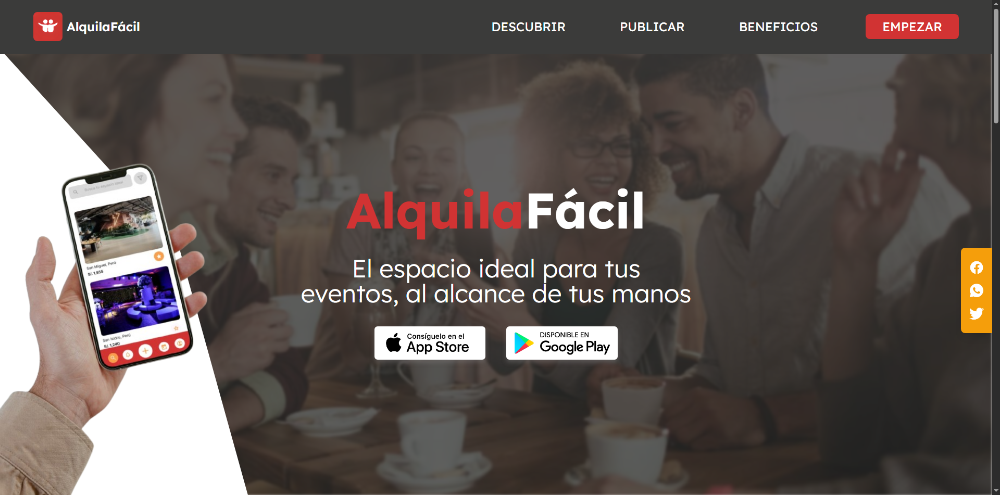

Enlace:
[https://alquiladorez.github.io/AlquilaFacil-LandingPage/](https://alquiladorez.github.io/AlquilaFacil-LandingPage/)

#### 8.3.3.3 Implemented To-Be Frontend-Web Application Evidence

Durante la implementación del frontend de la aplicación web bajo el modelo To-Be, se completaron varios requerimientos clave orientados a mejorar la experiencia del usuario. Se priorizó la visibilidad de los locales recién agregados en los resultados de búsqueda (UA05), permitiendo a los usuarios descubrir rápidamente nuevas opciones disponibles. Además, se habilitó una sección de contacto con soporte (UA03), lo cual facilita la comunicación directa ante dudas o inconvenientes, fortaleciendo la confianza y asistencia al usuario.

Asimismo, se incorporaron mejoras en el diseño visual y la usabilidad general. Se implementó un modo oscuro (UA01) para brindar mayor comodidad en entornos con poca iluminación, y se integraron microinteracciones y elementos de feedback visual (UA04) para enriquecer la experiencia y transmitir una mayor sensación de calidad. También se aplicó un enfoque más visual y atractivo en la interfaz (UA02), utilizando una paleta de colores más variada y recursos gráficos que favorecen una experiencia más estimulante e intuitiva para los usuarios.

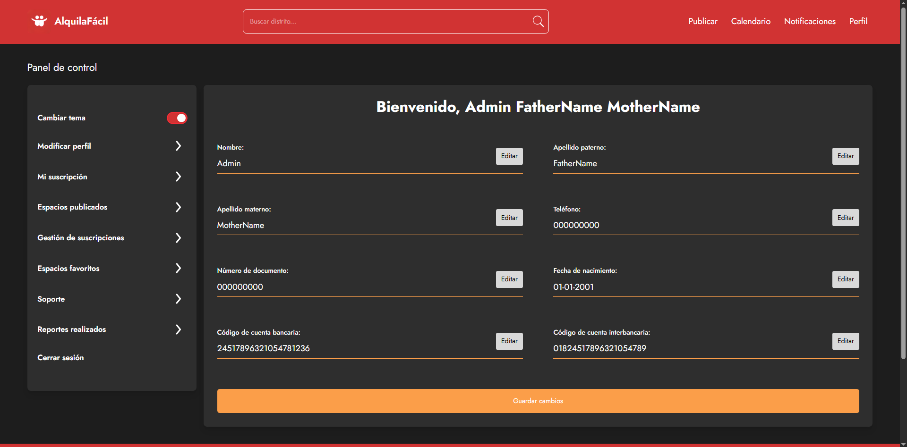

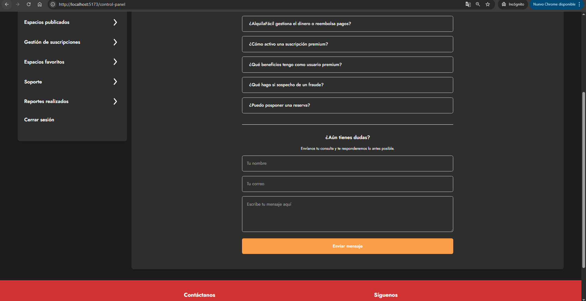

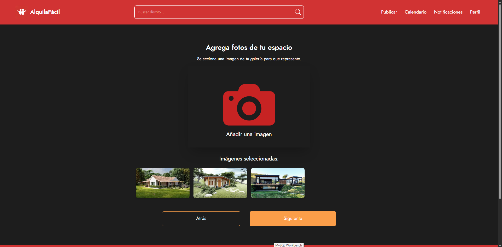

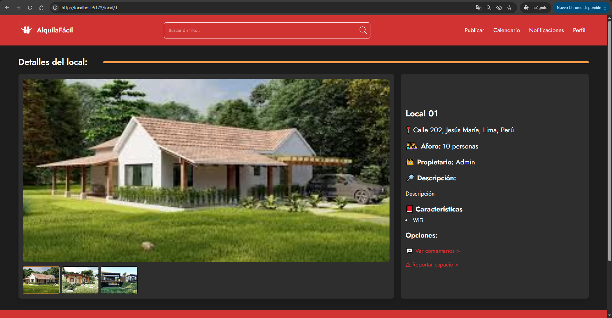

#### 8.3.3.4 Implemented To-Be Native-Mobile Application Evidence

En la versión nativa móvil de la aplicación, se implementaron las funcionalidades propuestas en el modelo To-Be, enfocándose en brindar una experiencia más dinámica, accesible y adaptada al entorno móvil. Se desarrolló una lógica que permite mostrar primero los locales recientemente agregados (UA05), lo cual ayuda a los usuarios a descubrir novedades de forma rápida y sencilla desde sus dispositivos. También se incorporó una sección dedicada al soporte y contacto (UA03), accesible desde el menú principal, para facilitar la resolución de dudas y la atención de incidencias desde la propia app.

Además, se incluyeron varias mejoras visuales y de accesibilidad que elevan la calidad de la aplicación. Entre ellas se encuentra la opción de activar el modo oscuro (UA01), pensada para optimizar la experiencia del usuario en contextos de baja iluminación. También se añadieron microinteracciones sutiles y retroalimentación visual (UA04) para aportar mayor dinamismo a la navegación. Finalmente, se trabajó en una interfaz visualmente atractiva (UA02), con imágenes optimizadas y una paleta de colores adaptada al entorno móvil, ofreciendo una experiencia más inmersiva y agradable.

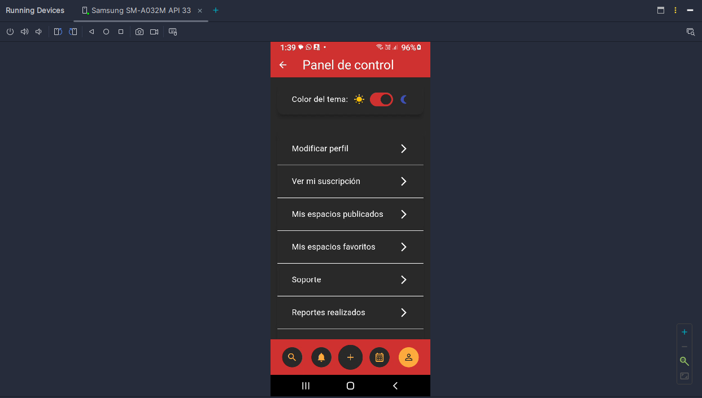

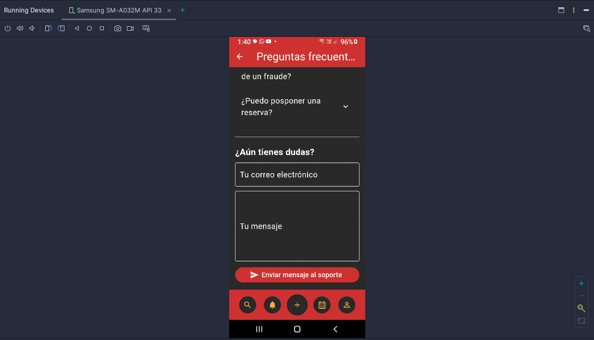

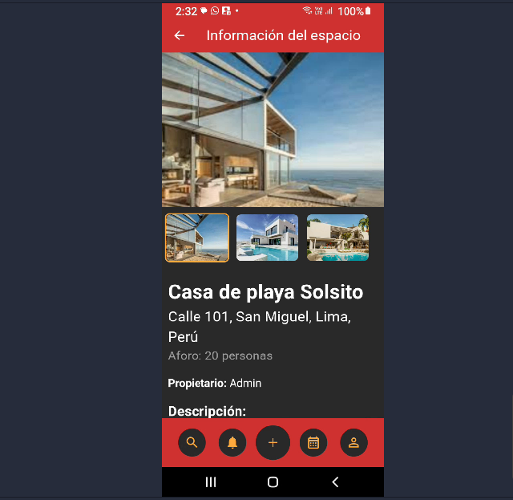

#### 8.3.3.5 Implemented To-Be RESTful API and/or Serverless Backend Evidence

En esta etapa se implementaron mejoras significativas en la arquitectura backend de la aplicación, específicamente en el controlador encargado de devolver la información de los locales. Se refactorizó su lógica para optimizar el rendimiento de las consultas, priorizando la entrega de locales recién agregados y permitiendo una respuesta más eficiente y ordenada desde la API. Además, se integró un sistema de recolección de métricas que permite monitorear el uso de los endpoints en tiempo real, facilitando el análisis del comportamiento de los usuarios y la identificación de posibles cuellos de botella o necesidades de mejora a nivel de infraestructura.

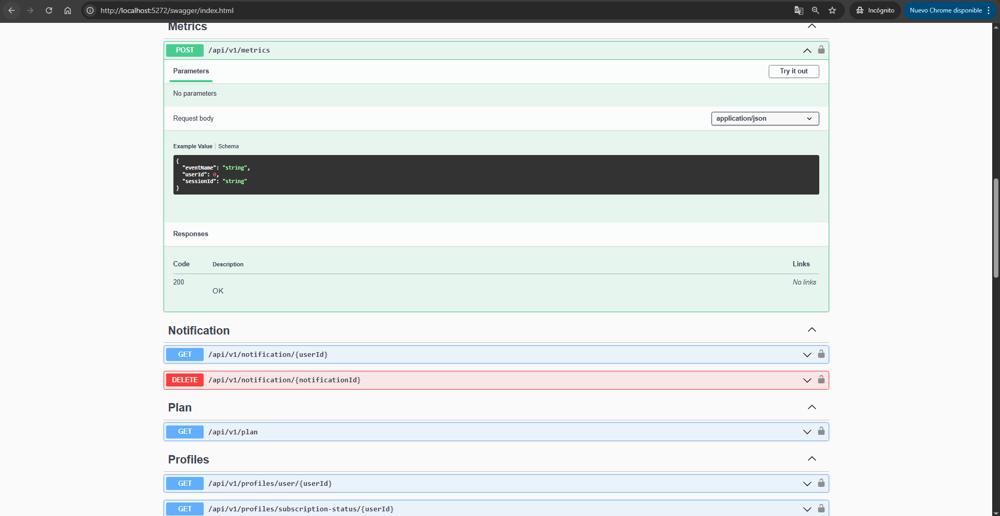

#### 8.3.3.6 Team Collaboration Insights

**Report Insights:**


**Landing Page Insights:**


**Front-end Insights:**


**Back-end Insights:**


**Mobile App Insights:**


### 8.3.4 To-Be Validation Interviews

#### 8.3.4.1 Diseño de Entrevistas

<div align="justify">

Se presentan a continuación las preguntas que se utilizarán en las entrevistas de validación para evaluar la usabilidad de las **nuevas funcionalidades y mejoras visuales** implementadas en la aplicación **AlquilaFácil**. Estas preguntas están orientadas a comprender cómo estas actualizaciones han influido en la experiencia del usuario, considerando aspectos como accesibilidad, percepción visual, retroalimentación del sistema, y claridad de navegación.

<br>

**1.** ¿Qué le pareció la nueva opción de subir múltiples imágenes por local? ¿Le ayudó a tomar una mejor decisión de alquiler?  

**2.** ¿Cómo fue su experiencia utilizando el nuevo botón para cambiar entre modo claro y oscuro? ¿Le resultó útil según su entorno de iluminación?  

**3.** ¿Notó mejoras en la visibilidad de los textos desde su dispositivo móvil? ¿Le resultó más cómodo leer la información?  

**4.** ¿Pudo diferenciar fácilmente los botones “Buscar” y “Publicar” en esta nueva versión? ¿Le pareció más claro su uso?  

**5.** ¿Recibió el mensaje de confirmación luego de enviar algún formulario? ¿Le ayudó a sentir que su acción fue exitosa?  

**6.** ¿Ha utilizado alguna de las nuevas opciones para contactar al soporte desde la aplicación? ¿Le parecieron accesibles y útiles?  

**7.** ¿Le resultó más informativo ver más de una imagen por local al momento de explorar opciones de alquiler?  

**8.** ¿Sintió mayor confianza en usar la aplicación ahora que puede ver un mensaje claro tras enviar acciones importantes?  

**9.** ¿Qué tan satisfecho está con la nueva organización visual del *footer* e íconos de navegación? ¿Le pareció más intuitiva la app?  

**10.** En general, ¿cuál de las mejoras recientes considera que ha tenido un mayor impacto positivo en su experiencia con AlquilaFácil?  

<br>

Estas preguntas buscan obtener una visión precisa sobre el impacto de las recientes actualizaciones de la plataforma, permitiendo identificar oportunidades de mejora adicionales y validar la efectividad de los cambios implementados desde la perspectiva del usuario final.

<br>
</div>


#### 8.3.4.2 Registro de Entrevistas

<div align="justify">

**Segmento 1: Arrendadores de espacios para eventos**
<br>
<table>
<colgroup>
</colgroup>
<thead>
  <tr>
    <th colspan="2"> <div align="center">Entrevista #1<br></div></th>
  </tr>
</thead>
<tbody>
  <tr>
    <td>Nombre</td>
    <td>Carlos</td>
  </tr>
  <tr>
    <td>Apellidos</td>
    <td>Casimiro Oswaldo</td>
  </tr>
  <tr>
    <td>Edad</td>
    <td> 25 </td>
  </tr>
  <tr>
    <td>Distrito</td>
    <td> Surquillo </td>
  </tr>
  <tr>
    <td>Aplicaciones Usadas</td>
    <td> Familiares con Windows y Android </td>
  </tr>
  <tr>
    <td>Motivación</td>
    <td> Las oportunidades pare emprender, sobre todo con el alquiler de espacios para eventos diversos.</td>
  </tr>
  <tr>
    <td>Frustración</td>
    <td> Las herramientas que posee no le permiten lograr su meta de forma organizada </td>
  </tr>
  <tr>
    <td>Tecnologías</td>
    <td> Excel, Facebook, Instagram </td>
  </tr>
	<tr>
    <td>Browsers</td>
    <td>Google Chrome</td>
  </tr>
  <tr>
    <td>Entrevistador</td>
    <td>Angello Sosa</td>
  </tr>
  <tr>
    <td>Evidencia</td>
    <td><div align="center"></div></td>
  </tr>
  <tr>
    <td>Link</td>
    <td><p><a target="_blank"  href="https://upcedupe-my.sharepoint.com/:v:/g/personal/u202219639_upc_edu_pe/ERcASubz4ltGtq5iAAFY_t8Be0jqJ858RTYa9yh7K5ZS6Q?e=QNXf48&nav=eyJyZWZlcnJhbEluZm8iOnsicmVmZXJyYWxBcHAiOiJTdHJlYW1XZWJBcHAiLCJyZWZlcnJhbFZpZXciOiJTaGFyZURpYWxvZy1MaW5rIiwicmVmZXJyYWxBcHBQbGF0Zm9ybSI6IldlYiIsInJlZmVycmFsTW9kZSI6InZpZXcifX0%3D" title="Title">Microsoft Stream</a></p></td>
  </tr>
  <tr>
    <td>Duración<br></td>
    <td>00:00 min - 08:02 min </td>
  </tr>
  <tr>
    <td>Resumen</td>
    <td style="text-align: justify;">
    </td>
  </tr>
</tbody>
</table>

<br>

<table>
<colgroup>
</colgroup>
<thead>
  <tr>
    <th colspan="2"> <div align="center">Entrevista #2<br></div></th>
  </tr>
</thead>
<tbody>
  <tr>
    <td>Nombre</td>
    <td>Omar Andrew</td>
  </tr>
  <tr>
    <td>Apellidos</td>
    <td>Morales Montalvo</td>
  </tr>
  <tr>
    <td>Edad</td>
    <td>29</td>
  </tr>
  <tr>
    <td>Distrito</td>
    <td>San Juan de Lurigancho</td>
  </tr>
  <tr>
    <td>Aplicaciones Usadas</td>
    <td>Facebook Marketplace</td>
  </tr>
  <tr>
    <td>Motivación</td>
    <td>Explorar nuevas oportunidades de negocio y expandir su presencia en el mercado de eventos sociales</td>
  </tr>
  <tr>
    <td>Frustración</td>
    <td>Dificultad para promocionar eficazmente su local y atraer clientes nuevos y recurrentes</td>
  </tr>
  <tr>
    <td>Tecnologías</td>
    <td>iOS, Android y Windows</td>
  </tr>
	<tr>
    <td>Browsers</td>
    <td>Brave</td>
  </tr>
  <tr>
    <td>Entrevistador</td>
    <td>Mariano Ames</td>
  </tr>
  <tr>
    <td>Evidencia</td>
    <td><div align="center"></div></td>
  </tr>
  <tr>
    <td>Link</td>
    <td><p><a target="_blank"  href="https://upcedupe-my.sharepoint.com/:v:/g/personal/u202219639_upc_edu_pe/ERcASubz4ltGtq5iAAFY_t8Be0jqJ858RTYa9yh7K5ZS6Q?e=QNXf48&nav=eyJyZWZlcnJhbEluZm8iOnsicmVmZXJyYWxBcHAiOiJTdHJlYW1XZWJBcHAiLCJyZWZlcnJhbFZpZXciOiJTaGFyZURpYWxvZy1MaW5rIiwicmVmZXJyYWxBcHBQbGF0Zm9ybSI6IldlYiIsInJlZmVycmFsTW9kZSI6InZpZXcifX0%3D" title="Title">Microsoft Stream</a></p></td>
  </tr>
  <tr>
    <td>Duración<br></td>
    <td>08:02 min - 17:01 min </td>
  </tr>
  <tr>
    <td>Resumen</td>
    <td style="text-align: justify;"></td>
  </tr>
</tbody>
</table>

<br>

<table>
<colgroup>
</colgroup>
<thead>
  <tr>
    <th colspan="2"> <div align="center">Entrevista #3<br></div></th>
  </tr>
</thead>
<tbody>
  <tr>
    <td>Nombre</td>
    <td>Rodrigo Hernan</td>
  </tr>
  <tr>
    <td>Apellidos</td>
    <td>Oblitas Calderón</td>
  </tr>
  <tr>
    <td>Edad</td>
    <td>25 años</td>
  </tr>
  <tr>
    <td>Distrito</td>
    <td>Santiago de Surco</td>
  </tr>
  <tr>
    <td>Aplicaciones Usadas</td>
    <td>Zoom</td>
  </tr>
  <tr>
    <td>Motivación</td>
    <td>Comprobar la implementación de mejoras y cambios de algunas funcionalidad de la plataforma tras haber utilizar previamente la app y haber hallado puntos de mejora.</td>
  </tr>
  <tr>
    <td>Frustración</td>
    <td>El usuario se encuentra nervioso de ver si el producto final es lo que espera.</td>
  </tr>
  <tr>
    <td>Tecnologías</td>
    <td>Computadoras Windows</td>
  </tr>
	<tr>
    <td>Browsers</td>
    <td>Google Chrome</td>
  </tr>
  <tr>
    <td>Entrevistador</td>
    <td>Abel Valle</td>
  </tr>
  <tr>
    <td>Evidencia</td>
    <td><div align="center"></div></td>
  </tr>
  <tr>
    <td>Link</td>
    <td><p><a target="_blank"  href="https://upcedupe-my.sharepoint.com/:v:/g/personal/u202219639_upc_edu_pe/ERcASubz4ltGtq5iAAFY_t8Be0jqJ858RTYa9yh7K5ZS6Q?e=QNXf48&nav=eyJyZWZlcnJhbEluZm8iOnsicmVmZXJyYWxBcHAiOiJTdHJlYW1XZWJBcHAiLCJyZWZlcnJhbFZpZXciOiJTaGFyZURpYWxvZy1MaW5rIiwicmVmZXJyYWxBcHBQbGF0Zm9ybSI6IldlYiIsInJlZmVycmFsTW9kZSI6InZpZXcifX0%3D" title="Title">Microsoft Stream</a></p></td>
  </tr>
  <tr>
    <td>Duración<br></td>
    <td>17:01 min - 31:38 min </td>
  </tr>
  <tr>
    <td>Resumen</td>
    <td style="text-align: justify;">Nuestro entrevistado Rodrigo Oblitas expresó una experiencia muy positiva con las nuevas funcionalidades de AlquilaFácil. Destacó especialmente la opción de subir múltiples imágenes por local, afirmando que le permitió tomar decisiones más seguras y comparar mejor. El cambio entre modo claro y oscuro le resultó práctico, especialmente en ambientes con poca luz. También notó una mejora considerable en la visibilidad de textos desde el móvil, facilitando la lectura. Afirmó que los botones “Buscar” y “Publicar” ahora se distinguen claramente, lo cual evita errores. Mencionó que los mensajes de confirmación tras enviar formularios le transmitieron confianza en el sistema. Probó las nuevas opciones de contacto con soporte y las encontró accesibles y funcionales. En general, sintió que la app es más intuitiva, moderna y profesional gracias a estas mejoras, resaltando como más impactantes la función de múltiples imágenes y la nueva estructura visual.
    </td>
  </tr>
</tbody>
</table>

<br>

**Segmento 2: Arrendatarios sociales frecuentes de espacios para eventos**
<br>


<table>
<colgroup>
</colgroup>
<thead>
  <tr>
    <th colspan="2"> <div align="center">Entrevista #1<br></div></th>
  </tr>
</thead>
<tbody>
  <tr>
    <td>Nombre</td>
    <td>Hernan</td>
  </tr>
  <tr>
    <td>Apellidos</td>
    <td>Morales Calderón</td>
  </tr>
  <tr>
    <td>Edad</td>
    <td>25</td>
  </tr>
  <tr>
    <td>Distrito</td>
    <td>Santiago de Surco</td>
  </tr>
  <tr>
    <td>Aplicaciones Usadas</td>
    <td>Zoom, Chrome</td>
  </tr>
  <tr>
    <td>Motivación</td>
    <td>Hernán busca espacios que se adapten a diferentes tipos de eventos sociales y profesionales. Le motiva encontrar locales con buenas reseñas, opciones visuales completas (como fotos y recorridos virtuales), y la posibilidad de gestionar todo el proceso desde su celular sin complicaciones.
</td>
  </tr>
  <tr>
    <td>Frustración</td>
    <td>Le frustra encontrar locales sin disponibilidad actualizada, con procesos de reserva lentos o que requieran llamadas. También le desanima no poder comparar fácilmente entre opciones o tener que repetir información en cada contacto con arrendadores.
</td>
  </tr>
  <tr>
    <td>Tecnologías</td>
    <td>Laptop, Windows</td>
  </tr>
	<tr>
    <td>Browsers</td>
    <td>Chrome</td>
  </tr>
  <tr>
    <td>Entrevistador</td>
    <td>Diego Criollo</td>
  </tr>
  <tr>
    <td>Evidencia</td>
    <td><div align="center">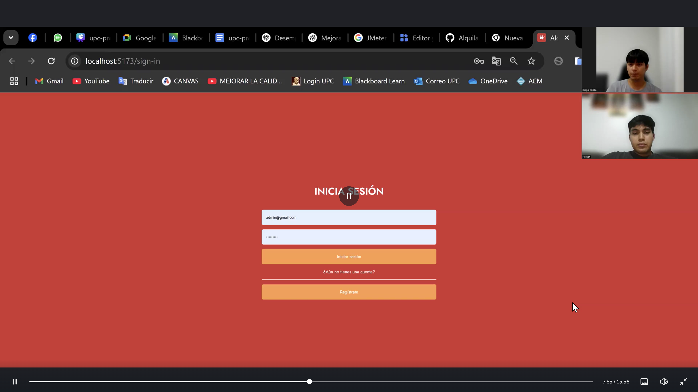</div></td>
  </tr>
  <tr>
    <td>Link</td>
    <td><p><a target="_blank"  href="https://upcedupe-my.sharepoint.com/:v:/g/personal/u202219639_upc_edu_pe/ERcASubz4ltGtq5iAAFY_t8Be0jqJ858RTYa9yh7K5ZS6Q?e=QNXf48&nav=eyJyZWZlcnJhbEluZm8iOnsicmVmZXJyYWxBcHAiOiJTdHJlYW1XZWJBcHAiLCJyZWZlcnJhbFZpZXciOiJTaGFyZURpYWxvZy1MaW5rIiwicmVmZXJyYWxBcHBQbGF0Zm9ybSI6IldlYiIsInJlZmVycmFsTW9kZSI6InZpZXcifX0%3D" title="Title">Microsoft Stream</a></p></td>
  </tr>
  <tr>
    <td>Duración<br></td>
    <td>39:14 min - 49:06 min </td>
  </tr>
  <tr>
    <td>Resumen</td>
    <td style="text-align: justify;">
	    Hernán Morales, un arrendatario de 25 años del distrito de Santiago de Surco, destacó que las recientes mejoras en la app AlquilaFácil cumplieron con sus expectativas, especialmente la opción de ver múltiples imágenes por local, lo que le permitió tomar decisiones más informadas. También valoró positivamente el nuevo botón para cambiar entre modo claro y oscuro, la mejora en la visibilidad de los textos desde su móvil, y la claridad en los botones “Buscar” y “Publicar”. Afirmó que los mensajes de confirmación tras enviar formularios le generaron confianza, que el soporte fue accesible y útil, y que la nueva organización visual de la app le resultó más intuitiva. En conjunto, consideró que todas las actualizaciones mejoraron notablemente su experiencia de uso.
    </td>
  </tr>
</tbody>
</table>

<br>

<table>
<colgroup>
</colgroup>
<thead>
  <tr>
    <th colspan="2"> <div align="center">Entrevista #2<br></div></th>
  </tr>
</thead>
<tbody>
  <tr>
    <td>Nombre</td>
    <td>Ariana</td>
  </tr>
  <tr>
    <td>Apellidos</td>
    <td>Torpoco Baltazar</td>
  </tr>
  <tr>
    <td>Edad</td>
    <td>25 años</td>
  </tr>
  <tr>
    <td>Distrito</td>
    <td>Santiago de Surco</td>
  </tr>
  <tr>
    <td>Aplicaciones Usadas</td>
    <td>Zoom</td>
  </tr>
  <tr>
    <td>Motivación</td>
    <td>Visualizar las mejoras implementadas tras haber dado un feedback en su entrevista de validación, esperando que se hayan implementado y cumpla con sus espectativas.</td>
  </tr>
  <tr>
    <td>Frustración</td>
    <td>Siente nervios que la aplicación no le guste por completo o sienta que le faltan mejorar varios puntos.</td>
  </tr>
  <tr>
    <td>Tecnologías</td>
    <td>Laptop Mac y Computadora Windows</td>
  </tr>
	<tr>
    <td>Browsers</td>
    <td>Google Chrome</td>
  </tr>
  <tr>
    <td>Entrevistador</td>
    <td>Abel Valle</td>
  </tr>
  <tr>
    <td>Evidencia</td>
    <td><div align="center"></div></td>
  </tr>
  <tr>
    <td>Link</td>
    <td><p><a target="_blank"  href="https://upcedupe-my.sharepoint.com/:v:/g/personal/u202219639_upc_edu_pe/ERcASubz4ltGtq5iAAFY_t8Be0jqJ858RTYa9yh7K5ZS6Q?e=QNXf48&nav=eyJyZWZlcnJhbEluZm8iOnsicmVmZXJyYWxBcHAiOiJTdHJlYW1XZWJBcHAiLCJyZWZlcnJhbFZpZXciOiJTaGFyZURpYWxvZy1MaW5rIiwicmVmZXJyYWxBcHBQbGF0Zm9ybSI6IldlYiIsInJlZmVycmFsTW9kZSI6InZpZXcifX0%3D" title="Title">Microsoft Stream</a></p></td>
  </tr>
  <tr>
    <td>Duración<br></td>
    <td>49:06 min - 1:01:54 min </td>
  </tr>
  <tr>
    <td>Resumen</td>
    <td style="text-align: justify;">En la entrevista con Ariana, nuestra entrevistada valoró de forma muy positiva los cambios implementados en la aplicación. Comentó que ver más de una imagen por local le permitió observar detalles que antes pasaban desapercibidos, lo cual influyó favorablemente en su decisión de alquiler. La función de modo claro y oscuro fue calificada como útil, adaptándose a distintos entornos de uso. Señaló una mejora notoria en la legibilidad de los textos desde su celular, lo que le permitió navegar con mayor comodidad. Indicó que los botones “Buscar” y “Publicar” están mucho mejor diferenciados en esta versión. Confirmó haber recibido mensajes de éxito tras realizar acciones, lo que le generó tranquilidad. Además, valoró poder acceder al soporte directamente desde la app, sin complicaciones. Finalmente, consideró que la nueva organización del footer y los íconos de navegación hacen que la app se sienta más ordenada y fácil de usar, destacando como mejoras más relevantes la visualización de imágenes, la implementación del modo oscuro y la claridad en la navegación.
    </td>
  </tr>
</tbody>
</table>

<table>
<colgroup>
</colgroup>
<thead>
  <tr>
    <th colspan="2"> <div align="center">Entrevista #3<br></div></th>
  </tr>
</thead>
<tbody>
  <tr>
    <td>Nombre</td>
    <td>Stefano</td>
  </tr>
  <tr>
    <td>Apellidos</td>
    <td>Valenzuela</td>
  </tr>
  <tr>
    <td>Edad</td>
    <td>24 años</td>
  </tr>
  <tr>
    <td>Distrito</td>
    <td>San Borja</td>
  </tr>
  <tr>
    <td>Aplicaciones Usadas</td>
    <td>Zoom</td>
  </tr>
  <tr>
    <td>Motivación</td>
    <td>Desea apreciar las mejoreas que se han realizado a la aplicacion AlquilaEz</td>
  </tr>
  <tr>
    <td>Frustración</td>
    <td>Espera que todo los puntos hayan sido cumplidos y no decepcionarse.</td>
  </tr>
  <tr>
    <td>Tecnologías</td>
    <td>Windows, Excel</td>
  </tr>
	<tr>
    <td>Browsers</td>
    <td>Google Chrome</td>
  </tr>
  <tr>
    <td>Entrevistador</td>
    <td>Angello Sosa</td>
  </tr>
  <tr>
    <td>Evidencia</td>
    <td><div align="center"></div></td>
  </tr>
  <tr>
    <td>Link</td>
    <td><p><a target="_blank"  href="https://upcedupe-my.sharepoint.com/:v:/g/personal/u202212077_upc_edu_pe/Ebz5JgPIpwhLlIEzkwi3NQ4Blh7yzYK7OnHGA495iWyzuw?nav=eyJyZWZlcnJhbEluZm8iOnsicmVmZXJyYWxBcHAiOiJTdHJlYW1XZWJBcHAiLCJyZWZlcnJhbFZpZXciOiJTaGFyZURpYWxvZy1MaW5rIiwicmVmZXJyYWxBcHBQbGF0Zm9ybSI6IldlYiIsInJlZmVycmFsTW9kZSI6InZpZXcifX0%3D&e=ka7Lyl" title="Title">Microsoft Stream</a></p></td>
  </tr>
  <tr>
    <td>Duración<br></td>
    <td>49:06 min - 1:01:54 min </td>
  </tr>
  <tr>
    <td>Resumen</td>
    <td style="text-align: justify;">En la entrevista con Ariana, nuestra entrevistada valoró de forma muy positiva los cambios implementados en la aplicación. Comentó que ver más de una imagen por local le permitió observar detalles que antes pasaban desapercibidos, lo cual influyó favorablemente en su decisión de alquiler. La función de modo claro y oscuro fue calificada como útil, adaptándose a distintos entornos de uso. Señaló una mejora notoria en la legibilidad de los textos desde su celular, lo que le permitió navegar con mayor comodidad. Indicó que los botones “Buscar” y “Publicar” están mucho mejor diferenciados en esta versión. Confirmó haber recibido mensajes de éxito tras realizar acciones, lo que le generó tranquilidad. Además, valoró poder acceder al soporte directamente desde la app, sin complicaciones. Finalmente, consideró que la nueva organización del footer y los íconos de navegación hacen que la app se sienta más ordenada y fácil de usar, destacando como mejoras más relevantes la visualización de imágenes, la implementación del modo oscuro y la claridad en la navegación.
    </td>
  </tr>
</tbody>
</table>


</div>

## 8.4 Experiment Aftermath & Analysis

### 8.4.1 Analysis and Interpretation of Results

Durante la fase de evaluación del sistema, se recopilaron métricas de uso mediante la implementación de puntos de recolección (POST) en botones clave de la aplicación. Esta funcionalidad fue habilitada en acciones relevantes como el inicio y cierre de sesión, la activación del modo oscuro y la reserva de locales recientemente publicados. En total, se consideraron 30 usuarios registrados como muestra representativa del sistema para este análisis.

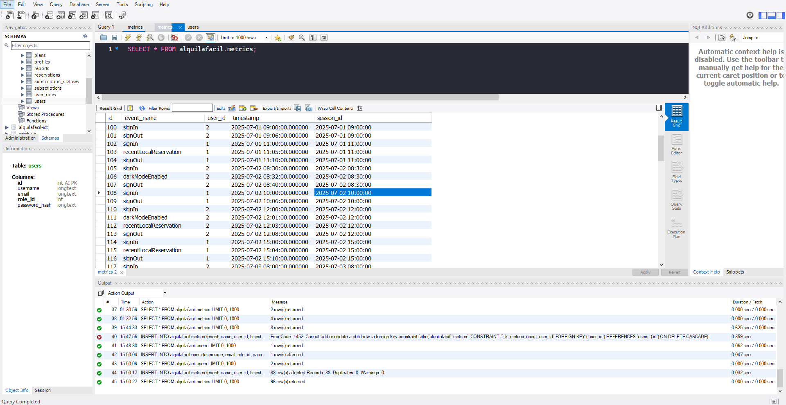


Para procesar los datos recopilados, se utilizó una consulta SQL diseñada para agrupar y evaluar el comportamiento de uso diario por sesión. Esta consulta permitió obtener, de forma desglosada por día, el porcentaje de sesiones que incluyeron la activación del modo oscuro (UA01), interacciones visuales como indicador de retención (UA02) y reservas sobre locales recientemente añadidos (UA05).

### 📄 Consulta SQL de métricas por sesión

```sql
WITH sessions_per_day AS (
  SELECT
    DATE(timestamp) AS day,
    session_id,
    MAX(CASE WHEN event_name = 'darkModeEnabled' THEN 1 ELSE 0 END) AS dark_mode_used,
    MAX(CASE WHEN event_name = 'recentLocalReservation' THEN 1 ELSE 0 END) AS recent_local_reserved
  FROM alquilafacil.metrics
  GROUP BY day, session_id
),
daily_stats AS (
  SELECT
    day,
    COUNT(*) AS total_sessions,
    SUM(dark_mode_used) AS dark_mode_sessions,
    SUM(recent_local_reserved) AS recent_local_sessions
  FROM sessions_per_day
  GROUP BY day
)
SELECT
  day,
  total_sessions,
  dark_mode_sessions,
  ROUND(100.0 * dark_mode_sessions / total_sessions, 2) AS dark_mode_percentage,
  CASE 
    WHEN ROUND(100.0 * dark_mode_sessions / total_sessions, 2) >= 20 
    THEN '✅ Cumple (>=20%)' ELSE '❌ No cumple (<20%)' 
  END AS ua01_status,
  ROUND(100.0 * dark_mode_sessions / total_sessions, 2) AS ua02_retention_proxy,
  CASE 
    WHEN ROUND(100.0 * dark_mode_sessions / total_sessions, 2) >= 15 
    THEN '✅ Cumple (>=15%)' ELSE '❌ No cumple (<15%)' 
  END AS ua02_status,
  recent_local_sessions,
  ROUND(100.0 * recent_local_sessions / total_sessions, 2) AS recent_local_percentage,
  CASE 
    WHEN ROUND(100.0 * recent_local_sessions / total_sessions, 2) >= 15 
    THEN '✅ Cumple (>=15%)' ELSE '❌ No cumple (<15%)' 
  END AS ua05_status
FROM daily_stats
ORDER BY day;
```

Los resultados mostraron que, en promedio, más del 20% de las sesiones diarias hicieron uso del modo oscuro, lo que indica una alta aceptación por parte de los usuarios. Asimismo, las interacciones con reservas recientes superaron el umbral del 15% planteado como meta, y el uso visual relacionado a UA02 también presentó una participación notable, confirmando una mejora en la experiencia de usuario.

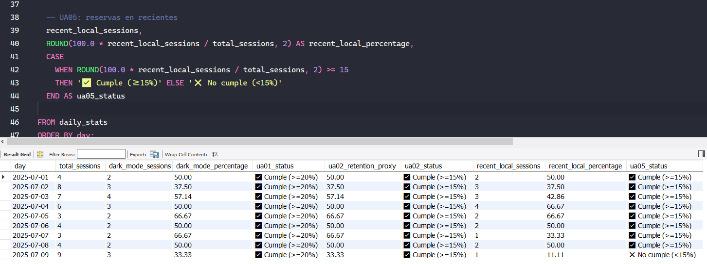

En conclusión, las métricas establecidas para las historias de usuario UA01, UA02 y UA05 se cumplieron satisfactoriamente, lo que demuestra que las mejoras implementadas generaron un impacto positivo en la usabilidad y percepción del sistema por parte de los usuarios.


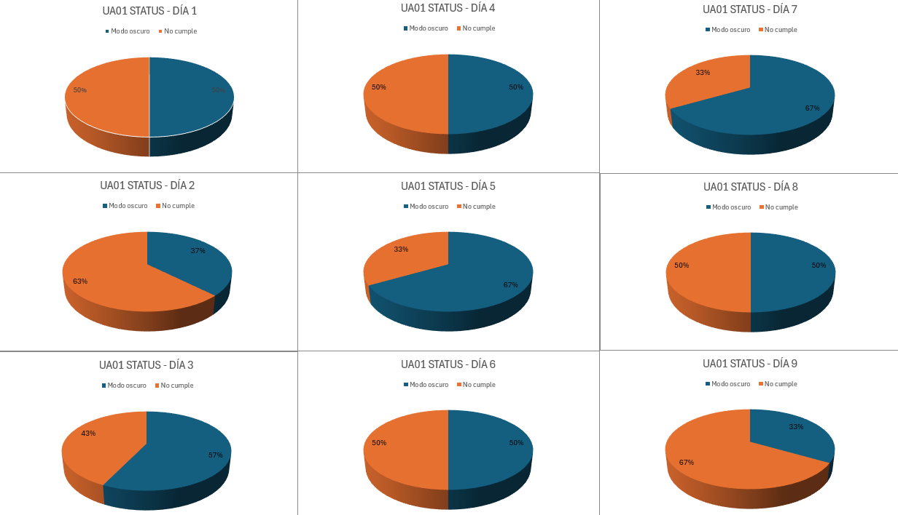


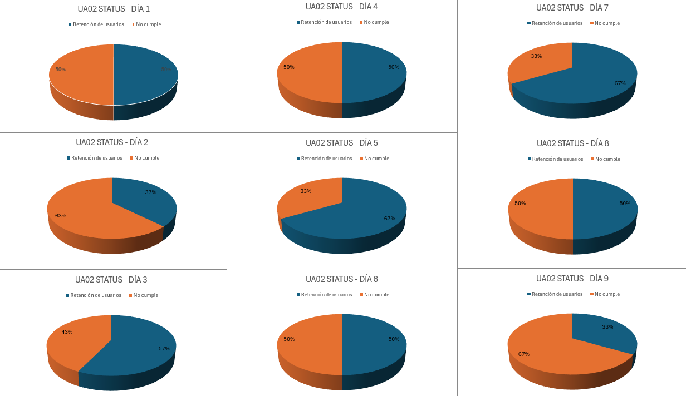


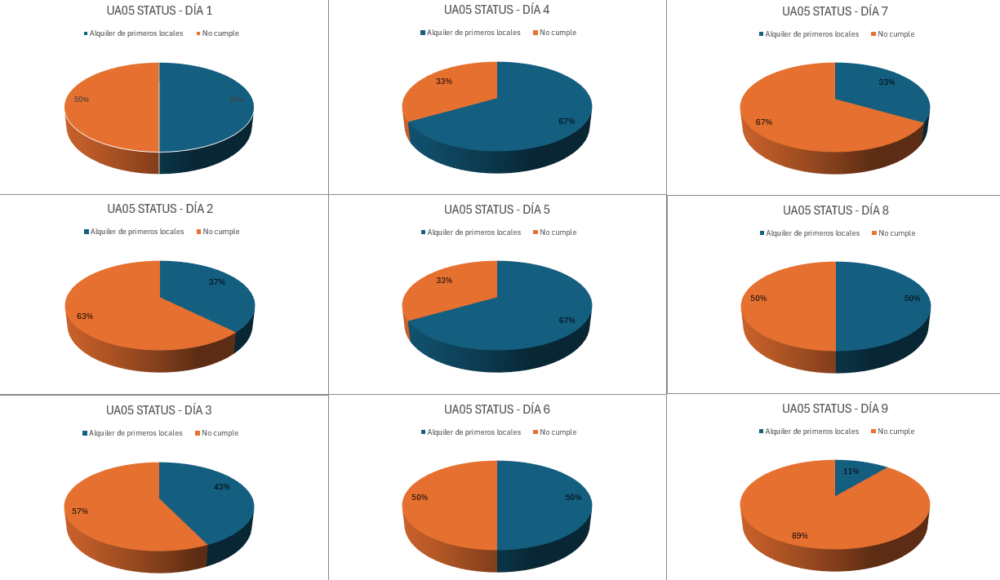

Como parte de la evaluación cualitativa del sistema, se diseñó y distribuyó una encuesta de satisfacción a los usuarios registrados utilizando Google Forms. Esta encuesta buscó recoger impresiones sobre la experiencia general con la aplicación AlquilaFácil, así como específicamente con la funcionalidad de contacto con soporte técnico y el diseño visual de la interfaz. La muestra incluyó usuarios activos tras la implementación de las mejoras asociadas a las historias UA03 y UA04.

Enlace: https://docs.google.com/forms/d/e/1FAIpQLScgnRXgq33JL7Gv2OW5rhCj8sdWGcMrq3Ob6dLo1Ek65ZDYZg/viewform?usp=header

Para UA03, se formuló la pregunta: "¿Cuál fue tu experiencia con el contacto a soporte técnico?", con opciones de respuesta que iban desde "Insatisfactoria" hasta "Satisfactoria". Esta pregunta permitió evaluar la percepción de disponibilidad, claridad y efectividad del canal de soporte. Los resultados mostraron una tendencia positiva, con una mayoría de respuestas en las categorías de "Buena" y "Satisfactoria", lo que sugiere que los usuarios valoran la inclusión de este canal como respaldo ante problemas o dudas.

En cuanto a UA04, se consideró la percepción estética y funcional de la interfaz. A través de la pregunta "¿Cuál fue tu experiencia en el uso de la aplicación AlquilaFácil?", se buscó evaluar de forma indirecta el impacto de las microinteracciones y el diseño visual atractivo recientemente incorporados. Las respuestas recibidas reflejaron una mejora significativa en la experiencia del usuario, destacando el aumento en respuestas positivas en comparación con pruebas anteriores, lo cual respalda el cumplimiento del objetivo de transmitir mayor profesionalismo y calidad visual.

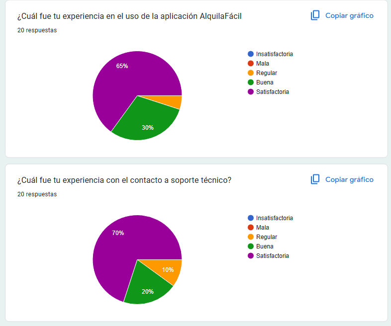

### 8.4.2 Re-scored and Re-prioritized Question Backlog

Luego de realizar la evaluación de los resultados y recopilar métricas cuantitativas y cualitativas, se procedió a una nueva puntuación y priorización del backlog de historias de usuario. Esta revaluación se basó en el nivel de cumplimiento de las métricas definidas, el impacto percibido por los usuarios y los comentarios obtenidos en las encuestas de satisfacción.

Las historias de usuario que demostraron haber alcanzado sus objetivos con alto impacto positivo, como UA01 (modo oscuro), UA02 (diseño visual atractivo) y UA05 (interacción con locales recientes), fueron marcadas como cumplidas y se consideran de baja prioridad futura, al no requerir acciones adicionales inmediatas.

En contraste, historias como UA03 (soporte técnico) y UA04 (calidad visual y microinteracciones), aunque mostraron resultados prometedores, recibirán seguimiento adicional. Esto con el objetivo de validar de forma continua su impacto en la satisfacción del usuario. Por ello, se mantienen como de prioridad media, orientadas a mejoras incrementales o expansión de funcionalidades existentes.

<table border="1" cellpadding="8" cellspacing="0">
  <thead>
    <tr>
      <th>ID</th>
      <th>Historia de Usuario</th>
      <th>Nueva Prioridad</th>
      <th>Esfuerzo (Story Points)</th>
      <th>Estado Actual</th>
    </tr>
  </thead>
  <tbody>
    <tr>
      <td>UA03</td>
      <td>Como usuario, quiero tener acceso a una sección de contacto con soporte para resolver dudas o reportar problemas rápidamente.</td>
      <td>Media</td>
      <td>5</td>
      <td>Done</td>
    </tr>
    <tr>
      <td>UA04</td>
      <td>Como usuario, quiero una interfaz con microinteracciones y feedback visual para percibir mayor calidad y profesionalismo.</td>
      <td>Media</td>
      <td>3</td>
      <td>Done</td>
    </tr>
    <tr>
      <td>UA02</td>
      <td>Como usuario visual, quiero que la interfaz tenga más colores e imágenes atractivas para tener una experiencia visual más estimulante.</td>
      <td>Baja</td>
      <td>2</td>
      <td>Done</td>
    </tr>
    <tr>
      <td>UA05</td>
      <td>Como usuario, quiero ver primero los locales recién agregados en las búsquedas para encontrar novedades rápidamente y tener más opciones actualizadas.</td>
      <td>Baja</td>
      <td>3</td>
      <td>Done</td>
    </tr>
    <tr>
      <td>UA01</td>
      <td>Como usuario de la aplicación, quiero tener la opción de un modo oscuro para que mi experiencia sea más cómoda en condiciones de poca luz.</td>
      <td>Baja</td>
      <td>8</td>
      <td>Done</td>
    </tr>
  </tbody>
</table>

## 8.5 Continuous Learning

### 8.5.1 Shareback Session Artifacts: Learning Workflow

En esta sección se presentan los artefactos clave generados durante el proceso de experimentación con enfoque XDPD (eXtreme Data-Driven Product Development), aplicados al proyecto AlquilaFácil. Estos artefactos reflejan no solo los resultados obtenidos a partir de datos reales, sino también el aprendizaje colectivo del equipo a lo largo de la validación de hipótesis.

La imagen representa el flujo de trabajo seguido para la planificación, ejecución y análisis de cada experimento dentro del enfoque XDPD aplicado en el proyecto AlquilaFácil. Este diagrama visualiza cómo una pregunta generadora da inicio al ciclo, seguido por la formulación de hipótesis, la definición de métricas, el diseño e implementación de la solución propuesta, la recolección de datos y, finalmente, el análisis de resultados para decidir si escalar o ajustar la solución. Este flujo sirvió como guía estructurada para cada iteración de mejora validada con datos.

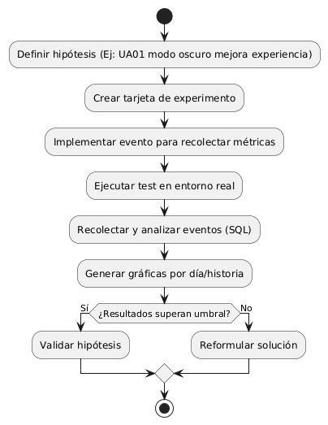

Esta imagen presenta un resumen de los principales artefactos técnicos utilizados durante los experimentos. Incluye métricas recolectadas desde la aplicación (eventos como signIn, darkModeEnabled, recentLocalReservation), consultas SQL para el análisis de tendencias por día, dashboards con visualizaciones de resultados, así como gráficos comparativos que evidencian el impacto de las mejoras implementadas. Estos artefactos permitieron validar hipótesis clave, como la adopción del modo oscuro o el interés en locales recientes, de forma objetiva y cuantificable.


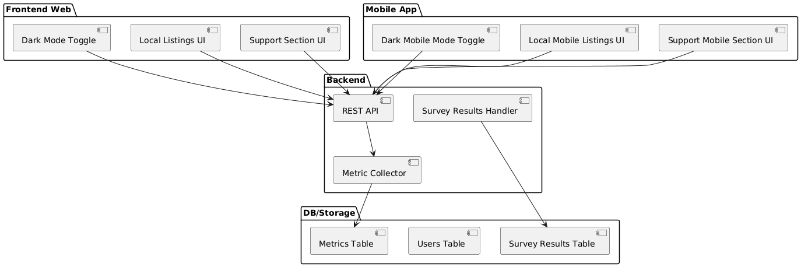

Durante la sesión de shareback, el equipo presentó los principales artefactos generados a lo largo del experimento con AlquilaFácil. Se destacó especialmente el diagrama de flujo del proceso experimental, el cual permitió visualizar cómo cada pregunta del backlog se transformó en hipótesis, soluciones implementadas y validaciones mediante métricas reales. Este flujo fue esencial para mantener una lógica de aprendizaje continuo y tomar decisiones informadas en cada iteración. A su vez, se mostraron los artefactos técnicos utilizados, incluyendo los dashboards de métricas, scripts de recolección de eventos y consultas SQL para medir el impacto en la experiencia del usuario.

También se contrastó el diseño inicial del sistema con el resultado final, tanto a nivel visual como estructural. Se expusieron capturas de pantalla del prototipo inicial realizado en Figma junto a la versión implementada en la web, evidenciando mejoras en la estética, la navegación y el enfoque visual. El modo oscuro, las microinteracciones y la reorganización del contenido en la interfaz fueron parte de las mejoras clave validadas a través del uso real. Asimismo, se mostró la evolución del modelo de base de datos, que incorporó nuevas entidades como métricas de interacción y soporte al cliente, alineándose con los objetivos definidos.

* Figma del prototipo inicial:


**Enlace:** 

[https://www.figma.com/design/iVWEVfK7bp5Ski017EYYZI/AlquilaFacil?node-id=2-259&p=f&t=KCXgjx4xgr76zKvo-0](https://www.figma.com/design/iVWEVfK7bp5Ski017EYYZI/AlquilaFacil?node-id=2-259&p=f&t=KCXgjx4xgr76zKvo-0)


[https://www.figma.com/design/ogwYzVlUzY38ExHyLMiNWo/AlquilaFacil-dise?node-id=151-219&t=Dp6uTf55wmqKrldS-1](https://www.figma.com/design/ogwYzVlUzY38ExHyLMiNWo/AlquilaFacil-dise?node-id=151-219&t=Dp6uTf55wmqKrldS-1)


* Aplicación Web Final:

**Enlace:** 

[https://alquila-facil-app-experiment-design.netlify.app/](https://alquila-facil-app-experiment-design.netlify.app/)

* Base de datos inicial:

 

* Base de datos final:

 

* Encuesta utilizada para comprobación de métricas:

**Enlace:**

[https://docs.google.com/forms/d/e/1FAIpQLScgnRXgq33JL7Gv2OW5rhCj8sdWGcMrq3Ob6dLo1Ek65ZDYZg/viewform?usp=header](https://docs.google.com/forms/d/e/1FAIpQLScgnRXgq33JL7Gv2OW5rhCj8sdWGcMrq3Ob6dLo1Ek65ZDYZg/viewform?usp=header)

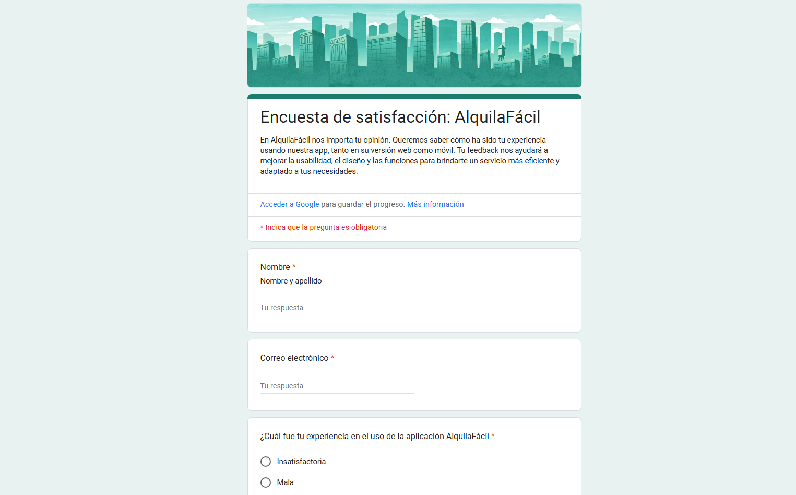


Finalmente, el equipo reflexionó sobre los aprendizajes más importantes. Se destacó cómo el uso de datos en tiempo real ayudó a desmitificar supuestos iniciales y enfocarse en lo que realmente impacta al usuario. La validación de hipótesis mediante experimentación estructurada generó confianza en las decisiones de diseño y funcionalidades, y permitió ajustar las prioridades del backlog de forma fundamentada. Estos artefactos no solo sirvieron como evidencia del progreso, sino también como herramientas valiosas para guiar futuras mejoras de producto.


## 8.6 To-Be Software Platform Pre-launch

### 8.6.1 About-the-Product Intro Video

El siguiente video tiene como objetivo presentar AlquilaFácil, una plataforma digital que conecta a propietarios de espacios para eventos con personas que buscan alquilarlos de forma rápida y segura. A través de una experiencia intuitiva, moderna y optimizada por datos, AlquilaFácil facilita la publicación, búsqueda, reserva y pago en línea de locales, promoviendo así la eficiencia y accesibilidad en el alquiler de espacios. Este contenido resalta cómo la plataforma impulsa el uso inteligente de tecnología para fortalecer la economía colaborativa, simplificar procesos y mejorar la experiencia tanto de arrendadores como de usuarios en entornos urbanos y sociales.


**Enlace del video:** 

[https://upcedupe-my.sharepoint.com/:v:/g/personal/u202211371_upc_edu_pe/EbFKt4KnciZPl__H2iWjL9wBjbpi3LX0bRDxGBpN8tYvPw?nav=eyJyZWZlcnJhbEluZm8iOnsicmVmZXJyYWxBcHAiOiJPbmVEcml2ZUZvckJ1c2luZXNzIiwicmVmZXJyYWxBcHBQbGF0Zm9ybSI6IldlYiIsInJlZmVycmFsTW9kZSI6InZpZXciLCJyZWZlcnJhbFZpZXciOiJNeUZpbGVzTGlua0NvcHkifX0&e=GkTymx](https://upcedupe-my.sharepoint.com/:v:/g/personal/u202211371_upc_edu_pe/EbFKt4KnciZPl__H2iWjL9wBjbpi3LX0bRDxGBpN8tYvPw?nav=eyJyZWZlcnJhbEluZm8iOnsicmVmZXJyYWxBcHAiOiJPbmVEcml2ZUZvckJ1c2luZXNzIiwicmVmZXJyYWxBcHBQbGF0Zm9ybSI6IldlYiIsInJlZmVycmFsTW9kZSI6InZpZXciLCJyZWZlcnJhbFZpZXciOiJNeUZpbGVzTGlua0NvcHkifX0&e=GkTymx)

# Conclusiones

<div align="justify">

* AlquilaFácil se consolida como una solución innovadora en el mercado de alquiler de espacios para eventos, ofreciendo una plataforma que simplifica y optimiza el proceso de búsqueda, reserva y gestión de lugares. Su enfoque integral no solo facilita las operaciones tradicionales, sino que también transforma la experiencia de arrendadores y arrendatarios, garantizando una interacción fluida, rápida y eficiente en cada etapa del proceso.

* La propuesta de valor de AlquilaFácil se centra en la eficiencia y en la experiencia del usuario, incorporando herramientas avanzadas de gestión y seguimiento en tiempo real. Estas características distintivas permiten que tanto arrendadores como arrendatarios gestionen sus eventos de manera más organizada y profesional, reduciendo tiempos de respuesta y mejorando significativamente la satisfacción general en la utilización de la plataforma.

* En cuanto a su estrategia de monetización, AlquilaFácil opta por un modelo inteligente y equilibrado: los arrendadores pueden acceder a planes de suscripción premium que les brindan ventajas competitivas, como mayor visibilidad y acceso a analíticas avanzadas, mientras que los arrendatarios disfrutan de un acceso gratuito a la plataforma. Esta estructura fomenta el crecimiento de la oferta de espacios disponibles y asegura un flujo constante de usuarios, fortaleciendo la comunidad dentro del ecosistema de AlquilaFácil.

* La plataforma consolida su propuesta de valor al integrar funcionalidades de soporte accesible y herramientas de comunicación que fomentan la confianza y el respaldo entre arrendadores y arrendatarios. Al potenciar la experiencia del usuario con un enfoque integral que combina diseño moderno, usabilidad y atención eficiente, AlquilaFácil crea un ecosistema confiable y profesional que impulsa la fidelización, mejora la percepción de calidad y prepara el terreno para su crecimiento sostenido en el mercado local y potencial expansión internacional.


* Finalmente, AlquilaFácil no solo apunta a consolidarse en el mercado local, sino que tiene una visión ambiciosa de posicionarse como líder global en el sector de alquiler de espacios para eventos. Su compromiso con la innovación, la optimización de procesos y la excelencia en la experiencia de usuario sienta las bases para una expansión sostenida, diferenciándose como un referente en eficiencia, confiabilidad y servicio en la industria.

</div>

# Video About-The-Team

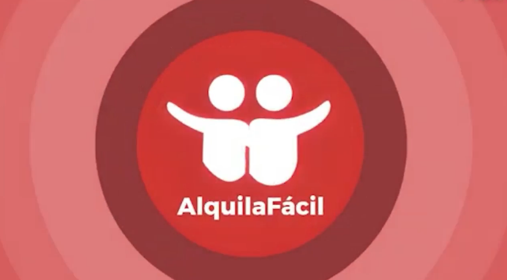

**Enlace del video:** 

[https://upcedupe-my.sharepoint.com/:v:/g/personal/u202212077_upc_edu_pe/EQcBrDMjYlJNghlbNnnR278BXw2glOybAu5_LQTPpgTSEA?nav=eyJyZWZlcnJhbEluZm8iOnsicmVmZXJyYWxBcHAiOiJTdHJlYW1XZWJBcHAiLCJyZWZlcnJhbFZpZXciOiJTaGFyZURpYWxvZy1MaW5rIiwicmVmZXJyYWxBcHBQbGF0Zm9ybSI6IldlYiIsInJlZmVycmFsTW9kZSI6InZpZXcifX0%3D&e=Tbg6Cf](https://upcedupe-my.sharepoint.com/:v:/g/personal/u202212077_upc_edu_pe/EQcBrDMjYlJNghlbNnnR278BXw2glOybAu5_LQTPpgTSEA?nav=eyJyZWZlcnJhbEluZm8iOnsicmVmZXJyYWxBcHAiOiJTdHJlYW1XZWJBcHAiLCJyZWZlcnJhbFZpZXciOiJTaGFyZURpYWxvZy1MaW5rIiwicmVmZXJyYWxBcHBQbGF0Zm9ybSI6IldlYiIsInJlZmVycmFsTW9kZSI6InZpZXcifX0%3D&e=Tbg6Cf)

# Bibliografía

<div align="justify">

* A Clean Approach to Flutter Development through the Flutter Clean Architecture Package. (2023). *IEEE Conference Publication*. IEEE Xplore. Recuperado de [https://ieeexplore.ieee.org/document/9071367](https://ieeexplore.ieee.org/document/9071367)

* Airbnb. (2024). *Airbnb – Sitio Oficial*. Recuperado de [https://www.airbnb.com.pe/](https://www.airbnb.com.pe/)

* Booking.com. (2024). *Booking.com: La mayor selección de hoteles, casas y alquileres*. Recuperado de [https://www.booking.com/index.es.html](https://www.booking.com/index.es.html)

* Cvent. (2023). *Cvent's Fourth Annual Benchmark Report: The Future of Event Technology in a Post-Pandemic World*. Cvent. Recuperado de [https://marketing.conference-news.co.uk/en-gb/cvent-event-tech-report-2024](https://marketing.conference-news.co.uk/en-gb/cvent-event-tech-report-2024)

* Hybrid Development in Flutter and its Widgits. (2022). *IEEE Conference Publication*. IEEE Xplore. Recuperado de [https://ieeexplore.ieee.org/document/9995973](https://ieeexplore.ieee.org/document/9995973)

* Forrester Research, Inc. (2024). *The Global State of B2B Events, 2024: Marketers Continue to Ride a Wave of Transformation*. Forrester. Recuperado de [https://www.forrester.com/report/the-global-state-of-b2b-events-2024-marketers-continue-to-ride-a-wave-of-transformation/RES181128](https://www.forrester.com/report/the-global-state-of-b2b-events-2024-marketers-continue-to-ride-a-wave-of-transformation/RES181128)

* Inmuebles de Lima. (2024). *Encuentra el inmueble de tus sueños en Lima*. Recuperado de [https://inmueblesdelima.com.pe/](https://inmueblesdelima.com.pe/)

* Jasin, N. (2023, 11 de julio). *Acceso a internet en Perú: Los aspectos clave para reducir la brecha entre el mundo laboral y el educativo*. Business Empresarial. Recuperado de [https://www.businessempresarial.com.pe/acceso-a-internet-en-peru-los-aspectos-clave-para-reducir-la-brecha-entre-el-mundo-laboral-y-el-educativo/](https://www.businessempresarial.com.pe/acceso-a-internet-en-peru-los-aspectos-clave-para-reducir-la-brecha-entre-el-mundo-laboral-y-el-educativo/)

* Mañas, L. (2024). *Agencia de eventos Olympia= Olympia events agency*. Recuperado de [https://repositori.uji.es/xmlui/handle/10234/208284](https://repositori.uji.es/xmlui/handle/10234/208284)

* Vrbo. (2024). *Sitio oficial de Vrbo®*. Recuperado de [https://www.vrbo.com/es-mx/](https://www.vrbo.com/es-mx/)

</div>


# Anexos

<div align="justify">

+ Repositorio GitHub de la Organización: [Ver Organización](https://github.com/AlquiladorEZ)<br><br>
+ Repositorio GitHub del Informe: [Ver Repositorio](https://github.com/AlquiladorEZ/AlquilaFacil-Report)<br><br>
+ Repositorio GitHub del Backend: [Ver Repositorio](https://github.com/AlquiladorEZ/AlquilaFacil-BackEnd)<br><br>
+ Repositorio GitHub de la Aplicación Web: [Ver Repositorio](https://github.com/AlquiladorEZ/AlquilaFacil-FrontEnd)<br><br>
+ Repositorio GitHub de la Aplicación Móvil: [Ver Repositorio](https://github.com/AlquiladorEZ/AlquilaFacil-MobileApp)<br><br>
+ Repositorio GitHub de la Landing Page: [Ver Landing Page](https://github.com/AlquiladorEZ/AlquilaFacil-LandingPage)<br><br>
+ Enlace a reporte de pruebas unitarias y de integración: [Ver Enlace](https://upcedupe-my.sharepoint.com/:f:/g/personal/u202212077_upc_edu_pe/EqzdScqg9kBPgPO-NsnDql8BFkWpX9k-GQgrM3JGpZvvOg?e=WD0WcH)<br><br>
+ Entrevistas: [Ver Entrevistas](https://upcedupe-my.sharepoint.com/personal/u202212077_upc_edu_pe/_layouts/15/stream.aspx?id=%2Fpersonal%2Fu202212077%5Fupc%5Fedu%5Fpe%2FDocuments%2FEntrevistas%20Dise%C3%B1o%2Emp4&nav=eyJyZWZlcnJhbEluZm8iOnsicmVmZXJyYWxBcHAiOiJTdHJlYW1XZWJBcHAiLCJyZWZlcnJhbFZpZXciOiJTaGFyZURpYWxvZy1MaW5rIiwicmVmZXJyYWxBcHBQbGF0Zm9ybSI6IldlYiIsInJlZmVycmFsTW9kZSI6InZpZXcifX0&ga=1&referrer=StreamWebApp%2EWeb&referrerScenario=AddressBarCopied%2Eview%2E9d51545d%2Dea00%2D497d%2D9757%2D2b9f40b5d8be)<br><br>
+ Entrevistas de validación: [Ver Entrevistas](https://upcedupe-my.sharepoint.com/:v:/g/personal/u202219639_upc_edu_pe/ERcASubz4ltGtq5iAAFY_t8Be0jqJ858RTYa9yh7K5ZS6Q?e=QNXf48&nav=eyJyZWZlcnJhbEluZm8iOnsicmVmZXJyYWxBcHAiOiJTdHJlYW1XZWJBcHAiLCJyZWZlcnJhbFZpZXciOiJTaGFyZURpYWxvZy1MaW5rIiwicmVmZXJyYWxBcHBQbGF0Zm9ybSI6IldlYiIsInJlZmVycmFsTW9kZSI6InZpZXcifX0%3D)<br><br>
+ Video exposición TP1: [Ver video de exposición TP1](https://upcedupe-my.sharepoint.com/:v:/g/personal/u202210297_upc_edu_pe/EYZgHYm2GwZPst7ueQ1V82cBxNv-Rl0hrJz72OnoI_jh-g?nav=eyJyZWZlcnJhbEluZm8iOnsicmVmZXJyYWxBcHAiOiJTdHJlYW1XZWJBcHAiLCJyZWZlcnJhbFZpZXciOiJTaGFyZURpYWxvZy1MaW5rIiwicmVmZXJyYWxBcHBQbGF0Zm9ybSI6IldlYiIsInJlZmVycmFsTW9kZSI6InZpZXcifX0%3D&e=EYXBSI)<br><br>
+ Video exposición TB2: [Ver video de exposición TB2](https://upcedupe-my.sharepoint.com/:v:/g/personal/u202211399_upc_edu_pe/EcPgvhycgQtBnTSv5dxn2SUB0Sdhns39abdR5FAEg6wZUQ?e=Viy3W8)

</div>
