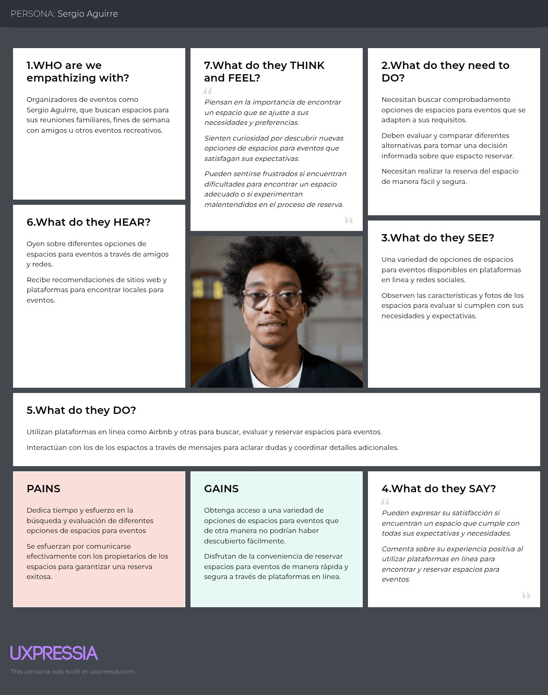

# Capítulo II: Requirements Elicitation & Analysis

## 2.1. Competidores

Después de realizar una investigación de mercado, hemos identificado tres plataformas que ofrecen características similares a las de nuestra aplicación para conectar arrendadores con arrendatarios de eventos. Estas son: 

**Competidores:**

* ***Airbnb:***
  Es una plataforma en línea fundada en 2008 que revolucionó la industria hotelera al ofrecer una alternativa a los hoteles tradicionales. Permite a los usuarios alquilar alojamientos a corto plazo, desde habitaciones individuales hasta casas completas, en más de 191 países. Facilita la conexión entre anfitriones que desean alquilar sus propiedades y huéspedes en busca de alojamiento temporal.  

  )](Resources/Competitors/Airbnb.png)

 

* ***Vrbo:***
   Es una plataforma en línea fundada en 1995 que facilita el alquiler de alojamientos vacacionales directamente a través de los propietarios. El nombre significa "Vacation Rentals by Owner" (Alquileres Vacacionales por Propietario). Es uno de los principales sitios web para alquileres vacacionales en todo el mundo, donde los usuarios pueden buscar y reservar casas, apartamentos, cabañas y villas en una variedad de destinos. Esto les permite encontrar opciones que se adapten a sus necesidades y preferencias. 

  )](Resources/Competitors/Vrbo.png)
  

* ***Booking:***
 Es una plataforma que permite a los usuarios reservar alojamiento en hoteles, hostales, apartamentos y otros tipos de alojamiento en todo el mundo. También ofrece la posibilidad de reservar vuelos, alquilar coches y reservar actividades turísticas. Booking.com es una de las mayores plataformas de reserva de alojamiento en línea y ofrece una amplia variedad de opciones para viajeros de todo tipo. Los usuarios pueden buscar alojamientos según sus preferencias y presupuesto, y realizar reservas de manera rápida y conveniente a través de la plataforma. 

  )](Resources/Competitors/Booking.png)

 

### 2.1.1. Análisis competitivo
 
<table>
    <thead>
        <tr>
            <th colspan="6">Competitive Analysis Landscape</th>
        </tr>
        <tr>
            <th colspan="6">Este análisis se realizó con la finalidad de poder identificar a nuestros potenciales competidores e idear estrategias y tácticas para diferenciarnos de estos.</th>
        </tr>
        <tr>
            <th colspan="2">Nombre</th>
            <th>AlquilaFacil</th>
            <th>Airbnb</th>
            <th>Vrbo</th>
            <th>Booking.com</th>
        </tr>
        <tr>
            <th colspan="2">Logo</th>
            <th></th>
            <th></th>
            <th></th>
            <th></th>
        </tr>
    </thead>
    <tbody>
        <tr>
            <td rowspan="2" align="justify">Perfil</td>
            <td align="justify">Overview</td>
            <td align="justify">Es una plataforma en línea que facilita el alquiler de una amplia gama de espacios para eventos, desde salones de eventos hasta casas y alojamientos temporales. Con una interfaz fácil de usar, conecta a arrendadores con arrendatarios, ofreciendo una solución conveniente y eficiente para satisfacer las necesidades de ambos.</td>
            <td align="justify">Plataforma en línea que revoluciona el alquiler de alojamientos a corto plazo, conectando anfitriones y huéspedes en todo el mundo. Ofrece una amplia variedad de opciones de alojamiento, desde habitaciones individuales hasta casas completas.</td>
            <td align="justify">Plataforma en línea que permite a los usuarios buscar y reservar alojamientos vacacionales directamente a través de arrendadores. Ofrece una variedad de opciones de alojamiento, como casas, apartamentos, cabañas y villas, en diferentes destinos, adaptándose a las necesidades y preferencias de los viajeros.</td>
            <td align="justify">Booking.com es una plataforma líder para reservar alojamiento y actividades turísticas en todo el mundo. Ofrece una amplia variedad de opciones, desde hoteles hasta apartamentos, y facilita la búsqueda y reserva según las preferencias y presupuesto de los usuarios.</td>
        </tr>
        <tr>
            <td align="justify">Ventaja competitiva ¿Qué valor ofrece a los clientes?</td>
            <td align="justify">Proporciona una solución completa para la planificación de eventos, ofreciendo una amplia gama de espacios para eventos y una plataforma intuitiva para gestionar reservas y espacios. Con características como registro gratuito de espacios, búsqueda avanzada y servicio al cliente dedicado, ArrendaFácil simplifica el proceso de planificación de eventos para arrendatarios y arrendadores.</td>
            <td align="justify">Ofrece una amplia variedad de alojamientos en todo el mundo, desde habitaciones individuales hasta casas completas, junto con experiencias locales únicas organizadas por anfitriones. Esto permite a los viajeros personalizar su experiencia y sumergirse en la cultura local.	</td>
            <td align="justify">Se especializa en alquileres vacacionales directamente a través de arrendadores, brindando a los viajeros la oportunidad de disfrutar de una experiencia más auténtica y personalizada. Con una amplia selección de alojamientos vacacionales, Vrbo ofrece opciones para todos los gustos y presupuestos.</td>
            <td align="justify">Destaca por su amplia oferta de alojamiento y servicios, que incluyen hoteles, vuelos, alquiler de coches y actividades turísticas. La plataforma fácil de usar permite a los usuarios encontrar y reservar alojamiento de manera rápida y sencilla, ofreciendo una solución integral para los viajeros.</td>
        </tr>
        <tr>
            <td rowspan="5" align="justify">Perfil de Marketing</td>
            <td align="justify">Mercado Objetivo</td>
            <td align="justify">Dirigido a arrendatarios adultos de 18 años en adelante que buscan espacios para eventos sociales, corporativos o especiales, como bodas, conferencias, fiestas de empresa, entre otros. Además, atrae a empresas y organizaciones que buscan espacios para eventos corporativos y reuniones profesionales dirigidas a un público adulto.</td>
            <td align="justify">Se centra en viajeros adultos de 18 años en adelante, ofreciendo una amplia variedad de alojamientos en todo el mundo, desde habitaciones individuales hasta casas completas, para adaptarse a diferentes necesidades y preferencias de viaje. Además, apunta a grupos de amigos, parejas y familias adultas que buscan opciones de alojamiento que se ajusten a sus requerimientos y presupuestos durante sus vacaciones o escapadas.</td>
            <td align="justify">Está dirigido a familias y grupos de amigos adultos de 18 años en adelante que buscan alquilar casas, villas o cabañas para vacaciones o escapadas grupales. Además, atrae a parejas y grupos de amigos adultos que buscan alquilar alojamientos vacacionales para eventos especiales, como bodas, reuniones familiares o celebraciones de cumpleaños.</td>
            <td align="justify">Orientado a viajeros adultos de 18 años en adelante, busca ofrecer una amplia gama de opciones de alojamiento para adaptarse a diversas necesidades y preferencias durante sus viajes. También se dirige a personas que viajan por negocios, parejas en escapadas románticas, grupos de amigos en vacaciones y familias en busca de opciones de alojamiento cómodas y convenientes.</td>
        </tr>
        <tr>
            <td align="justify">Estrategias de Marketing</td>
            <td align="justify">ArrendaFácil destaca con marketing de contenidos, participación en eventos de la industria y alianzas con proveedores de servicios de eventos para ofrecer soluciones completas a arrendatarios.</td>
            <td align="justify">Airbnb emplea campañas publicitarias en redes sociales y colaboraciones con influencers para promocionar destinos y experiencias únicas. También utiliza programas de referidos para aumentar su base de usuarios.</td>
            <td align="justify">Vrbo se centra en contenido educativo en su sitio web, colaboraciones con agencias de viajes y ofertas exclusivas para atraer a familias y grupos de amigos a reservar a través de su plataforma.</td>
            <td align="justify">Booking.com utiliza estrategias de SEO y SEM, junto con programas de fidelización, para atraer tráfico y fomentar la lealtad del cliente a través de una experiencia personalizada.</td>
        </tr>
        <tr>
            <td align="justify">Productos & servicios</td>
            <td align="justify">Aplicación web que conecta a arrendadores de diversos espacios, como salones de eventos, jardines y locales comerciales, con arrendatarios que buscan alquilar estos espacios para celebrar eventos sociales, corporativos o especiales. Proporciona una variedad de herramientas y servicios para facilitar la búsqueda, reserva y gestión de espacios para eventos.</td>
            <td align="justify">Plataforma en línea donde los usuarios pueden alquilar una variedad de alojamientos a corto plazo, desde habitaciones individuales hasta casas completas, en todo el mundo. Además de alojamiento, Airbnb también proporciona experiencias locales únicas organizadas por anfitriones, como recorridos gastronómicos, clases de cocina y excursiones.	</td>
            <td align="justify">Plataforma para alquilar alojamientos vacacionales directamente a través de los arrendadores. Los usuarios pueden encontrar y reservar una amplia gama de propiedades, que van desde casas y apartamentos hasta cabañas y villas, para sus vacaciones o escapadas en todo el mundo.</td>
            <td align="justify">Plataforma en línea que permite a los usuarios reservar una variedad de alojamientos, incluyendo hoteles, hostales, apartamentos y otros tipos de hospedaje en todo el mundo. Además de alojamiento, Booking.com ofrece la posibilidad de reservar vuelos, alquilar coches y reservar actividades turísticas para completar la experiencia de viaje del usuario.</td>
        </tr>
        <tr>
            <td align="justify">Precios & Costos</td>
            <td align="justify">Los precios de ArrendaFácil varían dependiendo del lugar, el tamaño de la propiedad, servicios, y el tiempo de uso.</td>
            <td align="justify">El costo promedio puede variar significativamente dependiendo de varios factores, como la ubicación, el tipo de alojamiento, la época del año y la demanda local.</td>
            <td align="justify">Los precios en VRBO pueden variar significativamente dependiendo de la ubicación, el tamaño de la propiedad, las comodidades ofrecidas y la temporada del año.</td>
            <td align="justify">Los precios pueden variar significativamente según la ubicación, la temporada, la demanda y el tipo de alojamiento.</td>
        </tr>
        <tr>
            <td align="justify">Canales de distribución (Web y/o móvil)</td>
            <td align="justify">Redes sociales y aplicación web donde los usuarios pueden poner en renta su espacio o alquilar un espacio para eventos.</td>
            <td align="justify">Sitio web de Airbnb, aplicación móvil de Airbnb, socios afiliados y asociaciones, redes sociales y marketing digital.</td>
            <td align="justify">Principalmente su sitio web y su aplicación móvil, así como acuerdos de distribución con otros sitios web de viajes o agencias de viajes en línea.</td>
            <td align="justify">Sitio web de Booking.com, aplicación móvil de Booking, agencias de viajes en línea, alianzas con compañías de viajes, afiliados y asociados.</td>
        </tr>
        <tr>
            <td rowspan="4" align="justify">Análisis SWOT</td>
            <td align="justify">Fortalezas</td>
            <td align="justify">Solución completa para la planificación de eventos.</td>
            <td align="justify">Gran comunidad de anfitriones y usuarios.</td>
            <td align="justify">Variedad de alojamientos en todo el mundo.</td>
            <td align="justify">Interfaz fácil de usar y experiencia intuitiva del usuario.</td>
        </tr>
        <tr>
            <td align="justify">Debilidades</td>
            <td align="justify">Dependencia de la disponibilidad de espacios para eventos.</td>
            <td align="justify">Dependencia de la reputación y opiniones de los usuarios.</td>
            <td align="justify">Posible saturación del mercado de alquiler vacacional.</td>
            <td align="justify">Competencia intensa con otras plataformas de alquiler de alojamiento.</td>
        </tr>
        <tr>
            <td align="justify">Oportunidades</td>
            <td align="justify">Expansión mediante aplicaciones integradas para mejorar la comunicación entre sus usuarios.</td>
            <td align="justify">Desarrollo de nuevas características y servicios para mejorar la experiencia del usuario.</td>
            <td align="justify">Alianzas estratégicas con proveedores de servicios de eventos.</td>
            <td align="justify">Aprovechamiento de la tendencia creciente del turismo y los viajes.</td>
        </tr>
        <tr>
            <td align="justify">Amenazas</td>
            <td align="justify">Cambios en la regulación de alquileres vacacionales y eventos.</td>
            <td align="justify">Posible disminución de la demanda de viajes debido a crisis económicas o sanitarias.</td>
            <td align="justify">Innovaciones tecnológicas que podrían ser adoptadas por competidores.</td>
            <td align="justify">Posible pérdida de confianza del usuario debido a problemas de seguridad o calidad del servicio.</td>
        </tr>
    </tbody>
</table>

### 2.1.2. Estrategias y tácticas frente a competidores

En esta sección se analizarán las estrategias y tácticas que se implementarán para aprovechar las debilidades de la competencia y enfrentar sus fortalezas, así como para abordar las amenazas y oportunidades del mercado. Para ello, hemos empleado un análisis FODA que nos ha permitido identificar nuestras fortalezas y debilidades internas, así como las oportunidades y amenazas externas, todo en función de nuestros dos segmentos objetivos: arrendadores y arrendatarios.

**Estrategia de Diferenciación:**

**Para los arrendadores:** A diferencia de otras plataformas de alquiler de espacios para eventos, AlquilaFácil ofrecerá herramientas innovadoras para la gestión de reservas y un sistema de promoción destacada para que sus espacios tengan mayor visibilidad. Además, contarán con opciones para integrar servicios adicionales como catering o entretenimiento, facilitando así una oferta más completa para los clientes.

**Para los arrendatarios:** Nuestra interfaz será fácil de usar y estará diseñada para simplificar todo el proceso de búsqueda, comparación y reserva de espacios. AlquilaFácil también permitirá la personalización de eventos y la contratación de servicios complementarios desde la misma plataforma, brindando una experiencia integral y diferenciada.

**Estrategia de Liderazgo en Costos:**

AlquilaFácil buscará ofrecer un modelo flexible y competitivo en costos. Si bien se mantendrán tarifas estándar por el uso de la plataforma, se explorarán modelos de monetización creativa que permitan diversificar los ingresos sin afectar la accesibilidad. Se ofrecerán servicios premium opcionales para arrendadores que deseen destacar sus listados o acceder a herramientas avanzadas de gestión. También se considerará la inclusión de servicios adicionales bajo demanda, así como publicidad no intrusiva y patrocinios de eventos como fuentes complementarias de ingreso.

**Estrategia de Marketing:**

El marketing de AlquilaFácil estará enfocado en construir una comunidad activa y comprometida de arrendadores y arrendatarios. Se buscará destacar los beneficios de la plataforma no solo desde el punto de vista funcional, sino también como un espacio para compartir experiencias, generar confianza y fidelizar usuarios.

**Tácticas:**

- **Campañas segmentadas:** Se lanzarán campañas digitales específicas para arrendadores y otras para arrendatarios, empleando publicidad en redes sociales, colaboraciones con influencers del sector de eventos y alianzas con proveedores de servicios relacionados.
- **Fomento de comunidad:** Se habilitarán espacios dentro de la plataforma para que los usuarios compartan sus experiencias, recomienden espacios o servicios, e interactúen entre sí, fortaleciendo así el sentido de comunidad.
- **Eventos y participación activa:** AlquilaFácil participará en ferias comerciales, eventos del sector y actividades colaborativas que aumenten la visibilidad de la marca y fomenten la interacción directa con los usuarios.
- **Modelos de referidos:** Se incentivará a los usuarios actuales a invitar a nuevos miembros mediante recompensas como descuentos, servicios premium o visibilidad destacada.

## 2.2. Entrevistas

### 2.2.1. Diseño de entrevistas

Se ha definido una cierta cantidad de preguntas para cada uno de nuestros segmentos objetivo, con la finalidad de obtener información cualitativa como opiniones o descripciones. Esta información nos será de gran ayuda en el desarrollo de nuestra solución.

**Preguntas generales:**

1. ¿Cuál es tu nombre?  
2. ¿Qué edad tienes?  
3. ¿Dónde vives actualmente?  
4. ¿A qué te dedicas?  

**Preguntas segmento de arrendadores de espacios para eventos:**

1. ¿Qué desafíos enfrenta actualmente al promocionar y gestionar reservas para su espacio?  
2. ¿Qué tipo de propiedades suele alquilar o publicitar? (apartamentos, casas, locales comerciales, terrenos, etc.)  
3. De tener experiencia en alquilar su propiedad, ¿cómo ha realizado los pagos de los centros en alquiler?  
4. ¿Cómo promociona su espacio para atraer a potenciales clientes? ¿Qué estrategias de marketing ha encontrado más efectivas?  
5. ¿Qué te parece más importante al alquilar una propiedad: la facilidad de uso de la plataforma, la seguridad de las transacciones, la diversidad de opciones disponibles u otros aspectos?  
6. ¿Cuáles son las principales características que busca en una plataforma de alquiler de espacios para eventos?  
7. ¿Qué incentivos o beneficios podrían motivar a utilizar una plataforma de alquiler de espacios de manera más frecuente?  
8. ¿Ha tenido alguna experiencia previa con plataformas similares de alquiler de espacios para eventos? ¿Qué aspectos le gustaron?  
9. ¿Estarías dispuesto(a) a pagar una tarifa por utilizar una aplicación que te ayude a publicitar o alquilar tu propiedad de manera más eficiente?  
10. ¿Qué sugerencias o mejoras tendrías para una aplicación de este tipo que aún no estén disponibles en otras plataformas similares?  

**Preguntas segmento de arrendatarios sociales / usuarios frecuentes de espacios para eventos:**

1. ¿Qué tipo de propiedades alquila regularmente para sus reuniones?  
2. ¿Alguna vez has necesitado un lugar de encuentro o festivo de emergencia?  
3. ¿Qué tipo de información te gustaría que viniera en las características del local/propiedad? (ej. licencias de eventos, capacidad máxima de gente, etc.)  
4. Organizando eventos, ¿alguna vez tuvo un problema grave con las políticas de cancelación?  
5. ¿Eres promotor de algún tipo de evento recurrente?  
6. ¿Cada cuánto recurres a alquilar lugares o a usarlos?  
7. ¿Ves necesario una plataforma como AlquilaFácil?  
8. ¿De qué maneras ves útil AlquilaFácil y cada cuánto lo utilizarías?  
9. ¿Hay alguna otra consideración o solicitud especial que crea que deba adicionarse para hacer un mejor servicio?  
10. ¿Qué tan importante es para ti la flexibilidad de horarios al momento de reservar un espacio para tu evento?

### 2.2.2. Registro de entrevistas

Para el registro de entrevistas se realizará 3 entrevista por segmento, dando un total de 6 entrevistas. Además, el formato de las entrevistas es mp4, cada entrevista es independiente debido a las diferentes preguntas y respuestas dadas por los entrevistados de cada segmento.

**Segmento 1: Arrendadores de espacios para eventos**
 
<table>
<colgroup>
</colgroup>
<thead>
  <tr>
    <th colspan="2"> 
Entrevista #1 
</th>
  </tr>
</thead>
<tbody>
  <tr>
    <td>Nombre</td>
    <td></td>
  </tr>
  <tr>
    <td>Apellidos</td>
    <td></td>
  </tr>
  <tr>
    <td>Edad</td>
    <td></td>
  </tr>
  <tr>
    <td>Distrito</td>
    <td></td>
  </tr>
  <tr>
    <td>Aplicaciones Usadas</td>
    <td></td>
  </tr>
  <tr>
    <td>Motivación</td>
    <td></td>
  </tr>
  <tr>
    <td>Frustración</td>
    <td></td>
  </tr>
  <tr>
    <td>Tecnologías</td>
    <td></td>
  </tr>
	<tr>
    <td>Browsers</td>
    <td></td>
  </tr>
  <tr>
    <td>Entrevistador</td>
    <td></td>
  </tr>
  <tr>
    <td>Evidencia</td>
    <td>

</td>
  </tr>
  <tr>
    <td>Link</td>
    <td>
<a target="_blank"  href="https://" title="Title">Microsoft Stream</a>
</td>
  </tr>
  <tr>
    <td>Duración </td>
    <td>00:00 min - 00:00 min </td>
  </tr>
  <tr>
    <td>Resumen</td>
    <td style="text-align: justify;">
    </td>
  </tr>
</tbody>
</table>

<table>
<colgroup>
</colgroup>
<thead>
  <tr>
    <th colspan="2"> 
Entrevista #2 
</th>
  </tr>
</thead>
<tbody>
  <tr>
    <td>Nombre</td>
    <td></td>
  </tr>
  <tr>
    <td>Apellidos</td>
    <td></td>
  </tr>
  <tr>
    <td>Edad</td>
    <td></td>
  </tr>
  <tr>
    <td>Distrito</td>
    <td></td>
  </tr>
  <tr>
    <td>Aplicaciones Usadas</td>
    <td></td>
  </tr>
  <tr>
    <td>Motivación</td>
    <td></td>
  </tr>
  <tr>
    <td>Frustración</td>
    <td></td>
  </tr>
  <tr>
    <td>Tecnologías</td>
    <td></td>
  </tr>
	<tr>
    <td>Browsers</td>
    <td></td>
  </tr>
  <tr>
    <td>Entrevistador</td>
    <td></td>
  </tr>
  <tr>
    <td>Evidencia</td>
    <td>

</td>
  </tr>
  <tr>
    <td>Link</td>
    <td>
<a target="_blank"  href="https://" title="Title">Microsoft Stream</a>
</td>
  </tr>
  <tr>
    <td>Duración </td>
    <td>00:00 min - 00:00 min </td>
  </tr>
  <tr>
    <td>Resumen</td>
    <td style="text-align: justify;">
    </td>
  </tr>
</tbody>
</table>

<table>
<colgroup>
</colgroup>
<thead>
  <tr>
    <th colspan="2"> 
Entrevista #3 
</th>
  </tr>
</thead>
<tbody>
  <tr>
    <td>Nombre</td>
    <td></td>
  </tr>
  <tr>
    <td>Apellidos</td>
    <td></td>
  </tr>
  <tr>
    <td>Edad</td>
    <td></td>
  </tr>
  <tr>
    <td>Distrito</td>
    <td></td>
  </tr>
  <tr>
    <td>Aplicaciones Usadas</td>
    <td></td>
  </tr>
  <tr>
    <td>Motivación</td>
    <td></td>
  </tr>
  <tr>
    <td>Frustración</td>
    <td></td>
  </tr>
  <tr>
    <td>Tecnologías</td>
    <td></td>
  </tr>
	<tr>
    <td>Browsers</td>
    <td></td>
  </tr>
  <tr>
    <td>Entrevistador</td>
    <td></td>
  </tr>
  <tr>
    <td>Evidencia</td>
    <td>

</td>
  </tr>
  <tr>
    <td>Link</td>
    <td>
<a target="_blank"  href="https://" title="Title">Microsoft Stream</a>
</td>
  </tr>
  <tr>
    <td>Duración </td>
    <td>00:00 min - 00:00 min </td>
  </tr>
  <tr>
    <td>Resumen</td>
    <td style="text-align: justify;">
    </td>
  </tr>
</tbody>
</table>
 

**Segmento 2: Arrendatarios sociales frecuentes de espacios para eventos**

 
<table>
<colgroup>
</colgroup>
<thead>
  <tr>
    <th colspan="2"> 
Entrevista #1 
</th>
  </tr>
</thead>
<tbody>
  <tr>
    <td>Nombre</td>
    <td></td>
  </tr>
  <tr>
    <td>Apellidos</td>
    <td></td>
  </tr>
  <tr>
    <td>Edad</td>
    <td></td>
  </tr>
  <tr>
    <td>Distrito</td>
    <td></td>
  </tr>
  <tr>
    <td>Aplicaciones Usadas</td>
    <td></td>
  </tr>
  <tr>
    <td>Motivación</td>
    <td></td>
  </tr>
  <tr>
    <td>Frustración</td>
    <td></td>
  </tr>
  <tr>
    <td>Tecnologías</td>
    <td></td>
  </tr>
	<tr>
    <td>Browsers</td>
    <td></td>
  </tr>
  <tr>
    <td>Entrevistador</td>
    <td></td>
  </tr>
  <tr>
    <td>Evidencia</td>
    <td>

</td>
  </tr>
  <tr>
    <td>Link</td>
    <td>
<a target="_blank"  href="https://" title="Title">Microsoft Stream</a>
</td>
  </tr>
  <tr>
    <td>Duración </td>
    <td>00:00 min - 00:00 min </td>
  </tr>
  <tr>
    <td>Resumen</td>
    <td style="text-align: justify;">
    </td>
  </tr>
</tbody>
</table>

<table>
<colgroup>
</colgroup>
<thead>
  <tr>
    <th colspan="2"> 
Entrevista #2 
</th>
  </tr>
</thead>
<tbody>
  <tr>
    <td>Nombre</td>
    <td></td>
  </tr>
  <tr>
    <td>Apellidos</td>
    <td></td>
  </tr>
  <tr>
    <td>Edad</td>
    <td></td>
  </tr>
  <tr>
    <td>Distrito</td>
    <td></td>
  </tr>
  <tr>
    <td>Aplicaciones Usadas</td>
    <td></td>
  </tr>
  <tr>
    <td>Motivación</td>
    <td></td>
  </tr>
  <tr>
    <td>Frustración</td>
    <td></td>
  </tr>
  <tr>
    <td>Tecnologías</td>
    <td></td>
  </tr>
	<tr>
    <td>Browsers</td>
    <td></td>
  </tr>
  <tr>
    <td>Entrevistador</td>
    <td></td>
  </tr>
  <tr>
    <td>Evidencia</td>
    <td>

</td>
  </tr>
  <tr>
    <td>Link</td>
    <td>
<a target="_blank"  href="https://" title="Title">Microsoft Stream</a>
</td>
  </tr>
  <tr>
    <td>Duración </td>
    <td>00:00 min - 00:00 min </td>
  </tr>
  <tr>
    <td>Resumen</td>
    <td style="text-align: justify;">
    </td>
  </tr>
</tbody>
</table>

<table>
<colgroup>
</colgroup>
<thead>
  <tr>
    <th colspan="2"> 
Entrevista #3 
</th>
  </tr>
</thead>
<tbody>
  <tr>
    <td>Nombre</td>
    <td></td>
  </tr>
  <tr>
    <td>Apellidos</td>
    <td></td>
  </tr>
  <tr>
    <td>Edad</td>
    <td></td>
  </tr>
  <tr>
    <td>Distrito</td>
    <td></td>
  </tr>
  <tr>
    <td>Aplicaciones Usadas</td>
    <td></td>
  </tr>
  <tr>
    <td>Motivación</td>
    <td></td>
  </tr>
  <tr>
    <td>Frustración</td>
    <td></td>
  </tr>
  <tr>
    <td>Tecnologías</td>
    <td></td>
  </tr>
	<tr>
    <td>Browsers</td>
    <td></td>
  </tr>
  <tr>
    <td>Entrevistador</td>
    <td></td>
  </tr>
  <tr>
    <td>Evidencia</td>
    <td>

</td>
  </tr>
  <tr>
    <td>Link</td>
    <td>
<a target="_blank"  href="https://" title="Title">Microsoft Stream</a>
</td>
  </tr>
  <tr>
    <td>Duración </td>
    <td>00:00 min - 00:00 min </td>
  </tr>
  <tr>
    <td>Resumen</td>
    <td style="text-align: justify;">
    </td>
  </tr>
</tbody>
</table>

### 2.2.3. Análisis de entrevistas

Las entrevistas realizadas proporcionan una visión detallada y matizada sobre las expectativas y requisitos de los distintos actores involucrados en el ámbito de las plataformas de alquiler de espacios para eventos. En general, tanto los arrendadores como los arrendatarios y los usuarios finales destacan la necesidad imperiosa de contar con sistemas que aseguren la integridad de las transacciones financieras, la claridad en los acuerdos contractuales y una comunicación fluida y eficaz. 

**Arrendadores de espacios para eventos**

Para los arrendadores, la seguridad en las transacciones financieras y la integridad de los contratos son aspectos fundamentales. También valoran una promoción efectiva de sus propiedades, buscando una plataforma que les permita llegar a un público amplio y relevante. Además, aprecian una comunicación clara y eficiente con los arrendatarios para evitar malentendidos y conflictos. Algunos arrendadores están dispuestos a invertir en servicios premium que les brinden ventajas adicionales, como una mayor visibilidad de sus espacios en la plataforma. En resumen, los arrendadores buscan una plataforma que les ofrezca seguridad, visibilidad, comunicación eficiente y opciones para maximizar el rendimiento de sus espacios. 

**Arrendatarios para eventos**

Por otro lado, los arrendatarios tienen necesidades específicas al utilizar plataformas de alquiler de locales. Para ellos, la facilidad de encontrar y reservar espacios adecuados es crucial, especialmente en situaciones de emergencia o cambios de último momento. Valoran la transparencia en los contratos y una comunicación eficiente con los arrendadores para evitar malentendidos y asegurar una experiencia sin contratiempos. Además, buscan plataformas que ofrezcan una amplia variedad de opciones de espacios que se ajusten a sus necesidades específicas y horarios. La posibilidad de utilizar herramientas de búsqueda avanzada y filtrado también es importante para encontrar el lugar perfecto. En resumen, los arrendatarios de eventos buscan plataformas que les brinden facilidad de uso, transparencia en los procesos, comunicación eficiente y una amplia gama de opciones de espacios para eventos. 

**Determinación de Personas**

Basado en el análisis de las entrevistas, se ha determinado lo siguiente:

**Persona Principal: Arrendatarios**  
**Razón:** Los arrendatarios son los usuarios finales que interactúan directamente con la plataforma para encontrar y reservar espacios. Sus necesidades de facilidad de uso, transparencia, comunicación eficiente y una amplia gama de opciones son cruciales para el éxito del producto. Además, la facilidad de encontrar y reservar espacios adecuados es fundamental para ellos, lo que hace que sus requerimientos sean el enfoque principal del desarrollo.  

**Persona Secundaria: Arrendadores**  
**Razón:** Aunque los arrendadores también son esenciales para el funcionamiento de la plataforma, su papel es secundario en comparación con los arrendatarios. Los arrendadores buscan seguridad, visibilidad y herramientas para la promoción y gestión de sus espacios. Estos aspectos son importantes, pero el enfoque primario debe estar en las necesidades y experiencias de los arrendatarios, que son quienes utilizan la plataforma de manera más activa y recurrente.

## 2.3. Needfinding

### 2.3.1. User Personas

Presentaremos los User Persona por cada segmento objetivo, en los cuales nos basamos en los usuarios ideales de cada segmento. A continuación, los presentamos:

**Segmento 1: Arrendatario**

 

**Segmento 2: Arrendador**

### 2.3.2. User Task Matrix

 

**User Persona Principal**

**Nombre:** Sergio Aguirre  
**Rol:** Arrendatario

<table align="center">
  <thead>
    <tr>
      <th>Task</th>
      <th>Frequency</th>
      <th>Importance</th>
    </tr>
  </thead>
  <tbody>
    <tr>
      <td>Buscar y reservar espacios para eventos</td>
      <td>High</td>
      <td>High</td>
    </tr>
    <tr>
      <td>Comunicarse con los arrendadores de los espacios</td>
      <td>High</td>
      <td>High</td>
    </tr>
    <tr>
      <td>Buscar variedad en los tipos de espacios disponibles</td>
      <td>High</td>
      <td>High</td>
    </tr>
    <tr>
      <td>Reservar espacios para diferentes tipos de eventos</td>
      <td>High</td>
      <td>High</td>
    </tr>
    <tr>
      <td>Estar dispuesto a pagar por una mejor experiencia</td>
      <td>Medium</td>
      <td>Medium</td>
    </tr>
    <tr>
      <td>Utilizar una plataforma fácil de usar e intuitiva</td>
      <td>High</td>
      <td>High</td>
    </tr>
  </tbody>
</table>

 

**User Persona Secundaria**

**Nombre:** Claudia Cañamero  
**Rol:** Arrendadora

<table align="center">
  <thead>
    <tr>
      <th>Task</th>
      <th>Frequency</th>
      <th>Importance</th>
    </tr>
  </thead>
  <tbody>
    <tr>
      <td>Gestionar reservas y coordinar eventos</td>
      <td>High</td>
      <td>High</td>
    </tr>
    <tr>
      <td>Promocionar el local en redes sociales y otros canales de marketing</td>
      <td>High</td>
      <td>High</td>
    </tr>
    <tr>
      <td>Mantener el local en óptimas condiciones de limpieza y mantenimiento</td>
      <td>High</td>
      <td>High</td>
    </tr>
    <tr>
      <td>Establecer comunicación efectiva con clientes y proveedores</td>
      <td>High</td>
      <td>High</td>
    </tr>
    <tr>
      <td>Explorar nuevas oportunidades de negocio y crecimiento</td>
      <td>Medium</td>
      <td>Medium</td>
    </tr>
  </tbody>
</table> 
 

### 2.3.3. User Journey Mapping

**Persona Principal: Arrendatarios de eventos sociales / Usuarios frecuentes de espacios para eventos**

**Persona Secundaria: Arrendadores de espacios para eventos**

### 2.3.4. Empathy Mapping

**Persona Principal: Arrendatarios de eventos sociales / Usuarios frecuentes de espacios para eventos**

**Persona Secundaria: Arrendadores de espacios para eventos**

### 2.3.5. As-is Scenario Mapping

**Persona Principal: Arrendatarios**

**Persona Secundaria: Arrendadores**

## 2.4. Ubiquitous Language

